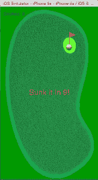

# 从 iOS 上的 CocosSharp 开始构建交叉游戏和应用程序

> 原文：<https://thenewstack.io/starting-cocossharp-ios/>

Cocos2D 是一系列用于构建跨平台游戏和应用的开源框架的名称。全球有超过 400，000 名开发人员使用 Cocos2d 的一个版本。有针对 JavaScript (Cocos2d-JS)、XNA (Cocos2d-XNA)、Swift (Cocos2d-Swift)和 Python (Cocos2d-Python)的具体版本。Xamarin 已经分叉 Cocos2d-XNA，并生产了用于 iOS、Android 和 Windows Phone 的 [CocosSharp](http://blog.xamarin.com/introducing-cocossharp/) 。许多商业游戏使用这些 [Cocos2d 库](http://www.cocos2d-x.org/games "Link To Cocos2d Showcase")中的一个。

除了跨平台，CocosSharp 还是一个可移植的类库。可移植类库不仅仅是一个避免不可移植事物的类库，它还包括工具支持。告诉编译器。NET 目标你想支持(即一个配置文件)，它会抱怨，如果你试图使用一些不会工作。所有的源代码都是可用的，所有的 Cocos 版本，所以你可以检查它，看看会发生什么。CocosSharp 源代码在 [Github](https://github.com/mono/CocosSharp "Link To CocosSharp source codeon Github") 上。

虽然 Xamarin 不是免费的，但你可以以每月 25 美元的价格订阅独立版本。当然，你仍然需要一台 Mac，并且是一名注册的苹果开发者，才能部署到 iOS 设备/应用商店。所有的 Cocos 家族都是开源的，大部分使用麻省理工学院的许可证，这意味着你可以用它们创建开源或商业软件。

## 安装 CocosSharp

首先创建一个空项目，在我的例子中，我称它为 TNSGame，是 New Stack Game 的缩写。现在使用 Nuget 并输入 CocosSharp。你会看到一个很大的软件包列表，但我们只需要 iOS 版的。单击 Add Package 后，您将在解决方案列表中看到一个新的包条目，并在 From Packages 文件夹下看到一组新的引用。具体是 box2d，CocosSharp，ICSharpCode。夏普齐普里，利德格伦。网络，和两个一夫一妻制的参考。花栗鼠还没有出现，但很快就会出现。

## iOS 应用的 CocosSharp 架构

一切都像在 AppDelegate 类的非 Cocos 应用程序中一样开始。然而这里的情况有所不同，你的 FinishLaunching 方法应该是这样的:

```
    var application  =  new CCApplication  ();
    application.ApplicationDelegate  =  new GameAppDelegate  ();
    application.StartGame  ();
  return true;

```

现在我们需要在 GameAppDelegate.cs 中创建一个 GameAppDelegate 类，并覆盖 ApplicationDidFinishLaunching 方法。添加此代码。

```
    class GameAppDelegate  :  CCApplicationDelegate
    {

        public override void ApplicationDidFinishLaunching(CCApplication application,  CCWindow mainWindow)
        {
            var bounds  =  mainWindow.WindowSizeInPixels;
            CCScene.SetDefaultDesignResolution(bounds.Width,  bounds.Height,  CCSceneResolutionPolicy.ShowAll);
            application.PreferMultiSampling  =  false;
            application.ContentRootDirectory  =  "Content";

            var gameScene  =  new GameScene(mainWindow);
            mainWindow.RunWithScene(gameScene);
        }
    }

```

## CocosSharp 类

有许多类，你可以在在线 [Mono 文档](http://docs.go-mono.com/?link=root:/CocosSharp "link to Online Mono Documentation")中看到它们的文档。我唯一的批评是，参考文档需要更多的工作，它有缺口，并解释像将屏幕坐标映射到世界坐标这样的事情会有所帮助。

出于我们的目的，我们可以只关注五个相关的类，它们将完成大部分工作。它们是 CCSprite、CCLayer、CCScene、CCNode 和 CCLabel。CCSprite 显示图像，可以重新定位，调整大小和旋转。它可以有子节点。CCNode 是 CocosSharp 中所有可视对象的基类，尽管它从未显示过。CCSprites 的所有旋转和大小调整都发生在 CCNode 中。这里的其他四个类都继承自 CCNode。CCLayer 是 CCSprite 的容器，所有可视对象必须是以 CCScene 为根的可视树的一部分。

一个游戏可以有多个 CCScenes，它们由一个 CCDirector 实例来管理，但是我们不会讨论这个。然而，一次只能运行一个场景。

## 游戏

游戏很简单；只不过是把高尔夫球轻击入洞。假以时日，它可能会变成一个半体面的高尔夫游戏，但我的目的只是为了展示可以做些什么，所以认为这是电脑高尔夫游戏历史上最糟糕的高尔夫游戏。一个洞没有树，掩体或任何其他类型的有趣的地形！

【T2

从 CocosSharp 的角度来看，它不使用 Box2d 物理引擎，而是将一个阻力应用到速度组件来减慢球的速度。如果你能在三分钟内把它沉入水中，你就比我强！要使它下沉，它必须在红旗底部以下大约 10-15 个像素处停止或非常缓慢地移动。

## 制图法

除了常见的应用程序图形(默认图像和应用程序图标)，只有三个使用:高尔夫球场，球和旗帜。这三个都作为精灵来处理。将旗帜作为精灵让我可以在它和球之间进行碰撞测试。所有精灵都在 GameScene 构造函数中设置。课程精灵略有不同，因为它被放大到整个 iPhone 屏幕。旗帜精灵必须放置在球场图像右侧 232 像素和下方 115 像素的小绿色区域。因为图像可能被缩放，所以这些偏移也必须被缩放。不幸的是，只有在我完成 I 之后，我才意识到我没有缩放球的速度，所以在 iPhone 6/6+上，它需要更多的击球。

CCNodes 和 CCSprites 可以定义一个锚点。这一点很重要，因为它会影响碰撞检测，并且旗杆的定位点被选择在中间底部。

CCSprite 的构造函数在指定图形的位置有一个重载。像往常一样，iOS 上的图形必须是 png 格式，但是在 CocosSharp 中，它们也必须位于一个名为 Content 的文件夹中，并且构造函数的参数应该去掉. png。

CCLabel 用于显示所用的笔画数。指定标签的位置时，您可能会注意到垂直位置被定义为 mainLayer。VisibleBoundsWorldspace . MaxY–35。这样做的意义在于，原点坐标 0，0 被视为屏幕左侧的 bo0ttom，因此 MaxY-35 距离顶部 35 个像素。

## 安排事件

CCNodes 有一个调度方法，可以以 60 fps 或更低的频率触发事件。大部分动作，即移动球，都发生在 RunGameLogic 方法中。这做了三件事:首先，它更新球的位置。通过将两个速度分量乘以所有预定事件获得的 frameTimeInSeconds 参数来平滑运动。我想，两个连续事件之间的 1/60 秒并不总是精确的，所以这可以弥补这一点。

做的第二件事是检查球是否击中了球洞。这是通过碰撞检查来完成的；如果两个精灵矩形相交，球移动得足够慢，它就在洞里。它有点粗糙，但在这里工作得很好。如果球确实进洞了，那么第三部分就是显示一个信息，停止球的移动，并设置一个 isOver 标志来阻止进一步的游戏动作。

我使用了另一个以每秒 10 次调用运行的调度程序来对球施加摩擦力，将它的速度分量降低到 98%，然后在低于固定速度时停止。

## 用户输入

CocosSharp 有许多用户输入方法。我添加了两个处理程序方法，用于触摸开始和结束的时间，并通过测量用户移动手指的距离来计算笔画的“力度”，缩放两个分量(x 和 y)，然后将其限制在 50 像素。这设置了球的 X 和 Y 速度。触摸处理器传入一系列触摸，因此如果你在触摸屏幕时移动手指，它会存储每次触摸。因为我只对开始和结束触摸事件感兴趣，所以在这两种情况下我都只使用第一个触摸坐标。

## 结论

我对 CocosSharp 印象非常深刻。从安装它到完成这个简单的游戏花了我六个小时，但当然我只是触及了它的表面，并没有接近雪碧批量更新，粒子系统，声音和音乐播放，场景切换，tilemaps，物理引擎等等。它开箱后就能正常工作，我只遇到过一次由于未具体化的对象而导致的愚蠢的崩溃。我在模拟器中开发了它，并在运行 iOS 8 的 iPhone 5 和运行 7.1 的 4S 上进行了测试。它在两者上运行完美。

Xamarin 对 Cocos2d-XNA 做了很多修改，以提高代码质量，如果你有 Cocos2d 使用其他版本框架的经验，你应该阅读他们的[关键差异](https://github.com/mono/CocosSharp/wiki/Key-Differences "Link to Key differences document")文档。它们不是很大的变化，但主要是一些高级类之间的功能转移，例如 CCWindow 从 CCDirector 接管渲染。

游戏的完整项目源代码在[的 NewStack](https://github.com/thenewstack/TNSGame "link to Github") Github 账户上。

*特色图片[通过](https://www.flickr.com/photos/microsiervos/15215516397/in/photolist-pbxuVB-dnP4eM-ksmHKt-cQii5Q-aJpwiD-aJpwCV-aJpwx2-aJpw9v-aJpw1r-aJpvWB-fDsMDR-bcsAx6-nZLdvs-nHoTDn-nZMuYL-nZMmfJ-o2Ev1k-nHpue2-nHpt1v-o2Er5K-nHoktR-nZSVjR-nZSTTz-nZSRmk-nZzBmr-nZM2Dq-nHnVcK-o2DWUr-nHnFhQ-nHnEaj-nHnzNW-nZyPcT-nHoNud-nHogxz-nZLujS-53QapR-aE8b9Y-aJpwp6-aJpwfT-eVN7DL-7wsiVS-M9n91-int2r7-fDgf3F-fiFQDB-mSDyQu-844kTN-52zxSN-fiW3xf-MEyWj) Flickr 知识共享。*

<svg xmlns:xlink="http://www.w3.org/1999/xlink" viewBox="0 0 68 31" version="1.1"><title>Group</title> <desc>Created with Sketch.</desc></svg>