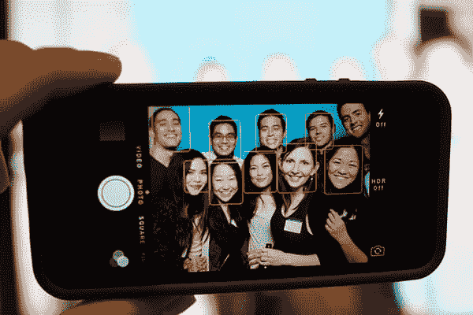
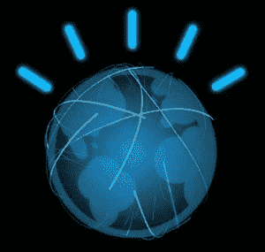
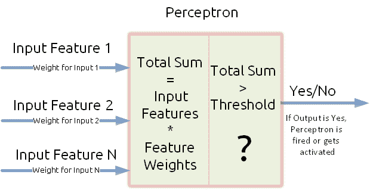
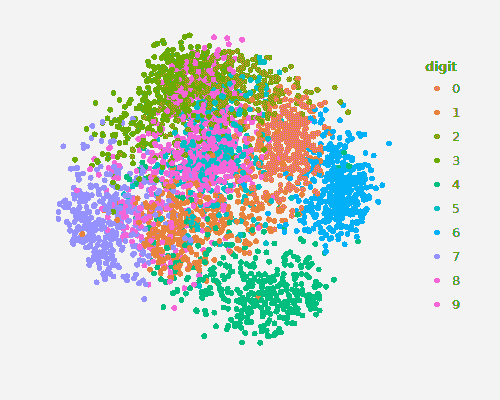
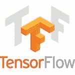

# 关于机器学习，每个开发人员都应该知道什么

> 原文：<https://thenewstack.io/starting-machine-learning/>

你有没有想过你的电子邮件是如何自动过滤垃圾邮件的？有没有一个真正的人理解你邮件的内容，然后决定它是不是垃圾邮件？或者说自动驾驶汽车是如何工作的？

这些智能动作都是机器在[机器学习](/category/machine-learning/) (ML)的帮助下执行的。

ML 是机器通过使用统计分析来确定数据中的相似模式并基于这些模式执行决定性动作的能力。

例如，智能手机摄像头如何自动检测照片中的人脸？这个的答案也是机器学习。一个智能机器学习软件应用程序与手机摄像头同步工作，允许检测和绘制人脸周围的方框。当机器学习算法被训练从其他物体中识别人脸，并赋予它像人类一样执行果断行动的能力时，这种智能是可能的。

使用手机摄像头进行人脸检测。

ML 实现的里程碑意义重大，值得一提。2015 年，微软推出了一项机器学习驱动的服务，名为《多大了？当给一张照片时，它能猜出一个人的年龄。这项服务一开始能立即给出相当准确的结果，随着越来越多的人使用它，它的准确性得到了提高。

谷歌基于机器学习的[阿尔法围棋](https://deepmind.com/research/alphago/)程序[在 2015 年的棋盘游戏围棋上击败了职业棋手](https://thenewstack.io/google-ai-beats-human-champion-complex-game-ever-invented/)。IBM 的沃森将在不久的将来作为[老师的助手](http://www.wsj.com/articles/if-your-teacher-sounds-like-a-robot-you-might-be-on-to-something-1462546621)给三年级学生教授数学。特斯拉和优步的自动驾驶汽车正在测试中，被视为自动驾驶的未来。即时通讯应用谷歌 Allo 允许用户在虚拟助理的帮助下无需打字即可回复。它将于本月晚些时候预装在 Pixel 手机上。很快，许多设备将具有某种智能，而机器学习是其中的关键。

## 酷之前的机器学习

你好，华生！

大约 50 年前，ML 开始设想制造智能机器，模仿以与人类相似的方式处理信息。

人脑处理来自人体上多个传感器的大量信息，以执行复杂的任务。计算机科学家一直希望能够通过计算机看到这一点。最早的机器学习应用可以在 1952 年由 Arthur Samuel 设计的跳棋程序中看到。在与人类进行游戏后，机器自学了玩跳棋所需的策略。它通过自我学习采用这些策略，并改进其游戏性。

Arthur Samuel 是机器学习和人工智能的先驱，于 1987 年被授予 IEEE 计算机先锋协会奖。他的名为“[使用跳棋游戏进行机器学习的一些研究](http://citeseerx.ist.psu.edu/viewdoc/download?doi=10.1.1.368.2254&rep=rep1&type=pdf)”的出版物被大量引用。

1957 年，Frank Rosenblatt 开发的“[感知机](https://web.csulb.edu/~cwallis/artificialn/History.htm)模型构成了人工神经网络的基础。最简单的模型由两层组成，输入和输出层。输入层有多个输入，并在输出节点求和。这些输入伴随着它们各自的权重，如果这些输入的总和达到一个阈值，那么它就激活感知器产生一个单一的输出。通过尝试不同的输入权重组合，可以生成多个输出响应。有复杂的感知器模型，由输入和输出层之间的几个“隐藏”层组成，以解决复杂的问题。

感知器，人工神经网络的构建模块

著名的“最近邻(NN)”算法发明于 1967 年，当时首次发现机器可以根据预先提供的数据识别相似类型的数据。在 20 世纪 90 年代后期，这种算法定义了“模式识别”(PR)的时代。PR 的实际应用包括计算机视觉、语音识别、自然语言处理、目标检测和识别、医学成像、机器人、系统和监控等。

21 世纪后期，ML 被用于网络应用、数据挖掘(大数据)和语言处理。机器学习的监督和非监督方法开始发展。流行的算法包括回归、K-最近邻搜索和支持向量机(SVM)。

检验程序和感知器学习属于监督学习的范畴，其中问题的输出是事先已知的。例如，为了检测图像中的人脸，利用由人脸和其他对象组成的示例来训练 ML 算法，并且机器通过训练示例来学习，以基于其训练将人脸与非人脸进行分类。

最近邻尝试根据颜色对数据点进行聚类。图例显示了由算法确定的十个聚类。

然而，最近邻算法是一种无监督学习，其中事先不知道先前的输出。假设有不同颜色、大小和形状的随机物体。神经网络算法将尝试根据颜色、形状和大小将相似的对象聚集在一起。ML 算法试图在没有任何训练示例的情况下找到数据内的相关性。

## ML 的最新趋势

ML 的基础是在 20 世纪 50 年代早期发展起来的，并且已经存在了相当长的一段时间。但是，突然之间，ML 成了技术界的一个时髦词，而且不可避免地会持续很长时间。这是因为在 20 世纪 90 年代早期，功能强大的计算机很容易获得。例如，在硬盘上存储少量图像的空间有限。没有强大的 GPU，开销是硬件组件的成本。简而言之，机器学习受到硬件资源的限制，只被政府项目的研究人员、学者和科学家使用。

Google 的开源机器库

但是随着我们在计算机硬件方面的进步，人们并不局限于使用它。他们现在可以买更快更便宜的电脑，运行机器学习算法。目前机器学习领域的一件好事是，许多构建的框架都是开源的，可以免费使用。例如，谷歌的 TensorFlow，一个免费的机器学习库，将他们的代码开源，彻底改变了机器学习的工作文化。通过这样做，技术的早期采用和开发变得更加容易和快速。在随后的帖子中，我们将看到如何应用机器学习来解决我们所有的问题！

通过 Pixabay 的特征图像。

<svg xmlns:xlink="http://www.w3.org/1999/xlink" viewBox="0 0 68 31" version="1.1"><title>Group</title> <desc>Created with Sketch.</desc></svg>