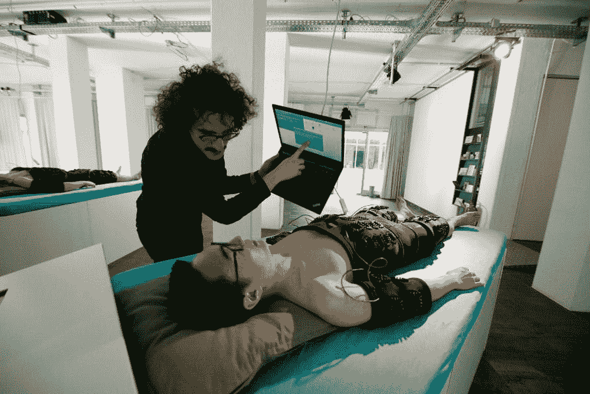
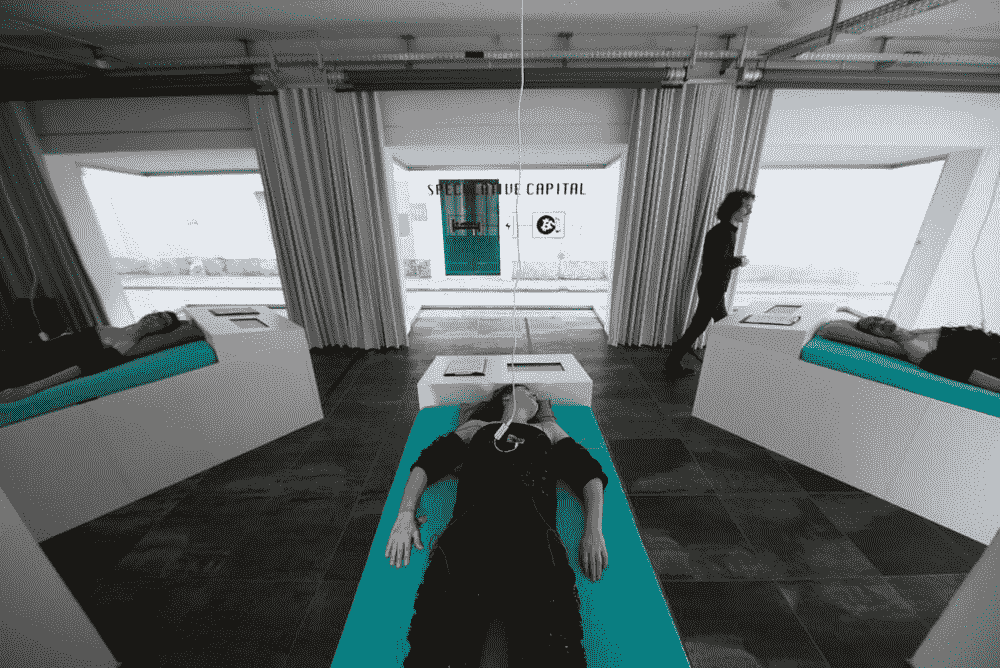
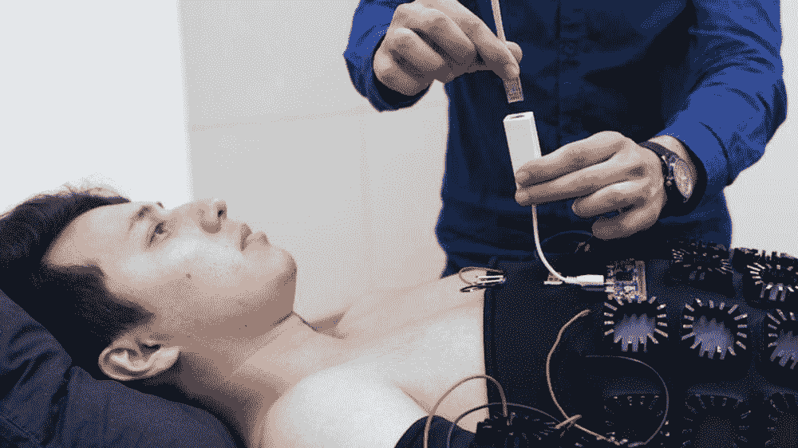

# 这家初创公司收集人体热量来开采加密货币

> 原文：<https://thenewstack.io/startup-harvests-human-body-heat-mine-cryptocurrencies/>

最近对比特币和其他加密货币的投机热潮导致越来越多的人加入虚拟潮流，以“挖掘”分散的点对点数字货币。虽然这听起来像是短暂和无形的事情，但挖掘比特币的过程对现实世界有着严重的影响:挖掘比特币的过程是能源密集型的，因为它需要一些繁重的计算来解决越来越具有挑战性的加密“工作证明”难题。有人估计，现在一笔比特币交易的用电量相当于一个家庭一周的用电量。总体而言，据估计，世界上所有比特币矿工在任何给定时间使用的电力足以维持 226 万个美国家庭。

这是相当大的环境足迹。随着整体能源消耗的持续增长，这种足迹需要得到解决，以使不断增长的加密货币保持长期可持续发展。这一现实促使一些人寻找替代方案来为他们的比特币采矿业务提供动力，无论是使用风能、太阳能还是水力发电，甚至偷工减料地操纵他们的电动汽车来生产额外的电力用于采矿。

然而，荷兰初创公司[人类淘汰研究所](http://speculative.capital/) (IoHO)提出了一个聪明但可能更极端的解决方案:利用人体热量为加密货币交易提供动力。这里的想法是将多余的身体热量转化为电能，为正在积极挖掘加密货币的数字处理计算机提供动力。

IoHO 网站解释说:“一个人在休息时会辐射 100 瓦的多余热量。”“我们创造了一种人体服装，它使用热电发电机来收集人体和周围环境之间的温差，并将其转化为可用的电力。”

收集人体热量来为加密货币采矿和其他各种事情提供动力，对于未来来说，可能看起来有点激进，甚至是反乌托邦的想法，但实际上这是一个已经流传了一段时间的旧想法。从瑞典的中央车站斯德哥尔摩到明尼阿波利斯的美国购物中心，人体热量被回收用来加热室内空间，降低了能源费用，而不是被浪费掉。最近，研究人员和私营公司正在寻找创新的方法，将人体热量转化为免费和高效的能源，为我们越来越多的可穿戴设备供电——如果这些相关技术的效率得到进一步提高，所有这些设备有朝一日可能完全不用电池。

到目前为止，IoHO 的实验已经从 37 名志愿者的体温中产生了约 127.2 瓦的电力，这相当于总共约 212 小时的采矿时间。志愿者所要做的就是穿上特别设计的服装，躺下来，在一、二或三个小时的轮班中“什么也不做”。到目前为止，该项目的志愿者已经能够挖掘超过 16000 枚替代硬币，从[硬币](https://coinmarketcap.com/currencies/vertcoin/)，到[以太坊](https://www.ethereum.org/)和 [Lisk](https://lisk.io/) 。志愿者们努力工作，获得 80%的利润，20%归项目所有。

诚然，替代币的数量看起来并不多，身体套装的效率需要进一步完善，但具有讽刺意味的是，该项目只专注于挖掘替代币，即被认为是比特币更好、更有效的替代品的加密货币——本质上凸显了其顽固的可持续性问题。

IoHO 创始人 Manuel Beltrán 告诉 [*主板*](https://motherboard.vice.com/en_us/article/vby7ny/bitcoin-body-heat-mining) “我们从来没有开采过比特币，因为用人类的热量生产它们是没有用的。“我们专门开采代用币，其中一些已经升值超过 46，000%。开始时只是小钱的东西现在变成了大笔的钱。”

除了强调加密货币采矿的潜在可再生能源替代方案，该项目旨在提出的问题是，在设计新技术时，重要的可持续性问题是否得到了足够的考虑，例如这些新兴的点对点数字货币，以及被称为区块链的[公共总账，它们支撑了比特币等加密货币。](https://thenewstack.io/the-mechanics-of-bitcoin/)

最重要的是，IoHO 提出的替代解决方案指出了人类“生物劳动”的未来价值，以及在人类工作可能很快被自动化的世界中它的价值。这是否意味着我们可以期待有一天被降级到产热电池的水平？这不是一个愉快的想法，但这个问题还没有明确的答案。

在[人类老化研究所](http://speculative.capital/)阅读更多内容。

<svg xmlns:xlink="http://www.w3.org/1999/xlink" viewBox="0 0 68 31" version="1.1"><title>Group</title> <desc>Created with Sketch.</desc></svg>