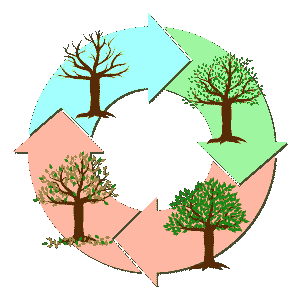
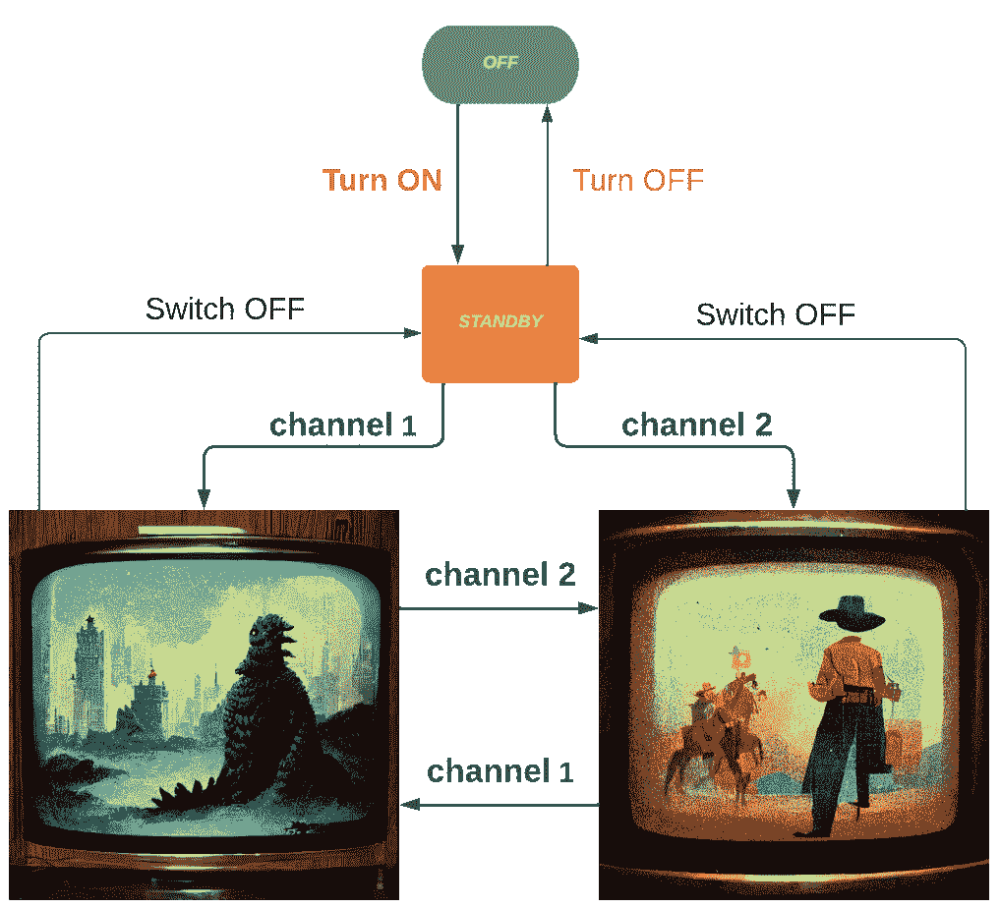

# 开发者的状态机:从区块链到 AWS 到电视机

> 原文：<https://thenewstack.io/state-machines-for-devs-from-blockchain-to-aws-to-tv-sets/>

我注意到状态机被提到的次数比解释的次数要多一点。然而，它们代表了开发人员武库中的一个标准工具，尽管在概念上比以整洁和可重用的方式实际实现它们更容易理解。

> 状态机(有时是有限状态机)是状态以及这些状态之间的转换的模型。

想想季节。如果我们想将一年转换成季节的状态机器，我们知道状态的名称将是“春天”、“夏天”、“秋天”和“冬天”，它们之间的转换通常是“等待三个月”



如果我们要用简单的代码来表达，我们需要:

*   列举季节；
*   把哪个季节过渡到哪个季节联系起来；
*   允许季节在方法调用时转换；
*   决定一个开始的季节。

以下是我针对这一需求编写的过于简单的 C#代码:

这里值得一提的是通过枚举类型来定义季节，将原本应该是字符串的东西变成了一级代码公民:

```
public  enum  SeasonalState  {  Spring,  Summer,  Autumn,  Winter  }

```

这很简单，因为季节循环往复。所以转变是一样的:你只是跳到下一个季节。事实上，高级开发人员可能会拒绝承认这是一个状态机，因为它是多么有限。然而，它确实完成了它的使命。虽然为了便于阅读，方法和变量的名称是为了反映领域(季节)而编写的，但是请注意，如果我们发明了一个新的季节，只需更改两行。我们稍后将回到实现。

我们认识到，大多数现实世界的事物没有明确的状态，它们可以干净地进入和离开。另一方面，*可以*这样建模的东西，应该是。

## 区块链用例

区块链是国家机器吗？毕竟，这是最近许多人第一次看到这个术语的地方。我们知道区块代表什么:加密货币的所有权和各方之间的转移。它是一个(相当低效的)状态机，有无限多的状态，尽管它们很相似。它确实有一个当前状态，并且只有在事务被正确解决后才能继续。以太坊似乎更热衷于将自己描述为一个状态机，将用户内容添加为状态的一部分，使其成为一个“智能链”。

谈到状态中的用户内容，我们可以对简单的状态机代码做一点小小的调整，使它在总体上更加有用。此更改允许简单的观察者订阅事件:

所以现在当我们运行代码时，我们从一个完全不切实际的农民的陈述中看到了季节:

```

Spring is here.  Spread the fertilizer!
Summer is here.  Cut the hay!
Autumn is here.  Harvest time!
Winter is here.  Feed the cows!
Spring is here.  Spread the fertilizer!
Summer is here.  Cut the hay!

```

## AWS 和阶跃函数

状态机的另一个值得注意的现代用途是在 AWS 中。它们被称为步骤函数，可用于无服务器环境中的编排。也就是说，春天的到来可能会触发其他λ函数。有趣的是它们在 JSON 中的表示方式:

```
{
  "Comment":  "A Hello World example of the Amazon States Language",
  "StartAt":  "HelloWorld",
  "States":  {
    "HelloWorld":  {
      "Type":  "Pass",
      "Result":  "Hello World!",
      "End":  true
    }
  }
}

```

这里只有一种状态，似乎既是起始状态，又是自终止状态。

## 典型的国家机器:电视

让我们看看另一个简单但更典型的国家机器:一台非常简单的电视机。



现在，这不是你有的或者想要的电视，但是你知道它是如何工作的。前面的一个大按钮可以打开(待机)和关闭电视。待机时，您可以使用遥控器在频道之间切换。我们也会忽略电视必须具备的所有其他东西。

如果我们继续使用 C#，我们现在需要两种枚举类型:一种用于命令，一种用于状态。

```
public  enum  TVStates  {OFF,  STANDBY,  CHANNEL1,  CHANNEL2}

public  enum  TVCommands  {TURN_ON,  TURN_OFF,  SWITCH_TO_1,  SWITCH_TO_2,  SWITCH_OFF}

```

我们已经可以看到，我们将不得不把重点放在过渡上，而不是各州本身。

与季节周期不同，并非所有命令都适用于任何给定的州。我们不能通过前面的大按钮连续打开电视两次。如果我已经在频道 1 上，切换到频道 1 没有任何作用。因此，在我们设置时，我们将需要添加八行“当处于此状态时，允许此命令移动到该状态”:

您可以添加观察者或“副作用”，正如我在前面的例子中所做的那样。你可以想象当一个频道被改变时，一个计时器可能会启动，这样，如果观众在日本怪物横冲直撞或牛仔对决面前睡着了，电视会自动关闭；简而言之，电视的 API 可能需要订阅一些状态转换。

在运行时，您可以看到不允许的转换被礼貌地忽略:

```

TURN_ON:  Now STANDBY
SWITCH_TO_CHANNEL1:  Now CHANNEL1
SWITCH_TO_CHANNEL2:  Now CHANNEL2
SWITCH_OFF:  Now STANDBY

```

## 结论

在编写了一些状态机之后，您将能够更好地使用现有的库版本——毫无疑问，您会希望这样做。这些必须被完全一般化，所以如果你没有开发出一些你自己的并确定了这个重要的设计模式，它看起来会有点简单。

<svg xmlns:xlink="http://www.w3.org/1999/xlink" viewBox="0 0 68 31" version="1.1"><title>Group</title> <desc>Created with Sketch.</desc></svg>