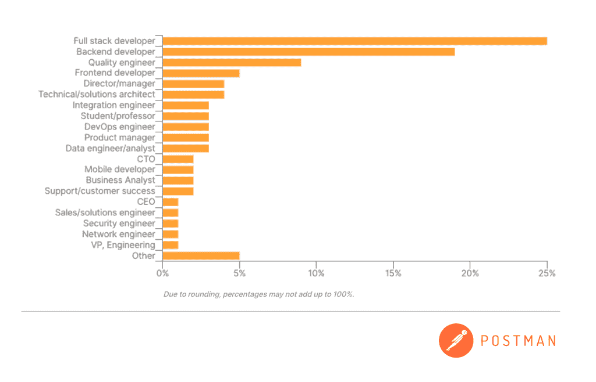
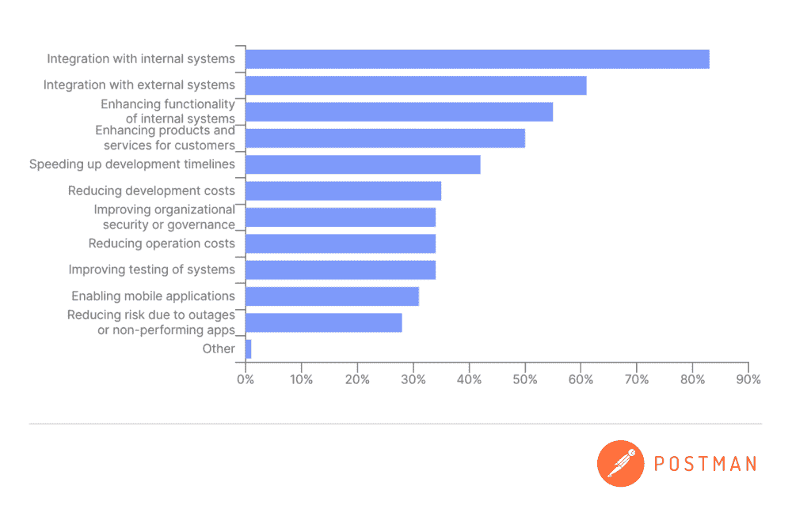

# API 的现状:缺乏 API 设计技巧是一个关键问题

> 原文：<https://thenewstack.io/state-of-the-api-lack-of-api-design-skills-a-key-problem/>

根据 API 平台 Postman 最近的一份报告，缺乏 API 设计技能是今年生产 API 的最大障碍之一。

周四发布的[报告](https://www.postman.com/state-of-api/)调查了超过 37，000 名开发人员和 API 专业人员。大约 5%的受访者被认为是前端开发人员，而 25%被认为是全栈开发人员，另外 20%声称他们是后端开发人员。其他与 API 相关的角色包括[开发人员](https://thenewstack.io/category/devops/)工程师、技术工程师、首席技术官、项目经理、数据工程师和分析师以及移动开发人员。

## 缺乏 API 设计技能

报告指出，API 设计技能的短缺可能会导致“[微服务、](https://thenewstack.io/category/microservices/)的过度扩散，这正在产生自己的问题”——但报告没有具体说明这些问题是什么。然而，数据显示了开发者和其他调查参与者之间的分歧。开发人员倾向于认为他们在设计技能方面很好，而其他人则看到了缺点。

“当你与开发人员交谈时，许多开发人员对他们目前的开发过程非常满意，”Postman 的首席传播者 [Kin Lane](https://www.linkedin.com/in/kinlane) 说。“作为一个花了很多时间和开发人员在一起的开发人员，我没有听到太多关于设计技能的需求——他们实际上有点排斥这一点。但调查覆盖了如此广泛的人群，这是一个大问题。”

Lane 说，可能需要更多的培训、更多的教育、更多的工具和服务。

“对我来说，这表明事情正在变得更加业务一致，因为我觉得过去 5 到 10 年来一直存在经典的 IT/业务分歧；开发者在做 API，但现在我们有了更多的商业利益相关者，”他说。“所以我认为这就是设计如此重要的原因。”

## 前端开发人员需要 API 意识

Lane 说，对于前端和移动开发人员来说，API 往往比后端开发人员更抽象，后端开发人员可以看到基础设施的更多细节。

“他们看到了这种基础设施，而[反应了](https://thenewstack.io/learn-react-start-of-a-frontend-dev-journey/)开发者——这就是为什么他们中的许多人要求 [GraphQL API](https://thenewstack.io/graphql-apis-great-for-adoption-but-are-they-secure/) 的东西，因为他们并不总是看到整个堆栈的细微差别，”Lane 说。“这就像你给一栋房子贴上石膏板后，进来的人看不到框架、饰钉和线路——他们看不到所有的零部件。所以你认为这是理所当然的。”

与 API 打交道的人。资料来源:《2022 年度美国空气污染指数报告》，邮递员

这就产生了一个问题，前端开发人员是否应该了解螺柱、框架和布线。Lane 说这是一个重要的问题，虽然前端开发人员不需要了解所有关于 API 的知识来完成他们的工作，但是他们应该了解 API。

“如果你希望你的操作更一致、更稳定、更可靠、更少冗余，当前端开发人员在构建一些东西时，他们应该有一些 API 策略和 API 治理的意识，[并且]他们应该合作并意识到这一点，”他说。“他们应该意识到这一点，这样他们就不会为一个应用程序专门构建多余的 API。”

他说，重新创建轮子一直是移动应用程序的一个问题，开发者在已经存在 API 的地方创建和部署 API。

## API 做什么

尽管所有人都在谈论 API 连接外部服务的能力，但调查发现，API 现在主要用于与内部系统集成，83%的调查参与者表示，与内部系统和应用程序的集成至关重要。这一比例高于去年的 67%。

“今年，内部整合对于生产和消费 API 都变得越来越重要，”报告指出。“这是一个值得关注的转变，因为它对 API 文档和设计以及整个开发生命周期都有影响。”

调查参与者如何使用 API。资料来源:《2022 年度美国空气污染指数报告》，邮递员

## 在 API 上投入更多时间和金钱

调查发现，每个人都在 API 上花费了更多的时间，51%的受访者表示，他们组织一半以上的开发工作都花在了 API 上。“这比 2020 年的 40%和去年的 49%有所上升，凸显了 API 作为现代软件基石的作用，”报告指出。

报告补充说，原料药投资也保持强劲，89%的调查参与者表示，在未来 12 个月内，原料药投资将增加或保持不变——尽管预计会出现经济动荡。

<svg xmlns:xlink="http://www.w3.org/1999/xlink" viewBox="0 0 68 31" version="1.1"><title>Group</title> <desc>Created with Sketch.</desc></svg>