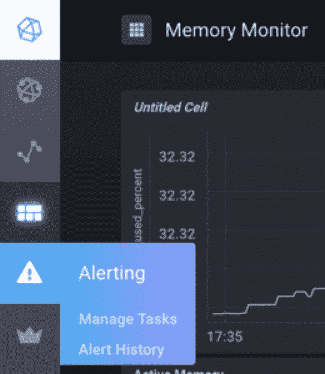
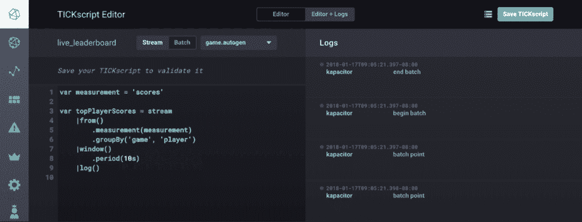
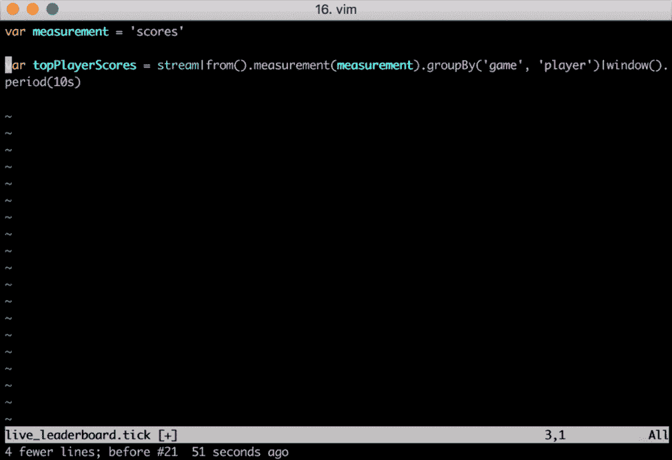
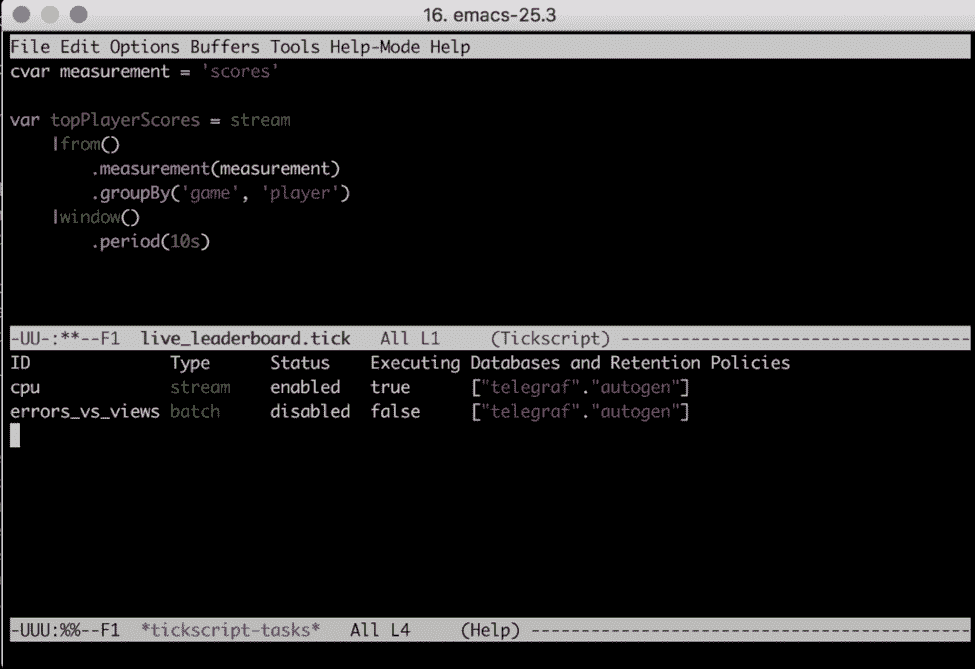
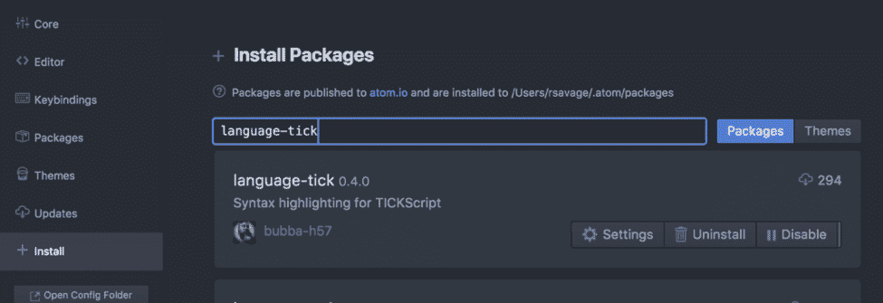
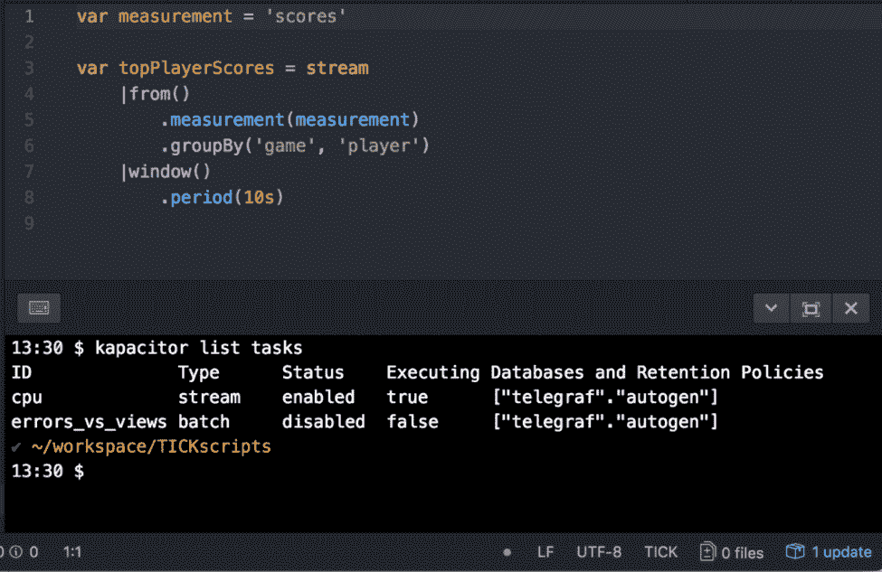
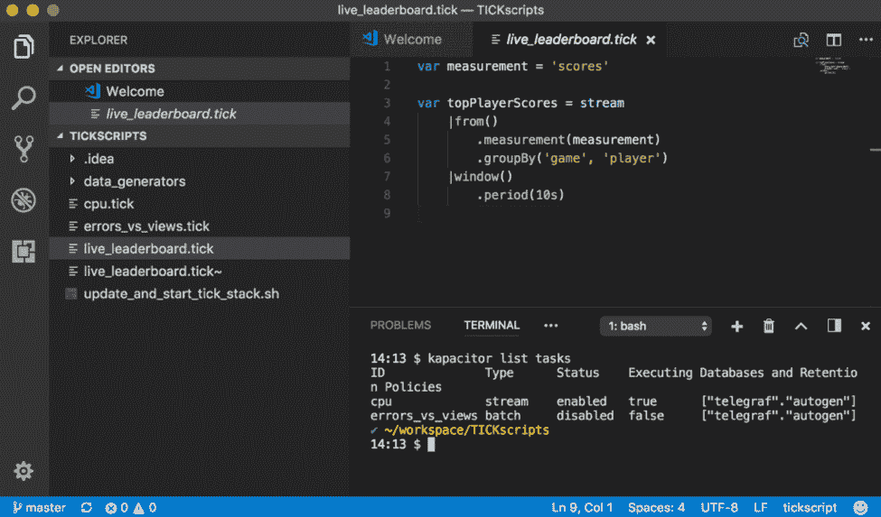
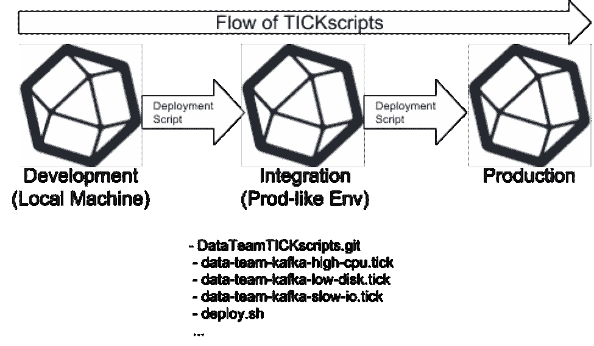

# InfluxDB:tick script 的发展状况

> 原文：<https://thenewstack.io/state-tickscript-development/>

 [Russ Savage，产品经理

Russ Savage 是 InfluxData 的产品经理，他主要负责为使用 InfluxDB 和 TICKstack 的团队启用 DevOps。他有计算机工程背景，过去 10 年来一直专注于企业数据的各个方面。Russ 之前曾在 Cask Data、Elastic、Box 和 Amazon 工作。](https://www.influxdata.com/) 

为了充分利用[Kapacitor](https://www.influxdata.com/time-series-platform/kapacitor/)([TICK 栈](https://www.influxdata.com/time-series-platform/)的“K”)及其提供的监控和警报，您和您的团队需要编写 TICKscripts。 [TICKscript](https://docs.influxdata.com/kapacitor/latest/tick/) 是一种简单而强大的方法，用于聚合、分析和警告流经 InfluxDB 的数据。在这篇文章中，我将介绍各种可用于编写 TICKscripts 的工具，并重点介绍一些我见过的用于组织脚本开发过程的常见模式。

让我们从强调一些可用于编写 TICKscripts 的开发工具开始。各种编辑器和 ide 的插件由开源的 InfluxDB 社区提供，并不由 InfluxData 维护。如果你有一个最喜欢的编辑器可能缺少 TICKscript 编辑器，我们鼓励你创建一个并在[社区页面](https://community.influxdata.com/)中分享。

## 开发环境

每个开发人员都有自己喜欢的 IDE，用于编写和部署代码。下面是我们所知道的开发者用来编写 TICKscripts 的各种工具的简要介绍。

### Chronograf Web 用户界面

开始编写 TICKscripts 的最快方法之一是通过 Chronograf UI 中的内置编辑器来完成。要开始，请确保您可以访问某处运行的完整 TICK 堆栈。如果你想在你的机器上试一试，看看[这个关于设置](https://docs.influxdata.com/kapacitor/latest/working/kapa-and-chrono/)和连接一切的教程。TICKscript 编辑器可以在“创建”子菜单的“警报”选项卡下找到。

在这里，您有两个选择:您可以使用 UI 中的向导创建一个警报规则，或者您可以创建和编辑一个自定义 TICKscript 来执行您喜欢的任何操作。在幕后，警报向导将生成一个 TICKscript，您可以在以后进入并手动编辑它。这是一个有用的起点，您可以使用它进行进一步的定制。

需要记住的一点是，Chronograf UI 只会与您选择的链接 Kapacitor 实例进行交互。这是它将提取脚本列表以及显示的实际代码的地方。如果您在 Kapacitor 机器上本地存储了文件，那么如果您通过此 UI 进行更改，则需要手动同步这些文件。

此外，在 Chronograf 的 1.4 版本中，我们引入了一个新的 Kapacitor 日志查看器，允许您在浏览器中查看任何 Log()命令的输出。这对调试脚本非常有帮助。

### Vim 集成

对于那些不喜欢离开终端的人，还有一个 Vim 插件，由 InfluxData 自己的[纳撒尼尔·库克](https://github.com/nathanielc)维护。可以在[vim-tick script](https://github.com/nathanielc/vim-tickscript)[GitHub repo](https://github.com/nathanielc/vim-tickscript)中找到。使用您最喜欢的 vim 插件管理器可以快速安装，但是自述文件中提供了病原体和 Vim 插件的[说明。](https://github.com/nathanielc/vim-tickscript#install)

安装后，您可以运行 **:TickInstallBinaries** 命令，该命令会将 **tickfmt** 添加到您的路径中，用于格式化您的脚本。当我安装这个时，由于我不使用 Vim 进行开发，我还需要安装 [vim-go 插件](https://github.com/fatih/vim-go/)，否则当我试图运行脚本来安装 **tickfmt** 时，我会看到一堆错误。默认情况下，这个插件会在你每次保存时自动格式化你的脚本，但是你可以在首选项中更改。

### Emacs 主要模式

当然，如果说 Vim，我们需要给 Emacs 同等的时间。Marc Sherry 为 TICKscript 文件创建了一个非常棒的 [Emacs major 模式，并与社区分享。除了语法突出显示和格式化之外，它还允许您通过 Emacs 命令运行常见的 Kapacitor 函数。你可以在](https://github.com/msherry/tickscript-mode)[自述文件](https://github.com/msherry/tickscript-mode#usage)中找到命令列表。

### 原子集成

Atom 是一个非常灵活的开源文本编辑器，许多开发人员都喜欢使用。Bubba Hines 为 TICKscript 语法高亮显示构建了一个不错的 Atom 包。通过 Atom 包安装程序，安装变得简单快捷，只需搜索 language-tick，一切就绪。它不会自动格式化您的脚本，但是语法高亮显示有助于快速发现问题。如果你想在一个屏幕中找到所有的东西，你可以安装[platform io-atom-ide-terminal](https://atom.io/packages/platformio-ide-terminal)[插件](https://atom.io/packages/platformio-ide-terminal)并使用它在 Kapacitor 中测试和安装你的脚本。

### 

### Jetbrains 插件

Jetbrains Intellij 平台还支持 TICKscript 编辑，这是由 Vladislav Rassokhin 和他的 T2 Intellij-kapacitor 插件 T3 提供的。这可以在任何基于 Intellij 的 IDE 上使用，包括 [GoLand](https://www.jetbrains.com/go/) 或 [IDEA](https://www.jetbrains.com/idea/) 。像 Atom 插件一样，它有语法高亮显示，内置的终端面板使得在同一窗口中更新 Kapacitor 中的脚本变得容易。您还可以使用 command-click 快速跳转到变量定义，就像编写 Java 或 Go 代码一样。

### Visual Studio 代码插件

最后但同样重要的是，对于那些已经爱上[微软视觉代码](https://code.visualstudio.com/download)工具的人来说，[马特·琼斯](https://gitlab.com/mattyjones)也为此编写了一个 [TICKscript 语法荧光笔插件](https://marketplace.visualstudio.com/items?itemName=mattyjones.vscode-tickscript)。一旦你安装了可视代码，通过浏览器中的 install 按钮安装就很容易了。像其他 ide 一样，可视代码带有一个集成的终端面板，这对于向 Kapacitor 发送命令很有用。

## 推荐的开发工作流程

如您所见，用于编写 TICKscripts 的工具并不缺乏。但是拥有合适的工具只是解决方案的一部分。您需要标准化将 TICKscripts 从本地开发者机器转移到生产系统的过程。

让我们从部署环境开始。开发 TICKscripts 应该像您组织中的任何其他类型的代码一样处理，并且您不应该在生产中直接编辑脚本。

我们的大多数大型用户至少有三个环境在运行:本地开发环境、集成环境和生产环境。您可能有更多，但是如果少了，您将大大增加产生无法正常运行或监控的脚本的机会。所有新的脚本或变更都是从左向右流动的，无论多小都不会反过来。

## 源代码控制是必须的

我们的许多客户将他们的 tick 脚本签入某种源代码控制系统，通常是 Git 或 SVN。我们建议围绕负责监控的不同团队来组织存储库。单个 repo 应该包含将由单个团队在其 Kapacitor 实例或集群上部署的所有 TICKscripts。这不仅使部署脚本变得更容易(存储库根处的一个 shell 脚本可以快速扫描 repo 中的所有 tick 脚本并通过 Kapacitor API 加载它们)，而且还使查找、添加和修复它们变得更容易，因为每个团队都管理自己的脚本。

我们看到的另一个常见模式是，当有一个集中的基础设施团队跟踪部署到公司每个 Kapacitor 实例的一组核心 TICKscripts 时。然后，每个单独的团队也可以拥有他们自己的存储库和他们自己的脚本集。这里的想法是确保团队不需要互相请求许可就可以进行修改，因为每个团队都有自己的库，他们可以用自己的 TICKscripts 来管理。

## 知识库结构

有许多不同的方法来构建包含 TICKscripts 的存储库，从将所有脚本放在根目录中到将它们整齐地分类到文件夹中。如果您计划在 Kapacitor 中利用基于[文件的脚本](https://github.com/influxdata/kapacitor/tree/master/examples/load)加载，您将需要维护一个预定义的结构。不管它们是如何组织的，当它们被发送到 Kapacitor 中时，每一个都只能通过它们的名称来引用，所以我们建议将有用的关键字编码到文件和脚本的实际名称中。例如，如果数据团队有一个监视 Kafka 集群上高 CPU 的警报，脚本文件名可能是 data-team-kafka-high-cpu.tick，并带有相应的脚本名。

当然，您可以自由选择您喜欢的任何格式，但是我们的建议是在每个 Kapacitor 实例上保持一致，并尽可能多地将可搜索的信息编码到其中。另外，请记住，结果是从 Kapacitor API 按字母顺序返回的。

## 测试和部署变更

对 TICKscripts 进行更改的过程也应该遵循标准的开发最佳实践。开发人员应该首先从源代码控制中签出存储库，进行他们的更改(可能在不同的分支上)，并在将更改代码合并回主分支之前，让另一个团队成员审查这些代码。你也可以使用这个来自[gon alo Pestana](https://github.com/gpestana)的令人敬畏的库为你的 tick script 编写[单元测试。使用这个单元测试框架，您可以定义触发警报的样本数据，并验证它是否按预期工作。这些单元测试应该与您的 TICKscripts 存在于同一个存储库中。](https://github.com/gpestana/kapacitor-unit)

一旦您的代码被合并回主分支，就应该使用自动化脚本将它部署到您的测试环境中进行集成测试。您的集成环境应该尽可能地模拟您的生产环境，以便可以在这里发现任何问题或与其他脚本或警报的冲突，而不是在生产环境中。您应该能够在您的集成环境中使用示例数据生成来模拟您试图警告的问题。

最后，一旦您的 TICKscript 被验证可以在您的集成环境中工作，它应该使用部署脚本自动加载到您的生产环境中。

所有这一切听起来一开始需要做大量的工作，但是前期的一点点投资将会随着生产系统的灵活性和适当的警报的增加而获得数倍的回报。

## 结论

对于那些刚刚开始使用 TICKscripts 的人来说，我希望我能够在工具和开发过程方面为你们指出正确的方向。如果你已经部署了大量 TICKscripts，请在评论中告诉我们你是否有一些开发和维护脚本的有用提示和技巧。

[InfluxData](https://www.influxdata.com/) 赞助了这篇文章。

通过 Pixabay 的特征图像。

<svg xmlns:xlink="http://www.w3.org/1999/xlink" viewBox="0 0 68 31" version="1.1"><title>Group</title> <desc>Created with Sketch.</desc></svg>