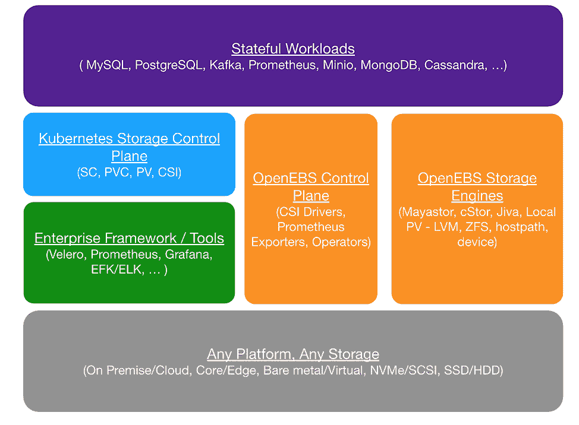
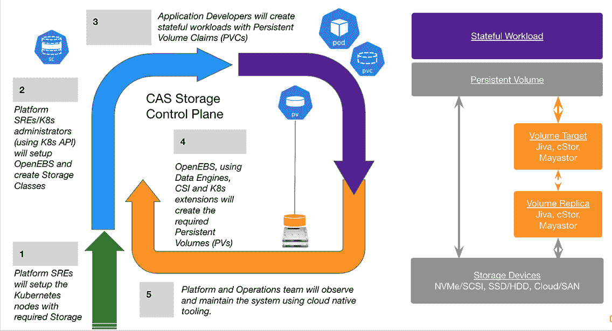
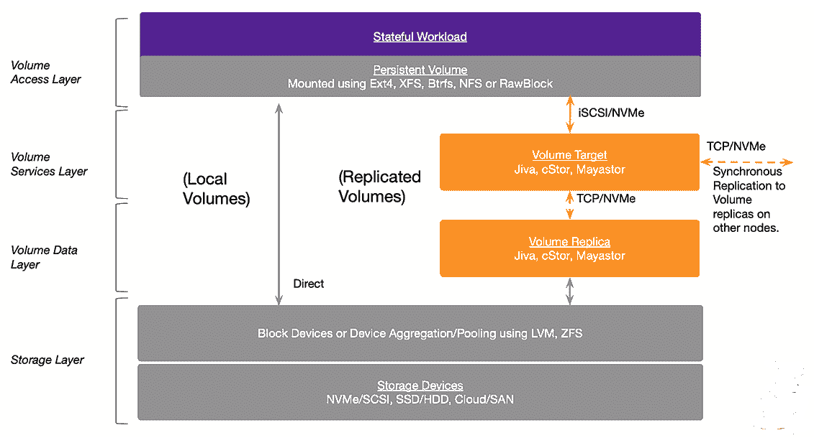

# 带有容器附加存储的 Kubernetes 上的有状态工作负载

> 原文：<https://thenewstack.io/stateful-workloads-on-kubernetes-with-container-attached-storage/>

Kubernetes 编排容器打包的微服务的方式简直不可思议。但它一直有一个主要的设计怪癖:它不是为处理有状态的工作负载而构建的——例如，数据库和键/值存储，或者任何其他从其活动中保存客户端数据以供未来使用的应用程序。容器是为处理无状态应用程序而构建的，优先考虑保持它们的灵活性和可移植性。

这种情况给开发者带来了许多挑战。其中之一是:它制造了瓶颈。如果组织内的团队定制他们的存储策略以匹配他们的工作负载，但共享数据存储，那么应用程序部署可能会变慢，因为有状态的应用程序通过“输入/输出搅拌器”搅动，争夺优先级。

然而， [MayaData](https://mayadata.io/?utm_content=inline-mention) 的联合创始人兼首席架构师 [Kiran Mova](https://www.linkedin.com/in/kiranmova) 说，无状态应用程序需要与有状态应用程序协同工作。“作为一个行业，我们喜欢谈论无状态和无服务器，”Mova 说。“但它们并不是孤立存在的，它们总是在某个必须存储在某个地方的状态之上工作。”

此外，在[云本地计算基金会的 2020 年调查](https://www.cncf.io/wp-content/uploads/2020/12/CNCF_Survey_Report_2020.pdf)中，55%的参与者表示他们在生产环境中的容器中运行有状态的应用程序。这项调查收到了 1，300 多份回复，发现只有 22%的调查参与者不在容器中运行有状态应用。

容器附加存储(CAS)的出现有助于开发者完全避免 I/O 混合器。它旨在允许 Kubernetes (K8s)处理有状态的工作负载。CAS 由基于微服务的存储控制器组成，由 Kubernetes 进行编排；它们可以在 K8s 所能运行的任何地方运行—公共云、本地、裸机。(它也可以在传统的存储区域网络(SAN)上运行。)该解决方案允许开发人员为其有状态应用程序的数据设置弹性块存储。

“CAS 提供了成熟企业所期望的功能类型，”顾问和行业分析师[克里斯·埃文斯](https://www.linkedin.com/in/chrismevan)说，他创立了[架构 IT](https://www.architecting.it/) 。“这为纵向扩展和横向扩展应用提供了弹性存储。”

## 集装箱附加存储解决方案

Evans 说，在容器附加存储出现之前，使用 Kubernetes 的开发人员必须创造性地使用变通方法来处理有状态的应用程序。

“开发人员需要依赖脚本和其他自主开发的自动化工具来跟踪数据的位置，”埃文斯告诉新的堆栈。“这些解决方案不可扩展，容易出错，最终会导致数据丢失。一些 CAS 类型的功能可以使用外部存储阵列来实现，但最大的困难是将应用程序映射到外部存储。

唯一的替代方法是将应用程序锁定到一个节点，这违背了横向扩展恢复能力的目的

当大规模构建时，这些变通办法会显著阻碍开发速度。为了满足大规模使用 Kubernetes 的开发人员的需求，CAS 领域已经发展到包括来自 [PortWorx](https://portworx.com/?utm_content=inline-mention) 、 [Rancher](https://rancher.com/products/longhorn/) 、 [Robin](https://robin.io/) 、 [Rook](https://rook.io/) 、 [StorageOS](https://storageos.com/?utm_content=inline-mention) 和 [MayaData](https://mayadata.io/?utm_content=inline-mention) 的工具。

[Maya data 推出的开源 CAS 工具 OpenEBS](https://github.com/openebs) ，已经是[云原生计算基金会](https://cncf.io/?utm_content=inline-mention) (CNCF)沙盒项目两年了。它与多个存储引擎一起工作: [cStor](https://docs.openebs.io/docs/next/cstor.html) 、 [Mayastor](https://docs.openebs.io/docs/next/mayastor.html) 、 [Jiva](https://docs.openebs.io/docs/next/jiva.html) 或[Kubernetes Local Persistent Volumes(Local PV)](https://docs.openebs.io/docs/next/localpv.html)。已经被彭博、康卡斯特、FlipKart、威瑞森等企业采用。

该项目始于 MayaData 的工程师对有状态应用程序的输入输出(I/O)控制器软件部分的研究。“我们能从集装箱化和 Kubernetes 中获益吗？这是我们开始开放这个项目时问的问题，”Mova 说。

他指出，硬件的创新不仅引发了存储领域的新工具的诞生，也引发了网络领域的新工具的诞生，这些新工具来自 MayaData 之外的许多领域:“是时候重写 I/O 控制器了。我们能不能用更好的方式来写它们？”

## 集装箱附加存储的优势

在 CAS 中，数据是通过容器访问的，而不是存储在平台外。它允许开发人员设置自己的块大小、备份策略和复制模式，而无需在部署前获得中央存储机构的授权。

CAS 的主要优势包括:

*   它是 Kubernetes 的土生土长的产品，从一开始就是为了与它一起工作而构建的
*   每个工作负载和团队都可以创建自己的系统来处理数据存储。
*   每个工作负载都可以使用自己的存储引擎
*   这些工具是开源的，所以没有被一个可能不会长久的供应商所束缚的危险。
*   数据保存在本地的 Kubernetes 集群中，可以根据需要复制到其他主机。
*   数据存储是水平可扩展的。

在 CAS 中，传统存储控制器的组成部分已被分解为可以自主运行的部分。将存储视为微服务也意味着输入/输出(I/O)是分布式的，因此“I/O 混合器”瓶颈不再是一个问题。

CAS 的另一个优势:增强的可观察性。“CAS 的一个架构要点是，你知道你的数据在哪里，”Mova 说。“如果你使用分布式系统，当你写一些文件或数据或一些用户信息时，它会进入云端，可以分发到任何地方。但是通过这种设置，你知道，确切地说，它来自这个服务并登陆到这个数据库。这个数据库把它写到这些特定的节点上。这些节点正在向这些磁盘写入数据。

“您可以获得这种可见性，并且所有这一切都可以通过 cube CTL 命令来实现。因此，管理员可以更灵活地了解它的工作原理和方式，这也有助于他们非常轻松地实施新策略。”

## OpenEBS 内部

为了使用 OpenEBS，平台站点可靠性工程师(SREs)设置了具有所需存储的 Kubernetes 节点。接下来，SREs 或 Kubernetes 管理员将设置 OpenEBS 并创建存储类。

然后，开发人员可以使用持久卷声明(PVC)创建有状态的工作负载。OpenEBS 然后使用数据引擎、CSI 和 Kubernetes 扩展创建持久卷。

运行在 cStor、Mayastor 或 Jiva 等数据引擎上的 PVs 依次创建目标卷，这些卷在其他节点上复制。也可以创建本地卷。

看起来都是这样的:

### OpenEBS 架构

### 制导机

### 数据平面

Mova 说，实际上，这意味着正在创建有状态应用程序并需要访问像 [MongoDB](https://www.mongodb.com/cloud/atlas/?utm_content=inline-mention) 这样的数据库平台的开发人员可以使用 OpenEBS 来允许容器数据存储运行，就像 Kubernetes 集群中的任何其他应用程序一样。

“你可以打开你的 minikube 或 K3s，你可以在上面运行 MongoDB，持久容量将由 CAS 给出，”他说。“它实际上可以使用您的主机存储来提供该卷。因此，它可以让您体验到使用 Kubernetes 的标准构造来创建带有卷的有状态工作负载。但它实际上是在使用开发人员机器上可用的资源来提供这种功能。”

对于开发人员来说，这意味着更大的自主性和速度——以及更大的灵活性，使他们能够在每个用例中使用最适合他们的工具。Mova 说:“它将平台团队从应用团队中分离出来，为应用团队提供了更多的灵活性，使他们能够使用他们想要的堆栈运行。“这是云原生、微服务方法的承诺，对吗？

## 案例研究:彭博的 OpenEBS

在金融数据和媒体巨头彭博[，数据和分析基础设施组的工程师大约两年半前开始关注 OpenEBS，据该组负责人](https://www.bloomberg.com/company/) [Steven Bower](https://www.linkedin.com/in/stevenbower/) 称，这是其 CAS 工具探索的一部分。该集团为公司的系统工程师提供一套计算(人工智能、流处理)和数据服务(RDBMSes、搜索、NoSQL)，帮助他们为客户构建应用。

他告诉 New Stack，Bower 的团队专注于易用性、可靠性和灵活性。“我们有许多不同的用例，每个用例都有许多工作负载，因此拥有一个工具来为这些用例建模和实施解决方案至关重要。”

他说，Bower 的团队选择 OpenEBS 作为 CAS 解决方案有两个原因。“首先，每个工作负载拥有大量不同存储集群的部署模式符合我们实施更高级服务产品的模式。”

其次，OpenEBS 是开源的，他说，“这符合我们为彭博带来的所有数据和分析基础设施解决方案的理想交互模型。”

到目前为止，数据和分析基础设施小组已经在两个用例中使用了 OpenEBS。第一个是一个试点系统，允许用户通过 Kubernetes 上的 API 启动数据库和其他数据服务，“我们每天都有数百个活跃的服务在这个平台上运行，”Bower 说。

第二个用例是需要 NFS 的构建系统；该团队在短暂的 OpenEBS 卷的基础上进行构建，以简化系统并减少对传统文件服务器的依赖。

总的来说，Bower 说，“我看到的最大优势是[OpenEBS]为存储提供了一致的模型，无论存储引擎是什么，也无论存储是本地还是分布式的。这使我们能够解决大量用例，而不需要工程师学习大量不同的工具。”

## 有待解决的挑战

OpenEBS 具有 CAS 工具的优势，但仍然存在一些挑战:

*   **不支持横向扩展卷。**仅支持容量可在给定节点内提供服务的卷。然而，OpenEBS 的创造者认为，随着越来越多的工作负载转移到 Kubernetes，对大容量的需求将会减少。Mova 说，存储技术的容量在过去几年中有所增加，从 2TB 增加到 16tb 或 32TB，超过了单个 PVC 的需求。“OpenEBS 被用作实现数据平台(如数据库)的构建模块，这些平台反过来可以支持为他们的应用程序提供 Pb 级的存储，”他说。未来，“易于管理和扩展的数据平台组件将只需要单个数据块卷的较低容量。”
*   **通过块存储卷上的 NFS 支持读写许多使用情形。**读/写许多用例通过基于对象、键/值或 API 的接口得到更好的服务，这些接口 offer 更多的控制和 efficiency.

使用 OpenEBS，一些数据引擎可能比其他引擎工作得更好。

[最近的一项 IT 架构研究](https://www.architecting.it/product/performance-benchmarking-cloud-native-storage-solutions-for-kubernetes-ebook/)将 OpenEBS 与 StorageOS、Rook 以及 Rancher's Longhorn 的产品进行了比较。它发现 OpenEBS 比其他 CAS 工具有更高的 I/O 延迟。该报告表明，使用 cStor 存储引擎是罪魁祸首，因为它在使用其他存储引擎的单独测试中表现更好。

关于 OpenEBS 的存储引擎的使用，Mova 说，“cStor 的目标是中小型集群的应用程序，这些应用程序主要寻求操作的简单性，而不是性能。OpenEBS Mayastor 和本地 PV 引擎针对需要更快性能的应用。”

总的来说，撰写架构 IT 研究的 Evans 说，CAS 工具“在一些传统的企业功能上仍然很轻”，特别是监控、数据安全和移动性。

他称赞 OpenEBS 的“可插拔”架构，这使得它可以与多个存储引擎配合工作，以适应不同的应用程序工作负载配置文件。然而，他说，MayaData 的开源存储引擎 [Mayastor](https://github.com/openebs/mayastor) (仍处于测试阶段)的更高可用性将对 OpenEBS 的成功“至关重要”。

<svg xmlns:xlink="http://www.w3.org/1999/xlink" viewBox="0 0 68 31" version="1.1"><title>Group</title> <desc>Created with Sketch.</desc></svg>