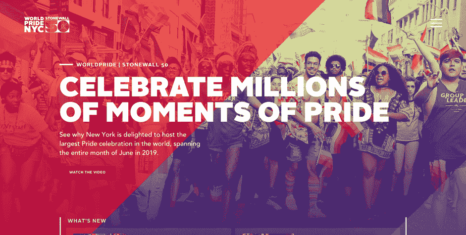

# 静态网站革命:用盖茨比建立的顶级网站

> 原文：<https://thenewstack.io/static-site-revolution-top-websites-built-with-gatsby/>

当我们都在 2019 年安顿下来的时候，让我们来谈谈 2018 年 UX 最强的趋势之一——网络性能。

想想去年你等待网站加载的平均时间。好吧，你可能不知道确切的秒数，但我敢打赌你看到了与前几年相比的不同。

你必须等待几秒钟才能看到一个网站的内容，这是良好用户体验的最重要因素之一。人们现在习惯于在发送请求后几乎立即获得想要的信息，这种趋势似乎不会发展到任何地方。

想想看，互联网连接、网络和移动应用、支付系统——现在一切都变得更快了。有了这样的用户期望，公司除了跟随别无他法。

## 加载速度与搜索引擎

所以，用户喜欢快网站。值得一提的是，谷歌也是如此。

在网络世界中，快速通常是一个好的 UX 的关键部分。[自 2018 年 3 月以来，谷歌机器人考虑速度和良好的 UX 主要搜索引擎排名因素](https://searchengineland.com/google-speed-update-page-speed-will-become-ranking-factor-mobile-search-289904)，这意味着如果你在乎流量和转化率(当然你确实在乎)，是时候采取行动，提高你网站的加载速度了。同样在手机上:

“在任何在线业务中，网站加载速度至关重要，但往往是一个完全被忽视的因素，这包括搜索营销和搜索引擎优化。这还包括移动设备上的页面加载时间:根据一项新的分析，完全加载一个移动登录页面的平均时间为 22 秒。然而，如果一个移动网站的加载时间超过三秒，53%的访问就会被放弃。这是一个大问题，”谷歌文件[声明](https://www.hobo-web.co.uk/your-website-design-should-load-in-4-seconds/)。

22 秒听起来可能有点抽象，但事实是，公司仍在努力用他们使用的流行引擎来满足用户的期望。[超过 35%的网站](http://www.internetlivestats.com/total-number-of-websites/)是基于 WordPress、Joomla 或 Drupal 的动态网站。

这些，因为许多因素，不是非常速度友好的。这为所谓的静态站点生成器创造了背景，比如 Gatsby。

## 什么是静态站点生成器？

静态站点生成器与流行的动态站点完全相反。在这些网站中，当用户进入一个网站时，服务器会向数据库发送一个请求，要求下载当前需要的内容。之后，数据以 HTML 文件的形式显示在网站上。

难怪整个过程需要时间，如果一次发送太多请求，速度会更慢(例如，当网站遇到更大的流量时)。

效果？用户等待元素加载的时间长达数秒，感到沮丧，有时会离开站点。

静态站点生成器不使用前端后面的数据库层。当用户进入每个页面时，它使用静态文件在浏览器中而不是在服务器上构建站点。也就是说，如果你网站上的人想看联系人页面——关于我们的页面不会被呈现。

当没有服务器时你会得到什么？一个轻量级的网站，需要更少的时间来建立和维护，因为你可以忘记数据库。

像静态站点生成器这样的前端解决方案自从 ca。2011 年，每年越来越多的爱好者。你喜欢什么样的编码语言并不重要。Ruby on Rails 的人有 [Jekyll](https://jekyllrb.com/) ，选择 go 的人有 [Hugo](http://gohugo.io/) ，至于 JavaScript — [NextJS](https://nextjs.org/) 和 [GatsbyJS](https://www.gatsbyjs.org/) ，我在这里简单描述一下。

资料来源:Gitlab.com

## 盖茨比是什么？

GatsbyJS 从 2015 年就有了(准确地说，它的第一次发布发生在 2015 年 10 月 6 日)。

长话短说，Gatsby 是一个静态站点生成器，它结合了 React JavaScript 库和 GraphQL 的最佳特性，为您提供全新的、完全前端的 web 构建体验。当一个网站只使用静态文件时，你得到的回报是资产优化、智能图像加载、代码分割和服务器端渲染。

效果？闪电般的快速装货地点。

GatsbyJS 是建立在 JAMstack 之上的——Javascript、API 和标记——这意味着它分享了 JAMstack 的好处——高性能、安全性和可伸缩性。

它在实践中是如何工作的？你，或者你的开发者，编码并构建你的网站。然后，Gatsby 使用 React JS 将 Markdown 等静态数据源转化为动态网站。遵循 React 的组件驱动开发模型，Gatsby 跨站点重用特定的组件，如联系人表单，从而提高了速度。

因此，用 GatsbyJS 开发的博客和网站就像一个单页应用程序。

### 为什么选择 GatsbyJS 而不是其他静态站点生成器

1.  **JavaScript 开发环境:**这是现在的团队，不要误解我的意思，这绝对不是一个暂时的趋势。前景光明的技术和巨大的社区绝对是有利因素。
2.  **丰富的生态系统:**虽然 Gatsby 是一项相当新的技术，但它有非常全面的文档和入门指南来帮助您快速入门。当你需要一些提示时，它有一个最活跃和增长最快的静态站点生成器社区——现在 GitHub 上有 1602 个。
3.  **表演:**我说第 100 遍是有原因的，盖茨比的每一个方面，每一个解决方案都是以速度为设计理念的。您可以在最终产品中看到这一点——基于 Gatsby 构建的网站明显比使用其他生成器创建的网站要快。
4.  **愉快的开发者体验:**因为我们总是致力于以愉快的方式做事。

现在，让我们进入正题。

## 用 GatsbyJS 构建的网站

让我给你们看一些公司和其他主体的例子，他们考虑将 GatsbyJS 用于他们的案例，并决定在他们的网站中实现它。

### React Javascript 库官方网站

开发人员使用 Gatsby 来讲述这个库的可能性，并向社区展示如何使用它。该网站有一个复杂而简单的架构，可以帮助用户了解教程，学习如何开始在他们的项目中使用它，并轻松找到他们问题的答案。你可以注意到它有多快，根据 Semrush 的说法，仅在 2018 年 12 月，它的访问量就超过了 300 万次。我估计跟着 React 官方团队也不是最坏的打算。

### 博朗盖茨比电子商务

大众剃须刀品牌 [Braun](https://ca.braun.com/en-ca) 的加拿大分公司决定把盖茨比作为他们的店面。它用于展示品牌和特定产品，包含大量视觉内容。今天加拿大，也许明天其他版本？

### 不可能食品的品牌网站

不可能食品公司是一家生产和销售无肉肉制品的公司:汉堡、肉丸、包子、辣椒、墨西哥玉米卷和许多其他产品。所有美国人的最爱，对动物和环境无害。

### 面向开发者和设计师的 Airbnb 网站

Airbnb 将 GatsbyJS 用于他们的两个网站:Airbnb 工程[数据科学](https://airbnb.io/)和开发者博客，并分享他们的品牌字体——[Airbnb 谷物](https://airbnb.design/cereal/)。这表明 Gatsby 是一个很好的选择，无论是当一个人想用一个有吸引力的设计来展示产品时，还是当有大量的数据和内容要显示时。

### Just Do It 推广耐克网站

这篇总结中的另一个大牌耐克用盖茨比做 Just Do It 项目。这是一个分享人们的梦想和如何实现梦想的故事的网站。当然，展示耐克运动服让我们做到这一点。

### NYC Pride 2019 平台

纽约 2019 骄傲庆典丰富多彩且大胆的网站。有新闻，有日历，有互动地图和游客交通住宿地图。都是为了举办世界上最大的年度盛会。

### SEO monitor:SEO 平台网站

在准备推出 SEO 平台的配套软件 Signals 时， [SEOmonitor](https://www.seomonitor.com) 需要用一个基于 Gatsby 执行的现代、快速、安全的 web 架构来替换他们陈旧、笨重、缓慢的 WordPress 网站。带来他们所寻找的结果的技术栈是 Gatsby，作为一个静态站点生成器，Contentful 作为一个无头 CMS，Netlify 作为一个托管解决方案(有一个完整的[案例研究](https://bejamas.io/blog/seomonitor-case-study/))。

需要更多例子吗？[这里](https://www.gatsbyjs.org/showcase/)是用盖茨比建立的网站的完整官方列表。

在快速发展的 web 世界中，开发趋势来来去去。对于 Gatsby 和静态网站来说，情况可能并非如此，因为它提供了一种更快、更安全的网站建设方式，这两个好处在当今世界很难忽视。

正在考虑为您的项目选择 GatsbyJS？在[bejamas . io](https://bejamas.io/)ping 我们！我们很乐意帮助你做出正确的决定，无论是盖茨比还是其他技术。

<svg xmlns:xlink="http://www.w3.org/1999/xlink" viewBox="0 0 68 31" version="1.1"><title>Group</title> <desc>Created with Sketch.</desc></svg>