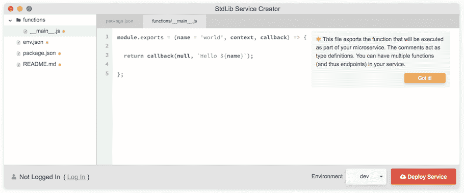

# StdLib:用于构建开发人员速度的无服务器库

> 原文：<https://thenewstack.io/stdlib-drives-bring-developer-velocity-serverless/>

FaaS 平台标准库的创始人兼首席执行官基思·霍伍德说，无服务器的真正价值不是每秒的计算能力，而是开发速度。

“我们的观点是，在无服务器领域，开发人员的速度是最大的优势，”Horwood 说，他的标准库(被称为 [StdLib](https://StdLib.com/) )提供了一个平台，编码人员可以在这个平台上编写或组合自动缩放的函数。“我们经常在首席信息官层面听到，他们非常关注无服务器架构，因为它可以很好地避免供应不足和过度供应，但我们对此的看法是，有人希望尽快交付产品。他们明白编写代码是怎么一回事，但他们对投身 web 开发变得犹豫不决，因为现在有太多的技术解决了可扩展性问题，但却以牺牲开发人员的速度为代价。”

Horwood 认为，无服务器允许回到 90 年代末和 21 世纪初编程模型的承诺。开发人员可以通过简单地修改现有网页的 PHP 代码来建立网站，通过 SFTP 加载并提供给全世界的网络观众。在那个范例中，脚本被认为是基本的可发布代码。然后，随着互联网使用的爆炸式增长，大规模的分发和性能成为开发人员的主要关注点，即使是那些专注于前端应用程序和网站的开发人员。

Horwood 说这在很多方面影响了开发者的速度。不仅是需要在操作环境中管理的组件的复杂性，更重要的是让开发人员不断担心“如果它崩溃了怎么办”的认知开销。

“节省这是一个巨大的好处，对于团队和管理时间的开发人员来说，这将具有不可估量的价值。这将是无服务器的最终真正驱动力，”霍伍德说。

## StdLib 作为一个服务平台发挥作用

StdLib 允许开发人员安装命令行界面(CLI)工具，该工具允许访问一系列库命令，并为脚本创建一些轻量级支架。从那里，开发人员可以在已经构建了函数的地方搜索可用的 API(例如能够创建 Slack 应用程序或将 Stripe 合并到在线商店中)，或者在 node.js 中编写自己的函数。一旦函数经过测试(StdLib 附带自记录类型安全检查，以确保函数可执行)，它们就可以被合并到任何企业现有的代码库中，或者使用 StdLib 用户的函数 URL 通过 webhook 进行访问。

“最终，你是在建立自己的函数库，”霍伍德说。“我们去掉了应用服务器的抽象，所以你只需要考虑功能，并把它们变成 web 服务和 API 端点。”

Horwood 认为 StdLib 让开发团队在企业软件代码库中像“一等公民”一样使用函数。在现有的代码库中，当想要使用函数时，开发人员会安装 lib 模块，然后执行 StdLib 函数，就像它是一个内联函数一样。

另一种方法是依靠 webhooks 并调用用户的 StdLib 函数 URL 来触发事件。对于一些试图平衡跨不同平台的代码库分布的企业来说，将代码库缩减到 StdLib 和他们的内部代码可能是确保监督的一种方式。

随着 Twilio、Auth0 等 SaaS 平台开始提供无服务器功能平台， [一些人担心这将为企业带来更多的复杂性](https://thenewstack.io/3-questions-serverless-technology/) 在更广泛分散的微服务和功能架构中，企业要准确了解其代码在哪里运行。也许使用 StdLib 将允许企业只在两个位置维护对代码的监督:他们自己的 repos 和他们的 StdLib 库中。

## StdLib 中的监控函数

虽然在 StdLib 的 FaaS 方法中处理了缩放操作，但仍有 [个函数级操作问题需要监控](https://thenewstack.io/iopipe-launches-lambda-monitoring-tool-aws-summit/) 。

功能可能会超时而不执行，可能会崩溃而不按预期运行，或者使用在生产中不同步的过期包构建。

Horwood 说 StdLib 团队处理了大部分这些问题，而 StdLib 用户不需要看到发生了什么。例如，如果一个包不是最新的，StdLib 会看到许多运行时错误，并会纠正包的使用，Horwood 说这种情况不会经常发生。

用户可能需要通过检查他们的日志或登录用户看到的 service analytics 控制面板来监视功能超时错误。然后，他们可以在代码中允许更长的执行时间。

为了更好地理解运行在 StdLib 中的函数，用户需要构建自己的解决方案。根据 Horwood 的说法，活动日志是作为平台功能的一部分编写的，但用户必须创建自己的 **cron** 作业来保存这些控制台日志文件，因为它们只保留一天。

该平台还没有将警报系统作为一项功能来实现，例如，如果用户希望收到关于他们的执行日志中可能发生的任何事情的通知，尽管 Horwood 说他们确实“有一个 API 日志端点，所以如果有人想安排一个 **cron** 作业，这是可能的。”

## StdLib 作为生态系统的切入点

当第一次引起社区的兴趣时，无服务器经常被说成是构建完整的端到端无服务器应用程序。那是可能的，大多在 [静态和](https://thenewstack.io/emerging-graphql-serverless-stack-building-static-web-sites/) 单页应用空间。但通常情况下，企业开始将无服务器用于一系列特定的工作流任务，任务被移交给无服务器环境进行计算，然后重新整合到更大的工作流中。

预定任务和图像处理是两个重要的例子。另一个越来越常见的例子是异步更新客户记录。

例如，客户通过集成在企业网站上的电子邮件工具注册。这可能触发三个异步无服务器功能运行:

*   向 CRM 中添加新电子邮件地址的条目
*   使用 [Clearbit API](https://clearbit.com/) 来填充关于该电子邮件地址的客户端数据，并将其添加到 CRM 记录中
*   将电子邮件地址添加到滴滴营销漏斗中。

Horwood 说，这种例子正在成为企业的中流砥柱，成为第一个无服务器和 FaaS 平台的关键用例。另一个是分布式 web 抓取，StdLib 让企业进行“大规模并行 DNS 校准”，以实例化尽可能多的功能，并撒下一张大网来收集网站上的数据。Horwood 说，也就是说，类似 MapReduce 的任务在 StdLib 中利用无服务器执行。

这些使用案例反映了有多少企业使用无服务器不是为了面向外部的应用，而是为了加快内部工作流的开发时间。Horwood 说，这也是企业使用 StdLib 创建内部 Slack 工作流的主要方式，而不是外部面向客户的机器人。

Horwood 听起来对 StdLib 的潜力真正感到兴奋的地方是他们迄今为止与 Slack 合作的方式。一个解释如何用 StdLib 构建 Slack 应用的教程已经成为 Slack 开发者博客中最受欢迎的内容之一。Horwood 认为这表明了 StdLib 在帮助任何新兴 SaaS 平台创建其开发者生态系统的低门槛入口方面可以发挥的作用。在大多数情况下，如果开发人员希望在 SaaS 平台上进行构建，他们必须处理集成产品的所有应用服务器和扩展任务，然后才能获得成为合作伙伴的好处。如果像 Slack 这样的 SaaS 平台继续使用 StdLib，新的生态系统合作伙伴的加入速度可以加快，开发人员在外部平台上创建的成本也可以降低。他们构建的东西可以直接进入平台的市场，就像他们自己从零开始构建集成一样。

10 月 11 日，霍伍德在纽约市的 [Serverlessconf 上发表了关于开发者速度的演讲。今年早些时候，他还谈到了服务组合:](https://nyc.serverlessconf.io/agenda)

[https://www.youtube.com/embed/m5TFVI5Y5Ro?feature=oembed](https://www.youtube.com/embed/m5TFVI5Y5Ro?feature=oembed)

视频

专题图片(从左至右):StdLib 的雅各布·李、基思·霍伍德、史蒂夫·梅耶。

<svg xmlns:xlink="http://www.w3.org/1999/xlink" viewBox="0 0 68 31" version="1.1"><title>Group</title> <desc>Created with Sketch.</desc></svg>