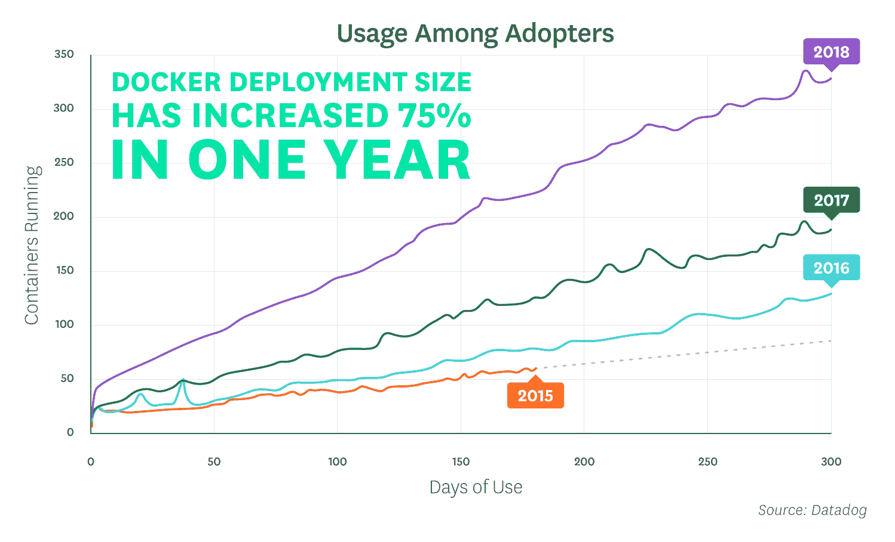

# Docker 的稳定采用导致招聘激增

> 原文：<https://thenewstack.io/steady-docker-adoption-leads-to-jump-in-hiring/>

对集装箱技能的需求在过去的一年里猛增。Linux 基金会和 Dice 对 750 名招聘经理进行的调查显示，57%的人正在寻找具有容器技能的员工，比去年调查的 27%有所上升。IT 专业人士已经注意到了这一点。根据同一份报告中报告的另一项调查，使用开源技术的人现在认为增长最大的领域是容器，领先于云、大数据/分析和人工智能/机器学习。

招聘经理将容器包含在他们的清单中，这意味着它已经加入了 Linux，成为开源专业人员应该知道的一项技术。因此，虽然容器采用的广度已经停止暴涨，但它在企业堆栈中的位置是安全的。Datadog 关于其客户采用 Docker 的最新[报告](https://www.datadoghq.com/docker-adoption/)有助于解释原因。

自 2015 年以来，经营 Docker 的客户份额每年跃升约 4 个百分点。运行 Docker 的主机份额增长速度略快，截至 2018 年 4 月达到 20%。这些数字不容小觑，但通常不会给就业市场带来巨大变化。相反，集装箱技能是有需求的，因为码头工人采用的深度已经大大增加。具体来说，只需看看那些已经过了初始部署阶段的客户，在 Datadog 客户环境中运行的容器数量在过去的一年中已经增长了 75%。

这个故事的寓意是，采用率和行业传言的大幅增加是有趣的，但使用一种技术的生产应用程序的数量可能更有助于预测一种趋势何时进入主流就业市场。

<svg xmlns:xlink="http://www.w3.org/1999/xlink" viewBox="0 0 68 31" version="1.1"><title>Group</title> <desc>Created with Sketch.</desc></svg>