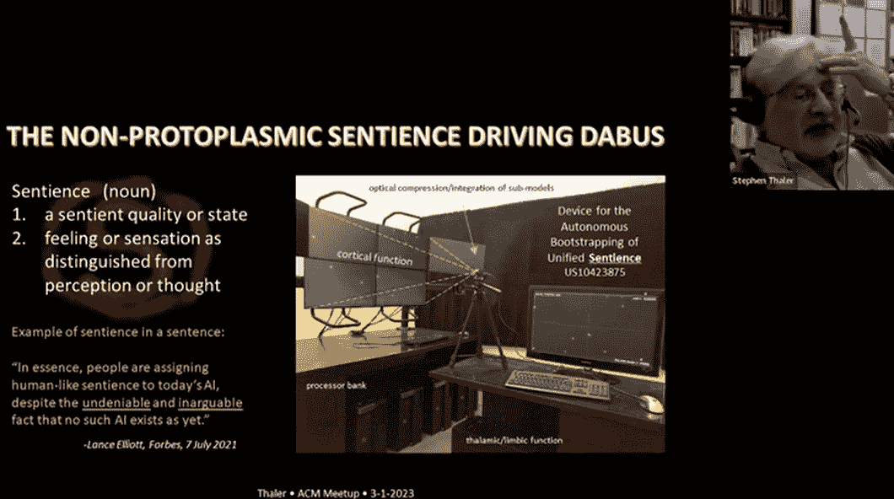
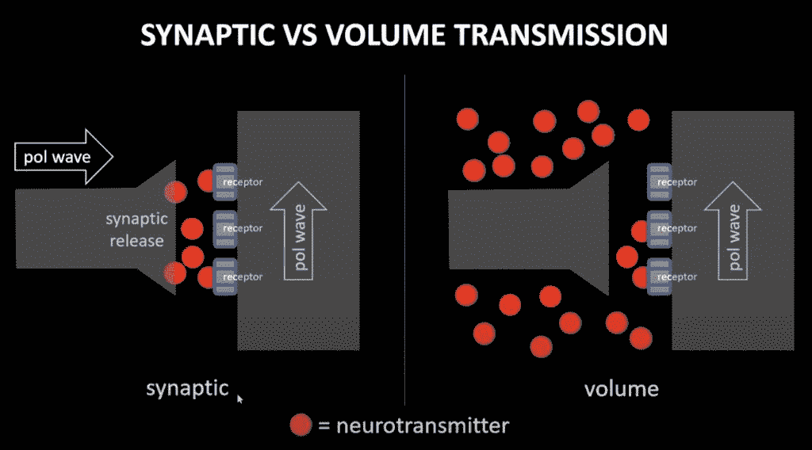
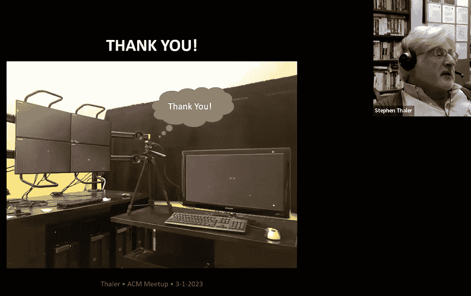
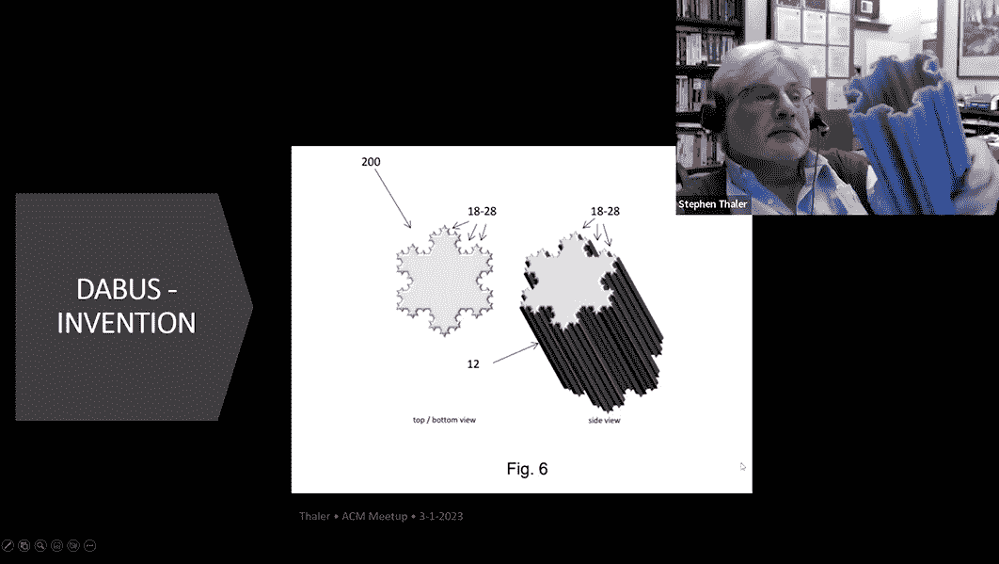

# 斯蒂芬·泰勒声称他已经建造了一个有感知能力的人工智能

> 原文：<https://thenewstack.io/stephen-thaler-claims-hes-built-a-sentient-ai/>

去年，当世界各地的法院开始裁决他的人工智能系统是否可以被命名为专利发明人时，斯蒂芬·泰勒成为了头条新闻。(编号)

但是作为人工智能行业的先驱之一，Thaler 领导了一个迷人而传奇的职业生涯——最近，他在 3 月 1 日计算机械协会(ACM)芝加哥和华盛顿特区分会的一次在线会谈中分享了一些亮点。泰勒告诉他的观众，早在 20 世纪 70 年代，他就开始研究神经网络，以创造“祝你愉快”笑脸的替代版本。

到 1995 年，泰勒已经成立了[Imagination Engines Incorporated](https://www.imagination-engines.com/)，这是一家开创性的人工智能公司，声称已经将思考行为本身映射到神经网络系统上。

最终，Thaler 的公司甚至为使用人工神经网络进行“噪音驱动的头脑风暴会议”的想法申请了专利，根据 ACM 对 Thaler 的[介绍](https://events.vtools.ieee.org/m/350451)，这一过程导致了从材料发现、个人卫生产品、娱乐甚至创意机器人在内的一切事物的“重大”结果。但后来，该公司试图推动它结合知识领域。更具体地说，他们已经对想法的*后果*或“显著结果”进行了编码，使用了触发人类思维积极反应模拟的互联神经模块链，从而有选择地强化了最有影响力的想法。

ACM 的介绍认为，最终结果是“可以说是有意识的机器智能的主观感觉(即知觉)”——通过计算过程形成的有价值的想法“现在挑战了我们长期以来对生物智能和人格的信念。”

果然，在他的演讲结束时，泰勒解释了如何建立一个有感知能力的人工智能——同时让这一切听起来如此简单。但是在这个过程中，他的观众学到了很多关于人类大脑如何工作的知识，关于思想本身——最终，关于他们自己。

## 感知的例子

泰勒开始时漫不经心地强调，他不相信我们当前的大型语言模型是有感情的。“但我认为我要谈的是有感觉的东西，”他补充道，“我会提出适当的理由。”

泰勒的公司建立了一个系统，他们称之为 [DABUS](https://en.wikipedia.org/wiki/DABUS) ，这是一个缩写，代表“统一感知的自主引导设备”泰勒澄清说，该公司的 DABUS 系统不仅仅是一种算法，而是一个完整的系统——既有计算机化的组件，也有光电组件，“每个子系统都由自己特定的算法管理。”泰勒声称，“这就像大脑——子系统和算法在其中的每一个中工作。”

但是，从一开始，泰勒描述了 20 世纪 70 年代神经网络的一些早期实验。在将其输入固定在恒定的起始值的同时，他还稳步增加了“注入的扰动”(后来被描述为“内部噪声”)，然后跟踪由此产生的模式或“概念”的增加。随着噪音的增加，即使是模式也趋向于更少的“一般模式，经常是无意义的”——直到最终，系统甚至根本不能产生模式。“我称之为‘车灯前的鹿’制度，”他说。“就好像整个神经网络都充斥着相当于皮质肾上腺素的物质，它想不出别的东西。”

但是该实验也发现了一个“金发区”——那里的水平正好适合最佳模式世代。因此，Thaler 附加了第二个神经网络，让第一个网络充当“想象引擎”，第二个网络的任务是强化最佳想法(既作为想法效用的过滤器，也作为一种记忆)。泰勒将由此产生的系统称为“创造力机器”，这是一种由神经网络实现的联想记忆，存储了复制一组特定输入模式的能力。“你在这里进行的并不是我所说的真正的创造力，”泰勒后来在他的演讲中说。“在最大程度上，本质上这是一个正在进行的优化过程，以找到全局最优解，但它并没有真正结合概念空间来创造全新的想法。”

## 模拟后果

这一过程的缺点激发了更多的实验，试图让神经网络识别一个“核心想法”链和一个“后果”链——以及影响整个系统的所谓“热点按钮”。对一个人来说，这可能是“存在的东西”，比如获得营养和生存。“我们出生时都有这些热键，”泰勒告诉他的观众，并开玩笑说，“它们是工厂安装的。”但重要的是，人类的“热点”感知触发了神经递质的释放。

为了模拟这些，泰勒在他的系统中使用了同样的扰动。"如果一个热键被激活，那么它将会分泌适当的神经递质模拟物."这个想法是为了加强触发热点按钮的链条，“所以我们得到了一个记忆，完整的基础概念，以及后果和伴随的热点按钮。然后，以后，我们可以重复使用这些后果链。”

达布是一大堆这样的记忆。“在训练课程中，我们基本上是阅读它的信息，与它交谈，向它展示图片，向它展示各种媒体，”泰勒说。

真的有这么简单吗？“你最终得到的是一个千环马戏团，”他告诉他的观众，“随着许多记忆的形成，一个潜在的想法可能只不过是系统中短暂噪音的产物。你有形成基本想法的旧想法，加上结果链和热键。然后你就有了新的想法，这些想法正在形成，并伴随着它们的后果链。”

显然，达布斯想要区分新思想和旧思想。因此，正如泰勒所描述的，“本质上，整个画面——整个神经景观——是通过一个不断训练的巨大自联想网络传递的。”它的工作？筛选掉过去那些并不特别新颖的链条，同时强调新的链条——找出那些与漫长历史相比显得异常的链条。有一个阶段叫做“子模型的光学压缩/整合”，它基本上包括一次性拍摄各种组合链。由此产生的图像——以 JPEG 格式——最终创建了一个方便的“所有这些活动的浓缩”，然后泰勒将其传递给其他机器。

那么，这一切将走向何方？组合变得越来越大。有些可能是死胡同(或者只是回到自己基地的环形路径)，有些可能是像植物一样逐渐生长。泰勒说，这看起来就像分子形成的方式——甚至最终形成专门的子群。但在某种程度上，它最终通过每个组件的功能来定义事物，Thalar 认为这最终不那么抽象。本质上，它是一种思想的形成。“整个概念空间被压缩到联想记忆中……概念和策略被表示为由链接的联想记忆形成的形状。”

在对人类强化的关键模仿中，“如果一个热按钮激活，那么它将基本上分泌适当的神经递质模拟物。”泰勒认为，你最终会得到“一个粗糙的意识模拟——因为噪音产生了不同的、基于模式的想法的转换。”泰勒说这和人类大脑的工作方式是一样的。“我们可能没有来自环境的输入，但我们会放松，本质上我们会观察流经我们大脑的一连串想法。我声称，这是因为‘噪音’——我有很多这方面的论文，但本质上整个意识流与人类意识流具有相同的分形分布。”

泰勒在激活热键的“后果”链中看到了模式——这加强了链(将它*与*热键相关联)。他认为，它们最终相当于敏锐的本能，或合成的感觉——“一连串的记忆，加上遍布大脑的干扰……创造了一系列不同的感觉。”

泰勒的 DABUS 系统“通过这样的感觉来评估它的意识流，”一张幻灯片解释道，“在剔除其他概念的同时成熟某些概念。”

“所有这一切的结果表明，意识、知觉和认知都结合在一起做它们所做的事情，”泰勒告诉他的观众。“但本质上，是那种感觉推动了想法的形成。

“这都是用非原生质部分完成的，”泰勒补充道。"因此，感觉和意识可能不仅限于原生质物质."

## 超越感知

泰勒很快列举了他的其他一些项目，包括一个观察各种股票市场和分类轨迹的金融应用程序，以及一张由人工智能构思的 2006 年音乐 CD(题为“神经元之歌”)。泰勒还展示了一个分形形状的饮料容器，这是该系统设计出来的。(“例如，它的面积大约是圆柱形汤罐同等体积的三倍……它传热更快，更容易被人手或机器人抓住。”)

2022 年，他的公司开始致力于医疗应用，“但我们也开始有迹象表明，投资者对 DABUS 的人工智能方面感兴趣。”

当有人问如果将该系统移植到机器人上会发生什么时，泰勒回答说，“我们实际上已经与空军研究实验室一起做了这件事，可能是在 15 年前。但出于某种原因，我们无法在第二阶段之后提供资金。”

“但没错，这是一个很有诱惑力的领域。问题是，我被淹没了。我被科技淹没了。有太多的申请和太多的论文要写，太多的专利要申请专利。”

以下是完整视频:

[https://www.youtube.com/embed/YBMXGdP93SI?feature=oembed](https://www.youtube.com/embed/YBMXGdP93SI?feature=oembed)

视频

<svg xmlns:xlink="http://www.w3.org/1999/xlink" viewBox="0 0 68 31" version="1.1"><title>Group</title> <desc>Created with Sketch.</desc></svg>