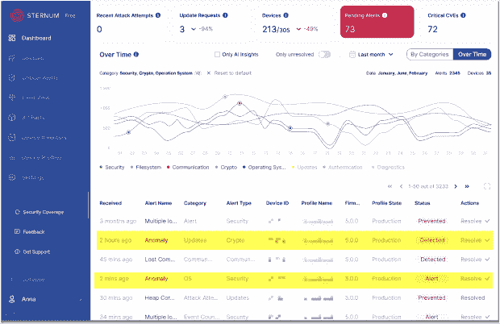

# 胸骨增加了物联网的可观察性

> 原文：<https://thenewstack.io/sternum-adds-observability-to-the-internet-of-things/>

一旦物联网设备发货，其制造商通常很少了解现场的情况。这就产生了一个黑洞。如果你考虑到全球安装和部署了超过 420 亿个 物联网设备、传感器和致动器，这是一个巨大的数字。

## **不搞一刀切**

目前市场上的可观察性工具提供统计车队级别的信息，对于试图解决现场问题或降低特定设备的网络风险的制造商来说，这些信息几乎没有用处。在设备级别，您通常可以看到设备的位置(geo-IP)，它连接到什么(端口)，以及一些关于固件和资源利用率的数据，但除此之外就没什么了。

缺少的是关于用法的深入信息。例如，用户与设备交互的趋势、关键功能的循环时间、暗示问题正在发展的功能的剧烈变化(例如，温度上升)等等。

此外，虽然物联网设备经常被归为一类，但它们在设计或功能上远非统一。例如，花点时间考虑一下心脏监护仪与 HVAC 设备、PLC 或任何其他设备有什么不同。

需求不同，运营套路不同，资源需求不同……一切都不一样。理解这些细微差别至关重要——不仅从业务和创新的角度来看，而且因为单个设备的任何故障都可能导致运营中断，导致代价高昂的召回，甚至威胁生命。

因此，要使观察解决方案普遍有效，它需要足够灵活，以支持所有不同的设备特定指标，并能够根据这些指标了解设备的日常“寿命”。

## **通过异常检测获取温度**

[胸骨](https://sternumiot.com/) 是专为物联网解决方案打造的安全性和可观测性平台。在安全方面，我们提供无代理运行时保护。简而言之，RASP(运行时应用程序自我保护)是专门为嵌入式系统构建的。

这项被我们命名为 EIV(嵌入式完整性验证)的专利技术可以阻挡 96%以上的威胁，而开销不到 3%，而且对本次对话来说最重要的是，它可以普遍兼容任何 RTOS 或 Linux 设备。

相同的普遍性设计原则也是我们的可观测性解决方案的核心。在这里，集成依赖于充当抽象层的轻量级 observability SDK，这允许它从任何设备收集日志、指标、事件和跟踪。

通过使用 SDK，用户可以精确地定义自己的跟踪并收集任何类型的数据，如下所示:

例如，通过我们的 SDK，输液泵制造商可以选择监控设备的温度，以确保其不会达到危险水平，而工业控制器可以跟踪压力读数，以确保液压系统得到维持。

拥有这种级别的定制对于灵活性来说是非常好的。但是，为这些跟踪创建警报仍然需要操作员手动设置阈值。这既复杂又耗时，而且很难做到精确，因为很难事先为每一种可能的情况做出规划。此外，这样的阈值对于更复杂的多变量问题从来没有帮助。

这就是为什么我们投入了大量资源来开发基于人工智能的学习引擎，该引擎使用用户定义的跟踪数据来创建所需设备行为的配置文件，并突出显示重要和不寻常的模式。

一旦设备连接上，系统就开始收集数据，经过短暂的学习期后，它开始充当“额外的一双眼睛”，提供关于异常活动的警报，这些异常活动需要人工操作员花费数小时或数天才能发现——如果有的话。

下面你可以在我们的仪表板上看到它的样子。异常警报(黄色)被添加到事件时间表中，为其他车队事件提供额外的信息和背景。

至于什么会触发警报，引擎会检测:

*   通信模式违规
*   一个事件或几个事件一起异常出现  
*   缺少事件(例如，未实现的更新请求)
*   异常数量的事件(例如，异常数量的更新请求)
*   变量检测的异常值(例如，不熟悉的实体连接到内部 IPC)
*   几个变量值的非典型组合
*   违反顺序(例如，未经验证就执行命令)

每一个都可能成为异常事件，对于每一个，我们还提供了深入调查视图。

例如，下面你可以看到我们对一个失败的更新事件的调查，它是由人工智能引擎自动检测到的。这是一个真实的事件，在功能推出的前几天就发现了。如果错过了，这可能会使设备暴露于安全和操作问题。

这是另一个现实生活中的例子，显示了一个关于沟通问题的自动警报——一个在制作中的严重错误，否则会被忽视。

## 学会理解

为了让物联网市场继续繁荣，它必须经历标准化，为此，我们需要适用于每种设备类型的通用解决方案。说到工作，我不仅仅指“融入”，更重要的是“理解”

了解每个设备应该如何操作的能力是创建每个物联网制造商都可以使用的解决方案的关键。

这个问题的严重程度需要一个自动化的解决方案。虽然并非没有挑战，但我相信异常检测是我们缩小差距的方式，并帮助制造商了解他们的设备如何工作(以及何时不工作)，不仅为他们提供粒度控制，还提供使用洞察和其他信息，这些信息是他们创造产品差异、促进业务和推动创新所需的。

<svg xmlns:xlink="http://www.w3.org/1999/xlink" viewBox="0 0 68 31" version="1.1"><title>Group</title> <desc>Created with Sketch.</desc></svg>