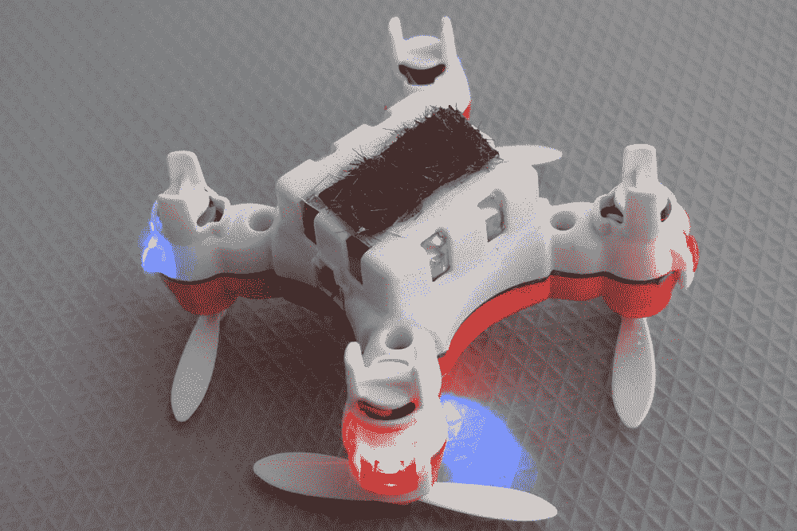
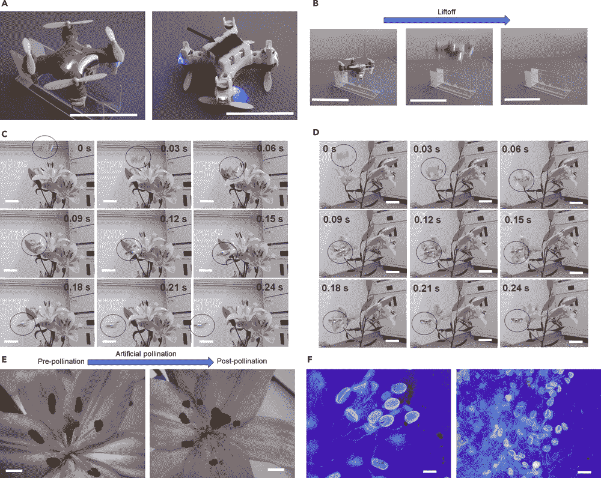

# 随着蜜蜂的死亡，粘性机器蜜蜂可以帮助人工授粉植物

> 原文：<https://thenewstack.io/sticky-robo-bees-help-artificially-pollinate-plants-bees-die-off/>

你可能听说过蜜蜂似乎遇到了麻烦，在没有解释的情况下大量死亡。这是一个令人不安的现象，因为蜜蜂——以及其他授粉者，如鸟类、蝙蝠、甲虫和蝴蝶——负责为世界上至少 30%的农作物和 90%的野生植物授粉。但是现在，一组研究人员开发了一种备用解决方案:微型遥控无人机可以帮助植物授粉，通过在植物之间传递花粉，就像真正的蜜蜂一样。

这个授粉机器人是由日本国家高级工业科学技术研究院(T3)的研究人员创造的，它使用一架价格 100 美元的塑料无人机，配有四个螺旋桨。在该设备的底部是一小块马毛，这使得这种机器人蜜蜂能够小心翼翼地从植物上采集花粉，使用粘在头发上的离子液体凝胶。这个想法是模仿当昆虫拜访开花植物时，花粉是如何粘在昆虫身上的，然后花粉被运送到下一个植物的异花授粉。

授粉是一项费力的工作，而蜜蜂和其他授粉者却非常擅长；对于人类来说，手工操作非常耗时且昂贵。虽然有许多不需要蜜蜂的替代授粉技术，但这种新设备也是对其他类型人工授粉的一大改进，其他类型的人工授粉也缺乏传播花粉所需的更轻的接触，而不会损坏花朵更脆弱的部分。

“一种授粉技术需要用艺术家的刷子或棉签将花粉从雄花转移到雌花，”发表在上的该研究的作者解释道。“不幸的是，这需要很多时间和精力。另一种方法是使用喷雾机，如枪筒和气动喷射器。然而，这种机器授粉的授粉成功率很低，因为它很可能随着花粉从机器中爆发出来，由于强烈的机械接触而导致花粉和花蕊严重变性。”

https://youtu.be/DjUl2WuJZPM

该团队的原型出现在世界各地蜜蜂数量急剧下降的时候，原因是有毒杀虫剂的使用增加，栖息地丧失，气候变化和养蜂业疾病的上升。根据 NRDC 的数据，自 1990 年以来，仅在美国就有超过四分之一的管理下的蜂群死亡，到 2005 年左右，这个问题已经达到了全球性的规模，专家们给这种现象起了自己的名字:[蜂群衰竭失调](https://en.wikipedia.org/wiki/Colony_collapse_disorder)。没有蜜蜂，像粮食作物这样的植物很可能无法茁壮成长，导致世界范围的粮食短缺，以及农业产业的重大经济损失。

令人惊讶的是，这种机器人蜜蜂的主要成分之一——离子液体凝胶(ILG)——完全是偶然发现的。这项研究的作者之一，化学家[宫古英次郎](https://www.pubfacts.com/author/Eijiro+Miyako)试图开发一种可以导电的离子液体(或液态盐)。相反，他的实验使他创造了一种非常粘的凝胶，但在导电性方面失败了。样品被搁置在一个没有盖子的容器里，然后被遗忘了。几年后，它被重新发现，令宫古惊讶的是，这种凝胶仍然完好无损，尽管存放了很长时间，仍然很粘。

“这个项目是偶然发现的结果，”Phys.org 宫古告诉 [*。“我们感到惊讶的是，八年后，离子凝胶没有降解，仍然如此粘稠。常规凝胶主要由水制成，不能长时间使用，所以我们决定使用这种材料进行研究。”*](https://phys.org/news/2017-02-sticky-gels-insect-sized-drones-artificial.html)

持久的离子凝胶是这些传统雄蜂在授粉任务中的优势。正如该团队发现的那样，原型能够在他们的实验中为日本百合( *Lilium japonicum* )授粉。但是这种人工授粉的壮举需要相当多的实践才能实现，这意味着遥控成群的机器人蜜蜂无人机可能不是解决世界上日益严重的蜜蜂危机的可行、可扩展的解决方案——至少现在不是。虽然在每个机器人蜜蜂上整合人工智能和 GPS 工具会使它们更加自主，因此更容易部署，但科学家们最终认为，这些无人机应该帮助蜜蜂，而不是取代它们。

图片:国家高级工业科学技术研究所。

<svg xmlns:xlink="http://www.w3.org/1999/xlink" viewBox="0 0 68 31" version="1.1"><title>Group</title> <desc>Created with Sketch.</desc></svg>