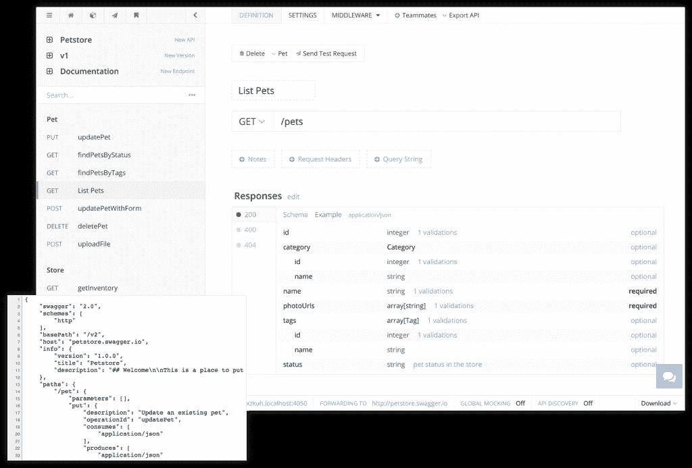
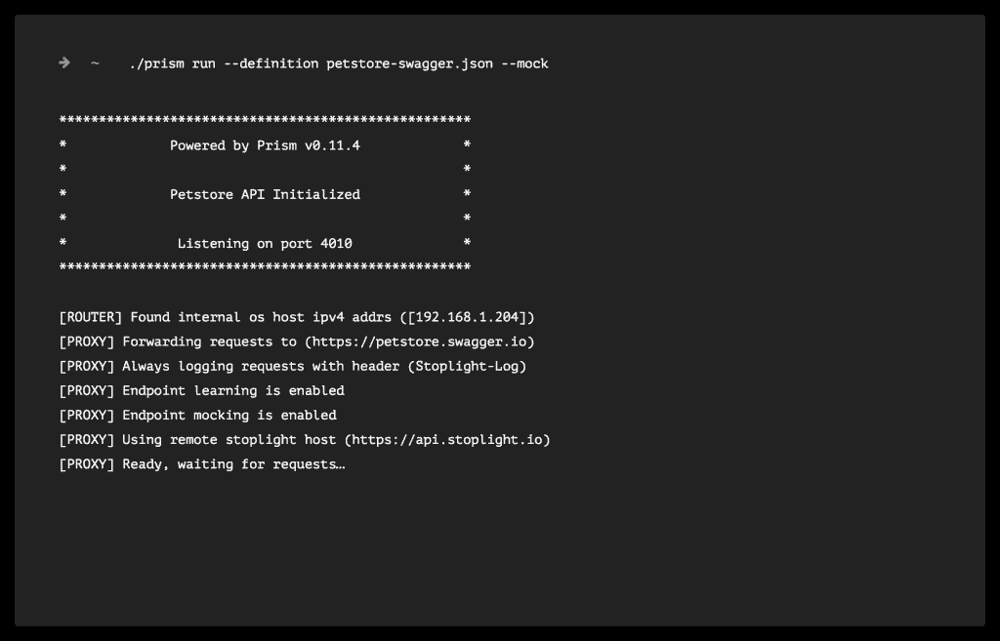
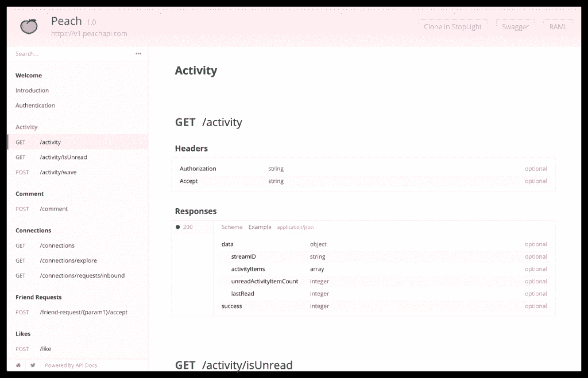

# StopLight 推出了一个建模套件来设计、测试和记录 API

> 原文：<https://thenewstack.io/stoplight-launches-modeling-suite-design-test-document-apis/>

API 软件提供商 StopLight 推出了一个全面的工具套件，旨在管理开发应用程序编程接口的所有方面，包括设计、测试甚至文档。

“产品经理如何在任何给定的时间知道他们的 400 个端点被准确地记录并保持一致？这就是我们试图帮助公司管理的，”StopLight 创始人马克·麦克劳德说。

去年,[API 定义格式文件发展成为企业的单点真理](https://thenewstack.io/importance-apis-container-age/)。API 定义格式用于创建机器可读的 API 规范，该规范包括关于提供者的 API 的元数据信息。流行的格式包括[开放 API 倡议](https://openapis.org/)(以前称为 Swagger)[RAML](http://raml.org/)和 [API 蓝图](https://apiblueprint.org/)。

API 工具平台已经将这些定义放在其生命周期产品的中心，因此企业可以导入定义格式文件，并自动生成 API 文档，便于测试和构建 SDK。StopLight 试图将定义格式文件抽象出来，以便最终用户(无论是工程师、客户服务支持人员还是业务主管)都可以从他们自己的首选(可视化)界面使用 API。

MacLeod 说，通过在 HTTP 的约束下工作，StopLight 能够创建一个可视化的工具界面，这意味着更多的业务角色可以直接与 API 进行交互，而不是必须理解描述格式并适应直接对规范文件进行更改。麦克劳德警告说:“目前的工具是专门的文本编辑器，做编辑的人需要非常了解规范。”“相反，我们采取了更直观的方法。您可以非常直观的方式轻松管理数百个终端。”MacLeod 给出了一个 API 模型的例子，该模型可以在 StopLight 中可视化地表示，但可以转换成 OAI 格式的 16，000 行文本规范。

麦克劳德说:“StopLight 为 API 提供了单点真实性:你在一个地方管理它，所有的文档和工具都围绕着单点真实性，它允许你整合到一个系统中。”。“例如，客户支持人员不需要学习 API 定义规范，任何人都可以使用和协作，而不必学习规范。”

麦克劳德说，该工具针对任何试图更好地组织他们的 API 策略的企业:“它帮助企业建立相同的标准，对他们的 API 有共同的理解:他们如何确保他们的文档总是同步的，他们如何确保他们有测试；交通信号灯 API 建模工具组织了所有这些部分，并确保所有内容都引用相同的定义。”

API 建模。

随着今天的发布，StopLight API 工具套件包括:

*   API Designer，一个建模工具，旨在允许开发人员和非技术用户在业务 API 上进行协作
*   Prism 代理，用于测试 API 的 HTTP 调用和响应的 API 代理
*   [API-docs.io](http://API-docs.io) ，一个免费的托管文档工具，可以独立使用，也可以成为 API 设计者生命周期的一部分，各种 API 版本都可以发布到 docs 平台上。

MacLeod 说，虽然 Prism Proxy 组件适合模仿 API 进行测试，但它也可以用来对 API 进行逆向工程。例如，该工具可用于映射一个 API 的所有端点，即使它没有记录在案。

麦克劳德说，迄今为止，该产品已经在近 300 家公司进行了测试，主要是与 API 设计人员合作，但该工具已经在客户支持下找到了强大的立足点。

## 非技术业务部门的 API 工具

StopLight 从根本上改变了整个 SendGrid 组织的 API 工作流，特别是客户支持部门。API 巨头 [SendGrid](https://sendgrid.com/) 的开发者体验产品经理马特·伯尼尔(Matt Bernier)说，该公司使用 API 每月为 Spotify、优步、Foursquare、Airbnb 和其他公司发送超过 200 亿封电子邮件。

Bernier 解释说:“我们有面向客户的文档作为我们的事实来源，但它们不是用我们内部开发人员可以使用和编辑的语言编写的。“所以这是一个更好的工作流程。这需要额外的学习:我不必教每个人什么是昂首阔步，因为它都在 Stoplight 创建的模型中以视觉方式呈现出来。”

> StopLight 每月为 SendGrid 节省了 10，000 张支持票，相当于员工工作 40 到 100 个小时。

“重要的是文档描述了如何使用 API。客户支持人员不会做一些代理魔术和逆向工程 API 来知道端点是什么。我们的客户成功经理与我们的大客户合作，”Bernier 说。“他们不想知道 Swagger 是如何工作的，他们不想使用 cURL。客户对他们说，‘我想做这个东西，我能用这个 API 做吗？’我们的员工不是技术人员，但有了红灯，他们可以迅速告诉我们的客户该做什么。"

Bernier 说，如果客户服务部门能够在不上报的情况下处理问题，就可以避免双倍的支持成本。他说，有了 StopLight，客户服务团队能够生成 API 密钥，进行 API 调用，检查响应，然后删除密钥，所有这一切都是在与客户交谈的时候进行的。Bernier 现在已经将之前的支持工作流程与 StopLight 的功能对应起来。

“我们以前的系统是 35 秒，而现在是 10 秒。这样每月可以节省 10，000 张支持票。这相当于我们所有支持人员节省了 40 到 100 个小时的工作时间。这对发送网格是无价的，”Bernier 说。

Bernier 说，他已经成功地向工程人员展示了 StopLight 的三个工具，这意味着开发人员在文档和测试之间切换时，不需要在当前的 API 工具堆栈之间切换。Bernier 说:“你可以打开一个窗口，看看 API 是否符合规范。

他说，他渴望进一步探索的工具的一个领域是 Prism 代理的逆向工程功能，它可以采用未记录的 API 并映射其所有端点。“这是我最兴奋的事情。我们使用很多微服务，不可避免地，有人需要处理一些只有一个人知道的代码。Bernier 说:“总会有一些未记录的代码，人们会因为这样的东西而放弃。

监狱代理

## API 文档:当前趋势

将 API-docs.io 工具作为 StopLight 的一部分和一个独立的产品发布，符合当前整个 API 经济的讨论，其中 API 文档是一个越来越多的行业考虑因素。在去年关于新堆栈的一次采访中，《构建你不会讨厌的 API》*的作者 Phil Sturgeon 说，如果他要重写他的 API 操作手册，他会把文档放在最前面，作为 API 设计的首要考虑之一。*

 *去年，其他 API 思想领袖也将文档作为关注的焦点。API 作者和行业顾问 James Higginbotham 认为全面的 API 文档策略[创造了更好的开发者体验](http://launchany.com/building-your-api-documentation-strategy-for-success/)；安盛银行的 IT 架构师 Arnaud Lauret 提倡[文档持续交付](http://apihandyman.io/document-api-topia-api-days-paris-2015/)，LinkedIn 的五大 API 文档作者之一 [Kelly Hitchcock 说](https://www.youtube.com/watch?v=XGWM8S4AL3U)API 的“生命证明”就是它的文档。

今年已经发布了新的 API 文档工具，包括 Algolia 的开源搜索文档工具 [DocSearch](https://community.algolia.com/docsearch/) ，而 API 模拟服务 [Postman](https://www.getpostman.com/) 提供了一个[“运行于 Postman”按钮](http://blog.getpostman.com/2016/01/28/the-run-in-postman-button-for-improved-documentation/)，让 API 提供商将 Postman 的工作流和测试服务直接集成到他们的文档中。

“去年，我们看到一些新的 API 工具平台发布，它们将定义格式置于 API 生命周期的中心，”API Changelog 的 Luke Miller 说，该服务帮助开发人员确定他们使用的 API 的文档何时发生变化。

“除此之外，我们看到像 Lucybot 和 API Transformer 这样的工具可以更容易地将 API 定义格式文件从一种规范转换为另一种规范。“API 经济意识到获得正确的描述格式将有助于刺激 API 的增长，”米勒说。“现在我们看到下一个难点出现并得到解决:如何创建和维护一致的、高质量的 API 文档。就像定义格式是创建 API 的唯一事实一样，文档现在被视为人们理解 API 的唯一事实。”

StopLight 的 API-docs.io 提供了一键发布到托管平台的功能。

麦克劳德说，提供新的 API-docs.io 是一个有意识的举动，有助于刺激整个 API 行业的增长。“为 API 社区提供一些有意义的免费内容对我来说很重要，这样托管的文档就可以免费使用了。我希望当人们需要一个更完整的解决方案时，它能成为 Swagger UI 的一个方便而强大的替代方案，”麦克劳德说。

虽然 API 越来越被认为是企业提供数字服务的商业推动者，也是帮助初创公司快速建立生态系统的关键策略，但 API 经济所看到的情况和主流商业世界正在经历的情况之间仍然存在一定程度的脱节。事实上，API 仍处于初级阶段，虽然领先公司抓住了 API 的机会，但许多其他公司——包括政府和银行等传统部门——还没有真正参与进来。核心问题之一就是“API”这个术语，它隐藏了 IT 术语背后的商业利益。像 StopLight 的可视化编辑器这样的工具可以将 API 带入跨技术和业务团队成员的协作环境，这是下一步需要的开始，以便在整个业务文化和战略中传播 API 和数字化转型战略。

加布里埃尔·圣地亚哥特写。在(CC 0 1.0)下获得许可。

<svg xmlns:xlink="http://www.w3.org/1999/xlink" viewBox="0 0 68 31" version="1.1"><title>Group</title> <desc>Created with Sketch.</desc></svg>*