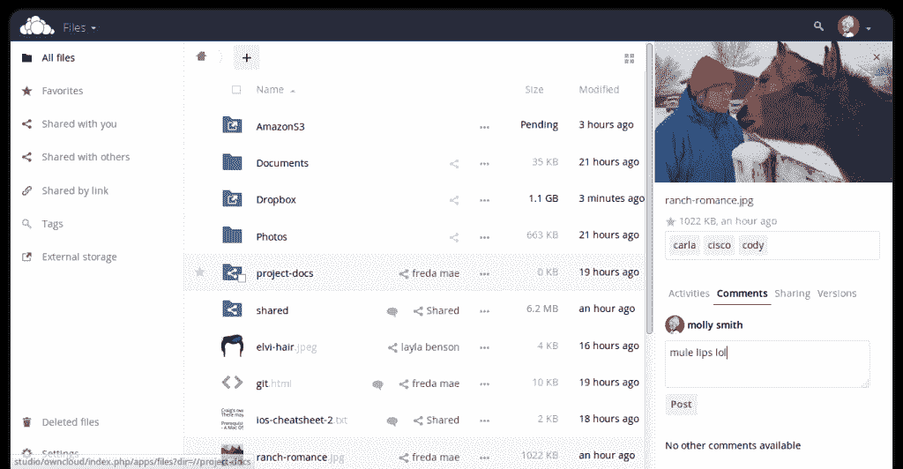

# NextCloud 复兴 ownCloud 的开源云存储软件

> 原文：<https://thenewstack.io/story-behind-nextcloud/>

通常，当开放源码软件提供商遇到业务困难或放弃其开放源码项目时，软件本身会被企业视为可疑，企业最看重的是稳定性和长期支持。新推出的 Nextcloud 从苦苦挣扎的 ownCloud 中获得了开源存储软件，它希望逆这一趋势而动。

虽然 Nextcloud 本身是一家上个月成立的非常新的公司，但它的故事始于 2010 年，当时[Frank karlitchek](https://twitter.com/fkarlitschek)编写了 ownCloud 的初始版本，为组织提供了一种更好的方式来安全地托管他们的文件和云服务，而无需将他们的数据委托给第三方。这个想法是为了能够在云中存储你的文件和其他数据，这与 Dropbox 没有什么不同，但不同之处在于，它是开源的，并且从一开始就被设计为与公司的其他基础设施一起托管在公司的服务器上。该软件建立了一个小规模的[但狂热的](https://opensource.com/life/15/12/6-creative-ways-use-owncloud)用户群，许多人对 AWS 等基于云的存储提供商带来的束缚持谨慎态度。

4 月份， [Karlitschek 宣布他将离开 ownCloud](http://karlitschek.de/2016/04/big-changes-i-am-leaving-owncloud-inc-today/) ，这家公司是他在 2011 年为支持 ownCloud 项目而联合创立的。他说，作为 ownCloud 的首席技术官，他对影响开源项目和社区的决策越来越失望。

在接下来的一个月里，我们看到一波又一波的人离开 ownCloud，包括安全工程师 Lukas Reschke [Jos Poortvliet](http://blog.jospoortvliet.com/2016/05/moving-on-from-owncloud.html) ，ownCloud 社区经理；[bjrn schiele](https://blog.schiessle.org/2016/05/26/road-ahead/)和 [Arthur Schiwon](http://arthur-schiwon.de/so-long-and-thx-all-fish-leaving-owncloud-inc) ，两位高级软件工程师；[莫里斯·乔贝克](http://morrisjobke.de/2016/05/31/Thanks-for-the-journey/)，开发商；和其他人。这些人中的许多人几乎从一开始就和 ownCloud 在一起，所以他们同时离开肯定不仅仅是巧合。

6 月 2 日，Nextcloud 宣布成立时，离别开始变得有意义，拼图开始拼凑起来。它是由 Karlitschek 发起的，他是这家新公司的董事总经理，ownCloud 的许多关键开发人员也加入了他的行列。

然而，最令人困惑的新闻可能是 ownCloud 发表的[声明，该声明旨在解决 Karlitschek 离职和 Nextcloud 组建的问题:](https://owncloud.com/owncloud-statement-concerning-formation-nextcloud-frank-karlitschek/)

*“不幸的是，该公告对总部位于马萨诸塞州列克星敦的 ownCloud 公司产生了影响。我们在美国的主要贷款人取消了我们的信贷。根据美国法律，我们被迫立即关闭 ownCloud，Inc .的大门，并终止 8 名员工的合同。ownCloud GmbH 不会直接受此影响，ownCloud 基金会的发展仍将是重中之重。”*

几位创始人之一离开一家公司去创办一家竞争对手的企业，通常不会导致一家公司的美国办公室立即关闭。相反，这似乎表明公司内部存在一些更大的问题，与离开 ownCloud 的人数一致。

ownCloud 声明之后，Karlitschek 立即发布了一条推文，表示愿意雇用从 ownCloud 解雇的员工，这并不特别令人惊讶，因为 Nextcloud 的其余员工中有许多都来自 ownCloud。

## **商业模式**

虽然 Nextcloud 是基于开源 ownCloud 项目的一个分支，但还是有一些关键的区别。ownCloud 有一个[社区版](https://owncloud.org/)，它是在 AGPLv3 许可下开源的，但该公司也有一个[企业版](https://owncloud.com/)，它具有商业许可下提供的附加功能。除了企业版和社区版都提供的支持订阅收入之外，它还提供产品功能作为收入来源。

另一方面，Nextcloud 是完全开源的，所有收入来自服务(支持、咨询等)。)

“与其他解决方案相比，Nextcloud 最重要的区别在于其完全的开放性。我们不需要来自贡献者或合作伙伴的贡献者许可协议，”Karlitschek 说。“不会有封闭的源代码，所有的规划和开发都是公开的。”

在成功打入企业软件市场方面，Nextcloud 面临着几大挑战。大多数公司都希望得到某种保证，即他们所采用的产品将会长期可用并得到支持。公司不希望经历采用新技术、推广新技术和培训一群员工的麻烦，结果产品在几年内就消失了。

Karlitschek 相信 Nextcloud 可以提供这种稳定性。

Karlitschek 声称，因为 Nextcloud 建立在已经成熟的代码基础上，所以对于生产使用来说已经是稳定的。*“next cloud 团队合作了很多年，事实上，是这个团队首先开发了这项技术，”他说，并补充说该公司也有足够的财务稳定性来提供长期支持。*

 *该公司不仅需要让企业客户相信这是未来几年的一个好赌注，而且还需要说服公司为作为开源产品免费提供的解决方案付费。此外，它仍然需要建立一个服务业务，这与围绕产品建立一个公司有很大的不同。

为此，公司继续雇佣新员工，包括董事总经理[尼尔斯·马切](https://twitter.com/nielsmache)，他是 Red Hat Germany 的创始人之一。

## **企业特色**

由于 ownCloud 拥有开源项目中没有的商业许可的企业功能，从企业产品的角度来看，Nextcloud 目前有点落后，必须迎头赶上。上周的 Nextcloud 9 更新旨在通过针对企业客户的功能来解决这些差距。

https://youtu.be/g3b0XDpcvuc

企业客户感兴趣的一些新功能包括:

*   针对单点登录(SSO)功能的 Shibboleth/SAML 身份验证集成。
*   主题功能，允许公司使用 Nextcloud 为员工应用其品牌。
*   为希望与其现有 Windows 解决方案集成的公司提供 Windows 网络驱动器存储支持。
*   自定义密码策略，使公司能够更好地控制这些策略。
*   安全漏洞奖励计划中发现的关键安全问题的修复。
*   Android 和 iOS 应用程序允许企业客户在旅途中更新文件。

在 Nextcloud 9 更新帖子中，他们已经承诺在未来几周内提供更多功能。该公司正在投资建立多个认证后端，包括安全断言标记语言(*[【SAML】](http://saml.xml.org/))*和灵活的双因素认证机制，所有这些都将作为开源提供。

<svg xmlns:xlink="http://www.w3.org/1999/xlink" viewBox="0 0 68 31" version="1.1"><title>Group</title> <desc>Created with Sketch.</desc></svg>*