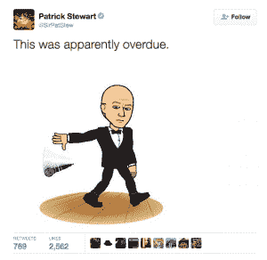
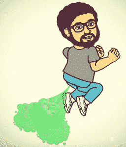

# Bitmoji 奇特诱人的交流能力

> 原文：<https://thenewstack.io/strangely-seductive-communication-powers-bitmoji/>

既然你现在可以发送一个生动的自己的头像，为什么还要发没有感情的短信呢？迟到了？发短信给你的虚拟形象，让他向前奔跑，双腿在一团尘土上打转。TMI？把你的头像捂着耳朵发过来。题目做完了？当你可以像帕特里克·斯图尔特那样做的时候，为什么要键入“放下麦克风”,并张贴一张他自己真的放下麦克风的漫画呢？

帕特里克·斯图尔特爵士扔掉了麦克风

欢迎来到 Bitmojis 的世界，在这里你的卡通代理可以为你讲述一切，有时比文本本身更优雅和幽默，或者至少更有效率。

这款新应用背后的公司 Bitstrips 的首席执行官雅各布·布莱克斯托克告诉《商业内幕》,

“发短信让交谈变得比以往任何时候都更方便，但它也剥夺了许多使交流人性化的东西。我们认为仍然缺失的最重要的东西之一是身份。想想历史，99%的人类交流都是面对面的。”

在研究这篇文章的过程中，我创建了自己的 Bitmoji，是的，我已经上瘾了。不得不说，看到你的个人化身挥舞着光剑完全摇滚。

人们会对他们的比特魔戒产生强烈的依恋，并很快认同它们。正如布莱克斯托克告诉希拉·耶戈的:

“……所以你有你的表达、你的情感、你的肢体语言、你的身份以及所有文本中缺失的东西……而这种[Bitmoji]让人们以文字无法捕捉的方式表达自己，我们认为这是革命性的。”

布莱克斯托克随后透露了耶戈的 Bitmoji，她用三句话就从怀疑者变成了粉丝:

"哦，你有一头短发，还带着微笑。"

“她看起来很有趣，我是说，我看起来也很有趣。”

然后耶戈惊讶地抬起头，“我感觉和这个比特魔人有联系。”

塞斯·罗根放屁比特莫吉

“就是这样，”布莱克斯托克得意洋洋地回答。“你的 Bitmoji 是你自己的延伸——它就像你在数字世界中的角色。”

正是这种与虚拟形象的情感联系似乎解释了 Bitmojis 的爆炸，它很快被每个人采纳，甚至被好莱坞精英采纳。塞思·罗根、帕特里克·斯图尔特、维多利亚·贝克汉姆、劳拉·邓纳姆和扎克·布拉夫都在使用 Bitmojis。

Bitmojis 带来了一些主要的硬币。据 TechCrunch 报道，2007 年推出的 Bitstrips 在 2014 年完成了 Horizons Ventures 和 Kleiner Perkins cau field Byers 的 800 万美元 B 轮融资。该公司正在用这笔钱扩充其 23 名员工和产品开发。Bitmojis 于 2014 年 11 月推出，已经吸引了来自[纽约时报](http://www.nytimes.com/2015/10/04/fashion/my-bitmoji-my-better-self.html?_r=0)、The Nerdist、[快速公司](http://www.fastcompany.com/3044570/most-creative-people/why-your-bitmoji-looks-so-much-like-your-actual-face)、[时代](http://time.com/4073412/curb-your-enthusiasm-bitmojis-larry-david/)、[财富](http://fortune.com/2015/04/06/bitstrips-emoji/)、[smallbiztrends.com](http://smallbiztrends.com/2015/04/bitmoji-emoji-characters.html)，当然还有[赫芬顿邮报](http://www.huffingtonpost.com/entry/bitmoji-chrome-extension_55d62362e4b055a6dab36509)的媒体关注。

在 Android 和 iOS 上，创建你的头像简单得荒谬。该应用程序会引导你进行一系列选择，从男性或女性开始。然后，你可以为面部细节、头发、眼睛和身材选择形状、颜色和风格。你可以选择像紫色和绿色这样的狂野颜色作为面部色调和一些疯狂的发型，这样你就可以创建怪物头像。男人可以选择我没有的胡须，但我不确定他们是否可以选择我有过的妆容和胸围。

你保存这个头像，然后选择一套服装。嘣。完成了。然后，你的个人头像被插入到 Bitmojis 中，Bitmojis 本质上是一种卡通文本信息面板。完成后，您可以将您的 Bitmojis 添加到您的手机短信、聊天记录或您的卡通替身可以表达的任何地方。

除了标准文本之外，Bitmojis 还提供了广泛的 hip 主题。有“Hangry”、“Mind Blown”、“Muahahaha”、“That Sucks”的 Bitmojis，还有哥斯拉踩一座小摩天大楼的漫画，或者 Bitmojis 正在拉屎，这只是数百个可用的几个例子。

Bitmoji 应用程序安装了几个包，除了标准的文本选择，包括“权力的游戏”(冬天来了，你什么都不知道，梵拉·莫古利斯)，“终结者”(“我会……”你知道)，和“星球大战”其他包装的价格为 0.99 美元。

该公司每周都会发布 Bitmojis。部分吸引力在于该公司能够在短时间内(在某些情况下不到 24 小时)生产新的 Bitmojis，使他们能够跟上潮流。例如，凯蒂·佩里(Katy Perry)超级碗表演中臭名昭著的卡戴珊礼服和左鲨鱼在今年早些时候出现在 Bitmoji 上，及时出现在人们使用它们的时候，而这个话题仍然是趋势，保持流行文化的脉搏。

今年早些时候，Bitmojis 与《人物》杂志合作创建了# SexiestBitmojiAlive，允许你在《人物》杂志评选出最性感的男人之前，将你的头像放在 Bitmoji《人物》杂志的封面上。

<svg xmlns:xlink="http://www.w3.org/1999/xlink" viewBox="0 0 68 31" version="1.1"><title>Group</title> <desc>Created with Sketch.</desc></svg>