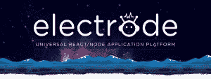
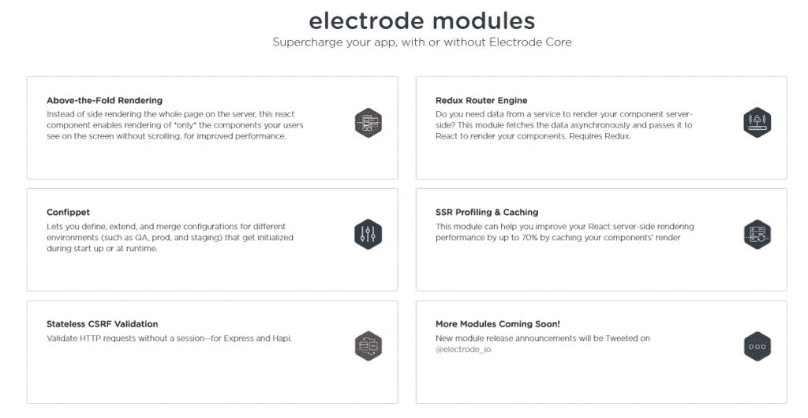

# 沃尔玛首次推出面向 React/Node.js 应用的开源平台 Electrode

> 原文：<https://thenewstack.io/strap-electrodes-walmart-labs-open-source-alive/>

美国第二大在线零售商沃尔玛拥有一条全新的产品线:[电极](http://www.electrode.io/)，一个[开源](https://github.com/electrode-io)通用 React/Node.js 应用平台。开发者被邀请使用沃尔玛实验室的电极作为一个完整的平台，或者利用电极的模块化架构，只获取他们需要的部分。

并不是每个开发人员都面临着每月 8000 万访问者浏览超过 1500 万个项目，请求负载高达每秒 10，000 个请求的规模挑战。该公司的工程师开发了电极平台，以解决该零售巨头的网络店面在性能、结构一致性和公司电子商务运营的子分支机构之间的代码冗余方面遇到的问题。

然而，沃尔玛实验室的软件工程师阿历克斯·格里戈良说,“电极”对于任何寻求“高性能、响应迅速、代码可重用的圣杯”的开发人员来说，在任何规模上都是有用的

回到 2015 年，格里戈良说，[Walmart.com](http://www.walmart.com)运行在一个[主干](http://backbonejs.org/) /Java 应用堆栈上，并希望迁移到一个响应更快的环境。电子商务网站越来越多地使用单页面应用程序，性能受到影响。“例如，我们的结账页面是一个单页应用程序，它越大，响应越慢，特别是在移动设备上，”格里戈良说。

在寻找更高性能的堆栈时，该公司的软件工程师审查了可用的框架和库阵列，最终选择了 React 和 Node . js。“React 有一个伟大的架构，Node 是渲染 React 的最佳引擎，”格里戈良说。该公司的工程师仅用了不到一年的时间就迁移到了他们选择的新堆栈，在此过程中，他们开始修补和定制。

这个修补空间就是电极存在的原因，最初是作为一种自定义修复的容器。“这是一个地方，如果有一个问题，多个应用程序都命中，我们把修复电极，”格里戈良解释说。随着越来越多的应用程序开发和推出，电极增长。他补充说，该团队对浏览器 HTML 的性能和 SEO 价值特别感兴趣，“所以每个机器人都可以直接读取 HTML，而不是试图读取 [JavaScript](/tag/javascript/) 的输出。因此，电极做得很好的一件事是服务器端高性能渲染和共享组件。”

## 去市场，去市场

对于一个跨越不同公司分支的数百名工程师团队来说，组件共享至关重要:沃尔玛实验室不仅支持 Walmart.com，还支持山姆会员店(Sam's Club)和 Asda(英国沃尔玛)的电子商务平台，共支持 11 个国家的 12 个购物网站。跨公司项目和品牌共享 React 组件对于提高效率和简化开发周期至关重要——但前提是开发团队能够找到正确的组件并信任它们的质量和一致性。

“当启动一个新的应用程序时，开发人员需要将这么多部分粘在一起——服务器端渲染、 [Redux](https://thenewstack.io/flux-overview-react-state-management-ecosystem/) 、webpack 配置、CSS 模块和后期部署脚本、代码覆盖配置，等等，”格里戈良说。在其业务架构中有相当多的重复，例如，购物者可以在 12 个零售网站中的至少三个网站上旋转“交易转盘”，电极团队努力将所有基础组件结合到一个易于使用的包中，更好地启动新应用并缩短上市时间。毕竟，当你是一家每秒钟赚取 466 美元利润的公司时，时间就是金钱。

在组件共享和代码重用的基本指导下，该团队将电极平台构建为一系列互锁的组件。首先是电极核心，用于构建新应用程序的基础结构。最重要的是电极模块，这是一个预打包的任务管理器库，从服务器端渲染缓存到灵活的配置管理。电极模块独立于电极芯，因此可集成到现有的应用程序中。最后，还有一套电极工具。其中包括一个名为 Explorer 的工具，旨在发现可重用的组件，以及 Electrify 和 Bundle Analyzer 来帮助优化 JavaScript 包。一切都是开源的，可以在 GitHub 上获得。

如今，Walmart.com 的大部分业务都在电极平台上运行，包括主页、登录、购物车、结账、类别和商品视图。该公司已经看到了网站和内部的业绩增长。关于指标，格里戈良报告说，例如，主页现在快了 20 %,甚至客户端呈现的结账页面也快了 20%。迁移到服务器端呈现的页面速度提高了 30 %,同时 JavaScript 包的大小减少了 20%。他还表示，员工的士气和生产率也有所提高:“我们可以在工程师加入沃尔玛实验室的当天就让他们入职，大多数人可以在开始工作的几天内发布代码。”

跨应用程序重用“大量”React 和 Redux 组件的能力极大地提高了生产率。沃尔玛的各种子品牌现在可以快速轻松地利用已经为兄弟品牌和应用程序创建的功能。

格里戈良总结道，迁移到 React/Node.js 的结果是，“工程师们对他们使用的现代技术感到兴奋，我们的内部开发人员社区感到充满活力，沃尔玛可以更有效地竞争。”

## 你能在空气中感觉到吗？

的确，电极一直在向前涌动。上周，沃尔玛实验室[宣布发布](https://medium.com/walmartlabs/publish-react-native-bundles-over-the-air-with-the-first-electrode-rn-release-3780edb387ba#.9bm892guh)[无线电极](https://github.com/electrode-io/electrode-ota-server)(电极 OTA)，这是一个 100%开源的解决方案，使用微软的[代码推送](https://github.com/Microsoft/code-push)在客户端实现[反应原生](https://thenewstack.io/react-native-learn-write-anywhere/)更新。

“我们一直在调查 React Native，认为那里有很多机会，”格里戈良说。“有了电极 OTA，我们可以通过无线方式更新用户的应用，而不必去苹果商店费力地通过审批流程，通过 Android 也是一样，提供了原生体验。"

电极 OTA 允许用户通过在其服务器上托管、管理和监控 JavaScript 包来控制访问和安全性。对代码推送客户端应用进行一些调整，将它指向您的服务器，而不是微软的服务器，瞧——将 React 原生包无缝部署到运行在 iOS 和 Android 上的客户端应用。而且，由于电极 OTA 是开源的，开发人员可以自由地修改、定制和推广它，以满足他们的需求。当然，电极 OTA 被设计成无缝地插入电极服务器基础设施，所以这些需求可能已经被预期和解决了。

## 打开电极服

亚历克斯·格里戈良一直密切参与电极的发展，并表示他对此次发布感到自豪和兴奋——最重要的是因为这款产品的“100%开源”性质。

“许多公司只开放他们生态系统的一部分，但我们开放了沃尔玛的整个平台。所以你知道，作为一个平台，它是稳健的，”他说。

为什么沃尔玛——一家并不以透明的零售行为而闻名的公司——愿意打开电极和服？

“总的来说，沃尔玛相信开源，我们必须回报社区——因为社区给了我们 Node 和 React，这是我们堆栈的基础，”格里戈良说。“我们有一个围绕 React 和 React Native 规划的路线图，当我们遇到挑战时，我们将把它们构建到电极平台中，这样社区就可以从我们所做的工作中受益。”

格里戈良表示，公司高管“非常支持开源”，特别是沃尔玛工程副总裁劳伦特·德瑟古尔(Laurent Desegur)和沃尔玛实验室首席技术官 T2·杰瑞米·金(Jeremy King)。

“他们明白，这不仅仅是我们投入的资源，”格里戈良说。“最终，我们相信它将允许我们所有人构建更好的软件，社区可以将电极的功能扩展到我们甚至还没有想到的领域。”

通过 Pixabay 的特征图像。

<svg xmlns:xlink="http://www.w3.org/1999/xlink" viewBox="0 0 68 31" version="1.1"><title>Group</title> <desc>Created with Sketch.</desc></svg>