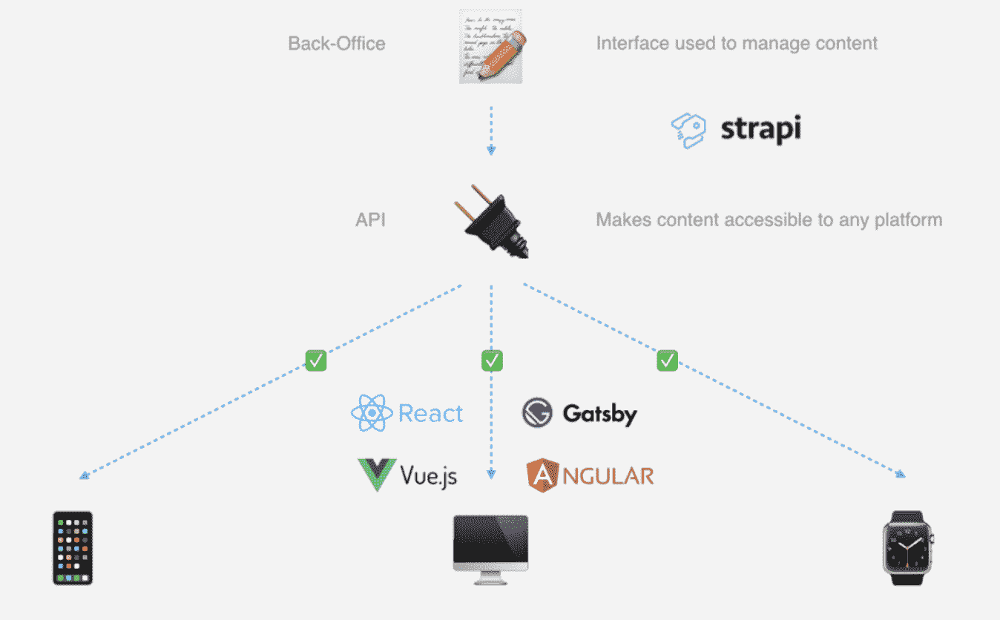
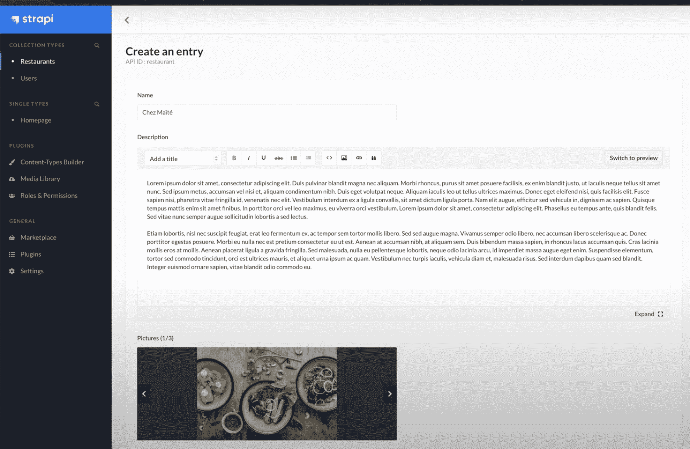

# Strapi 的无头 CMS 和 Docker 的经验教训

> 原文：<https://thenewstack.io/strapi-headless-cms-and-lessons-learned-from-docker/>

 [理查德·麦克马努斯

理查德是《新书库》的高级编辑，每周撰写一篇关于云原生互联网未来发展的专栏文章。此前，他在 2003 年创立了读写网，并将其打造为全球最具影响力的科技新闻和分析网站之一。](https://twitter.com/ricmac) 

在 web 开发的 [JAMstack](https://thenewstack.io/the-sweetness-of-jamstack-javascript-apis-and-markup/) 模型的所有组件中，内容管理部分是目前最不成熟的。但是在技术世界里，哪里有不成熟，哪里就有机会。在 JAMstack 的例子中，有机会用一种叫做“无头内容管理系统”的东西来重新想象传统的内容管理系统(CMS)

为了找出无头 CMS 的作用以及为什么它是一个大趋势，我采访了领先的无头 CMS 供应商之一的 Victor Coisne。事实证明，Coisne 对云原生生态系统也有相当多的了解，他在 2013 年至 2018 年期间担任 Docker 的社区负责人。因此，我还询问了他 2013 年涌现的容器世界和(或许)2020 年涌现的无头 CMS 世界的相似之处。

但是首先，让我们来讨论一下术语“无头 CMS”，它可以和“无服务器”相提并论，是云时代最糟糕的类别名称之一。基本上，CMS 上下文中的“头”意味着前端。根据 Coisne 的说法，无头 CMS 将表示层与数据和逻辑层分开。而对于传统的 CMS，所有这些层都捆绑在一个整体架构中。

下面是 Strapi 的竞争对手之一 ButterCMS 的解释:“在传统的 CMS 中，所有的东西都打包在一起，技术架构将前端(设计和布局)与后端(代码和内容数据库)紧密地联系在一起。”

这是 Strapi 在演示中用来形象化其无头架构的图表:

资料来源:Strapi。

Strapi 的技术是开源的，基于一个 JavaScript 运行时环境 [Node.js](https://nodejs.org/) 。它的用户界面是一个使用流行的 JavaScript 框架 React 构建的管理面板。这个想法是，开发者在管理面板中设置各种“内容类型”，并进一步用“组件”定义这些类型(根据开发者[巴托米杰·dąbrowski](https://tsh.io/blog/strapi-node-js-headless-cms/)的说法，组件是一种“可重用的数据结构，可用于不同的内容类型”)。

内容可以存储在您选择的数据库中，然后通过 API 连接到前端工具(如 React 或 Gatsby)。

## 与 WordPress 相比，在 Strapi 中编辑内容

无头 CMS 系统的主要吸引力在于，您只需输入一次内容，就可以通过 API 将内容分发到任何表示层。Coisne 称之为内容管理的“全渠道”方法，这意味着任何渠道或设备都可能消费这些内容，不仅仅是网络和移动设备，还包括物联网(IoT)设备、数字标牌等。

另一方面，WordPress 只针对网络和手机进行了优化。然而，WordPress 的主要优势是内容编辑可以通过其所见即所得(WYSIWYG)用户界面看到内容对最终用户来说是什么样子。

Strapi 面临的一个大问题是，它的前端对内容创作者来说不一定是最佳的。与 WordPress 相比，管理面板(见下图)相当简单。

资料来源:Strapi。

Coisne 承认，在内容创作体验方面，headless CMS 供应商正在“稍微追赶”WordPress 和 Drupal 之类的网站。

他说:“像 WordPress 或 Drupal 这样的标准功能在无头 CMS 中不一定可用。”

Coisne 指出，到目前为止，对无头 CMS 的采用是由开发人员主导的(这一点[也是由 Gatsby](https://thenewstack.io/gatsbys-content-mesh-and-its-role-in-jamstack/) 提出的)，因为它给了他们“构建自己的堆栈和使用自己喜欢的工具的灵活性”然而，和 Gatsby 一样，Strapi 也希望使用越来越流行的无代码开发方法来获得更广泛的受众。

## 帮助非技术用户做技术工作

Coisne 说:“我们的目标肯定是更加主流化，允许技术含量较低的人来建立 Strapi。

为此，Strapi 需要帮助非技术用户连接和使用多种 web 服务；本质上，让用户像在 WordPress 中输入文本一样舒适地管理 API。

“这里的愿景，”Coisne 说，“是利用 api，使 Strapi 成为下一次低代码[和]无代码开发革命的关键推动者。”

将主流用户转化为无头 CMS 产品不是一件容易的事情，但是大量的资金已经流入这个领域来实现这个目标。今年 5 月，Strapi 在由 Index Ventures 牵头的 A 轮基金中筹集了 1000 万美元(总投资额为 1400 万美元)。它的一个竞争对手 Contentful 在 6 月份的 E 轮融资中筹集了 8000 万美元(现在它总共筹集了 1.596 亿美元)。

该企业很可能成为更广泛采用 headless CMS 产品的关键垫脚石，就像它在 21 世纪初对 Drupal 一样。事实上，就在这个月，Strapi 宣布了一个企业版的测试版，其特点是基于角色的访问控制。

## 与 2013 年 Docker 的对比

当 JAMstack 方法在 2013 年通过 Docker 首次出现时，它给人的感觉有点像容器。当时，没有人知道容器是否会被广泛采用。然而，七年后的今天，容器是大规模开发的主导范例。也许 JAMstack 和 headless CMS 也会出现类似的增长呢？

Victor Coisne 从 2013 年开始担任 Docker 的社区负责人，所以我问他从快速发展的经历中学到了什么，他现在可以申请 Strapi 吗？

“与 Docker 类似，看到开发者对(Strapi)的浓厚兴趣以及在开放环境中发生的合作，真的令人惊讶，”他回答道，提到了两个产品的开源特性。“因此，我们努力做到尽可能透明，并努力遵循 Docker 项目早期获得的一些最佳实践。”

Coisne 指出，围绕集装箱的标准化也是 Docker 成功的关键。他希望同样的事情会发生在 JAMstack 生态系统中。目前有许多公司试图在 JAMstack 中扬名立万——包括 [Netlify](https://thenewstack.io/why-netlify-is-tech-agnostic-and-its-role-in-jamstack-development/) 、 [Gatsby](https://thenewstack.io/gatsby-wants-to-be-orchestration-layer-for-building-websites/) 、 [Vercel](https://thenewstack.io/vercels-frontend-and-the-rise-of-the-hybrid-developer/) 和 Contentful——但并不总是清楚谁在与谁竞争，或者每个公司在这个新兴的 web 开发“堆栈”中扮演什么样的特定角色

根据 Coisne 的说法，Strapi 希望“走向与其他参与者的合作”——就其而言，特别是像 Gatsby、VuePress 和 Nuxt 这样的静态站点生成器(因为它们负责内容构建)。

“我们试图与他们所有人整合，”Coisne 说，他指的是静态网站生成器，“然后他们试图与所有不同的 CMS 玩家整合。因此，我认为行业将真正受益于某种程度的标准化，这可以防止供应商锁定，并确保开源社区能够受益。”

Coisne 特别希望看到“内容建模级别”的标准化，这是开发人员目前必须在 Strapi 管理面板中自己解决的问题。

当然，标准化对容器生态系统非常有效，并最终导致了开源的 Kubernetes 容器编排平台。JAMstack 的领先创业公司应该注意到这一点。

通过 Pixabay 的特征图像。

目前，新堆栈不允许直接在该网站上发表评论。我们邀请所有希望讨论某个故事的读者通过推特(Twitter)或脸书(T2)与我们联系。我们也欢迎您通过电子邮件发送新闻提示和反馈:[反馈@thenewstack.io](mailto:feedback@thenewstack.io) 。

<svg xmlns:xlink="http://www.w3.org/1999/xlink" viewBox="0 0 68 31" version="1.1"><title>Group</title> <desc>Created with Sketch.</desc></svg>