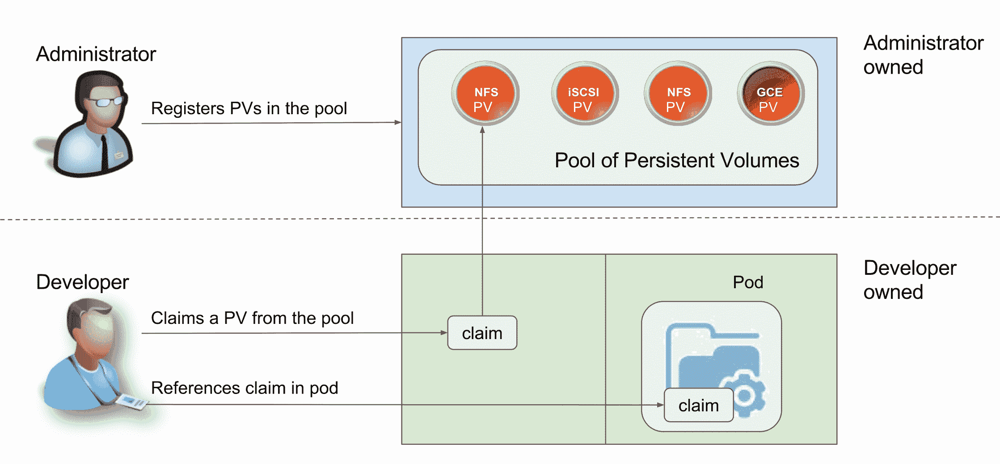

# 在 Kubernetes 中运行有状态应用程序:存储供应和分配

> 原文：<https://thenewstack.io/strategies-running-stateful-applications-kubernetes-persistent-volumes-claims/>

在……里

[last part of this series](https://thenewstack.io/strategies-running-stateful-applications-kubernetes-volumes/)

，我们探讨了卷的概念如何给容器带来持久性。本文以对卷的理解为基础，介绍持久卷和声明，它们构成了 Kubernetes 的健壮存储基础设施。

为了理解 [Kubernetes](/category/kubernetes/) 如何管理为应用程序提供持久性的存储池，我们需要理解与应用程序部署相关的架构和工作流。

Kubernetes 用于各种角色——由开发人员、系统管理员、操作人员和开发团队使用。如果你愿意的话，这些角色中的每一个都以不同的方式与基础设施进行交互。系统管理团队负责配置运行 Kubernetes 集群的物理基础设施。运营团队通过修补、升级和扩展集群来维护 Kubernetes 集群。DevOps 团队与 Kubernetes 打交道，以配置 CI/CD、监控、日志记录、滚动升级和 canary 部署。开发人员使用由 Kubernetes 基础设施公开的 API 和资源。他们永远不会了解运行主节点和节点的底层物理基础设施。

开发人员通过一种声明性机制“请求”他们运行应用程序所需的资源，这种机制通常在 [YAML](http://yaml.org/) 或 [JSON](http://www.json.org/) 中描述。Kubernetes master 负责确保按照开发人员的要求选择适当的资源。但在此之前，管理员需要调配所需的计算、存储和网络容量。

例如，开发人员可能会要求 Kubernetes 安排一个由 SSD 支持的 pod 运行，由一定数量的内核和内存提供动力。假设基础设施是有能力的，Kubernetes master 通过选择运行 pod 的正确节点来接受请求。

为了理解这个概念，让我们看一下 pod 和 node 之间的关系。节点是由管理员和运营团队预先配置的服务器。开发人员创建利用节点公开的计算资源的 pod。

Kubernetes 的这种架构使得开发人员、管理员和操作人员之间的关注点能够清晰地分离。

## Kubernetes 资源供应和分配

现在，让我们将单元和节点比喻为存储。在开发人员可以开始使用存储之前，管理员需要配置永久卷。与卷不同，持久性卷在创建时不与任何特定的 pod 或容器相关联。它们是预先调配的存储资源，可供开发人员在创建 pod 时使用。一旦管理员配置了持久性卷(PersistentVolume ),开发人员就创建一个声明(PersistentVolumeClaim ),开始消耗作为持久性卷公开的存储资源。

这非常类似于节点和 pod 之间的关系。在部署 pods 之前，开发人员假设节点已经配置好并且可用。类似地，在创建声明之前，开发人员假设持久性卷是可用的。声明和持久卷对于存储来说就像 pod 和节点对于计算一样重要。

来源:史蒂夫·瓦特，红帽

理解 Kubernetes 卷和持久卷之间的区别也很重要。卷类似于 Docker 卷，在 Docker 卷中，容器请求由主机提供的运行时持久性。卷可以使用隐式的基于主机的存储，也可以明确请求由外部块存储设备和分布式文件系统支持的持久性。但是开发人员并不期望在使用卷之前预先配置存储资源。在持久卷和声明中，在资源创建期间定义的策略规定了严格的资源利用率。

传统的 Kubernetes 卷可以利用持久卷。pod 可以通过将声明用作卷来访问存储。声明必须与使用声明的 pod 位于同一命名空间中。然后，该卷被装载到主机和机架中。

## 术语、概念和生命周期

**持久卷** (PV)属于管理员已调配的群集网络存储资源。它是群集中的资源，就像节点是群集资源一样。

PV 是像卷一样的卷插件，但是它们有独特的生命周期，独立于使用 PV 的任何单独的 pod。

一个**PersistentVolumeClaim**(PVC)是开发者对存储的请求。它类似于一个豆荚。Pods 消耗节点资源，PV 消耗 PV 资源。Pods 可以请求特定级别的资源(CPU 和内存)。声明可以请求特定的存储大小和访问模式，如读取和读写。

PVC 和 PVs 可以通过标签和选择器的概念来匹配。在创建 PV 的过程中，管理员可以创建带有属性的标签。PVC 可以使用选择器来确保它们总是绑定到具有匹配标签的匹配 PVs。

持久卷类型是作为插件实现的。Kubernetes 支持流行的后端和分布式文件系统，包括 Amazon EBS、GCE 持久磁盘、Cinder、Azure 文件系统、NFS、iSCSI、Gluster 和 Ceph 等类型。

StorageClass 使管理员能够创建他们提供的多个存储层或存储类别。不同的类别映射到不同级别的服务质量、备份策略和管理员定义的任意策略。

持久性卷的生命周期分为五个阶段:

1.  准备金提取
2.  有约束力的
3.  使用
4.  放
5.  改造

在配置阶段，管理员从现有的物理存储池创建一个 PV。资源调配支持静态和动态模式。当开发人员请求索赔时，Kubernetes 会寻找符合要求的现有 PV。这称为静态供应。当管理员创建的静态 PVC 都不符合开发人员的要求时，群集可能会尝试为该 PVC 动态配置一个卷。这种供应模式由 Kubernetes 动态处理，前提是物理资源可用。

绑定是声明被绑定到特定持久卷的阶段。通过分析 PVC，Kubernetes 将找到一个匹配的 PV，并将两者关联起来。

PVC 绑定到 PV 后，pod 将开始使用声明作为卷。这是开发人员定义访问卷的模式(读或写)的时候。

当应用程序使用完卷时，开发人员可以通过 API 删除 PVC 对象，释放声明。这一步将启动回收过程。但是在声明被删除之前，该卷不会被释放出来供其他人使用。

最后一个阶段是回收，由管理员定义为一项策略。持久卷的回收策略告诉群集在释放其要求后如何处理该卷。永久卷可以被保留、回收或删除。根据存储后端，可以对持久卷采取适当的操作。在使用块存储的情况下，可以通过调用特定于云的 API 来删除它们。在从分布式存储创建卷的情况下，可以发出简单的擦除命令。

在本系列的下一篇文章中，我们将研究 Pet Sets，这是 Kubernetes 中一个不断发展的概念，用于运行高度可用的有状态工作负载。

<svg xmlns:xlink="http://www.w3.org/1999/xlink" viewBox="0 0 68 31" version="1.1"><title>Group</title> <desc>Created with Sketch.</desc></svg>