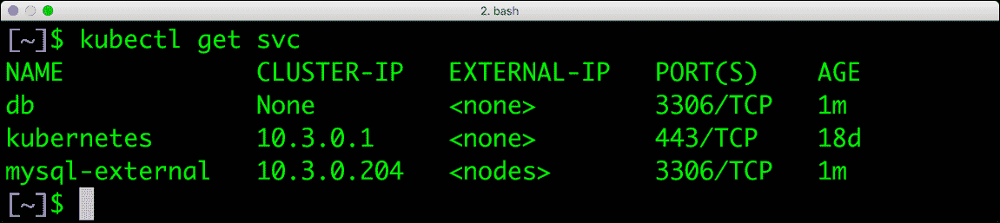

# 在 Kubernetes: Pet Sets 中运行有状态工作负载的策略

> 原文：<https://thenewstack.io/strategies-running-stateful-applications-kubernetes-pet-sets/>

任何试图在生产中运行容器的人都同意管理有状态服务是最大的难点之一。无论是 Swarm、Kubernetes 还是 Mesos，与确保有状态容器的高可用性相比，向外扩展无状态容器都简单明了。尽管容器生态系统正在积极地为此做出贡献，但它仍然是一个挑战。

 **受[宠物与牛](https://blog.engineyard.com/2014/pets-vs-cattle)类比的影响， [Kubernetes](https://thenewstack.io/strategies-running-stateful-applications-kubernetes-volumes/) 社区创建了[宠物集](http://blog.kubernetes.io/2016/07/stateful-applications-in-containers-kubernetes.html)，作为在 1.3 或更高版本中运行持久的、有状态工作负载的一种方式。Pet 集的目标是将[副本集](http://blog.kubernetes.io/2016/07/stateful-applications-in-containers-kubernetes.html)的灵活性和功能带给有状态的 pod。就像由副本集管理的 pod 在崩溃时被重新创建一样，Pet 集将确保有状态 pod 的所需配置始终得到维护。

这听起来可能很简单，但是考虑到 Kubernetes 的架构方式，这需要一种完全不同的方法来安排和管理 pod 的生命周期。

在了解宠物如何区别对待有状态的 Pod 之前，让我们先来看看无状态的常规 Pod 的特征。

*   pod 通过[副本集](http://kubernetes.io/docs/user-guide/replicasets/)进行横向扩展和纵向扩展。
*   pod 将在运行时被分配一个任意的名称。
*   每个 pod 可以在任何可用的节点上被调度，除非关联性规则有效。
*   pod 可以在任何时间点重新启动和重新定位。
*   pod 可能永远不会被名称或 IP 地址直接引用。
*   一个[服务](http://kubernetes.io/docs/user-guide/services/)选择一组符合特定标准的 pod，并通过一个定义良好的端点公开它们。
*   任何以 pod 为目标的请求都会通过该服务，该服务会将流量路由到其中一个 pod。

在上图中，每个彩色圆圈代表一个服务，而每个正方形代表一个 Pod。当使用选择器“color=red”创建服务时，Kubernetes 会将所有标签为“color=red”的窗格放在新服务下。即使是稍后创建的、在任何节点上调度的新 pod 也将开始接收请求，只要它们带有相同的标签。从技术上来说，任何符合相应标签的 pod 都会自动归入该服务。Kubernetes 中的服务充当众所周知的通信端点。

让我们换个角度，考虑如何在主-主配置中部署高可用性 MySQL 集群。这要求两台服务器在对客户端可用的同时相互通信。通常使用 [HAProxy](http://www.haproxy.org/) 将流量均匀地路由到一个 MySQL 服务器。

M1 和 M2 应该有众所周知的端点来进行复制。HAProxy 将成为所有客户端与 MySQL 集群对话的端点。除非我们使用 PetSets，否则在 Kubernetes 中部署和管理这个配置并不容易。

参与 PetSet 的有状态 pod 称为 Pet。它将具有以下属性:

*   一个稳定的主机名，总是由 DNS 解析。
*   代表宠物的顺序/角色的顺序索引号。
*   一种与主机名和顺序索引号相联系的稳定存储器。

当我们将 MySQL HA 配置创建为名为 *mysql* 的宠物集时，其中一个宠物将被命名为 *mysql-0* ，而另一个将被命名为 *mysql-1* 。序数编码方案有相当多的重要性，这在处理持久卷声明时变得很明显。

在配置 Pet Set 之前，有一个块存储的分布式文件系统形式的持久存储后端是很重要的。所有节点都应该能够访问存储后端公开的装载点。

从 Kubernetes 1.2 开始，某些后端如 [GCE 持久磁盘](https://cloud.google.com/compute/docs/disks/)、 [OpenStack Cinder](https://wiki.openstack.org/wiki/Cinder) 和 [Amazon EBS](https://aws.amazon.com/ebs/) 卷可以动态配置。有关存储类和动态预配置的详细信息，请参考 Kubernetes [文档](http://kubernetes.io/docs/user-guide/persistent-volumes/#storageclasses)。

对于 NFS 后端，我们需要实现以下步骤:

1.  为每只宠物提供永久卷。
2.  创建绑定到永久卷的永久卷声明。
3.  创建一个由每只宠物用来解析其他宠物的 DNS 名称的服务。
4.  创建向外部客户端公开的服务。
5.  用所需数量的宠物创建宠物集。

创建由 NFS 共享支持的永久卷。

然后，我们创建两个绑定到上述 PVs 的持久卷声明。

在我们创建了宠物集之后，我们看到基于上面的 PVs 创建了两只宠物作为有状态的 Pods。

这两只宠物属于 *mysql* 宠物集，从下面截图可见。

宠物集公开了两个服务——一个用于宠物相互交谈，另一个用于外部通信。

当我们描述服务时，我们看到它有一个名为 db 的命名端口。这用于解析每个宠物的 DNS 名称。宠物集定义还将包含一个任意名称，用于为每个宠物创建子域。

宠物 *mysql-0* 总是可以通过 DNS 名称*MySQL-0 . db . default . SVC . cluster . local*到达。

Pet *mysql-0* 无论在哪里，总能通过端点 *mysql-1.db* 到达 *mysql-1* 。

假设已经在 MySQL 服务器的两个实例之间配置了复制，我们几乎已经成功地模拟了 Kubernetes 上的 MySQL HA 配置。

如果其中一只宠物撞车了会怎么样？宠物设置会自动调出与带有完全相同索引的旧宠物同名的宠物。由于宠物的卷将自动指向持久卷声明，因此状态会立即恢复。

在一些配置中，比如一个 MySQL 主服务器有多个从服务器，很容易添加新的宠物作为从服务器。我们只需要预先重复创建持久卷和声明的步骤，并增加 Pet 集中副本的数量。

本系列的目标是介绍在 Kubernetes 中运行有状态工作负载的各种策略。在接下来的文章中，我将带您了解在 Kubernetes 中配置高可用性、持久性、有状态工作负载的所有步骤。敬请关注。

[英特尔的尼克·韦弗讨论编排](https://thenewstack.simplecast.com/episodes/intels-nick-weaver-discusses-orchestration)

英特尔和 Mesosphere 是新堆栈的赞助商。

通过 Pixabay 的特征图像。

<svg xmlns:xlink="http://www.w3.org/1999/xlink" viewBox="0 0 68 31" version="1.1"><title>Group</title> <desc>Created with Sketch.</desc></svg>**