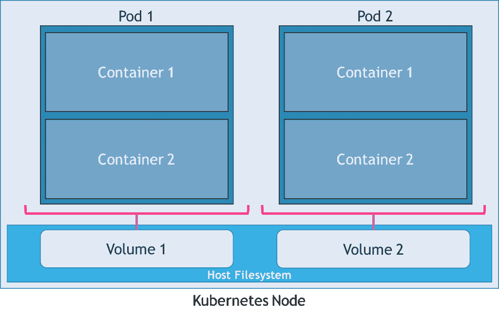
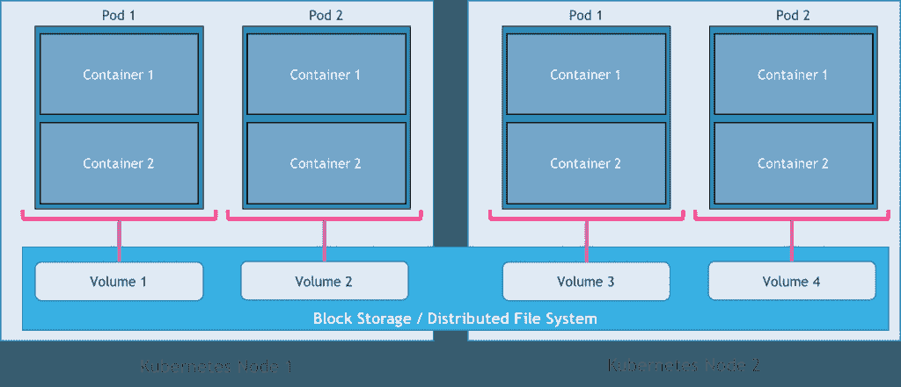

# 在 Kubernetes 中运行有状态应用程序的策略:卷

> 原文：<https://thenewstack.io/strategies-running-stateful-applications-kubernetes-volumes/>

运行容器化工作负载的关键挑战之一是处理持久性。与提供持久存储的虚拟机不同，容器带有短暂的存储。从一开始，Docker 就鼓励无状态服务的设计。在容器的世界里，持久性和有状态性是事后才想到的。但是这种设计有利于工作负载的可伸缩性和可移植性。这也是容器推动云原生架构、微服务和网络规模部署的原因之一。

意识到容器的好处后，人们正在努力将有状态的应用程序容器化，使其可以与无状态的应用程序无缝运行。Docker 卷和插件[是将有状态应用程序转变为 Docker 一等公民的重要一步](https://thenewstack.io/methods-dealing-container-storage/)。最近来自新堆栈的[电子书](https://thenewstack.io/ebookseries/)涵盖了容器存储的各个方面以及用例。

中间层 DC/操作系统强调在运行云原生应用的同时运行事务性工作负载。Robin Systems 是一家容器管理公司，[的目标是将 Oracle 和其他企业数据库容器化](https://thenewstack.io/robin-systems-everythings-container/)。Kubernetes 容器编排引擎正在准备通过一个叫做 Pet Sets 的新概念来运行有状态工作负载，Pet Sets 是一个有状态容器的 pod。宠物设置是在 7 月发布的 Kubernetes 1.3[中作为 alpha 特性引入的。](https://thenewstack.io/kubernetes-1-3-supports-stateful-applications-federated-clusters/)

Kubernetes 将底层基础架构构建模块抽象为计算、存储和网络。当开发人员和运营团队开始使用 Kubernetes 时，他们通常会接触到 pods、标签、服务、部署和副本集等对象，这些对象提供了一种处理计算和网络的机制。谈到 Kubernetes 中的持久性，用户应该熟悉卷、持久性卷、持久性卷声明(PVC)和即将推出的 Pet Sets 的概念。

本文将是讨论 Kubernetes 中每个可用存储选择的策略和用例的系列文章的第一篇。在这一章中，我们将仔细研究卷，它提供了到 Kubernetes 的最简单的迁移路径。

## 卷

[Kubernetes 卷](http://kubernetes.io/docs/user-guide/volumes/)类似于 [Docker 卷](https://docs.docker.com/userguide/dockervolumes/)。两者都旨在通过依赖底层主机为容器带来一定程度的持久性。

Docker 卷绕过[联合文件系统](https://blog.docker.com/2015/10/docker-basics-webinar-qa/)直接访问主机上可用的存储。根据卷的创建方式，它的生命周期可能受限于容器，这意味着当容器终止时，卷会被删除。通过卷插件，Docker 开始提供超出容器寿命的存储卷。

Kubernetes 的存储要求与 Docker 略有不同。因为它支持将多个容器打包到一个 pod 中，这是一个逻辑部署单元，所以属于一个特定 pod 的所有容器应该共享数据。pod 中的容器可能偶尔会重新启动，这不会影响存储机制。与受特定容器影响的 Docker 卷不同，Kubernetes 卷与 pod 的生命周期相关联。即使在 pod 中运行的容器被终止或重新启动，关联的卷也将继续存在。只有当 pod 显式终止时，它才会被删除。

在终止 pod 后卷仍应可用的情况下，它可能基于持久的块存储后端，如 Amazon EBS、Google Compute Engine 的持久磁盘(GCE PD)或分布式文件系统，如网络文件系统(NFS)或 Gluster。关键是包装成一个容器的多个容器具有相同的体积。

Kubernetes 卷可以分为基于主机的存储和基于非主机的存储两种类型。基于主机的存储类似于 Docker 卷，其中主机的一部分存储可供 pod 使用。一旦 pod 终止，该卷就会自动删除。非基于主机的存储不依赖于特定的节点。相反，存储卷是从外部存储服务创建的。即使删除了 pod，基于此存储类型的卷仍将可用。

依赖于基于主机的存储的两种特定卷类型是 emptyDir 和以及 hostPath。

在特定节点上创建 pod 的过程中会启动一个 emptyDir 卷。只要 pod 在同一个节点上运行，它就会一直存在。从它的名字可以明显看出，它从节点上的一个空目录开始。属于 pod 的所有容器都可以读写 emptyDir 卷。每个容器可以通过不同的路径看到相同的体积。当 pod 终止或重新定位到另一个节点时，emptyDir 中的数据将被永久删除。即使 pod 在同一节点上恢复，它也将从空白卷开始。但是，emptyDir 卷在单个容器崩溃和重新启动后仍然存在，这使它成为存储共享配置数据的安全选择。

使用 emptyDir 卷的一些常见用例包括:

*   创建暂存磁盘来存储中间数据。
*   一个公共存储区域，用于在同一 pod 的多个容器之间共享配置设置和元数据。
*   众所周知的容器存储位置，用于存储和转发数据。当 web 服务器响应请求时，crawler 容器可能会定期填充卷。

虽然 emptyDir 卷的创建完全由 Kubernetes 管理，但 hostPath 卷超出了它的范围。emptyDir 卷类似于 Docker 的隐式的每个容器的存储策略。它们是由容器运行时管理的沙箱。另一方面，主机路径卷将文件或目录从主机节点的文件系统直接装载到 pod 中。虽然这不是最推荐的策略，但一些需要即时访问现有数据集的应用程序会发现它很有用。

hostPath 卷附带一些警告，例如在底层主机上创建的目录只能由 root 用户写入。这将强制容器以特权模式运行，或者显式修改主机文件权限，以便能够写入主机路径卷。

支持各种块存储、分布式文件系统和托管文件系统，包括 Amazon EBS、GCE PD、Ceph、Gluster、NFS、Azure 文件系统、Flocker 和 vSphere 卷。参考 Kubernetes 的[文档](http://kubernetes.io/docs/user-guide/volumes/#resources)了解支持的驱动程序及其实现。

卷非常适合将容器从 Docker 迁移到 Kubernetes 环境的用例。鉴于其与 Docker 卷的兼容性，为基于主机的持久性设计的应用程序可以很容易地利用该特性。

在本系列的下一部分中，我们将了解如何利用 Kubernetes 持久卷和声明来为微服务创建健壮的基础架构。

<svg xmlns:xlink="http://www.w3.org/1999/xlink" viewBox="0 0 68 31" version="1.1"><title>Group</title> <desc>Created with Sketch.</desc></svg>