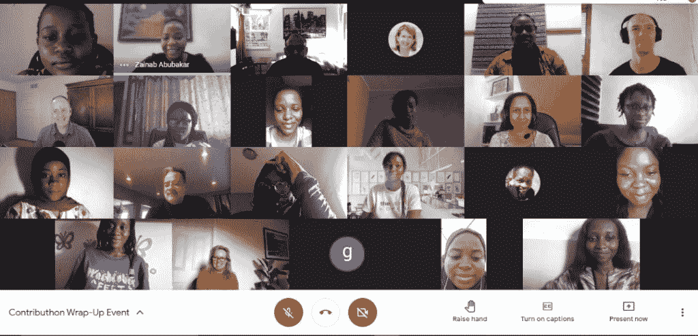

# 利用开源多样性和包容性击败亲和偏见

> 原文：<https://thenewstack.io/strategies-to-beat-affinity-bias-for-more-open-source-diversity-and-inclusion/>

大量开源软件(OSS)社区炫耀彩虹标志，标记#BlackLivesMatter 和#MeToo，并做许多其他表演姿态。然而，在 OSS 贡献者中，只有 3%的人是女性，相比之下，整个科技行业中女性的比例约为 20%。

开源领域的女性扮演着煤矿中的[金丝雀，对生态系统特有的更大的多样性问题保持警惕。其他 OSS 的人口统计数据也很糟糕，包括，虽然非洲占全球人口的 16%，但它只占 GitHub 社区的 2%。](https://eaves.ca/2009/07/20/women-in-open-source-the-canary-in-the-coal-mine/)

今年三月，[她编码非洲](https://www.shecodeafrica.org/)收到了来自整个非洲大陆[女性](https://thenewstack.io/how-the-tech-community-can-do-better-for-black-women/)的 180 份申请参加其开源虚拟训练营。但是非营利组织只能找到三个 OSS 社区作为导师参与，所以他们不得不接受更少的申请者。当然，他们得到了充足的赞助资金，但只有詹金斯、Layer5 和 DeployHub 也愿意贡献他们的时间。

所以缺乏代表性不是对 OSS 缺乏兴趣，也不是缺乏人才。去年的《2020 年非洲电子经济报告》发现，非洲的科技工作者比以往任何时候都多，拥有超过 600 个不同的科技中心。像[非洲开源社区](https://festival.oscafrica.org/)这样的活动，有 800 多名来自尼日利亚和其他国家的参与者，表明当地也需要开源指导。

但是，正如 Interswitch Group 的 DevOps 工程师、Jenkins 的技术作家和 She Code Africa 的开源项目经理 Zainab Abubakar 所说，“我们在非洲有很棒的人才，我可以特别夸耀尼日利亚——我们需要的是机会。我们还有很长的路要走。”

非洲并不是这里唯一的。全球北方的开源社区仍然在缓慢地改变他们不包容的习惯，包括对女性的习惯，尤其是在考虑到种族、宗教、性别和性取向等其他交叉因素时。

阿布巴卡尔在今年 cdCon 上的演讲的后续采访中告诉 New Stack，有许多开源社区声称致力于多样性，“但事实是他们实际上做得还不够。”这篇文章是那次谈话和谈话的混合。

事实上，开源和更广阔的技术空间中的许多[多样性、公平和包容倡议](https://thenewstack.io/black-lives-matter-how-the-tech-community-can-provide-support/)仍然是高度理论化和散漫的。指针似乎不动了。

“我认为开源社区和组织应该把他们的钱用在他们所说的地方。如果你在谈论鼓励你的社区更加多元化，这应该不仅仅是在一个活动中发言或者写一篇文章。各社区需要采取积极措施，表明他们真的在做事情，鼓励多元化和包容性的社区，”阿布巴卡尔说。

我们需要的是特异性。超越品牌倡议的行动项目，向明确的行为政策和包容战略迈进。这就是今天这篇文章的内容。

## 为什么开源应该不顾一切地追求多样性

你可以说开源生态系统并没有绝望，因为 2020 年 [Github 的贡献增加了 25%](https://octoverse.github.com/#finding-balance)。但我们知道，事实证明，增加多样性和包容性与金融增长相关。事实上，它在包括[创新、创造力](https://www.greatplacetowork.com/resources/blog/why-diverse-and-inclusive-teams-are-the-new-engines-of-innovation)和[产品质量和可用性](https://productschool.com/blog/product-management-2/diversity-inclusion-product/)在内的几个指标上带来了更好的表现。

如果开源是构建未来的主要方式——90%的企业至少使用一些开源软件——那么它就危险地将大多数用户[排除在构建和培训未来的道路之外。我们已经知道语音识别软件在识别高音方面](https://accelerate.withgoogle.com/stories/creating-products-for-a-diversity-of-users)[更差](https://www.newscientist.com/article/2202071-voice-assistants-seem-to-be-worse-at-understanding-commands-from-women/)——尽管大多数[虚拟助手默认为女性](https://thenewstack.io/rebuilding-ai-toward-a-feminist-alexa/)。

面部识别软件的范围从在推特上斩首黑人(T8)到缩放(Zoom)到三分之一时间内不准确地识别黑皮肤女性(T11)。诸如此类的事情还在继续发生，因为软件开发人员和他们所培训的数据缺乏多样性，这很危险。如果边缘化群体被排除在创造之外，你就无法为他们构建解决方案。

对于 Abubakar 来说，她最喜欢的开源好处——社区——真的失去了，当它的成员看起来都一样，有着相同的生活经历、观点和背景。社区是开源的[社会资本](https://eaves.ca/2009/07/20/women-in-open-source-the-canary-in-the-coal-mine/)。

当然，开源定义[明确禁止歧视](https://opensource.org/osd)，所以，不仅这些群体不能从开源中受益，缺乏多样性也可能威胁到你的[开源许可](https://thenewstack.io/open-source-licenses-who-holds-the-power/)。

## 敌意和亲和偏见困扰着开源社区

> “今天的事实是，世界上女性的成就确实受到了损害。”

扎伊娜卜·阿布巴卡尔

所以我们知道女性的贡献还不够，甚至这也不完全准确，因为“女性”被用作非男性和非二进制的统称。但是，正如项目经理[艾玛·欧文在](https://blog.mozilla.org/en/products/firefox/open-source-inclusion/)中写道，“如果代表地球上近一半人口的人口统计数据表现如此糟糕，我们将如何在其他代表性领域取得进展，包括不讲英语的人、种族/民族、年龄、家庭地位、社会经济地位和残疾？”

阿布巴卡尔说:“事实是，女性经常被排除在群体活动之外，或者被有意忽视，因为她们不是‘群体’中的一员，在群体中‘群体’通常指白人男性。不管这是有意识的还是无意识的，这肯定是一种偏见，它肯定使人很难卷入其中。”

她说这可以归结为亲和力偏见，即与像我们一样的人相处并希望与他们一起工作的倾向。对于少数群体来说，这可能是创造[安全空间](https://thenewstack.io/open-source-communities-need-more-safe-spaces-and-codes-of-conducts-now/)的一种重要方式，但对于那些占绝大多数的人来说，如白人男性，这有助于形成一种动态，在这种动态中，除了这种亲和力之外的所有人都被排除在外。

她认为偏见培训应该是 OSS 维护者和其他社区领导人的必修课。

当然，一部分原因可能是自我实现的预言，即拥有培育有毒环境的名声。阿布巴卡尔谈到了无数的问题和贡献遭到公众嘲笑的故事。

她说:“闯入一个对成员和外人表现出敌意的社区需要很大的动力，这往往会阻碍那些已经不符合传统白人男性电脑呆子模式的人。”

但这不仅仅是缺乏同理心，而是[公开的性别歧视](https://businesschicks.com/how-to-call-out-casual-sexism/)和敌意，从不当的代码功能笑话和[外观评论](https://businesschicks.com/how-to-call-out-casual-sexism/)一直到公共邮件列表上毫不掩饰的言论。正如阿布巴卡尔指出的那样，阻止这种行为的斗争经常会遇到极端的抵制、嘲笑和报复。

例如， [2017 GitHub 开源调查](https://opensourcesurvey.org/2017/)(不幸的是，这仍然是最近对这个问题的深入研究)发现，这种负面影响导致 21%的贡献者退出。大约一半的受访者目睹过这种粗鲁或骚扰——这当然不包括所有未被发现的辱骂性短信。

[我们已经写过](https://thenewstack.io/open-source-communities-need-more-safe-spaces-and-codes-of-conducts-now/)如何有大量的轶事和实证研究表明开放源码软件中“妇女和代表性不足的少数群体的敌意、歧视和掠夺经历”。Abubakar 提醒我们，“所有这些问题与开源贡献者想要的和开源社区想要代表的形成了鲜明的对比。”

## 衡量厌女症和厌女症

开源社区中现存的对女性的潜意识偏见是极端的——而且是可以量化的。

【2017 年的一项被广泛引用的研究通过关注近 140 万用户在开源项目中的 GitHub pull 请求，检查了开源中的性别偏见，其中基于他们个人资料的性别身份是显而易见的。他们发现，总的来说，女性提出的拉请求有 78.6%被接受，而男性只有 74.6%。然而，在社区中不知名的女性用户中，这一接受率急剧下降。

对于那些没有明确授权所有者或合作者的新来者，论文称，“我们看到了性别偏见的证据:当女性使用性别中立的资料时，接受率为 71.8%，但当她们的性别可以识别时，接受率下降到 62.5%。”

这些结果表明了这样一个事实，即在所有贡献的节奏上，女性的拉式请求比男性的接受率更高，这意味着她们的工作被认为在主观上更好。然而，当性别偏见的因素，他们受到负面影响。

阿布巴卡尔开始使用中性的名字 Zaycodes，部分是为了限制这种偏见。她说，维护人员需要更多地关注审查拉取请求和变更，而不是找出这个人是谁，他们来自哪里。

但是每个项目仍然可以维护一个选择加入的贡献者列表，以跟踪您的 DEI 工作，包括 pull 请求(批准的和未批准的)、创作的内容和贡献的数量。

Abubakar 提醒说:“事实是，很难完全消除开源社区中多样性、公平和包容性的困难。无论如何一致，工作和努力是没有界限的。因此，完全了解这种情况并作为一个团队努力实现这一共同目标至关重要。”

试着总是公布你的结果——这会让你更负责任，更有可能实现你的目标。

## 第一步是第一步

> “一个由各种能力的贡献者组成的多元化社区会有所不同。你有能力通过改变员工的生活来改变你所在的每个社区。”

扎伊娜卜·阿布巴卡尔

阿布巴卡尔说，一个开源项目必须有意识地欢迎新来者，设定对社区及其规范的期望，创造一个安全的空间[在早期给予和接受技术支持](https://thenewstack.io/how-to-give-and-receive-technical-help-in-open-source-communities/)。

她告诉新的 Stack，这大部分可以在一个#introduction-channel 中自动完成，你可以自动添加新成员。你甚至可以设置 slack-bots，让人们一步一步地从哪里开始，包括指向行为准则，解释其重要性和社区的承诺。然后，社区经理可以将他们的时间投入到标志问题上，这是一个很好的起点。

阿布巴卡尔说，不只是你分享什么，而是你如何分享。避免过于专业术语，尤其是在介绍阶段。您可以找到这些技术术语，但是是在文档的词汇表附录中，或者是全文链接中。

她提到了 Jenkins 社区，以及[、【控制者】和【代理人】](https://thenewstack.io/words-matter-finally-tech-looks-at-removing-exclusionary-language/)是如何无处不在——你不仅会在第一页、第一天看到它们的定义，还会得到解释和[演示演练](https://www.jenkins.io/doc/book/managing/nodes/)。如果你用不同的格式——书面的、音频的、带字幕的视频——清楚地解释每一件事，那就更好了，这样不同的能力和学习需求就可以获得相同的信息。像文字记录这样的东西也更容易翻译成其他语言。

## 不良行为的后果

Abubakar 说,“现在我们有很多开源社区，他们的知识库中有一个自述文件，里面有一个行为准则，人们反对这个行为准则，但是什么也没有做。开源组织强制执行这一行为准则，并确保任何违反这一准则的人都会受到惩罚或某种形式的惩罚，这一点非常重要。”

她为社区提供了一些策略，以解决诸如欺凌、刻板印象、辱骂、羞辱和骚扰等有害行为。

她说，第一步应该是肇事者公开道歉。她说，随着事态升级，社区领导人应该通过暂停的方式来执行政策。这看起来可能很小，但是，根据对 2019 年 Tidelift 和 New Stack 联合运行的开源软件开发人员的调查，平均而言，他们为开源做出贡献的时间中有 40%是他们工作的一部分。所以任何停职或开除都有可能危及这份工作。

阿布巴卡尔说:“如果你为社区工作并获得报酬，那么责任和义务应该更多，就像你的正常工作一样，”然后继续说，“尽管我认为报酬并不重要，不管你是否获得报酬，你都必须遵守行为准则。”

当被问及这些侵犯行为是否应该“保留在社区中”时，阿布巴卡尔说这违背了整个要点。

“当你说一个社区是一个开源社区时，这意味着你在社区中做的几乎所有事情都应该对公众开放”，包括你的代码和文档。“因为不管你做了什么，很可能都是公开的。如果有人发表了不好的评论，我认为你应该能够大声说出同一个平台上的那个人，这样平台上的其他每个人都明白并知道这是不好的。”

但是她说事情远不止如此。“最重要的事情是能够引起维护者的注意或更高，”她说，并举例说明詹金斯如何有其他基金会赞助这个庞大的项目。

## 责任止于 OSS 社区领导

阿布巴卡尔说，领导力为应该严格遵守的价值观设定了标准，并得到政策和行为准则的支持。他们应该举例说明如何恰当地表达不同意见，即使是在有争议的问题上，比如对重要特性的代码检查。任何违反都必须尽快解决，否则人们会习惯的。

她继续说，拒绝和删除听起来带有侮辱性或辱骂性的评论取决于社区经理——但首先要抓拍那些截图。这样你可以保留收据，但新会员不会看到这些不受欢迎或骚扰的评论。

当然，另一个问题是缺乏角色的多样性，以及对没有记录到协作工具(如代码库)中的贡献的认可。

阿布巴卡尔说，这取决于领导人来消除流行的神话，包括:

*   你需要成为一名程序员才能加入 OS。(还有很多其他的投稿方式。)
*   开源社区的文化和规范很容易驾驭。(完全不总是这样。)
*   反馈是现成的。(人们通常不知道如何贡献、改进，也不知道为什么他们最初的拉动式请求会被拒绝。)
*   你不能成为一个随意的贡献者——你必须为一个开源项目工作一辈子。(你可以根据你的方便来工作，做一个短期的贡献者。)

“程序员得到了所有的爱，”她说，但社区领导应该承担同样重要的其他角色，包括技术写作、社区经理、问题回复者、营销人员、设计师以及项目和产品经理。毕竟，这些贡献者实际上使人们更容易从 Hello World 重复贡献。

像翻译这样的角色使得开源生态系统的本地化变得容易，特别是当一些 OSS 项目的贡献者中只有 21%的人是英语母语者的时候。

克服亲和力偏见的最好方法是确保各级领导既接受传统多样性，也接受角色多样性。当每个人都感到被认可时，社区就存在了。

作者注:如果有一件事是肯定的，虽然我们知道这是一个大问题，但我们也知道该行业需要更好的数据和见解。Linux 基金会刚刚发布了其在开源调查中的[多样性、公平性和包容性](https://www.research.net/r/DEISOCIAL21)，我们鼓励您分享它并自己做出回应。

<svg xmlns:xlink="http://www.w3.org/1999/xlink" viewBox="0 0 68 31" version="1.1"><title>Group</title> <desc>Created with Sketch.</desc></svg>