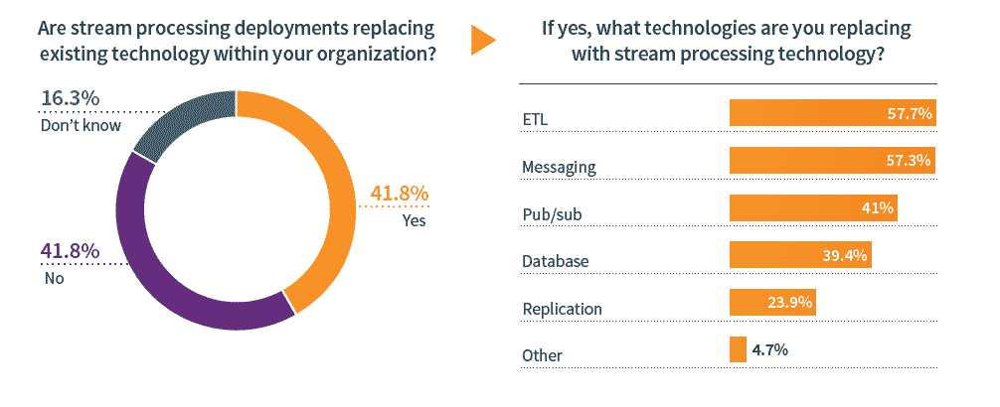

# 流处理可以取代 ETL 部署

> 原文：<https://thenewstack.io/stream-processing-could-replace-etl-deployments/>

为了纪念本周的 [Kafka 峰会](https://kafka-summit.org/events/kafka-summit-san-francisco-2019/)，我们与[分享一些基于我们今年早些时候对 800 名 it 专业人员使用数据流处理的调查](https://thenewstack.io/concern-about-state-lessens-as-more-applications-use-stream-processing/)的见解。当被问及 Apache Kafka 时，48%有流数据用例的受访者在生产中使用 Kafka。但是，Kafka 经常与其他流处理技术结合使用。

调查发现，42%的流处理用户认为部署正在取代他们组织内的现有技术。这没有考虑到那些东西流处理只是补充他们现有的堆栈。

提取、转换和加载(ETL)和消息传递是最有可能被取代的技术类型。相信流处理正在取代数据库的组织更有可能使用 MySQL 和 Hadoop 作为流处理的数据源。这些技术都不是为快速处理流数据用例所涉及的数据量而设计的。因为这些是开源数据存储，人们可能认为用另一个开源产品替换它们更容易。相比之下，其他数据存储不太可能受到 Kafka 的威胁，因为它们似乎合作得很好。例如，39%的人使用 Cassandra 进行流处理用例，而在这个群体中，69%的人使用 Kafka 进行流处理。

<svg xmlns:xlink="http://www.w3.org/1999/xlink" viewBox="0 0 68 31" version="1.1"><title>Group</title> <desc>Created with Sketch.</desc></svg>