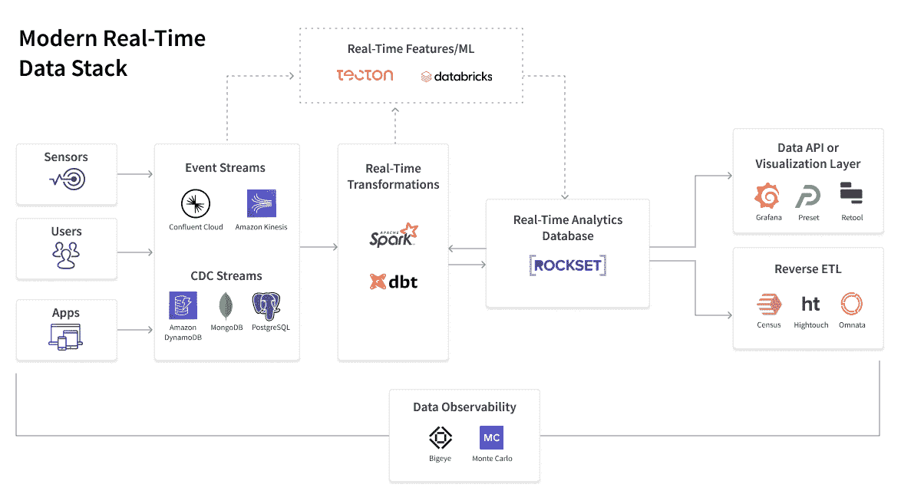

# 流数据和现代实时数据堆栈

> 原文：<https://thenewstack.io/streaming-data-and-the-modern-real-time-data-stack/>

[Shruti Bhat](https://www.linkedin.com/in/shrutibhat)

[Shruti 是 Rockset 的首席产品官和营销高级副总裁。在加入 Rockset 之前，她负责 Oracle Cloud 的产品管理，专注于人工智能、物联网和区块链，并担任 Ravello Systems 的营销副总裁，推动该初创公司从发布前的快速增长到数百名客户并成功收购。在此之前，她负责启动 VMware 的 vSAN，并领导过惠普和 IBM 的工程团队。](https://www.linkedin.com/in/shrutibhat)

现代数据堆栈出现在十年前，是对大数据缺点的直接回应。承担大数据项目的公司一头扎进了管理复杂的内部数据堆栈的高成本、 [僵化和复杂性](https://mattturck.com/big-data-landscape/) 。将他们的大数据环境提升并转移到云中只会让事情变得更加复杂。

现代数据栈推出了一套云原生数据解决方案，如用于数据摄取的 Fivetran、 [Snowflake](https://www.snowflake.com/?utm_content=inline-mention) 、 [Amazon Web Services](https://aws.amazon.com/?utm_content=inline-mention) 、用于数据仓库的 Redshift 或 Google BigQuery，以及用于数据可视化的 Looker 或 Mode。这意味着简单性、可扩展性和更低的运营成本。采用现代数据堆栈的公司获得了回报，即能够利用更大的数据集做出更明智的决策。

现代数据堆栈已经存在了 10 多年，创新的时机已经成熟。不可避免的下一阶段？直接向用户提供实时见解，即现代实时数据堆栈。在本文中，我们将讨论这一体系中需要云原生和 SQL 功能的层，并确定每一层中的最佳云数据产品:

1.  **用于摄取的事件和变更数据捕获流:**融合云，Amazon Kinesis
2.  **用于实时转换的实时 ETL(或 ELT):**DBT，亚马逊 Glue
3.  **实时分析数据库，用于快速分析新数据:** Rockset
4.  **数据 API 或可视化层:**修图，Grafana，预置
5.  **反向 ETL，用于将洞察力推向业务应用:** Census，Hightouch，Omnata
6.  **确保大规模数据质量的数据可观测性:** Bigeye，蒙特卡罗

## 但是为什么是现在？

还记得你在网上购物，过了一个星期你的包裹才到达，而你对此并不介意吗？我现在希望在信用卡付款后几分钟内就能收到我的发货确认，并且能够在发货离开仓库后立即跟踪我的两天交货。我希望我的 Grubhub 晚餐外卖和我的优步皮卡也是如此。

实时行动不仅仅会让人上瘾，它正在成为我们在消费者和商业生活中的基本期望。以我友好的邻居咖啡店为例——你知道的。员工使用老式 ERP 系统重新订购供应品的日子已经一去不复返了。不，现在所有的咖啡豆、杯子和糕点都通过一个全自动系统不断地被跟踪和重新订购，一旦它们被记录下来，就从收银机中获取销售数据。在其封面故事《实时革命》(2021 年 10 月 23 日版)中，《经济学人》认为:

“随着信息质量和及时性的转变，世界正处于经济实时革命的边缘。从亚马逊到网飞的大公司已经在使用即时数据来监控食品杂货的运送，以及有多少人迷上了“鱿鱼游戏”疫情引导各国政府和央行进行实验，从监控餐厅预订到跟踪信用卡支付。结果仍然是初步的，但随着数字设备、传感器和快速支付变得无处不在，准确快速地观察经济的能力将会提高。这为更好的公共部门决策带来了希望，也诱惑着政府去干预。"

以下是实时数据渗透我们生活的一些其他方式:

*   **物流**:当你放下一个要运输的包裹时，智能投递箱中的传感器会将数据传送给运输公司，运输公司会检测哪个司机离你最近，并为他们重新安排路线，以便立即取货。每天，通过航空、铁路货运、海上运输和卡车运输，都会创建并实时跟踪数百万个工作单。
*   **健身排行榜**:每天 10000 步是个不错的目标，但我们大多数人需要更多的动力。健身公司[隆隆了解到](https://rockset.com/blog/case-study-rumbles-real-time-leaderboards-empower-users-to-lead-healthier/)。它的应用程序给用户硬币来计算步数。Rumble 还会实时更新排行榜，进行一场小小的友谊赛。
*   **欺诈检测**:时间是网络犯罪的关键。为了最大限度地降低风险，必须不断分析信用卡交易和登录模式等实时数据，以检测异常情况并迅速采取行动。
*   顾客个性化:网上购物者喜欢相关的产品推荐，但他们更喜欢打折和捆绑销售。为了实现这一点，电子零售商正在挖掘客户过去的购买记录、产品视图和大量实时信号，以创造客户更有可能购买的有针对性的优惠。

所有这些用例不仅需要实时数据，还需要一整套工具来即时接收、准备、分析和输出数据。进入现代*实时*数据堆栈，这是专为支持具有高并发性、高性能和高可靠性的实时分析而创建的新一波云解决方案，一切都不需要花费太多。

我简要解释了现代实时数据堆栈是如何发展到这一步的，以及让实时数据如此强大的一些用例。在本文中，我还将概述:

*   实时数据的五个独特技术特征是什么；
*   现代实时数据堆栈的四项技术要求是什么；
*   您需要在现代实时数据堆栈中部署哪些关键解决方案。

**免责声明:**我工作的公司 [Rockset](https://rockset.com/) 提供实时分析数据库，  是现代实时数据堆栈中的一部分。

## 为什么现代数据栈不能处理实时数据

现代数据堆栈中的每一层都是为基于批处理的世界而构建的。数据摄取、转换、云数据仓库和商业智能(BI)工具  都是为每周或每月报告的世界而设计的，这些报告不再适用于实时世界。以下是实时数据的五个特征，面向批处理的现代数据堆栈在处理这些特征时会遇到一些基本问题:

1.  **大规模、经常是突发性的数据流**:对于点击流或传感器数据，数据量可能高得令人难以置信——每天数 TB 的数据——而且难以预测，迅速扩大和缩小。
2.  **变更数据捕获流**:现在可以连续捕获发生在 MongoDB 或 Amazon DynamoDB 等操作数据库中的变更。问题？许多数据仓库，包括一些最著名的云数据仓库，都是不可变的，这意味着数据不容易更新或重写。这使得数据仓库很难与运营数据库保持实时同步。
3.  **无序事件流**:对于实时流，数据可能会无序到达或被重新发送，从而导致重复。批处理堆栈不是为处理事件流的这种特性而构建的。
4.  **深度嵌套的 JSON 和动态模式**:实时数据流通常是原始的和半结构化的，比如以 JSON 文档的形式，有许多嵌套层次。此外，新的数据字段和列不断出现。这些可以轻易地打破批处理世界中僵化的数据管道。
5.  **目的地** : **数据应用和微服务**:实时数据流通常为分析或数据应用提供动力，而批处理系统则为静态仪表盘提供动力。这篇关于分析应用[剖析的精彩文章](https://towardsdatascience.com/the-analytical-application-stack-eead8ce6b70)将数据应用定义为面向终端用户的应用，其功能本身包含大规模的数据汇总分析。这是一个重要的转变，因为开发人员现在是最终用户，他们倾向于快速迭代和试验，同时要求比批处理系统更大的灵活性。

## 什么定义了现代*实时*数据堆栈？

实时 wave 以自然的方式扩展了现代数据堆栈的一些核心概念:

1.  **SQL 兼容性**:尽管 SQL 已经存在了近半个世纪，但它仍在不断创新。将 SQL 作为实时数据分析的标准是最经济实惠、最容易实现的选择。
2.  **云原生服务**:有云，就有云原生。对于数据工程团队来说，云原生服务在任何可用的情况下都是首选，为处理流动的实时数据源提供了更好的即时扩展，因此他们不必过度调配服务或担心停机。
3.  **低数据操作:**实时数据管道迫使从复杂的批量转换向简单的连续转换转变。如果您需要在接收任何数据之前进行大量的模式管理、数据的反规范化或 JSON 代码的扁平化，那么它既不是现代的，也不是实时的。
4.  **即时洞察:**搜索、汇总和连接来自不同来源的数据，实时检测异常情况，并在正确的用户使用其信息时向其发出警报(例如:Salesforce 或 Slack)的能力是这里的一项关键要求。
5.  **可负担性:**可负担性有两个维度:人力效率和资源效率。当今的现代实时数据解决方案直观且易于管理，只需更少的人力和计算即可实现大规模速度提升。

## 你的现代实时数据堆栈的关键层是什么？

我每天都与这一领域的客户和供应商交谈，以下是我对现代实时数据堆栈必备技术的看法:

1.  **事件和 CDC 流:**这是由对实时点击流和物联网传感器数据的兴趣所驱动的。最好的事件流解决方案是基于云的，易于管理且经济高效。[合流云](https://www.confluent.io/?utm_content=inline-mention)、[亚马逊 Kinesis](https://aws.amazon.com/kinesis/) 和谷歌 Pub/Sub 都符合这个要求。尤其是融合云，它提供了比 Apache Kafka 更低运营成本、更经济实惠的替代方案。CDC 流也在增加，因为公司将他们的实时分析系统从他们的核心运营数据库中分离出来。数据库和 CDC 技术也已经成熟，使得 CDC 流比过去更容易和更可靠。虽然一些 OLTP 数据库可以本机发布 CDC 流，但强大的工具也已经介入，以从数据库中卸载这种计算密集型工作。像 [Debezium](https://debezium.io/) 这样的工具可以将更新同步到分析数据库，并在五秒钟内准备好供查询。
2.  **实时 ETL(或 ELT)服务:**对于流数据，大多数公司会更喜欢提取、加载和传输(ELT)的灵活性。源数据保持完好无损，而转换可以根据需要在目标系统中重复进行。流行的开源流 ETL 解决方案包括 Spark 和 Flink，其中 [Amazon Glue](https://aws.amazon.com/glue/) 是 Apache Spark 的流行云部署。Apache Spark 也有 PySpark，这是一个使用 Python 转换流数据的易用工具。 [dbt Cloud](https://docs.getdbt.com/docs/dbt-cloud/cloud-overview) 是另一个基于 SQL 的 ELT 工具，虽然植根于批处理世界，但已经强大地进入了实时领域。也就是说，流式 ETL 已经走过了很长的路，内存中的流处理增强了它的功能。当您有大量数据集需要在接收到实时分析数据库之前进行重复数据删除和其他预处理时，这可能是正确的选择。
3.  **实时分析数据库:**Lynch pin 是一个专门为处理流数据而设计的分析数据库。这意味着它必须能够接收大量数据流，并在几秒钟内为查询做好准备。查询结果需要更快地返回，甚至是复杂的结果。并发查询的数量必须能够扩展，而不会产生减缓接收速度的争用。使用 SQL 提高效率并将接收和查询计算分开的数据库是一个关键的先决条件。更好的是一个实时分析数据库，可以在接收数据时执行汇总、搜索、聚合、连接和其他 SQL 操作。这些都是困难的需求，Rockset 就是这样一个云原生实时分析数据库。注意:有一个可选的实时机器学习(ML)管道，带有像 [Databricks](https://databricks.com/) 和 [Tecton](https://www.tecton.ai/) 这样的工具，这些工具有助于实时特征生成，并且可以很好地与作为服务层的实时分析数据库一起工作。
4.  **实时应用的数据 API 层:** BI 仪表盘和可视化很好地完成了工作。但它们价格昂贵，难以使用，并且需要数据分析师来监控它们的变化。因此，商业智能并没有让数据分析大众化。但是 API 网关将通过提供对最新数据的安全、简单、易于构建和快速的查询访问。这支持一类新的实时应用程序，例如用于网络安全、物流或欺诈检测的监控和跟踪应用程序，这些应用程序可以检测和分析异常情况，以最大限度地减少不必要的警报。或者实时推荐引擎和 ML 驱动的客户聊天系统，帮助个性化客户体验。或者数据可视化应用程序，使决策者能够实时探索数据，以制定有指导的宏观战略决策。我们对最初在脸书开发的基于 GraphQL 的 API 感到兴奋。还可以看看像 [Apache Superset](https://superset.apache.org/) 和 [Grafana](https://grafana.com/) 这样的工具来帮助你构建现代的实时数据可视化。
5.  **反向 ETL:** 使用像 [Census、](https://www.getcensus.com/) [Hightouch](https://hightouch.io/) 和 [Omnata](https://omnata.com/) 这样的反向 ETL 工具，您可以将实时洞察带回您的 SaaS 应用程序，如 Salesforce、Hubspot 和 Slack——无论您的用户住在哪里。这使您能够充分利用您的数据，减少数据孤岛的数量，并促进市场营销和销售活动、供应链管理和客户支持等数据密集型运营团队的发展。
6.  **数据可观察性:**有了实时数据堆栈，公司可以接收更多的数据，并几乎即时地对其进行处理。这意味着监控数据的健康状况并确保其确实可靠变得更加重要。监控数据新鲜度、数据模式和沿袭的能力增加了信任，因为应用程序比人类更关键，而不仅仅是人类开始消费数据。这个领域的领导者， [Bigeye](https://www.bigeye.com/) 和 [Monte Carlo](https://www.montecarlodata.com/) ，正在确保团队能够实时测量和提高他们数据的质量。

## 你的下一步行动

今天，一些公司拥有现代实时数据堆栈的一部分，如 Kafka 流。其他的只想一点一点升级。这没问题，但是请记住，如果您正在实时捕获数据，但是使用面向批处理的仓库来分析它，那么您的钱就没有得到应有的价值。使用正确的工具对于用最少的努力获得最好的结果是非常重要的，尤其是当现代实时数据堆栈如此经济实惠，投资回报率又如此之高的时候。

我很想听听您对实时数据和分析的看法！如果您想讨论现代实时数据堆栈，请在下面发表评论或[联系我](https://www.linkedin.com/in/shrutibhat/)。

<svg xmlns:xlink="http://www.w3.org/1999/xlink" viewBox="0 0 68 31" version="1.1"><title>Group</title> <desc>Created with Sketch.</desc></svg>