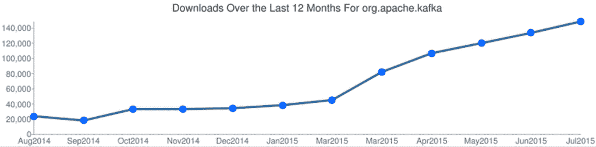
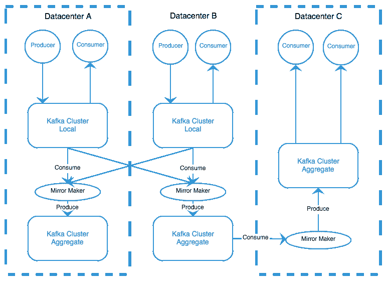

# LinkedIn 的数据流:Apache Kafka 每天发送 1.1 万亿条消息

> 原文：<https://thenewstack.io/streaming-data-at-linkedin-apache-kafka-reaches-1-1-trillion-messages-per-day/>

LinkedIn 部署的 Apache Kafka 已经超过了每天 1.1 万亿条消息，这是一个里程碑，也是互联网规模的服务如何改变企业级消息经纪人观点的又一个例子。

Apache Kafka 是一个低延迟的分布式消息传递系统。今年早些时候，LinkedIn 的 Navina Ramesh [为新的 Stack](https://thenewstack.io/apache-samza-linkedins-framework-for-stream-processing/) 写了关于 [Apache Samza](http://samza.incubator.apache.org/) 的文章，这是 LinkedIn 的流处理框架。她描述了早在 2006 年，LinkedIn 如何开始使用 Hadoop 进行批处理。她写道，与针对吞吐量进行优化的 Hadoop 不同，Kafka 针对低延迟消息传递进行了优化:

> 我们在卡夫卡的基础上建立了一个处理系统，允许我们对信息做出反应——加入、过滤和统计信息。新的处理系统 Apache Samza 解决了我们的批处理延迟问题，使我们能够近乎实时地处理数据。

## 阿帕奇·卡夫卡的起源

卡夫卡和萨马扎背后的故事也说明了[合流](http://www.confluent.io/)的根源，这是业内发展最快的创业公司之一。在昨天的一篇文章中，Confluent 的联合创始人 Neha Narkhede 写了她、Jay Kreps 和饶俊如何创造了现在的卡夫卡系统。在 Kafka 之前，LinkedIn 使用传统技术，这使得数据收集和研究变得困难。通过观察使用旧机器时出现的局限性，Narkhede、Rao 和 Kreps 能够建造 Kafka 来适应今天的技术需求。

今天，Kafka 被用于世界各地的数据中心，包括网飞的数据中心，在那里同步和访问全球数据的能力至关重要。Kafka 于 2010 年 7 月投产时，最初用于为用户活动数据供电。到 2011 年，Kafka 每天处理 10 亿条消息。随着时间的推移，Kafka 被用来捕获 LinkedIn 的所有数据。这从处理小变化开始，比如当用户更新他们的个人资料或添加工作联系时，最终发展到包括搜索图、LinkedIn 的 Hadoop 集群及其数据仓库等细分市场。

## 卡夫卡的未来

最终，Narkhede、Kreps 和 Rao 离开 LinkedIn，成立了合流公司。根据 Narkhede 在 Confluent 上的帖子，自从他们开始转型以来，Kafka 的下载量在去年增长了 7 倍。Confluent 为开发人员提供了一个分层的[订阅包](http://www.confluent.io/confluent_platform_-subscription_w_apache_kafka_support)来为企业级任务大规模部署 Kafka，尽管该项目本身是开源的。

【T2

LinkedIn 和 Confluent 都活跃在开源社区中，致力于长期支持和开发 Kafka。LinkedIn 对 Kafka 的使用远远超出了其创造者的预期，是其成立之初为公司提供大规模可靠利用数据能力的最大项目。

LinkedIn 最初的遗留平台不允许收集用户活动数据或日志数据，而这些数据对任何现代企业的长期成功都至关重要。自从实现了 Kafka，这些数据源就可以被收集、研究和分析。Kafka 使数据实时可用，允许轻松地进行流处理和分析。LinkedIn 继续开发 Kafka 以满足其需求，在原始 Kafka 库的基础上设置自定义库。了解用户如何在 LinkedIn 等平台上导航、消费、填充和管理内容至关重要。

运行 Kafka 作为标准消息代理的替代方案，允许企业处理他们的数据基础设施，重点关注可伸缩性和安全性。随着越来越多的应用程序转移到云中或使用容器，利用日志和用户数据对于长期留住用户至关重要。Kafka 是企业或小型企业管理其流数据的杰出选择。

专题图片:[南](https://www.flickr.com/photos/nanpalmero/)的[领英巧克力](https://www.flickr.com/photos/nanpalmero/4278432941)由 2.0 在 [CC 下授权。](https://creativecommons.org/licenses/by/2.0/)

<svg xmlns:xlink="http://www.w3.org/1999/xlink" viewBox="0 0 68 31" version="1.1"><title>Group</title> <desc>Created with Sketch.</desc></svg>