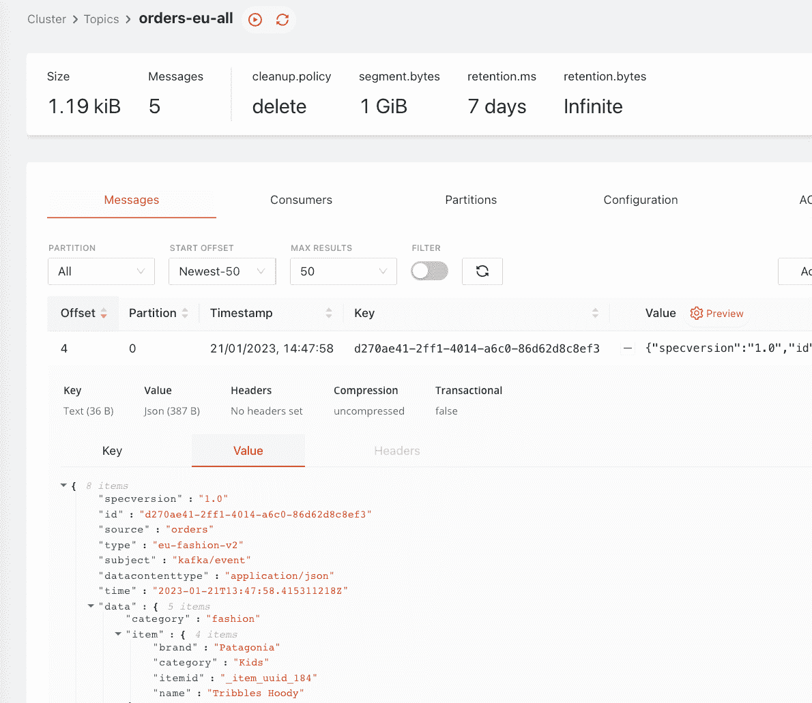

# 使用 Kafka 和 tmctl 简化事件管理

> 原文：<https://thenewstack.io/streamline-event-management-with-kafka-and-tmctl/>

支持事件驱动的应用程序开发人员的开发运维团队和平台工程师面临着从公共云提供商、消息传递系统或内部应用程序等来源捕获事件，并根据消费者的需求可靠地向其提供经过过滤和转换的事件的挑战。

在本帖中，我们将介绍一个解决方案，该方案使用 Kafka 和 TriggerMesh 的新命令行界面`tmctl`来集中和标准化事件，以便我们可以在将事件推送给下游消费者以方便消费之前，以统一的方式应用转换和过滤器。

所有示例[的源代码都可以在 GitHub](https://github.com/triggermesh/tutorials/tree/main/unify-event-sources) 上获得。

## 这个问题说明了

一家电子商务公司需要处理来自不同订单管理系统的订单。该公司的内部订单管理系统将订单写入 Kafka 主题，但其他随着时间的推移添加的订单工作方式不同:一个通过 HTTP 推送订单，另一个公开 REST API 以供调用，另一个将订单写入 AWS SQS 队列。订单结构因生产商而异，需要调整成形。对于所有生产商，订单都标有地区(欧盟、美国等。)和一个类别(电子、时尚等。)并以各种可能的组合进来。

应用程序开发人员的下游团队要求消费全球图书订单，以创建新的会员卡。一个独立的分析团队希望消费所有欧洲订单，以探索该地区的扩张机会。这些消费者中的每一个都希望从总体流中获得特定的事件，有时是特定的格式，他们都希望从专门的 Kafka 主题中获得这些事件。

你的任务是从四个订单管理系统中实时捕捉订单，将其标准化，过滤并交付给 Kafka 主题，专门用于每个消费者。


## 作为统一事件层的 TriggerMesh

我们将展示如何使用 [TriggerMesh](https://triggermesh.com/) 来接收订单、转换和路由它们，以便在 Kafka 主题上消费。还有其他工具可以解决这个问题，每种工具都有其独特之处。TriggerMesh 因其声明性接口和 [Kubernetes 原生部署](https://docs.triggermesh.io/installation/)而受到开发运维工程师的青睐。

典型的 TriggerMesh 配置由以下组件组成:

### **来源**

源是数据和事件的起源。这些可能是内部部署的，也可能是基于云的。示例包括来自应用程序或服务的消息队列、数据库、日志和事件。

所有来源都在[来源文件](https://docs.triggermesh.io/sources/awscloudwatch/)中列出并记录。

### **经纪人、触发器和过滤器**

TriggerMesh 提供了一个[代理](https://docs.triggermesh.io/brokers/),充当事件生产者和消费者之间的中介，将它们解耦，并提供交付保证，以确保在此过程中不会丢失任何事件。代理的行为就像一个事件总线，这意味着所有的事件作为一个组被缓冲在一起。

[触发器](https://docs.triggermesh.io/brokers/)用于确定哪些事件针对哪些目标。触发器附加到代理，并包含一个筛选器，该筛选器定义哪些事件应该触发触发器。过滤器表达式基于事件元数据或负载内容。如果触发器触发，它会将事件发送到触发器中定义的目标。你可以把触发器想象成基于推送的订阅。

### **转换**

转换是对事件的一组修改。示例包括用时间戳注释传入事件、删除字段或重新排列数据以适应预期的格式。TriggerMesh 提供了[几种变换事件](https://docs.triggermesh.io/transformation/)的方法。

### **目标**

目标是已处理事件或数据的目的地。示例包括数据库、消息队列、监控系统和云服务。所有目标都在[目标文件](https://docs.triggermesh.io/targets/alibabaoss/)中列出并记录。


## 设置环境

为了为这个例子提供 Kafka 主题，我将使用 [RedPanda](https://redpanda.com/) ，这是一个 Kafka 兼容的流数据平台，带有一个方便的控制台。我将在我的笔记本电脑上用 docker 提供的[合成文件](https://docs.redpanda.com/docs/platform/console/reference/docker-compose/)运行这两个程序，我已经为我的设置做了一点调整。你可以使用任何你喜欢的 Kafka 发行版。

默认情况下，控制台在 [http://localhost:8080/](http://localhost:8080/) 变为可用。


我们将使用`tmctl`，TriggerMesh 的新命令行界面，让您可以在装有 Docker 的笔记本电脑上轻松构建事件流。为了安装它，家酿为我做了工作:

`brew install triggermesh/cli/tmctl`

还有其他安装选项[可用](https://docs.triggermesh.io/get-started/quickstart/)。

## 摄取来自卡夫卡的订单

我们将首先创建一个代理，这是我们将要构建的事件流的核心组件。它是一个轻量级的事件总线，提供至少一次的交付保证和称为触发器(及其过滤器)的发布/订阅样式的订阅。

`tmctl create broker triggermesh`

现在，我们将使用 Kafka 源组件将订单流接收到我们的代理中:

`tmctl create source kafka --topic orders --bootstrapServers <url> --groupID mygroup`。

在一个单独的终端中，我将使用命令`tmctl watch`开始观察 TriggerMesh 代理上的事件。

我们现在可以使用 RedPanda 控制台向`orders`主题发送一个事件:


如果我们查看运行`watch`命令的终端，我们会看到事件显示在那里，这意味着事件已经被代理接收。注意事件是如何被包装在基于 [CloudEvents](https://cloudevents.io/) 规范的标准信封中的。我们稍后会看到如何利用这个信封。


## 将事件转换并发送到正确的主题

我们想要将全球图书订单路由到`orders-global-books`主题，并将所有类别的所有欧盟订单路由到`orders-eu-all`主题。在我们这样做之前，我们需要将区域和类别从事件有效负载中提取到事件头中([cloud events](https://cloudevents.io/)[attributes](https://github.com/cloudevents/spec/blob/main/cloudevents/spec.md#context-attributes)具体来说)，以便我们稍后可以使用[触发过滤器](https://docs.triggermesh.io/brokers/triggers/)过滤这些头。

为此，我们将使用 TriggerMesh [JSON 转换](https://docs.triggermesh.io/transformation/jsontransformation/)，它提供了一种修改 JSON 事件的有效负载和元数据的低代码方法。这里我们将有效载荷中的值`region`和`category`存储为变量(代码的后半部分),并使用它们将事件类型属性修改为`$region-$category-v1`的形式。

```
context:
-  operation:  add
  paths:
  -  key:  type
    value:  $region-$category-v1
data:
-  operation:  store
  paths:
  -  key:  $region
    value:  region
  -  key:  $category
    value:  category

```

我给了事件类型一个版本，这样我们可以更容易地进行额外的转换，并在每个阶段改进版本。这将为消费者提供按照自己的步调从一个版本的事件迁移到另一个版本的可能性，并提供更大的灵活性来修改事件流，同时对其他组件的影响最小。

我们将把这个转换代码放在一个文件中，并创建一个引用它的新转换，以及一个将事件从原始的`order`主题(正如您在上面的`tmctl`表的第一个输出中看到的，它是`io.triggermesh.kafka.event`类型)路由到这个转换的触发器:

`tmctl create transformation --name transform-extract-region-category -f transformations/orders-add-region-category.yaml`。

`tmctl create trigger --eventTypes io.triggermesh.kafka.event --target transform-extract-region-category`

现在，如果我们将同一个事件发送到`orders`主题中，我们将看到两个事件出现在`tmctl watch`中:原始事件，后面是转换后的事件，后者应该如下所示:


注意，事件类型现在是`eu-fashion-v1`。这非常适合我们下一步要做的路由。

现在让我们创建一些 Kafka 目标，它们将为我们的应用程序开发人员和分析消费者向两个专用 Kafka 主题写入事件。

`tmctl create target kafka --name orders-global-books-target --topic orders-global-books --bootstrapServers <url>`

`tmctl create target kafka --name orders-eu-all-target --topic orders-eu-all --bootstrapServers <url>`

这些目标将为您创建必要的 Kafka 主题，正如您将在 RedPanda 控制台中看到的那样。然而，这些 Kafka 目标还没有做任何事情，因为我还没有将任何事件路由到它们。

让我们创建触发器，将事件发送到它们各自的 Kafka 目标，从而发送到它们各自的 Kafka 主题:
`tmctl create trigger --name global-books --eventTypes eu-books-v1,us-books-v1 --target orders-global-books-target`

`tmctl create trigger --name eu-all --eventTypes eu-fashion-v1,eu-books-v1,eu-electronics-v1,eu-groceries-v1,eu-pharma-v1 --target orders-eu-all-target`。

每个触发器都定义了应该触发触发器的事件类型，以及事件应该传递到的目标组件(这里是 Kafka 目标)。

如果我们现在再次发送原始事件，因为它的事件类型已经变成了`eu-fashion-v1`，它将被路由到`orders-eu-all`卡夫卡主题。我们可以在 RedPanda 控制台上看到它:


在任何给定的时刻，我们可以使用命令`tmctl describe`来查看我们已经创建的 TriggerMesh 组件、它们的状态和参数:


## 欧洲人需要一种特殊的格式

一位来自欧盟地区的总经理说，在欧洲，商品 id 的格式应该是`_item_uuid_184`的形式，而在美国，商品 id 是简单的数字，如`184`。啊，那些讨厌的欧洲人(我会知道)。

我们将添加一个新的 JSON 转换，它只转换`eu`区域的`itemid`值，并且它还将这些事件的版本提升到`v2`。

```
context:
-  operation:  add
  paths:
  -  key:  type
    value:  $region-$category-v2
data:
-  operation:  store
  paths:
  -  key:  $itemid
    value:  item.itemid
  -  key:  $region
    value:  region
  -  key:  $category
    value:  category
-  operation:  add
  paths:
  -  key:  item.itemid
    value:  _item_uuid_$itemid

```

因为版本 v1 和 v2 中的事件副本都将流经代理，所以 v1 的使用者可以不间断地继续，只要触发过滤器在 v1 最初进入代理时仍在监听 v1。

我们现在可以创建转换和触发器，该触发器将所有 v1 EU 订单路由到转换，以便它们可以转换为 v2 EU 订单。
`tmctl create transformation --name transform-eu-format -f transformations/orders-eu-format.yaml`

`tmctl create trigger --eventTypes eu-fashion-v1,eu-electronics-v1,eu-books-v1,eu-groceries-v1,eu-pharma-v1 --target transform-eu-format`

我们还将更新 EU 目标的触发器，以过滤 v2 事件，而不是 v1 事件。请注意，使用相同的名称或参数重新创建触发器(或任何其他组件)会导致更新。同样，在这种情况下，您可以决定暂时只将 v2 路由给一个消费者，然后再将其推广到其他尚未准备好 v2 的消费者，或者只是为了在出现问题时减小爆炸半径。

`tmctl create trigger --name eu-all --eventTypes eu-fashion-v2,eu-books-v2,eu-electronics-v2,eu-groceries-v2,eu-pharma-v2 --target orders-eu-all-target`

如果我们将相同的原始事件发送到`orders`主题中，我们现在会看到转换后的 v2 事件出现在`orders-eu-all`主题中。



我们现在有了贯穿卡夫卡主题的事件和一些适当的转换，如下图所示。


接下来，我们来添加一些新的订单来源。

## 整合通过 HTTP 推送的订单

我们需要集成的下一个订单管理系统是通过 HTTP 推送订单。因此，为了能够将这些内容接收到 TriggerMesh 中，我们将创建一个 webhook 源来公开一个 HTTP 端点:

`tmctl create source webhook --name orders-webhook --eventType orders-legacy`

我给来自这个 webhook 的订单赋予了`orders-legacy`类型，因为它们没有按照最新的标准进行格式化。订单到达如下:

```
{
  "orderid":  11,
  "ordertime":  1497014121580,
  "region":  "us",
  "category":  "books",
  "itemid":  "331",
  "brand":  "Penguin",
  "itemcategory":  "Edutainment",
  "name":  "Bonnie Garmus - Lessons in Chemistry"
}

```

我们需要在这些事件到达 TriggerMesh 时对它们进行转换，之后它们将由我们已经创建的管道的其余部分进行处理:

```
context:
-  operation:  add
  paths:
  -  key:  type
    value:  io.triggermesh.kafka.event
data:
-  operation:  store
  paths:
  -  key:  $itemid
    value:  itemid
  -  key:  $brand
    value:  brand
  -  key:  $itemcategory
    value:  itemcategory
  -  key:  $name
    value:  name
-  operation:  add
  paths:
  -  key:  item.itemid
    value:  $itemid
  -  key:  item.brand
    value:  $brand
  -  key:  item.category
    value:  $itemcategory
  -  key:  item.name
    value:  $name
-  operation:  delete
  paths:
  -  key:  itemid
  -  key:  brand
  -  key:  itemcategory
  -  key:  name

```

我们在这里做了一点小技巧，将它们的事件类型设置为`io.triggermesh.kafka.event`，这样它们就可以被我们创建的第一个转换选中。

我们将创建转换组件，并将遗留订单传递给它，如下所示:
`tmctl create transformation --name transform-orders-webhook-legacy -f transformations/orders-webhook-legacy.yaml`

`tmctl create trigger --eventTypes orders-legacy --target transform-orders-webhook-legacy`

订单管理系统会通过 HTTP 将事件推送到 webhook，我们可以使用 curl 来模拟这个过程，如下所示:

`curl -X POST -H "Content-Type: application/json" -d @mock-events/webhook_raw.json <webhook URL>`

要获得 webhook 的 URL，您可以使用`tmctl describe`并找到 webhook 组件旁边的 URL`orders-webhook`。

## 集成由 HTTP 服务提供的订单

我们需要集成的下一个订单管理系统提供了一个 HTTP API，我们需要定期对其进行轮询以发现新事件。该服务还产生我们需要转换的遗留订单格式。

首先，我们将在本地启动一个模拟 HTTP 服务，在一个新的终端中模拟这个服务(需要 Python 3):

`python3 -m http.server 8000`

在我工作的目录中，文件`mock-events/legacy_event.json`中有一个示例遗留 json 事件，这个 HTTP 服务器可以提供服务。

现在，我们创建 HTTP 轮询器:
`tmctl create source httppoller --name orders-httppoller --method GET --endpoint http://host.docker.internal:8000/mock-events/http_poller_event.json --interval 10s --eventType orders-legacy`。

您可以根据您的环境调整端点。我用的是`host.docker.internal`，因为我在 Docker 桌面上运行。

这里的美妙之处在于，我们还将这些事件的类型设置为`order-legacy`。这意味着无需任何额外的工作，我们知道这些订单将由我们刚刚为 webhook 订单创建的管道来处理，这意味着它们将被重新格式化为新的标准，被转换以提取必要的元数据等。

您现在应该看到这些事件每 10 秒钟出现在 TriggerMesh 中，并被路由到`orders-global-books` Kafka 主题。

## 整合 SQS 队列中的订单

需要集成的最终订单管理系统通过 AWS SQS 队列提供订单。为了从队列中读取，我们可以使用 TriggerMesh 创建一个 SQS 源:

`tmctl create source awssqs --arn <queue-arn> --auth.credentials.accessKeyID <id> --auth.credentials.secretAccessKey <secret>`

现在，我将向 SQS 发送一个符合我们初始订单格式的事件:


惊喜！当我用`tmctl watch`查看进入 TriggerMesh 的事件时，我注意到订单数据被封装在许多 AWS 元数据中，其中一些如下所示:


因为我们不需要这些元数据，所以我们将提取 SQS 消息的主体，以便传入的事件与我们想要的模式相匹配。提取`Body`属性并将其设置为有效载荷的根是一个简单的例子。我们还将事件的类型设置为由 Kafka orders 源生成的类型，这样它就可以由管道中的同一组转换进行处理。

```
context:
-  operation:  add
  paths:
  -  key:  type
    value:  io.triggermesh.kafka.event
data:
-  operation:  store
  paths:
  -  key:  $payload
    value:  Body
  -  key:  $category
    value:  category
-  operation:  delete
  paths:
  -  key:
-  operation:  add
  paths:
  -  key:  
    value:  $payload

```

同样，我们将创建转换和向它发送事件的触发器:
`tmctl create transformation --name transform-sqs-orders -f transformations/orders-transform-sqs.yaml`

`tmctl create trigger --eventTypes com.amazon.sqs.message --target transform-sqs-orders`

## 这种方法的好处

我们刚刚创建了一个统一的事件层，可以接收、转换和过滤来自异构源的事件，并可靠地过滤和交付给不同的消费者。


*   **解耦:**事件生产者和消费者的解耦，这是这种事件驱动架构所固有的，使得随着需求的变化，拓扑结构的发展变得容易。在不影响其他生产者或消费者的情况下，很容易添加新的消费者，我们只需要创建一个新的触发器和目标。同样，我们可以轻松地添加新的订单管理系统，并转换它们以适应正确的模式。这提供了灵活性和可维护性。
*   **版本化:**通过使用类型元数据对我们的事件进行版本化，我们能够逐步推出变更，消费者可以以独立的速度采用新版本。
*   **集成:**该解决方案允许您集成异构的事件生产者和消费者，而不会强加约束，如他们必须嵌入的模式或 SDK。
*   **推还是拉:**卡夫卡和 TriggerMesh 的结合给了我们一个消息交换模式和保证的有趣组合。在我们的例子中，事件消费者将从 Kafka 提取事件。但是，如果我们愿意，我们可以使用其他 TriggerMesh 目标组件(如 CloudEvents 目标)将事件直接推送给消费者。
*   **短内循环:** `tmctl`使创建事件流的过程具有交互性和迭代性。您可以立即看到结果并进行调整。
*   **转换到 K8s 上的声明性:**当您准备好转移到更具声明性的工作流时，您可以`tmctl dump`将您的配置作为 Kubernetes 清单，然后您可以将它应用到任何安装了 TriggerMesh 的集群上。
*   **多云开源:**本教程使用的组件是 Apache 2.0 (TriggerMesh)和 source-available (RedPanda)。它们与云无关，可以在你需要的任何地方运行。

如果你想自己尝试一下，你可以前往本例的 [GitHub repo](https://github.com/triggermesh/tutorials/tree/main/unify-event-sources) 或者尝试通过快速入门指南开始[自己创造一些东西。](https://docs.triggermesh.io/get-started/quickstart/)

<svg xmlns:xlink="http://www.w3.org/1999/xlink" viewBox="0 0 68 31" version="1.1"><title>Group</title> <desc>Created with Sketch.</desc></svg>