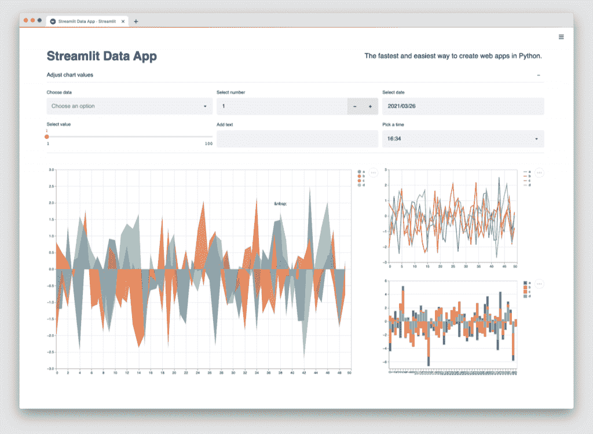
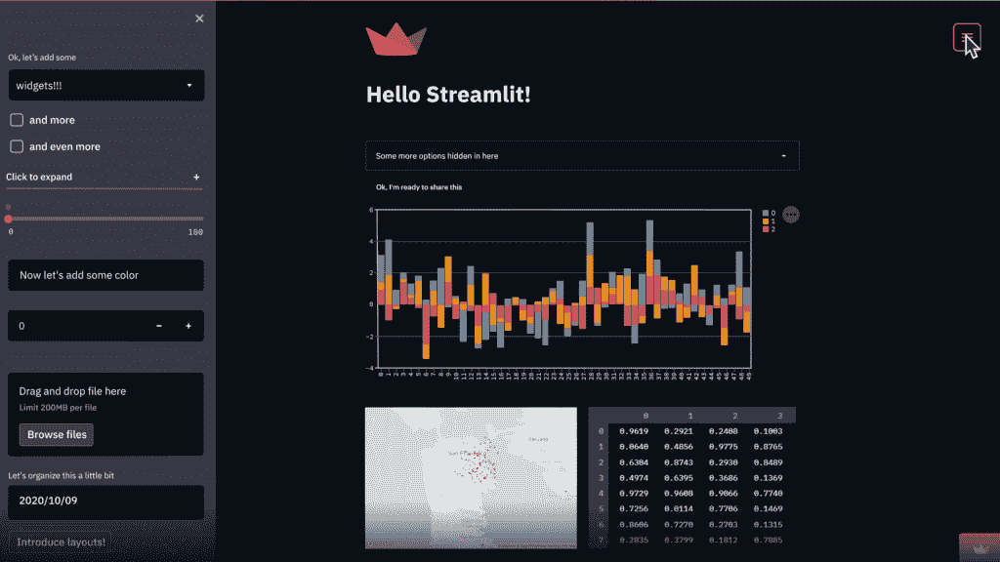

# Streamlit:数据科学团队的应用构建器

> 原文：<https://thenewstack.io/streamlit-an-app-builder-for-the-data-science-team/>

公司不仅在收集大量数据，还在收集地理数据和情绪分析等新型数据，这些数据不仅用于绘制过去，还可以通过机器学习来预测未来。

然而，公司还没有能够充分利用他们拥有的数据，因为在内部共享数据需要花费太多的时间和人力资源来构建充分利用数据的应用程序。

进入 [Streamlit](https://streamlit.io/) ，这是一个开源框架，使数据科学家可以轻松快速地构建 web 应用程序，以访问和探索机器学习模型、高级算法和复杂的数据类型。

Streamlit 的联合创始人兼首席执行官 [Adrien Treuille](https://www.linkedin.com/in/adrien-treuille-52215718/) 说:“现在出现了一种全新的商业智能问题，这种问题在五年前并不存在，使用 Tableau 或微软 Power BI 的传统方式只是说，‘让我们建立一个仪表板，让我们建立一些图表，并用图表显示这些数据’在这个世界上已经不再适用了。

他和联合创始人阿曼达·凯利和[蒂亚戈·特谢拉](https://www.linkedin.com/in/thiagotdotcom)于 2013 年在创新实验室 Google X 工作时相遇。

他们从这个问题开始:如果我们能让构建工具像编写 Python 脚本一样简单，会怎么样？

他们希望数据科学家和机器学习工程师能够构建应用程序，让他们能够与[数据](https://thenewstack.io/category/data/)进行交互，而不必召集工具团队或管理后端数据工程任务。

今天，这家总部位于旧金山的公司在 2019 年开源了这项技术，拥有超过 16，000 名 GitHub 明星和一个由全球超过 30，000 名开发者组成的社区。它被德尔塔牙科，卡特彼勒，7-11，优步，福特和辉瑞这样的公司使用。

> Streamlit 从一个问题开始:如果我们能让构建工具像编写 Python 脚本一样简单，会怎么样？

“在 Streamlit 中构建一个小型 web 应用程序所花费的时间是使用传统应用程序构建方法所花费时间的 10%。Streamlit 对不懂 JavaScript 的数据科学家来说是一个更大的胜利，因为 Streamlit 让他们可以用 Python 构建一切，”前谷歌数据科学家 [Dan Becker](https://www.linkedin.com/in/dansbecker/) 说，他是 Kaggle Learn and Decision.ai 的创始人，现任 DataRobot 的产品和决策智能副总裁。

“过去，我必须管理前端代码、后端代码以及它们之间的通信。使用 Streamlit，我可以指定我希望页面如何在 Python 中工作，它会处理好一切。默认情况下页面看起来很漂亮，省去了我写 CSS 的麻烦。Streamlit 非常容易学习。只需 10 分钟左右，你就能学到足够多的东西，从而变得富有成效。”

## 现有工作流程的一部分

这个想法不是建立一个一刀切的工具，而是创造类似乐高的功能，让用户创造自己的方式来理解他们的数据。这可能意味着用不同的变量构建滑块，或者将数据的子集提取到侧边栏中，以不同的方式查看它。

这些应用程序是由几行 Python 代码编写的数据的可视化，这些代码是数据科学家现有工作流程的主体。React 是用于在屏幕上呈现数据的前端框架。

Streamlit 将小部件视为变量。每次交互只是从头到尾重新运行脚本。

它只下载一次数据，使用缓存原语作为持久、不可变的数据存储，使应用程序能够安全地重用信息。这消除了冗余的数据获取和计算。

该产品直接从私有 Git repos 部署应用程序，并在提交时即时更新。

它集成了数据科学中常用的 Python 库，如 NumPy、Pandas、Matplotlib、Scikit-learn 等。

“在我看来，Streamlit 是迄今为止将有趣的分析、机器学习模型或聪明的可视化转化为数据产品的最快方法，你可以轻松地在网上向其他人展示，”脸书大学的数据科学家[泰勒·理查兹](http://www.tylerjrichards.com/)说，他也在 Streamlit 上写了一本[书](https://www.amazon.com/Getting-Started-Streamlit-Data-Science/dp/180056550X/ref=sr_1_2?keywords=Streamlit&qid=1638222613&sr=8-2)。

“当我在工作或个人项目中取得令人惊叹的结果时，我总是会遇到这个问题，我不得不将它简化为可以轻松粘贴到仪表板或 Word 文档中的东西(静态图表或我的模型的一些基本性能统计数据)，或者花费大量时间创建一个定制的 Flask/Django 应用程序。Streamlit 是这两个世界中最好的，因为我可以直接从我已经创建的 Python 脚本创建一个功能完整的 web 应用程序，并使用他们的工具轻松托管它。”

## 几个小时，不是几周

作为卡内基梅隆大学的教授和自动驾驶汽车初创公司 Zoox 的副总裁，Treuille 总结了他与学生在机器学习项目上合作的经验。

他说，使用 Streamlit，以前需要几周时间的项目可以在几个小时内完成。

“[数据科学]团队面临着公司从未见过的独特挑战，特别是当涉及到我们如何大规模地提供我们正在产生的见解，以便营销团队可以直接受益于我们建立的预测未来的模型，或者产品团队可以自己浏览以传统方式过滤的所有地理数据，然后跳进去，查看应用于这个或那个国家的情感分析，”他说。

“因此，这些都是数据科学家和机器学习工程师非常擅长解决的下一代挑战，但尚未在公司内得到更广泛的系统分享。”

该公司建立在开源技术的基础上，为数据科学家和他们的客户增加了企业级数据安全性和身份验证以及协作功能。

“实际上，在一个下午的时间里，在你已经在做的工作中，你可以从主要为你自己做的分析……变成可以与其他人互动和分享的东西，”凯利说。

“我们一直有人告诉我们，‘如果我必须用 Flask 这样的不同语言来写，这将会有 10，000 行代码，实际上有 100 行代码(在 Streamlit 中)。”或者‘这花了另一个团队三个半月的时间来建立；我在六个小时内复制了完全相同的东西。"

## 1.0 中的新功能

虽然 Streamlit 可以部署在任何地方，但该公司最近宣布了 Streamlit Cloud 来处理容器、认证、扩展、安全等问题。

该公司的物理基础设施由谷歌云平台(GCP)托管和管理，利用了其内置的安全、隐私和冗余功能。

用户的[权限级别](https://docs.streamlit.io/streamlit-cloud/trust-and-security)是在 GitHub 中分配的。对特定应用程序具有写权限的员工可以进行更改，但只有具有管理员权限的员工可以部署或删除应用程序。

这项技术最近达到了 1.0 的里程碑。

“我们基本上花了 2020 年的所有时间，以及 2021 年的大部分时间，既增加了这些功能，又加强了这些功能，确保我们真的在与社区一起测试，真的弄清楚并说，‘这不仅是开发和构建应用程序的最快方法，而且是在原语和易用性方面做到这一点的最佳方法，’”凯利说。

这些新功能包括:

*   通过利用 Apache Arrow 进行序列化和内存管理来提高缓存，从而提高速度和响应能力。
*   通过应用程序布局原语和主题提供更多定制，使用户能够匹配其公司品牌。
*   通过会话状态和表单添加状态，使用户能够创建更复杂的应用程序。
*   添加组件和集成，使用户能够编写自己的组件或引入 SpaCy、HiPlot 或 Folium 等库。新功能还包括发送和接收视频或在画布上绘图的能力。

它的路线图包括计划添加到它的小部件库，改善开发人员的体验，并使代码，组件和应用程序的共享更容易。

在[的一篇博文](https://crystaldatasy.medium.com/face-mask-detection-with-deep-learning-and-computer-vision-94a965806ab3)中，[黄尧晰](https://www.linkedin.com/in/crystal-huang-ds/)，自称是一名有抱负的数据科学家，描述了她的项目使用 Streamlit 通过深度学习算法将人脸面具检测应用于照片。

Streamlit 已经筹集了 6200 万美元，最近一轮 3500 万美元的 B 轮融资于 4 月份宣布，来自红杉资本和之前的投资者 Gradient Ventures 和 GGV 资本。

<svg xmlns:xlink="http://www.w3.org/1999/xlink" viewBox="0 0 68 31" version="1.1"><title>Group</title> <desc>Created with Sketch.</desc></svg>