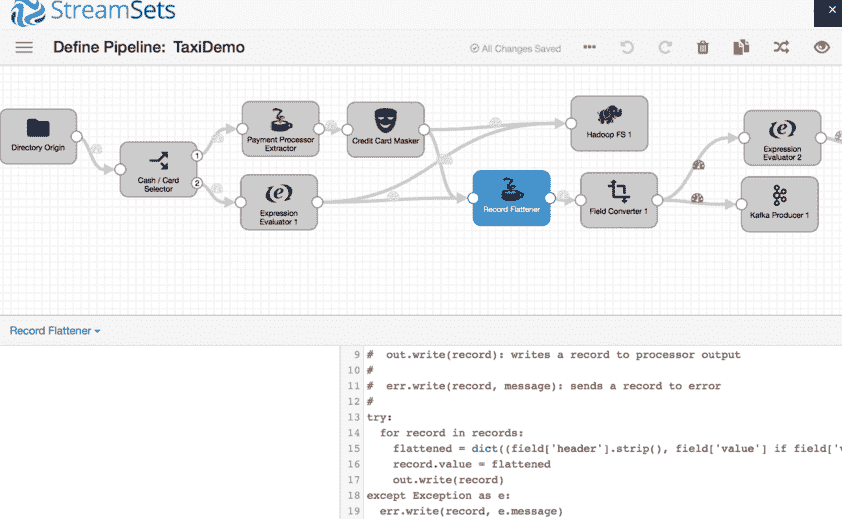
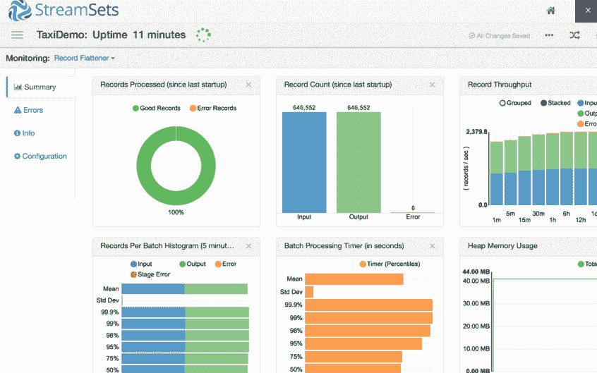

# 流集平滑了大数据的流动

> 原文：<https://thenewstack.io/streamsets-helps-smooth-flow-big-data/>

当使用当今的技术时，在大数据中工作会带来许多难题。随着时间的推移，数据源会发生变化，当使用不太理想的工具或第三方系统时，这不仅会导致代码中断，还会导致服务中断和其他麻烦的问题。StreamSets 是一家旨在解决他们所谓的“数据漂移”的公司，允许当今世界的编码人员诊断这些中断，允许开发人员更好地响应和修复发生的中断。

## 从源头收集数据

StreamSets 为开发人员和数据工程师提供的第一道防线是 [StreamSets 数据收集器](http://streamsets.com/documentation/datacollector/1.1.3/help/)产品。该工具允许开发人员在其基础设施上覆盖一个可视化 UI，然后他们可以使用该 UI 将数据源连接到目的地。这允许更灵敏、更灵活的各种转换，以便在数据移动时清理数据。

StreamSets 联合创始人兼首席执行官 Girish Pancha 表示:“它可以抵抗数据漂移，因为它不依赖于模式，并使用标准记录格式来提供对数据流的完全可见性。

流集数据管道

减少手工编码对于提高数据工程师的生活质量至关重要，这样可以减少花费在定制代码的主动维护上的时间。通过将定制编码从过程中去除，StreamSets 简化了那些大量使用 Kafka 和 Flume 等大规模数据处理工具的人的生活。它在大数据领域迅速成名，尤其是在思科。

“思科使用 StreamSets 作为他们的 [InterCloud](http://www.cisco.com/c/en/us/products/cloud-systems-management/intercloud-fabric/index.html) 产品的一部分。他们重视我们自动处理基础设施变化的能力，以及对其内部运营日志和多数据中心数据接收日志进行智能监控和动态调整的能力，”Pancha 说。

数据不准确是没有用的。StreamSets 为用户提供了自省输入流数据的能力，让他们有机会测试任何异常情况。如果数据开始漂移或返回错误，StreamSets 将向用户提供早期警告。

StreamSets 运行在用户现有的 [Hadoop](https://hadoop.apache.org/) 集群之上，与 [YARN](https://hadoop.apache.org/docs/current/hadoop-yarn/hadoop-yarn-site/YARN.html) 和 [Mesos](http://mesos.apache.org/) 一起确保企业级调度和可扩展性。它还可以部署在产生数据的位置，以优化带宽使用和数据移动，在内存中运行，从而最大限度地降低对系统性能的影响。

在其最新版本 1.1.3 中，StreamSets 宣布现在将允许用户在 [Cloudera](https://www.cloudera.com/) 中安装、管理和部署他们的 StreamSets 数据包和服务。

## 进入更精细的细节

流集可以部署在以独立模式运行的边缘节点上，也可以部署在支持流和批处理的集群模式下。除此之外，它还实现了一种标准的记录格式，这种格式为检测异常情况和转换进行了高度优化。StreamSets 已经实现了一个完全基于 REST API 开发的无状态前端，这允许它与各种其他基于云的产品无缝集成，如容器监控服务。

流集异常监测

部署流集就像利用拖放 UI 构建复杂的管道一样简单。Pancha 指出，开发人员还可以使用 Java 表达式语言和整个系统中可用的一系列数据操作函数来创建复杂的逻辑，以满足他们的特定需求。

StreamSets 系统还支持各种常见的脚本语言，比如 Python 和 JavaScript。然后，可以将它们插入用户 StreamSets 管道中的阶段，以便对数据进行自由形式的操作。如果有人想深入挖掘特定用例的流集，它有一个公共 API，允许开发人员创建自定义的特定于域的阶段，然后可以在整个管道中使用。

随着越来越多的企业继续依赖大数据，为用户提供收集、分析和监控这些信息的工具对于长期成功至关重要。

思科是新堆栈的赞助商。

在 CC0 许可下，通过 Pixabay 的特征图像。

<svg xmlns:xlink="http://www.w3.org/1999/xlink" viewBox="0 0 68 31" version="1.1"><title>Group</title> <desc>Created with Sketch.</desc></svg>