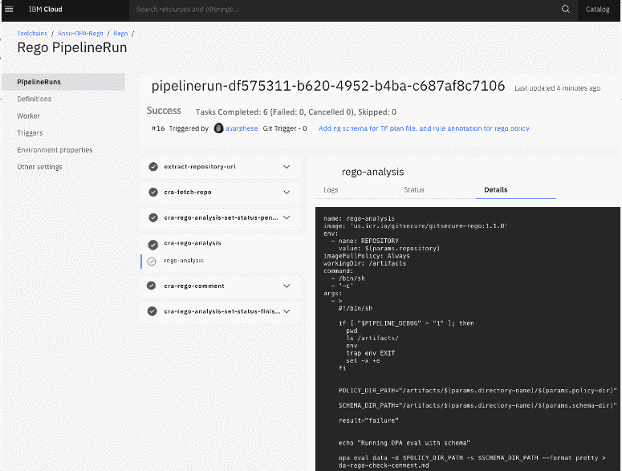
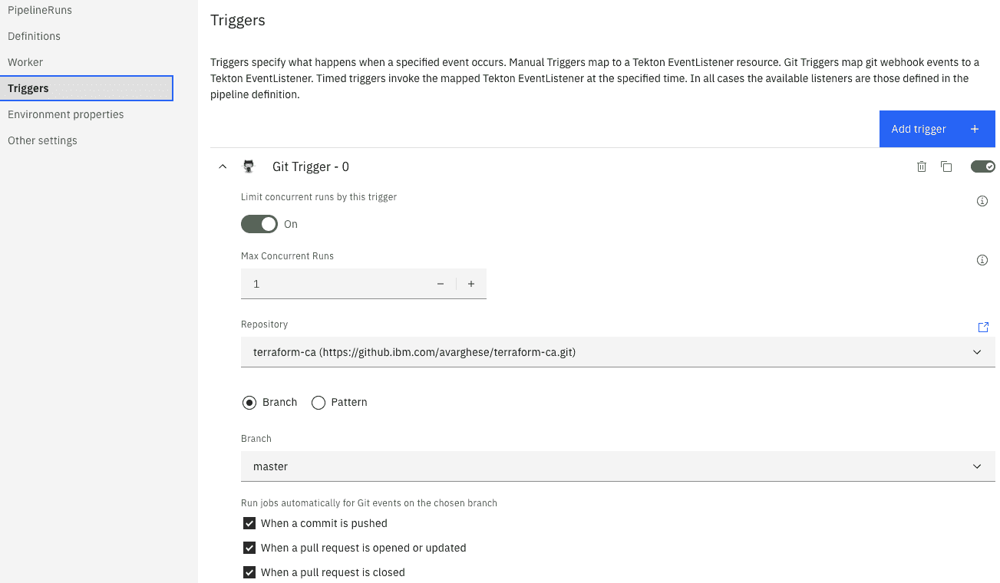
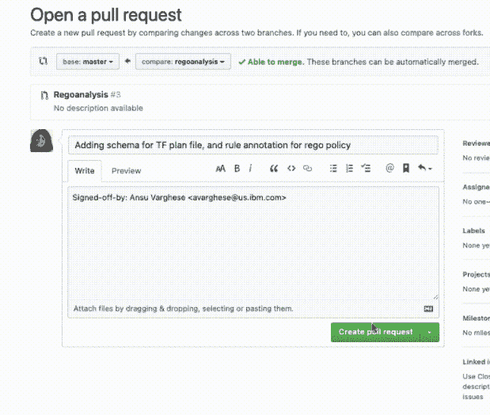
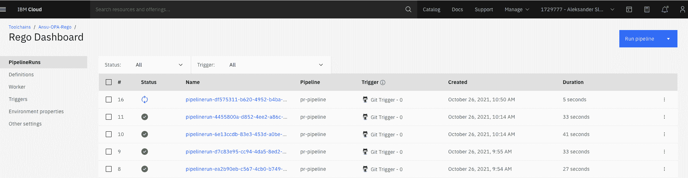
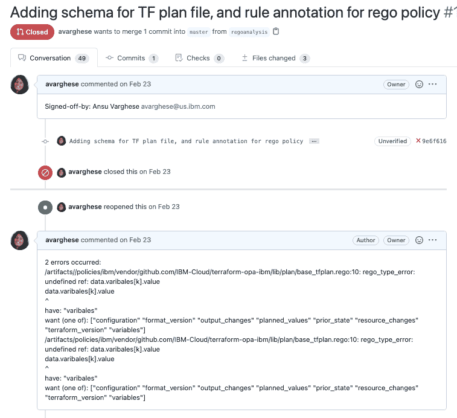

# 通过分析 CI/CD 管道中的减压阀来加强合规性

> 原文：<https://thenewstack.io/strengthen-compliance-by-analyzing-rego-in-ci-cd-pipelines/>

[](https://www.linkedin.com/in/ansuvarghese23/)

 [安苏·瓦格斯

安苏是 IBM T.J .沃森研究中心的研究软件工程师，目前致力于开发云原生应用的解决方案。](https://www.linkedin.com/in/ansuvarghese23/) [](https://www.linkedin.com/in/ansuvarghese23/)

[开放策略代理(OPA)](https://www.openpolicyagent.org/) 是一个开源引擎，用于指定跨云原生堆栈的合规性策略。OPA 项目包括对其减压阀类型检查器的最新增强[,该检查器在策略评估期间使用 JSON 模式作为输入，这实质上为正在编写的策略提供了一个蓝图。这允许使用信息性错误消息进行更直接的静态类型检查，让用户能够正确地编写策略。](https://github.com/open-policy-agent/opa/blob/main/CHANGELOG.md#0280)

新的增强是通过`opa eval`命令和一个新的模式参数(–schema/-s)实现的，包括输入和数据的模式。[之前的](https://blog.openpolicyagent.org/enhanced-type-checking-for-opa-with-json-schema-annotations-826acb0f575) [博客](https://blog.openpolicyagent.org/type-checking-your-rego-policies-with-json-schema-in-opa-5f7ac4c8a958) [帖子](https://thenewstack.io/json-schema-keywords-allof-and-anyof-in-opa-type-checker/)向 OPA 用户社区介绍了带有模式的静态类型检查器，使用了各种示例，这些示例可以在纯粹的开发环境(如 IDE 或终端)中作为单独的策略运行。

在这篇博客中，我们展示了如何将 OPA 类型检查器与模式一起用于[持续集成/持续交付(CI/CD](https://www.redhat.com/en/topics/devops/what-is-ci-cd) )管道工作流。这为减压阀策略增加了一层漏洞检查，进而为类似生产环境中的组织强制实施关键资源和数据的合规性。

## 合规奖金

 [曼陀罗·瓦齐里

Mandana 是 IBM T.J. Watson 研究中心的首席科学家，从事编程语言和软件工程领域的工作。](https://www.linkedin.com/in/mandana-vaziri-1aa21331/) 

我们的目标不仅是在本地开发周期中提高减压阀程序员的生产力，而且通过为现有和新的 CICD 管道增加减压阀策略的类型检查阶段，为“左移”运动做出贡献。我们将进一步讨论如何在您自己的工作流中使用它。但首先，让我们从法规遵从性和安全性的角度来理解为什么这很重要。

组织通常拥有数百个(如果不是更多的话)减压阀策略来保护和监控对资源、数据等的访问。测试成批的减压阀程序需要具体的输入，这可能无法涵盖可能的行为范围。减压阀策略中的错误，即使是非常小的错误，也会导致不符合的配置无法被检测到。

DevSecOps 鼓励团队通过在管道中加入安全检查和关卡，从一开始就在应用程序中建立法规遵从性和安全性。一种这样的检查是将 OPA 的增强静态类型检查集成为 DevSecOps 过程中的流水线阶段，以分析大量的减压阀源代码来发现其中的错误。

## DevSecOps 管道中减压阀文件的批处理分析

现在，在软件世界中，DevSecOps 中的安全性和法规遵从性过程有一个“左移”的焦点。这包括在部署之前分析各种代码(应用程序代码、配置代码等)的方法，这有助于更快地发现安全问题，并保证供应商和用户的代码安全合规。

IBM 最近宣布了一款名为[代码风险分析器(CRA)](https://www.ibm.com/cloud/blog/announcements/find-source-code-vulnerabilities-with-code-risk-analyzer) 的新合规和监管软件，由[IBM Cloud Continuous Delivery](https://cloud.ibm.com/catalog/services/continuous-delivery?cm_sp=ibmdev-_-developer-blogs-_-cloudreg)提供。今天，CRA 提供了许多预建的 Tekton 任务和管道，可以对您的源代码和基础设施代码(如 Terraform 等)执行合规性检查。，可轻松整合到您的连续输送管道中。

这些交付工作流的输出既可以在您的 Git 存储库中使用，也可以在持续交付仪表板中使用。这一发展是重要的，因为它阻止了具有遵从漏洞的代码被部署，并且如果需要，它可以被手动或自动补救。

我们使用了 [IBM Toolchain](https://www.ibm.com/cloud/continuous-delivery) 和 [OpenShift Pipelines](https://cloud.redhat.com/learn/topics/ci-cd) 来执行我们的 GitHub 库上的许多预先构建的 CRA Tekton 任务和管道。然后，我们实现了一个类似的新 Tekton 任务(截图如下),通过批量分析运行 OPA 的增强型静态类型检查器，并将其添加到现有的 CRA 集合中。

例如，为了运行这个新管道，我们选择了一个 GitHub 存储库，其中包含数百个 Terraform 的减压阀源文件，并为许多被引用的输入文档生成了 JSON 模式。然后，通过`opa eval -s`命令对带有策略目录和相应模式目录的存储库进行批量分析，以暴露类型检查错误。

下面是当您将 CRA Tekton 任务/管道集成到您的 DevSecOps 流程中时，IBM Toolchain UI 向您显示的屏幕截图。注意`cra-rego-analysis`任务被列为整个管道中的一个阶段。



现在，让我们更深入地看看上面管道中运行的[新 CRA 泰克顿任务](https://gist.github.com/aavarghese/be5f365b68a33bab6455d0e57b8d51af):

该任务允许您为 rego 分析设置任何必要的环境变量和输入，例如关于正在分析的 GitHub 存储库的信息、策略目录的位置、repo 中的模式、访问令牌等。(以下截图)。args 部分包含要在策略上运行的命令。

IBM tool chain/open shift Pipelines 还允许您设置何时必须运行这些 CRA 任务/检查的触发器。例如，您可以为 GitHub pull 请求创建一个触发器到主分支中，每当有人在存储库中打开一个 pull 请求时，主分支就会运行一组指定的遵从阶段。(请参见下面打开拉请求如何触发管道运行您配置的 CRA 任务。)







然后，它评估在输入 GitHub 存储库中找到的所有减压阀策略文件的编译时错误。例如，假设您正在分析的 GitHub 库包含一个如下所示的[策略文件](https://gist.github.com/aavarghese/b6c13fd57b99411ae7ef7083536b0b04)，其中`variables`的拼写有误:

```
```
package ibmcloud.tfplan

import data as tfplan

# lists all the variables from variable section
# METADATA
# schemas: 
#   - data: schema.plan-schema
variables  =  vars{
    some  k
    vars  :=  {  k  :  v  |
        v  :=  tfplan.varibales[k].value
        true
    }
}
```

```

输入错误导致字段`variables`为空集，即使 tfplan 中存在已定义的变量，这也可能导致其他依赖策略做出不正确的决策。

一旦分析完成，管道会以可读格式向 GitHub pull 请求发布一条注释，并使用`success|failure`更新该任务的结果状态。该注释包括在分析过程中发现的任何错误，这些错误必须在合并拉请求之前进行检查。请参见下面的屏幕截图，了解 OPA 的静态类型检查器使用提供的模式评估策略时产生的减压阀错误。



类似的 CRA 预建的合规 Tekton 任务可以在这里找到:[https://github . com/open-tool chain/tek ton-catalog/tree/master/CRA](https://github.com/open-toolchain/tekton-catalog/tree/master/cra)

## OPA 中的束类型检查功能

此外，OPA 支持使用“bundle”子命令和 API 来评估策略和数据文件包。OPA 还增加了类似的上传 JSON 模式包的功能，用于执行批量策略的静态类型检查。这可以在您的 DevSecOps 工作流中使用，并且是评估您的策略文件并使它们准备好投入生产的增值收益。

点击此处了解更多关于使用带捆绑参数的 OPA 评估:[https://www.openpolicyagent.org/docs/latest/#2-try-opa-eval](https://www.openpolicyagent.org/docs/latest/#2-try-opa-eval)

在这里阅读更多关于使用 OPA bundle APIs 的信息:[https://www . openpolicyagent . org/docs/latest/management-bundles/](https://www.openpolicyagent.org/docs/latest/management-bundles/)

## 摘要

将 OPA 的带有 JSON 模式的静态类型检查添加到 CI/CD 管道中是遵从性领域中一个令人兴奋的进步。这为用户提供了一定程度的保证，即他们的软件在经过代码分析阶段以及暴露和修复任何可能的漏洞之后是安全的和符合规范的。

得益于 IBM Code Risk Analyzer 等工具和 IBM Toolchain 和 OpenShift Pipelines 等托管公共云产品，只需几行代码和几个按钮就可以添加新的法规遵从性任务。

<svg xmlns:xlink="http://www.w3.org/1999/xlink" viewBox="0 0 68 31" version="1.1"><title>Group</title> <desc>Created with Sketch.</desc></svg>