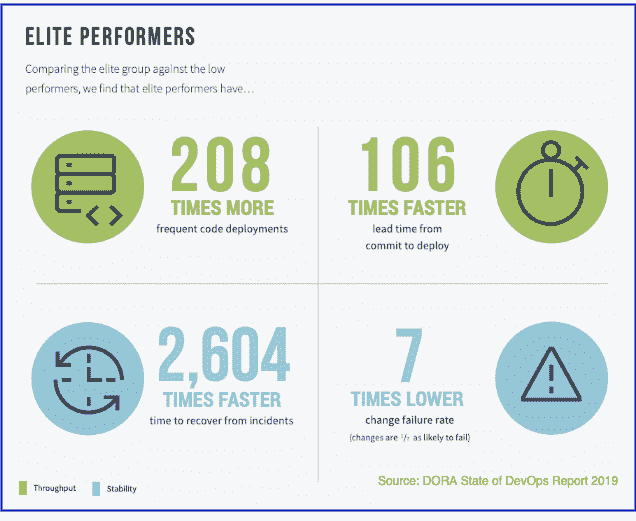
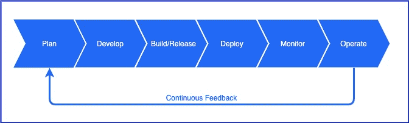
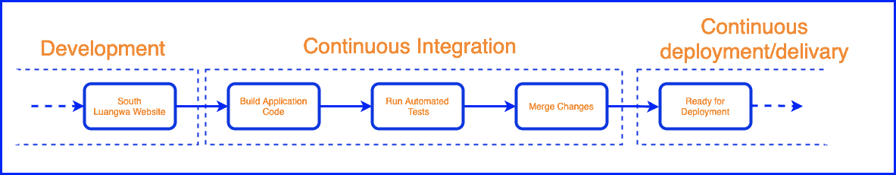

# 借助 CI 可观察性强化您的 DevOps 渠道

> 原文：<https://thenewstack.io/strengthening-your-devops-pipeline-with-ci-observability/>

从[加速 DevOps 2019 报告的状态](https://cloud.google.com/blog/products/devops-sre/the-2019-accelerate-state-of-devops-elite-performance-productivity-and-scaling)来看，众所周知，采用 DevOps 相关实践的团队和组织在产品开发方面更加成功。这是因为 DevOps 的目标是在保持稳定性的同时提高速度。因此，当有效地实践时，组织会获得很大的好处。例如，下面的图表说明了接受 DevOps 的人和在 DevOps 方面落后的人之间的发展差距。

我们还必须记住 [DevOps 实践](https://thenewstack.io/category/devops/)不是一套定义好的操作，而是一种值得追求的发展模式。因此，改变开发和实现所需工具和基础设施的文化是一个困难的过程。浪费所有这些努力可能会导致任何公司从进步的变革中退缩，注定要采用陈旧的开发实践，并最终导致缓慢和不合标准的产品开发。

 [萨尔吉尔·优素福

Sarjeel 是 Atlassian 的一名产品经理，负责引导 Atlassian 工具在其功能集中促进 DevOps 功能。](https://www.linkedin.com/in/syedsarj/) 

考虑到试图[改变当前开发实践](https://sdarchitect.blog/2019/03/06/adopting-devops-part-v-addressing-data-friction/)的技术债务，这一点更加尖锐。考虑到财务成本、所需时间和数据迁移需求，公司不愿意改变。因此，一旦我们开始采用 DevOps 相关的实践，我们确保我们建立一个坚实的核心或基础，在此基础上我们可以继续改进我们的开发实践，这被视为至关重要的。

但是，任何团队的 DevOps 管道都有一个漏洞，那就是有效 CI/CD 的失效。我们将在本文的后面部分详细阐述为什么这个阶段对于整个开发实践是至关重要的。那么为什么会这样呢？在考虑 DevOps 时，确立 CI/CD 阶段的重要性是我们将在本文中探讨的内容。我们还将考虑将管道与该漏洞隔离所需的文化和工具补救措施。

## DevOps 的支柱

重申一下，DevOps 的[目标一直是提高速度，同时保持应用系统的稳定性和可用性。这在很大程度上是通过两个原则实现的。第一是打破孤岛，第二是自动化。各种 DevOps 工具、实践和文化都围绕着促进这两个原则。](https://youtu.be/K3VnleYz3uc?t=43)

例如，[监控和事件管理](https://www.thundra.io/whitepaper/monitoring-vs-observability)旨在让开发者了解他们的应用系统的状态，从而打破孤岛。类似地，与开发人员的 IDE 集成的自动化测试工具通过促进自动化来帮助提高速度。

然而，没有任何工具或实践像持续集成和持续交付这样重要。这是因为 CI/CD 阶段是开发周期中的关键时刻，在这个阶段“代码传统上是[被扔出围墙](https://blog.thundra.io/ebbs-and-flows-of-devops-debugging-part-1)”从以开发人员为中心的领域过渡到以运营人员为中心的领域。因此，我们看到了在这个阶段打破孤岛和自动化的潜力。

因此，CI/CD 成为 DevOps 的支柱，其中自动化测试和自动化部署形式的自动化包含在持续集成和持续交付的领域中。失败或薄弱的 CI/CD 意味着将代码投入生产可能[非常缓慢](https://blog.thundra.io/why-a-ci/cd-pipeline-makes-good-business-sense)，甚至可能[增加事故](https://blog.thundra.io/why-a-ci/cd-pipeline-makes-good-business-sense)和中断的可能性，因为 CI/CD 阶段未能捕获有问题的代码。DevOps 管道中薄弱的 CI/CD 实践会直接影响速度和稳定性。

不幸的是，这个阶段也是脆弱的阶段。这是因为当经历 CI 和 CD 过程时，问题可能会出现，事情可能会以测试失败或管道执行失败的形式失败。一个在开发人员中越来越成为问题的例子是[古怪的测试](https://blog.thundra.io/fixing-flaky-tests-the-fast-lane-to-success)。这是指在 CI 阶段运行的一些测试在代码没有任何实际变化的情况下随机成功或失败。

片状测试现象背后的原因通常是模糊的。很多时候，我们不知道测试失败的原因，忽略测试并忽略警告信号以继续部署是常见的做法。这绝对是一个滑坡，因为我们并不总是知道测试失败的原因。它开始降低我们在 CI 流程中的信任度。可以看出，我们真的让自己陷入了“狼来了”的境地。

## 用可观察性加强主干

考虑到 CI 对 DevOps 渠道的重要性，我们必须加强它。为了理解这意味着什么，让我们提醒自己在 CI 阶段实际发生了什么。

CI 通过提供版本控制系统和工件存储库，允许单一的事实来源。在这个阶段，我们管理合并以及对源代码的[主干分支](https://www.linkedin.com/pulse/trunk-based-development-single-source-truth-code-ci-ashok-kumar-n)的相关提交。正是这些源代码被打包并发送出去进行部署。实际上，在它被发送到部署之前，CI 还执行[必要的测试](https://www.cloudbees.com/continuous-delivery/continuous-integration)，其中一些测试可能会导致不稳定的测试，如前一节所述。

可以看出，在这个阶段有许多步骤，每个步骤都对整个系统的成功起着关键作用。因此，在经历发展旅程的这一阶段时，我们绝不能被蒙在鼓里。这就是可观察性的用武之地，通过提供对 CI 服务器当前阶段的正确洞察。

可观察性和监控并不是新概念，事实上，是 DevOps 管道的重要组成部分。然而，它们传统上被认为是 Ops 领域。正如你所注意到的，在整篇文章中，我们一直在开发故事和 DevOps 管道中区分开发域和操作域。当然，这与 DevOps 的哲学不是一个好兆头，devo PS 的哲学旨在打破所有的筒仓，用更狂热的术语来说，甚至是领域的划分。

因此，可以预期，最初用于理解生产中应用程序状态的可观察性和监控，现在将用于理解版本化和测试的状态。通过跟踪各种度量，比如质量和基于时间的度量，同时在测试和调试场景中利用度量跟踪和日志，我们可以有效地摆脱传统 CI 的困境。

因此，根据这些指标，我们实际上可以列出主要优势:

*   在 CI/CD 阶段，通过提供实际状态和理解的指标，在团队之间建立信任。
*   为解决失败和不可靠的测试提供至关重要的见解。
*   由于提供了额外的“调试”层，降低了生产中事故和中断的风险。
*   在 CI/CD 阶段和整个 DevOps 管道中建立弹性

总的来说，通过利用可观察性修复 CI/CD 领域的漏洞，我们有效地加强了 DevOps 管道的主干。有了 CI 可观察性，我们看到在整个开发生命周期中理解我们的应用程序的差距正在缩小。在生产中，我们已经有了复杂的观察和监控工具。

在开发中，我们可以利用调试策略来提供必要的见解。然而，很长一段时间以来，开发和生产之间的阶段是一个盲点。随着 CI 可观察性的提高，我们终于发现了这个盲点。

## 结论

在过去的十年里，自从 Patrick Debois 在 2009 年创造了这个术语以来，DevOps 越来越受欢迎。然而，在这种炒作中，过于急切的团队和公司通常会深深陷入一个他们没有完全理解或没有准备好的概念中。此外，这种变化不可能在一夜之间发生，所以团队或组织走上错误的道路也不会立即显现出来。

当被问及什么是正确的道路时，没有正确的答案。每个组织都是独一无二的，每个团队都是独一无二的，因此，每个人的 DevOps 之旅也将是不同的。但是，有一些最佳实践需要考虑。CI 可观察性就是其中之一。

这是因为，正如本文所讨论的，CI/CD 构成了团队在打破孤岛和促进自动化方面的大部分工作。必须加强 DevOps 管道中的这一阶段，以确保 DevOps 实践总体上取得成功。

<svg xmlns:xlink="http://www.w3.org/1999/xlink" viewBox="0 0 68 31" version="1.1"><title>Group</title> <desc>Created with Sketch.</desc></svg>