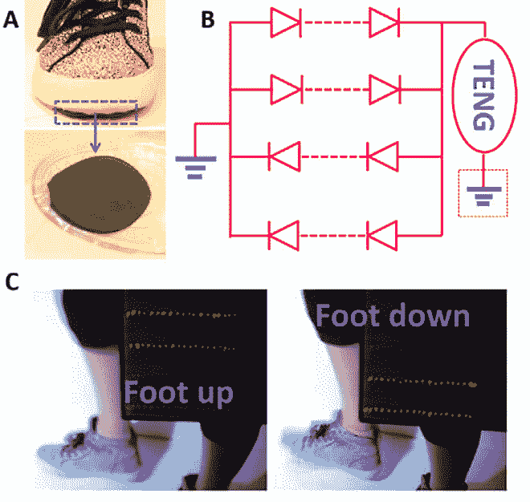
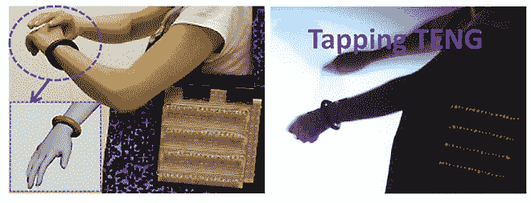
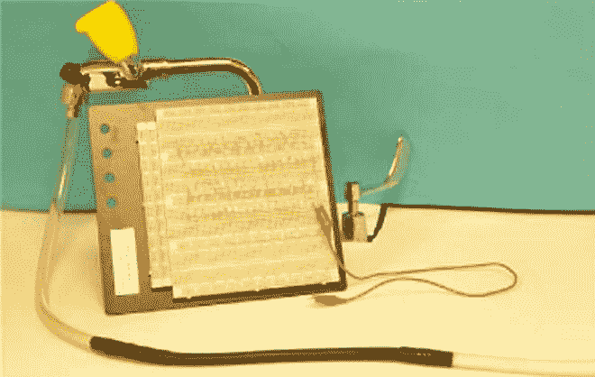
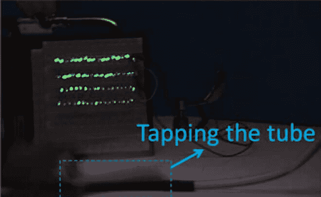

# 可拉伸的纳米发电机可以为可穿戴设备和假肢提供动力

> 原文：<https://thenewstack.io/stretchable-nanogenerators-power-wearables-prosthetics/>

我们的日常生活越来越依赖于不断变化的设备——智能手机、笔记本电脑、平板电脑和[可穿戴设备](https://thenewstack.io/why-wearables-make-sense-people-just-want-to-get-high/)——所有这些设备都依赖某种电池来全天供电。但是一旦这些电池没电了，人们就不得不经历将这些设备插在某个地方几个小时的麻烦过程。

令人欣慰的是，研究人员正在研究更方便的替代方法，从探索使设备能够从无处不在的 WiFi 信号、[无线电波](https://thenewstack.io/battery-free-programmable-devices-run-radio-waves/)，甚至是利用[体热的热电采集器](https://thenewstack.io/battery-free-sensor-patch-harvests-power-body-heat/)中获取能量的方法。

现在，由佐治亚理工学院和中国几所大学的科学家组成的联合小组开发了一种柔性纳米发电机，可以收集日常运动如走路或摆动手臂的机械能，并将其转化为电能。

本质上，这些所谓的[摩擦电纳米发电机](https://en.wikipedia.org/wiki/Nanogenerator#Triboelectric_nanogenerator)(Teng)利用[摩擦电效应](https://en.wikipedia.org/wiki/Triboelectric_effect)——两种不同材料摩擦产生的静电——和[静电感应](https://en.wikipedia.org/wiki/Electrostatic_induction)来产生可用的能量。

TENG 并不新鲜:首席研究员钟教授和他在佐治亚理工学院的同事早在 2012 年就开发了一种刚性 TENG，但他们指出，一般来说，这些不可弯曲的设备具有“有限的拉伸能力，有限的变形能力和有限的可伸缩性，无法满足可变形和可拉伸电子产品快速增长的要求。”

但是这一切都可能随着该团队的最新发展而改变，在他们的论文[中](http://advances.sciencemag.org/content/advances/2/6/e1501624.full.pdf)描述为这些能量收集设备的可拉伸、柔韧版本，可以为下一代可穿戴设备和假肢提供动力。

“这项工作与我们以前的工作的关键区别是使用导电液体而不是导电固体作为 TENG 的一部分，”王告诉 [*IEEE Spectrum*](http://spectrum.ieee.org/nanoclast/semiconductors/materials/flexible-nanogenerators-offer-dependable-energy-source-for-flexible-electronics) 。因此，整个结构非常灵活，适应性强，可以适应任何几何表面

## 液体电极

该团队将他们的最新进展称为“形状适应性”滕，简称 saTENG。为了创造这种新的形状适应的摩擦电纳米发电机，研究人员将一个基于液体的电极与一个弹性的聚合外壳结合在一起。用等离子体炬对橡胶覆盖物进行干法蚀刻，以在其表面上产生纳米棒结构，从而增加表面积的量，以提高总摩擦电荷。封闭在橡胶材料内部的液体可以是任何导电流体——水，甚至是液态金属。

使用这种装置，研究小组使用普通自来水和盐溶液作为电极，选择它们是因为它们相对丰富、廉价、可再生和环保。

为了展示纳米发电机的功效和变形到几乎任何三维和曲线表面的能力，研究小组随后将 saTENG 安装到参与者鞋子的底部，使用自来水作为电极。当这个人轻拍他们的鞋子时，他们能够点亮一系列的 LED 灯。

为了创建一个类似于自供电、健康监测可穿戴设备的场景，科学家们还测试了他们的 saTENG 原型的手镯形状版本，并发现当一个人移动或轻拍他们的手臂时，这种移动足以点亮 80 个 LED 灯。在这两个实验中，研究人员发现他们可以将纳米发电机扭曲高达令人印象深刻的 300%，而性能没有任何明显的损失。

在另一项可能预示着从水中获取能量的新方法的测试中，他们扩展了 saTENG，以从更大的区域获取能量，并将其形成类似于橡胶水管的东西，使用流动的水作为电极。当橡胶管被轻叩时，就会产生电输出信号——这暗示着也许有一天，任何可以盛水的家用物品都可以提供少量的电。

 

研究人员指出，他们的 saTENG 具有相对较高的能量转换效率，而且价格便宜，易于生产。这些实验中的藤条每单位仅花费 50 美分。像这样的柔性纳米发电机可以用于许多领域，机器人，以及娱乐和旅游行业。在科学和建筑领域，它们可以用来为检测化学物质、测量压力、声音和温度的传感器供电。

最重要的是，它们可以帮助医学取得重大进展，用自我供电、可拉伸的传感器取代笨重的医疗设备，以监测生物力学运动，或作为植入物的一部分，跟踪糖尿病等慢性健康状况。该团队现在的目标是增加这些灵活多样的纳米发电机的功率输出，这是一个令人兴奋的前景，认为这些设备可能有一天会形成一种新的可持续能源的基础，从最小的运动中获得。

图片:科学进展

<svg xmlns:xlink="http://www.w3.org/1999/xlink" viewBox="0 0 68 31" version="1.1"><title>Group</title> <desc>Created with Sketch.</desc></svg>