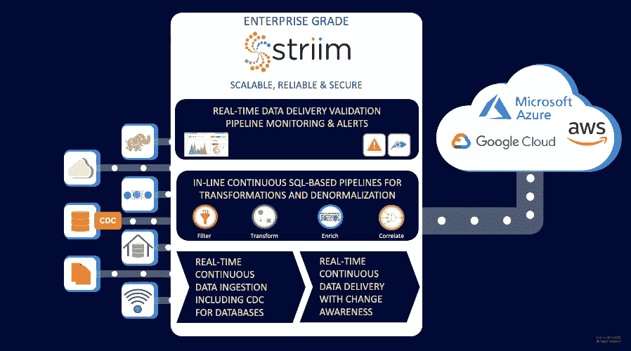

# Striim 在内部解决跨云的数据集成问题

> 原文：<https://thenewstack.io/striim-tackles-data-integration-across-clouds-on-premises/>

应用程序越来越依赖实时数据，这些数据通常来自云中或本地的多个数据存储，甚至可能在数据到达存储之前就对其进行操作。

随着企业处理的数据量和速度呈指数级增长，这给[数据集成](https://thenewstack.io/stop-talking-about-multicloud-and-hybrid-cloud-and-start-talking-about-integration/)带来了额外的压力。

Striim 的联合创始人[阿里·库泰](https://www.linkedin.com/in/ali-kutay-88002112/)、[史蒂夫·威尔克斯](https://www.linkedin.com/in/stevewilkes/)、[阿洛克·帕雷克](https://www.linkedin.com/in/pareekalok/)和[萨米·阿克贝](https://www.linkedin.com/in/samiakbay/)着手解决跨多个系统的数据集成挑战，包括内部系统和云中系统。

这三家公司有很长的合作历史，之前曾建立 GoldenGate 软件公司，该公司于 2009 年被甲骨文公司收购。2012 年，他们在加州的帕洛阿尔托成立了 Striim 公司。

“当我们成立公司时，我们的使命是提供一个端到端的流媒体平台，可以实时收集数据，处理数据，将数据传输到终端系统，并以安全可靠的方式完成这些工作，”Wilkes 说。

“在过去几年中，用例已经转变为主要面向云。几年前，有很多大数据请求，人们希望将数据写入数据湖并维护数据湖，使其与实时数据保持同步。不再是了。这已经改变了很多。用例[现在]实际上围绕着将数据库迁移到云。”

但是客户不能因为云迁移而关闭数据库，因为他们必须保持运行，所以一个重要方面是[变更数据捕获](https://www.striim.com/change-data-capture-cdc-what-it-is-and-how-it-works/#what-is-change-data-capture)——实时跟踪数据中发生的所有变更。

这是一个基于 Java 的实时数据流平台，集成了内置加密、流处理、集成和交付功能。使用集群服务器技术，您可以启动一个 Striim 实例或一个由 4 个或 10 个服务器组成的集群，无论您需要多少个服务器来处理不同的工作负载。

Striim 不断从无数来源获取数据，包括数据库、日志文件、消息系统、云应用和物联网设备。实时流处理可以包括过滤、转换、聚合、屏蔽和元数据丰富等任务，在内存中通过连续的基于 SQL 的查询进行。

“使用流式连续查询，您创建查询，它就在内存中。然后一个数据流正在喂它。每次数据流上有新数据时，它都会进入查询，结果就会出来。所以是连续的，”威尔克斯解释道。

“实时数据集成平台和一些老式数据集成平台之间的一大区别是，没有批处理的概念。没有工作的概念。一切都是 24/7，持续运行的。”

它提供了监控和验证功能来帮助跟踪和确认流数据的收集和交付，并提供了一个向导来帮助客户定义数据流和连接，以构建他们自己的自定义管道。

现成的控制面板显示表级指标和数据交付延迟。其工具使管理员能够配置性能和正常运行时间警报，并通过补救工作流创建自我修复管道。这些仪表板还结合了人工智能来生成连接器组件的指标，如读写速率、延迟和 CPU 使用率。

转型后，它还为 AWS、Azure、Google Cloud 等目标提供数据收集器和交付。

它的客户包括零售商梅西百货、英国广播公司 Sky、法国电信 Orange、谷歌、Gartner 和杂货商 Albertson's。

梅西百货的 IT 经理[尼尔·钦塔](https://www.linkedin.com/in/nchinta/)说:“Striim 为我们提供了跨领域的单一事实来源，并加快了我们的上市时间，提供了跨不同系统的内聚体验。

诸如 [IBM](https://www.ibm.com/cloud?utm_content=inline-mention) 、SAP、Google、 [Oracle](https://developer.oracle.com/?utm_content=inline-mention) 、Cloudera、Informatica 和 Talend 这样的大公司，以及诸如 Matillion、Fivetran 和 Airbyte 这样的新公司，都对企业数据集成和分析有自己的看法。然后就是 [Kafka](https://kafka.apache.org/) 、 [Flink](https://flink.apache.org/) 、 [Spark](https://spark.apache.org/) 等开源工具。

Wilkes 说，这些开源工具更倾向于面向开发者，更适合面向消息的应用程序，事件驱动的应用程序。他坚持认为，不断读写 [Kafka topics](https://kafka.apache.org/intro) 会导致磁盘 I/O，从而导致速度变慢。第三方收集器和第三方目标的混合，就像 [Kafka Connect](https://itnext.io/kafka-connect-in-a-nutshell-e0a0f57e7cdb) 一样，很难保证端到端的数据完整性和数据传输。

同时，它提供[卡夫卡作为其产品的可选部分](https://www.striim.com/videos/how-industry-leaders-are-using-streaming-integration/)，尽管它有自己的内存信息系统。

他说，Striim 的客户通常不是开发人员，而是数据库管理员和 IT 运营人员，尽管更多的数据科学家正在参与进来。

“客户希望能够说，‘我如何将我的所有数据放入雪花？我不想自己做这个。我不想必须配置一大堆不同的技术。我不想写任何代码，我只想把这些数据从这个数据库，或者这些数据库表中取出来，放到雪花的这些表中。用一种简单的方式，”威尔克斯说。

该公司目前通过云市场或作为容器化的云产品部署在内部，最近宣布了一项名为 [StreamShift](https://www.striim.com/press/streamshift-database-migrations-on-google-cloud/) 的托管服务预览，以在没有管理的情况下全面处理云数据流。它包括自动化数据库概要分析、迁移兼容性评估、模式创建、转换和数据移动功能等服务，适用于升降转换数据库迁移和零停机连续在线迁移。

它还宣布了 5000 万美元的 C 轮融资，使这家 120 人的公司的总融资额超过 1 亿美元。

威尔克斯说，该公司目前非常关注将于未来几个月全面上市的 SaaS 版本，以及易用性。

<svg xmlns:xlink="http://www.w3.org/1999/xlink" viewBox="0 0 68 31" version="1.1"><title>Group</title> <desc>Created with Sketch.</desc></svg>