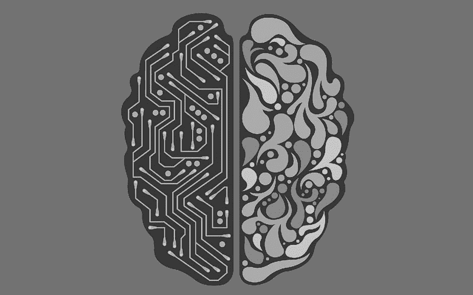

# 为什么人工智能需要神经科学作为灵感

> 原文：<https://thenewstack.io/stronger-artificial-intelligence-needs-neuroscience-inspiration/>

如今，无论你走到哪里，人工智能似乎都在突飞猛进。它变得足够聪明，可以在越来越多的任务中击败人类——赢得像国际象棋、[围棋](https://thenewstack.io/alphagos-win-human-go-champion-means-ai/)和[扑克](https://thenewstack.io/computers-can-now-bluff/)这样的游戏，以及从事创造性的努力，如[写小说](https://thenewstack.io/day-computer-wrote-novel-almost-won-literary-competition/)和[音乐](https://thenewstack.io/artificial-intelligence-todays-newest-hitmaker/)——所有这些都曾被认为是机器无懈可击的。我们还看到了人工智能驱动的自动化在一些行业的新兴趋势，如[医药](https://thenewstack.io/scientists-artificially-intelligent-nanoarray-can-diagnose-disease-using-breath/)、[销售](https://thenewstack.io/conversicas-ai-based-virtual-assistant-can-help-generate-better-sales-leads/)、[零售](https://thenewstack.io/cashier-free-self-driving-ai-powered-grocery-store-comes/)和[酒店管理](https://thenewstack.io/hotel-run-entirely-robots-opens-japan/)——这让我们想知道一旦[机器取代了所有工作](https://thenewstack.io/will-happen-robots-take-jobs/)会发生什么。

然而，尽管最近取得了这些高调的成就，人工智能在真正模仿甚至超越体现人类智能的复杂奥秘之前，仍有一些路要走。虽然在让机器像人类一样学习如何学习和推理(T21)方面已经取得了进展，但当前的人工智能模型在范围上仍然相对狭窄，并且尚未体现人类日常用于解决广泛问题的全部认知能力。这个旨在创造所谓的[人工通用智能](https://en.wikipedia.org/wiki/Artificial_general_intelligence)(AGI)——或者一种能像人类一样成功完成任何智力任务的智能——的目标仍然没有被专家们所理解。

但是根据人工智能初创公司 [DeepMind](https://deepmind.com/) 的联合创始人[戴密斯·哈萨比斯](https://twitter.com/demishassabis)的说法，我们可能会通过首先更好地了解人类智能的工作方式来更接近解决这个问题。在最近发表在 *[神经元](https://dx.doi.org/10.1016/j.neuron.2017.06.011)* 上的一篇论文中，哈萨比斯和合著者 Dharshan Kumaran、Christopher Summerfield、Matthew Botvinick 提出了在神经科学和人工智能发展的各个领域之间建立更强有力的联系，以帮助创造真正的人工智能。

作者指出，翻译从研究生物智能中学到的这些经验教训有许多优势:“神经科学为新型算法和架构提供了丰富的灵感来源，独立于并补充了基于数学和逻辑的方法和思想，这些方法和思想在很大程度上主导了传统的人工智能方法。”

除此之外，通过研究大脑的认知系统如何工作，我们可以更好地了解大自然认为什么是进化相关的，以及什么将与开发更智能的人工智能相关。

“神经科学可以为已经存在的人工智能技术提供验证，”作者写道。“如果一个已知的算法随后被发现在大脑中实施，那么这就有力地支持了它作为一个整体通用智能系统的一个组成部分的合理性。”

## 神经科学的教训

找到神经科学和人工智能之间的联系并不是一件新鲜事，这篇论文很好地概述了几十年来的重大里程碑。哈萨比斯在推出 DeepMind 之前作为神经科学家接受了广泛的培训，他指出，深度学习和强化学习的早期人工智能研究是建立在之前对哺乳动物大脑和动物行为的神经心理学研究基础上的。

当前的人工智能研究延续了自然和机器之间的互利关系。例如，在开发人工注意力时，研究人员将生物大脑视为一个模型，它通常由管理各种重要功能的模块化子系统组成。

这种模仿自然界运作方式的相同方法也被应用于开发人工版本的情景记忆(在“一击”中快速学习经验)、工作记忆(在活动系统中存储和操纵信息的能力)和持续学习(能够掌握新任务而不忘记以前学习的技能)。

## “虚拟大脑分析”

然而，尽管这种跨学科的共享正在进行，哈萨比斯和他的同事们断言，人类和机器之间的智能鸿沟仍然很大。这种差距是由于我们对生物大脑、认知的潜在机制和意识本身的性质的不完全了解。同样，这种差异也是因为驱动人工智能的复杂计算可能是一个不可思议的“黑盒”——它是可行的，但我们真的不知道为什么。

但是，由于脑成像和遗传生物工程等新技术，这一神秘的景观现在正逐渐变得明朗起来，这些新技术使神经科学家能够窥视和修补神经回路。然后，这种经验知识可以转移到创建新的神经架构，能够像人一样学习、推理和直觉、创造力、想象力和层次规划，以便有效地解决复杂的现实世界问题。

哈萨比斯还提议进一步开发他所谓的“虚拟大脑分析”，或打开人工智能系统的形象化“黑匣子”的工具。这些分析和挑选“虚拟大脑”内部工作的工具将受到神经科学中已经使用的技术的启发，例如可视化大脑状态和绘制 T2 感受域的工具。

最终，哈萨比斯和他的同事认为，要让人工智能进步和进化，超越高度专业化但普遍薄弱的水平，更接近人类水平复杂性的智能，人工智能研究人员需要与神经科学家积极合作。随着这两个领域的发展和扩大，人们很难成为这两个学科的专家，这就需要两者之间有一种“共同语言”来帮助确定共同的观察和发现。

“我们的观点是，利用从神经科学研究中获得的见解将加快人工智能研究的进展，”作者解释说。“人工智能和神经科学之间的思想交流可以创造一个推进两个领域目标的‘良性循环’。”

图片:[众多优秀艺术家](https://flic.kr/p/UTHyuq)(公共领域)。

<svg xmlns:xlink="http://www.w3.org/1999/xlink" viewBox="0 0 68 31" version="1.1"><title>Group</title> <desc>Created with Sketch.</desc></svg>