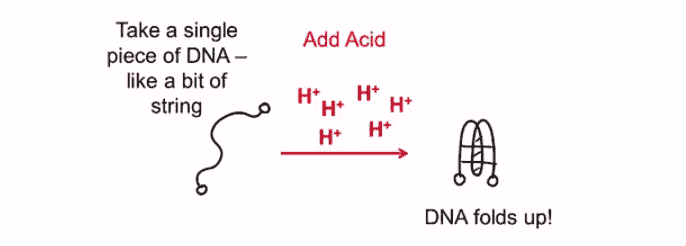
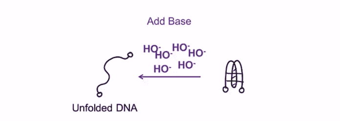
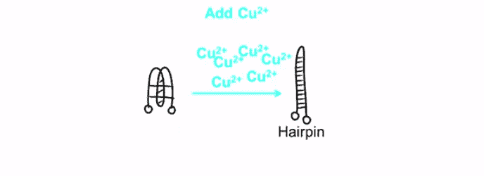
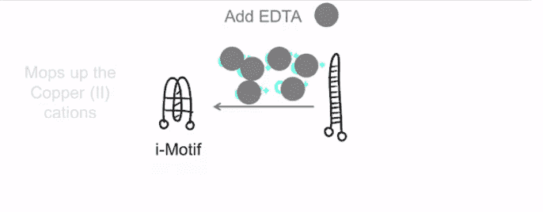

# 研究:基于 DNA 的计算机可以用洗发水成分制造

> 原文：<https://thenewstack.io/study-dna-based-computers-built-shampoo-ingredient/>

我们现在正迅速达到硅基计算的极限，许多观察家预测，硅基半导体的发展速度将在未来十年内很快放缓，这预示着[摩尔定律](https://en.wikipedia.org/wiki/Moore%27s_law)的终结，并迎来一个“[后硅时代](http://bigthink.com/endless-innovation/is-silicon-valley-ready-for-the-post-silicon-era)”

类似于[量子计算](https://thenewstack.io/newly-discovered-particles-could-push-quantum-computing-further/)和基于[像 DNA 这样的分子](http://www.wisegeek.com/what-is-molecular-computing.htm)的计算机的替代方案已经被提出，但是仍然存在巨大的挑战，现在说什么将取代硅基硬件还为时过早。但东安格利亚大学(UEA)的科学家最近推动了 DNA 计算机的发展，这要归功于他们的发现，即使用铜盐和乙二胺四乙酸(EDTA)，DNA 的结构可以多次“转换”，乙二胺四乙酸是一种水溶性固体，也是洗发水的一种常见成分。这一发现可能会对纳米技术和基于 DNA 的计算产生深远的影响。

[https://www.youtube.com/embed/01bEnhtldzQ?feature=oembed](https://www.youtube.com/embed/01bEnhtldzQ?feature=oembed)

视频

这项研究最近发表在“[化学通讯](http://pubs.rsc.org/en/content/articlelanding/2015/cc/c5cc05111h#!divAbstract)”上，详细介绍了研究人员如何使用铜盐和 EDTA 将 DNA 链的形状改变成各种形状。这些发现建立在以前的实验基础上，这些实验表明，当加入酸时，DNA 链的螺旋结构可以转化为卷曲的“I-基序”，当使用碱性试剂时，这种结构可以逆转。

这一次，UEA 的实验证明了另一种转变是可能的。通过使用带正电荷的铜盐(也称为铜[阳离子](https://en.wikipedia.org/wiki/Ion)),“I 基序”DNA 变形为发夹形状。

【T2

为了逆转这种转化为发夹结构，EDTA 被用来“清除”铜阳离子，瞧，回到以前的“I-基序”形状。

改变 DNA 的形状可能看起来没什么大不了的，但是首席研究员 Zoë Waller 博士解释了这些发现的重要性:

“我们的研究显示了我们的遗传物质——DNA——的结构是如何被改变并以一种我们没有意识到的方式使用的。以前单个开关是可能的——但是我们第一次展示了这种结构是如何被切换两次的。这一发现的潜在应用可能是为基于 DNA 的计算创造逻辑门。逻辑门是数字电路的基本构件，用于计算机和其他电子设备。传统上，它们是用二极管或晶体管作为电子开关制成的。这项研究扩展了 DNA 如何在基于 DNA 的计算或纳米技术中用作逻辑门的开关机制。”

## DNA“转录子”和长期 DNA 数字存储

随着后硅时代的到来，[基于基因的逻辑门](http://med.stanford.edu/news/all-news/2013/03/biological-transistor-enables-computing-within-living-cells-study-says.html)将成为[合成生物电路](https://en.wikipedia.org/wiki/Synthetic_biological_circuit)的一部分，合成生物电路由基于 DNA 的组件组成，如[转录器](https://en.wikipedia.org/wiki/Transcriptor)和 [DNA 数字数据存储器](https://en.wikipedia.org/wiki/DNA_digital_data_storage "DNA digital data storage")——所有这些可以放在一起，创建一个[生物计算机](https://en.wikipedia.org/wiki/Biocomputer)。科学家们现在正在推动计算机作为机械部件总和的传统概念:在生物计算机中，转录器是由 DNA 和 RNA 而不是硅制成的类似晶体管的设备，而基于 DNA 的数字存储将涉及以 DNA 的碱基序列存储数字数据。

人们可能会从甚至可以从化石 DNA 中提取的数据的寿命中直觉到，存储在 DNA 中的信息可以完整无缺地保存数百年，如果不是数千年的话。最重要的是，DNA 具有令人难以置信的存储能力，一克 DNA 能够存储大约 455 艾字节的数据(一艾字节等于十亿吉字节)。但是由于反应时间以分钟、小时甚至天来衡量，生物计算机的计算速度比硅计算机慢得多。尽管如此，它们的制造成本比硅基机器要低，而且 DNA 的本质允许这些生物计算机比目前的计算机能够并行执行许多多重计算。

尽管存在处理速度的障碍和如何大规模生产这些廉价生物计算机的问题，但基于 DNA 的计算机的可能性是令人难以置信的。首先，我们也许有一天能够创造出纳米级的生物计算机，可以注射到体内，可以进入细胞内部，在细胞水平上治疗疾病。有朝一日，生物计算机可能会永久存在于人类体内，创造出一种生物增强的超级杂交人类，这种人类将对疾病免疫，并能从内部自愈？我们现在还不知道，但可以肯定的是，有了这些令人惊讶的发现，基于 DNA 的计算机的未来看起来更加光明。在东安格利亚大学和 T2 化学通信学院阅读更多信息

图片:[东安格利亚大学](https://www.uea.ac.uk/about/-/how-uea-research-could-help-build-computers-from-dna)。

<svg xmlns:xlink="http://www.w3.org/1999/xlink" viewBox="0 0 68 31" version="1.1"><title>Group</title> <desc>Created with Sketch.</desc></svg>