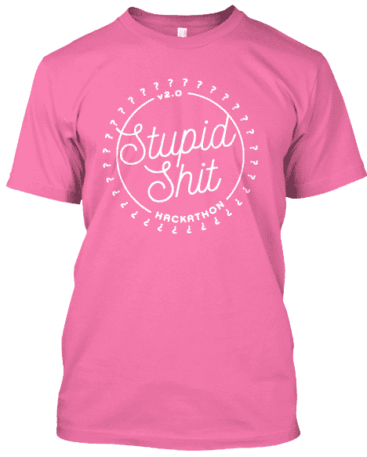

# 黑客马拉松反弹引发更多黑客马拉松

> 原文：<https://thenewstack.io/stupid-shit-hackathons-growing-popularity/>

旧金山很快将举办另一场黑客马拉松:没人需要的愚蠢狗屎和糟糕想法黑客马拉松这是一种新趋势的一部分，这种趋势是轻松的、没有野心的编码活动，或许也是对所有其他黑客马拉松的一种含蓄的批评，带有他们的喝彩和企业赞助商。

但奇怪的是，这些反黑客马拉松似乎越来越受欢迎。

旧金山的免费活动将于 5 月 14 日周末在一个名为 Noisebridge 的创客空间举行，从技术上讲，这已经是该活动的 2.0 版本，因为另一场活动是在 2015 年举行的。但据他们的网站报道，这也只是西海岸版本的[，一个纽约市的活动](http://www.stupidhackathon.com/)，报道称还有愚蠢的黑客马拉松即将在多伦多和柏林[举行。从 Medium 上最近的一篇文章来看，他们显然有一些竞争对手，这篇文章描述了在加拿大滑铁卢举行的为期一天的“恐怖黑客”活动](http://stupidhacktoronto.com/)[，有 100 多名黑客参加](https://medium.com/@tau/terriblehack3-1164c2541c3f)。

提交的项目包括一个增加了侧边栏广告和弹出窗口的终端窗口[和一个将拼写正确的单词替换成常见拼写错误的“](https://github.com/Uberi/Adwear)[语法编辑器](https://devpost.com/software/grammer-ungooder)”。

“大多数黑客马拉松都是关于提出创新的新想法和做出可信的创业原型，”该活动的一名组织者在 2015 年写道。[这个不一样](http://www.davepagurek.com/blog/terriblehack)。这是一个为了编程而编程的乐趣，即使这意味着重新发明一个效率较低的轮子。”看起来大多数与会者只是出去找点乐子，而不是实际。2015 年，他们的一名参与者甚至找到了一种方法，可以在 Pebble 智能手表上以黑白方式显示里克·阿斯特利的滚动里克视频。

与此同时，[去年旧金山黑客马拉松](https://stupidhackathon.github.io/2015.html)上的愚蠢项目包括一种在智能手机上阅读任何书籍的新方式——通过[将书录制到你的手机上](https://kitties.neocities.org/ebookreader.html)。一个名叫威尔·多恩伦的开发者竟然[在香蕉皮](https://www.youtube.com/watch?v=cp3wC2toiFA)上安装了拉链。还有一个空气喇叭被偷工减料，只要有人在推特上发布#disrupt 标签，它就会响起[。一个团队甚至发明了一种可以倒水的雨伞，“这是一种确保你在阳光下保持湿润的好方法。”自从那次黑客马拉松之后，一个网站管理员为他自己的愚蠢项目——一个叫做 DoesMyScreenWork.com 的网站——积累了将近 57000 次页面浏览量。它在荧光绿色背景上显示“Yes”——当然，只有在你的屏幕确实工作的情况下才能看到……](http://disruptor.herokuapp.com/)

活动结束后，在当地一家名为[时代精神](https://www.yelp.com/biz/zeitgeist-san-francisco)的酒吧喝啤酒。

那么这些勇敢愚蠢的开发者是谁呢？在这一页的底部有一个提示。“我们不是一个中央集权的组织，只是一群旧金山的朋友，他们对没有一个愚蠢的黑客马拉松感到震惊。欢迎你为你的城市窃取创意。”

但有一点他们似乎很重视，那就是这个活动的精神。组织者诺亚·斯沃茨告诉《每日电讯报》:“我经常批评那些提出太有用想法的人。”。该科技网站发表了一篇对 2015 年事件的热情洋溢的报道，称赞它突出了旧金山的创客社区，“在对科技社区的批评中，湾区的文化经常被忽略……所有人都乐于分享新想法，并告诉其他人从头开始建造东西是什么感觉。”

当然，隐含的背景是，所有其他高尚的黑客马拉松可能正在经历意想不到的反弹。12 月，Fast Company 发表了一篇题为“[为什么黑客马拉松不利于创新](http://www.fastcompany.com/3054023/hit-the-ground-running/why-hackathons-are-bad-for-innovation)”的文章，认为它们创造了一种虚假的成功感，解决了“故意脱离现实”的简单挑战

2013 年，工程师 Chinmay Pendharkar 写了一篇博文，提出了另一个观点:黑客马拉松对你的健康有害。他批评他们鼓励将睡眠剥夺与“垃圾食品、酒精和咖啡因”混在一起。这些抱怨在今年 2 月另一个名为“ [Hackathon 消失](http://brianchang.info/2016/02/28/hackathon-be-gone.html)”的博客中得到回应，一位澳大利亚博客作者补充了他的评论，标题为[“不，我不会为免费披萨构建你的应用程序。”](https://musicmachinery.com/2013/11/19/no-i-will-not-build-your-app-for-free-pizza/)去年 9 月，一名伯克利学生发表了一篇颇有见地的文章，认为[黑客马拉松违背了黑客文化的长期信条](https://medium.com/@folz/selling-out-and-the-death-of-hacker-culture-fec1f101b138#.f210htlnk)，写道“我们为了利润出卖了彼此，却失去了让我们快乐的东西。”

不可能忽略这种并列关系。纽约的活动至少从 2014 年开始，一个组织者后来将这个活动描述为“一个黑客马拉松，要求参与者产生没有任何价值的项目。(“这是一次彻底的、无条件的成功。”)2014 年活动的一些例子包括 Needybot，“一个当你不安慰它时会哭的机器人”，以及“金·卡戴珊在牛顿上”，一张金·卡戴珊的黑白照片显示在…好了，你明白了。

两年后，旧金山即将举行的黑客马拉松已经邀请你现在就预订你的纪念愚蠢 t 恤。

<svg xmlns:xlink="http://www.w3.org/1999/xlink" viewBox="0 0 68 31" version="1.1"><title>Group</title> <desc>Created with Sketch.</desc></svg>