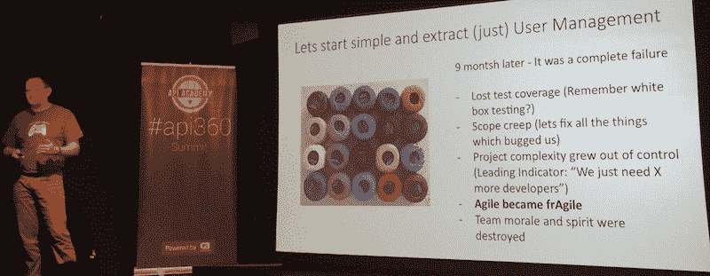

# 如何在微服务失败时取得成功

> 原文：<https://thenewstack.io/succeed-failure-microservices/>

愿意在公开场合快速失败是当今新的分布式软件范例的原则之一。从整体架构转移到微服务架构——通常是构建全球分布式应用架构的关键任务——是一项具有挑战性的工作，并且会带来不可避免的失误。

在[微服务](/category/microservices/) 的故障仍然很少被讨论。即使在新堆栈的页面中，也只有 25 个关于[、“故障”和“微服务架构”的搜索结果在许多情况下，这是因为企业希望将失败隐藏在内部，不愿过多公开谈论他们是如何应对架构和基础设施转型这一棘手问题的。](https://thenewstack.io/?s=failure+%2B+microservices)

对微服务失败的深入探索可以帮助企业取得成功。毕竟失败就是反馈。失败是一种暂时的状态。《领导力》的作者[约翰·C·麦斯威尔](https://twitter.com/JohnCMaxwell)，在他的书《[向前失败](https://www.amazon.com/Failing-Forward-Turning-Mistakes-Stepping/dp/0785288570)》中，鼓励对失败进行新的定义，将其视为“我们为获得成功所付出的代价”

在最近于纽约举行的 CA Technologies 的 API360 峰会上，《微服务架构:调整原则、实践和文化》的合著者 Ronnie Mitra 说，重新定位微服务架构的失误是意料之中的，毕竟，“当你把服务做得很小的时候，围绕它们的系统会变得更加复杂。”

Mitra 说，微服务的本质是“规模和和谐的速度和安全。”他指出了规模变得越来越复杂的三个领域:

*   当**需求**增加时(现在你的应用有很多用户)，
*   随着**距离**(应用程序的代码在地理上分散在云基础设施中)以及，
*   在**组织中**(随着业务的增长，当有数千名员工时，适用于 10 人公司的方法可能不再适用)。

在这里，Mitra 暗示了架构重定向的一个最被遗忘的方面:这是一个三管齐下的方法，团队组织与软件架构和云服务器基础设施决策一样重要。

[Vijay Alagarasan](https://twitter.com/vijayalagarasan) 是全球移动和电信保险提供商 Asurion 的首席架构师，该公司为超过 2.9 亿客户提供支持，他表示，迁移到微服务架构是该公司降低成本、提高灵活性和提供高质量客户体验的关键。

然而，他表示，微服务很容易失败，他已经确定了在规划新的微服务架构时需要避免的七种反模式:

然而，Alagarasan 没有触及的是 Asurion 如何组织自己来实现这些设计模式并避免反模式。纽约 ThoughtWorks 的首席开发人员/顾问 Cassandra Shum 说，微服务成功的关键是团队的组织方式:她说，微服务可以“在组织具有灵活性和接受度的情况下”工作。Shum 认为，当一个组织是分层的，不能创建功能驱动的团队时，那么微服务就不会成功。

## 聚焦失败:为什么技术革命不是起点

Holger Reinhardt 是德国 Haufe-Lexware 集团的首席技术官，这是一家欧洲 LexisNexis 类型的企业，已经从传统出版商转型为数字服务提供商。他勇敢地详细讲述了失败是什么样子的，以及他作为一名新的首席技术官所学到的惨痛教训，他最初加入公司时热衷于将他们的技术堆栈重建为微服务架构。

当 Reinhardt 开始时，像许多传统企业一样，Haufe-Lexware 也有相当份额的技术债务。有一个服务平台，有一个已部署的工件，因此将任何更改部署到生产中需要 5 到 10 天。测试任何东西通常需要几个月的时间。代码库仅基于托管硬件的一个实例。非常适合转向微服务，对吗？

重新定位九个月后，莱因哈特不得不取消这个项目，并承认这是一个“彻底的失败”。分离用户管理导致了零测试覆盖率。范围蔓延意味着项目团队经常被他们已经识别并想要修复的所有新问题所淹没。敏捷已经变得脆弱。Reinhardt 警告其他面临类似挑战的人:“如果你听到解决方案是‘我们只是需要更多的开发人员’，那么就应该竖起黄色的旗帜。”

莱因哈特说，这个结果让他想起了彼得·德鲁克的名言:“文化早餐吃战略”。'

“战略的执行是文化、技术和组织结构的功能，”莱因哈特说。“我觉得，在任何团队中，你都需要让文化、技术和结构保持一致，才能取得成功。在这三者中，文化永远是赢家，它将粉碎任何试图改变现有模式的努力。”

他举了一个例子来强调技术是不公正的。“如果你有一个用企业 Java 编程的 Java 团队，重点是安全性、稳定性和可预测性。但如果你需要加快上市速度，引入 JavaScript，你会让程序员像 Java 一样使用 JavaScript，因为这个团队的文化模式是关注安全。”

在搁置了这个为期九个月的项目后，Reinhardt 手头的工作变得更加紧迫:与其说是解决迁移问题，不如说是防止一开始就负责这项任务的团队士气下降。“我需要提供一个外部结构，让团队重新相信自己。”

莱因哈特说，在看到失败对他的团队的影响后，他回到了两个关键的想法，这影响了他策划新的前进道路。一个是[马丁·福勒](http://www.martinfowler.com/)的比喻“你必须至少有这么高才能使用微服务。”第二个是丰田的精益转型模式:“在精益转型中，你必须首先稳定，然后优化，然后转型。”

“我们试图在稳定之前转型，”莱因哈特承认。

## 失败的教训:让团队为微服务定位做好准备的三个工具

Reinhardt 分享了他带领团队走向新成功的三种方式，一种是看到在重新定位中失败的同一个团队引入结构性变化，使他们的整体代码库部署从 5-10 天缩短到 30 分钟。

**1。沟通:**莱因哈特认为，在一个企业中，沟通往往只发生在中层管理阶层内部。他分享了月球计划的故事，不管是真是假，当一名记者问清扫发射台的人他们在做什么时，清扫者回答说，“我正在帮助把一个人送上月球。”Reinhardt 认为，开放和持续的沟通可以帮助团队中的每个人看到他们的工作如何与整体战略保持一致。“我们将 [Slack](https://slack.com/) 和 [Rocket](https://rocket.chat/) 引入组织。它使交流民主化:火箭上的每个人都可以 ping 我。我将此作为内部社交媒体策略，不断向组织提供参考点和信息。”

Reinhardt 在他的内部团队中培养了一种开发者文化，利用 IRC 聊天、开发者博客、meetups 和保持开放政策来帮助建立势头。

**2。接受你所拥有的文化约束:**考虑到已经存在的组织结构，以及多年来已经做出的技术决策，对于像微服务重新定位这样的大型项目来说，向敏捷方法的转变是一个太大的文化转变。

莱因哈特回忆了精益转型的前两个阶段:先稳定，再优化。对于失败的团队，他选择了一个他称之为“灯塔”的项目，并设定了一个具有挑战性的时间表:三个月。“如果是六个月，团队失败的外部看法就会深入人心，所以我们通过震惊和敬畏来挑战团队，让他们回到正轨。”

一种关键链项目管理方法取代了纯粹的敏捷方法:“它介于严格的瀑布方法和敏捷方法之间:你给出了时间的外部预期，只要满足结束日期，团队就很好。”Reinhardt 说，提供这种外部结构有助于团队再次相信自己。

“敏捷对于非常成熟的团队非常有用，”Reinhardt 说。“但你带着你拥有的军队去打仗，而在许多球队中，你没有那种成熟。他们有敏捷的概念，但是他们没有敏捷的生活。团队开始对自己变得非常不确定，然后你开始得到评估，因为团队不想承诺他们无法实现的事情，所以他们变得非常保守。”

他说，答案是在这些团队中强加一些自上而下的结构。

“我们有预感，如果有合适的资源，团队可以在三个月内完成新项目。所以我们暂停了一点敏捷，采用了一种近乎瀑布式的方法，告诉他们必须及时完成这些事情，”Reinhardt 说。“在后台，我们有信心，如果他们需要，我们有一些关键的人来支持团队。所以这让团队变得更加强大，但也确保了团队不会对自己失去信心。然后神奇的事情发生了，当团队能够达到那个延伸目标时，失败的污点就被抹去了。他们突然从被打败的狗变成了最强的狗，并能够在三个月内展示他们所做的一切。”

Reinhardt 说，在这个阶段——就像 ThoughtWorks 的 Shum 敦促消除等级组织结构一样——当团队恢复信心时，你需要开始把手从方向盘上拿开，让团队再次前进。干预不是永久的解决办法。

**3。将微服务视为一种哲学而不是一种架构:** Reinhardt 说，经过反思，他应该鼓励一种微服务的心态，而不是试图立即实现一种微服务架构。

“微服务架构是自全球变暖以来最大的用词不当，”Reinhardt 说。“‘全球变暖’比‘气候变化’更容易脱口而出。”缺点是，每当你有一个寒冷的冬天，人们都说全球变暖不存在，而气候变化只是说天气事件的频率更极端。微服务也是一样:人们本能地立刻关注微的部分。

“但微服务架构是一种考虑到我们工作和组织方式的架构方法。我发现这一点非常令人着迷，不仅仅是技术，还有像 [DevOps](/category/devops/) 这样的文化因素和像康威法则这样的组织因素。因此，为了实现某些目标，你需要这三者协调一致。根据你想要制造什么样的产品，你需要建立相应的团队。”

程序员 Mel Conway 在 1968 年提出的 Conway 法则(T5)对如何从失败中吸取教训并实现微服务架构的讨论进行了建模:“设计系统的组织……被限制生产这些组织的通信结构的副本。”

康威在 API360 上发言时提醒观众，“每个组织选择都排除了一个设计选择。那么，你将如何建立一个最佳的系统呢？一个灵活的组织，实验性的。”

现在，差不多五十年过去了，康威在微服务时代的公理——正如莱因哈特所证明的——比以往任何时候都更加正确。

<svg xmlns:xlink="http://www.w3.org/1999/xlink" viewBox="0 0 68 31" version="1.1"><title>Group</title> <desc>Created with Sketch.</desc></svg>