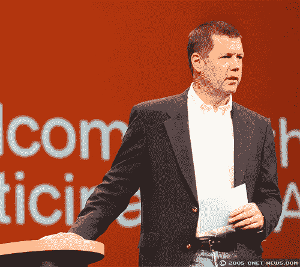
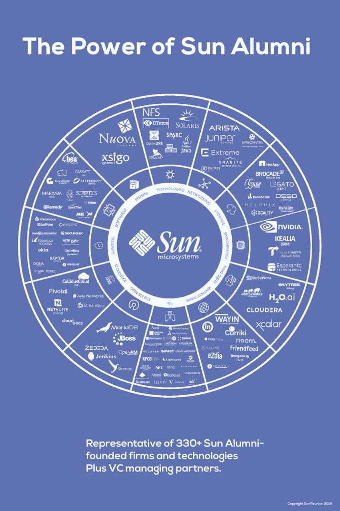

# 太阳微系统公司:回顾一家领先于时代的科技公司

> 原文：<https://thenewstack.io/sun-microsystems-a-look-back-at-a-tech-company-ahead-of-its-time/>

太阳微系统公司是硅谷的传奇。在被甲骨文公司收购十年后，该公司的前员工仍然对他们的旧居有着深厚的感情——两周前，在旧金山机场附近的凯悦酒店举行了一次历史性的重聚。1000 多名前 Sun 员工齐聚一堂，共度良宵，重温旧梦。

“这真的很有趣，”Sun 前首席执行官兼联合创始人斯科特·麦克尼利笑着告诉我们。“我不知道，我们组建的团队和文化有些疯狂。每个人的态度都很有趣，当人们聚在一起时……”

接下来的日子里，Sun 的员工在网上分享怀旧的回忆，表达他们过去和现在的极客情谊。但是这次重聚也给斯科特·麦克尼利(T2)和其他人提供了一个机会，让他们反思这一切意味着什么。你如何衡量一家科技公司及其员工留下的遗产？

## **“比我们意识到的影响更大”**

聚会怎么样？“这实际上有点奇怪，”麦克尼利告诉我们。“我觉得这就像是某种摇滚音乐会，每个人对其他人来说都是名人。人们只是笑着，享受着叙旧、回忆、记忆的美好时光。这有点像你所期望的重聚，只会更好。”

该活动的官方网站[指出，超过 150 名高级管理人员参加了该活动，并且“与会者名单包括了 Sun 存在](https://sunreunion.com/index.html)以来的所有人[，从第一名员工到最后一批甲骨文前雇员。”](https://sunreunion.com/fotome.htm)

麦克尼利开玩笑说，当他结婚时，只有 400 人参加婚礼，即使在那时，他也担心会遇到每个人。但在拍了许多自拍后，“幸运的是，他们给了我麦克风，我有机会谈论一下我们做了什么，以及这对我和这个行业意味着什么……”

但据 InfoWorld 称，在正式活动之前，还有一场类似“峰会”的活动，四位最初的联合创始人会与媒体见面。比尔·乔伊、安德烈亚斯·贝希托尔斯海姆和维诺德·科斯拉与斯科特·麦克尼利坐在一起，这是他描述的当晚最难忘的时刻之一——“听取每个人的观点……有时你需要保持一点距离，才能真正理解正在发生的事情。”

“现在回头看，你可以看到谁真正产生了影响并改变了事情，”麦克尼利告诉我们。他举了亚当·奥斯本的例子。虽然奥斯本的公司早在 1981 年就卖出了第一台商业上成功的便携式电脑，但它在 29 个月内就破产了。“亚当·奥斯本当时非常有名，但他并没有对整个行业产生影响。还有很多其他的都只是行业内的注脚。

“我认为没有人会认为 SPARC、Solaris、Java、作为虚拟计算机的网络、虚拟化，以及我们在 Sun 公司所做的所有这些事情都是脚注。它们是基岩。所以我认为，真正聚在一起回顾过去并说‘是的，我们可能产生了比我们当时意识到的更大的影响’是很有趣的。"

麦克尼利仍然为孙取得的成就感到自豪，并在晚上晚些时候与他的前员工分享了他的一些感受。“我记得我站起来说，‘你知道，他们都在做多元化和包容性的事情。30 年前，我们想都没想就这么做了。这不是我们的目标，我们只是*具有包容性和多样性…*

“然后我说，另一件事是我们做了所有这些疯狂的创新。我们比我们的时代超前了好几光年。Sun 总是走得太早，无论是在云计算、开源还是其他方面。我们远远领先于我们的时代，远远领先于我们的时代，因为我们有能够超越地平线的杰出人才……”

InfoWorld 报道称，在正式活动之前，Bill Joy 表示，移动数据网络现在已经改变了社会，这让他想起了 Sun()早期尝试其他人后来完善的技术的具体时间。该网站称赞 Sun 拥有“一系列至今仍受欢迎的开源软件技术”，包括 Java 编程语言和 Jenkins CI/CD 平台。Sun 已经尝试了自然语言处理和 Java ME，甚至可编程智能手机。Joy 说:“但当时硬件才刚刚起步。

McNealy 还记得早在 1984 年，Sun 是如何共享网络文件系统(NFS)协议来通过网络存储和检索文件的。InfoWorld 引用他的话说“我们没有发明开源，但是我们让它发生了。我们是那次游行的领导者。”

当被问及 Sun 是否应该从 Sparc RISC 处理器和 Solaris Unix 转向 Intel 处理器和 Linux 时，麦克尼利说他不想谈论他在担任 Sun 首席执行官时所犯的错误，但这样的转变不是 Sun 应该做的

## 向前支付它

据同学会的官方网站称，这次活动的另一个特点是深思熟虑地试图传递一些专业知识。“我们利用这个难得的机会，通过与下一代企业家分享我们一些最有知识的校友的专业知识，来推动这一发展。”Sun Reunion 委员会邀请了来自五所当地大学的 100 名 MBA 候选人参加一系列 20 分钟的“SunTalks ”,内容涉及教育、工作、技术、金钱、创新和思想的未来。(“特邀嘉宾”演讲者，被誉为“Java 之父”的詹姆斯·高斯林讲述了“创新的未来”)会谈之后是 20 分钟的问答时间。

此次重聚还特别推出了另一个名为“[庆祝成功:杰出女性@孙](https://sunreunion.com/women-in-leadership.htm)”的小组，展示了“那些在孙公司积累了经验并在该行业取得巨大成就的女性”小组成员包括:

*   Linda Popky(主持人)——leverage 2 market Associates 创始人兼总裁
*   EVA Sage Gavin——埃森哲人才与组织咨询业务部高级董事总经理
*   neha Sampat——content stack 首席执行官
*   Denise Peck——Ascend 执行顾问
*   南希·豪格——CHRO，自动化无处不在

重聚的所有活动都是在脸书的[举办的，有一个由近 24 名前员工组成的团队志愿帮助实现这一目标。](https://www.facebook.com/groups/571167169610359/?ref=group_header)

### 你永远记得的

麦克尼利仍然记得他在 Sun 被甲骨文收购前夕发出的那份由衷的备忘录。备忘录的主题是“感谢伟大的 28 年”在动情的告别中，麦克尼利回忆起他们是如何进入《财富》200 强的，同时这些年来创造了超过 2000 亿美元的收入，他写道，Sun“疯狂地创新……尽管我们没有尽可能好地将我们的发明货币化，但很少有公司拥有我们在过去 28 年中拥有的研发记录。”

九年后，他解释了他在备忘录中写的内容。“最令人兴奋的事情之一是能够完成我们已经完成的所有事情，而不用担心第二天早上我儿子看报纸时会感到尴尬。我们在不违法的情况下打破了商业规则。我们以一种大规模的方式改变了业务，并且我们以一种公开、多样和包容的方式合乎道德地、诚实地做到了这一点。”

那么现在是什么感觉呢？“我认为我们中的许多人都非常——不是懊悔或悲伤，而是——我认为我们都感到非常幸运，能够与公司一起度过一个神奇的时刻……”

从 1982 年到 1995 年，Sun 公司的工程师史蒂夫·埃文斯在该公司工作了 13 年，他为这次重聚创作了一个令人心酸的展览。他从他最近的火人节艺术项目中取出一个低分辨率的 LED 面板，然后用它来纪念孙前 10 年的一些标志性图像。

[https://www.youtube.com/embed/20JwE1854a4?feature=oembed](https://www.youtube.com/embed/20JwE1854a4?feature=oembed)

视频

至于重聚时的感受，埃文斯似乎已经找到了一种延续感。“与我交谈的大多数人都是老同事，而且大多数人仍在甲骨文的 Java 团队工作。在开发 Java 之前，Gosling 已经在我的团队中工作了很长时间。我相信，那些在甲骨文交易后留下来并继续工作的人会喜欢成为这项成功且具有历史意义的技术的一部分，喜欢与詹姆斯一起工作，即使是间接的。”

关于重聚，还有一个问题:那些跳槽到其他公司的人后来怎么样了？Sun Reunion 网站上的一个页面展示了前 Sun 员工结束工作的[公司的标志。它包括谷歌、亚马逊、脸书、网飞等主要科技公司，以及 IBM 和惠普等重量级企业，以及雅虎、易贝、Twitter 和 Slack 等知名互联网公司。有像 Docker、Joyent 和 Cloudera 这样的云公司，有像优步、Lyft 和 Tesla 这样的颠覆性运输公司，有像戴尔、联想、爱立信这样的主要消费技术公司，还有几家 Linux 供应商(包括 Red Hat 和 Canonical)。当然，还有甲骨文。](https://sunreunion.com/where-did-they-go.htm)

还有第二页是孙校友创办的*新公司*。在 Cloudera 和 CloudBees 等云公司中，有一个 Nvidia 的标志——其 1993 年的联合创始人包括两名前 Sun 工程师。

1992 年，Sun 甚至给了未来的微软首席执行官塞特亚·纳德拉一个在科技界的职位——这只是一个例子，McNealy 称之为 Sun 员工向科技界其他领域转移的“令人震惊的系谱”。“多年前，我们统计了一下，发现至少有几百名前 Sun 员工成为了首席执行官。在 Sun 的帮助下，已经有了令人难以置信的数字和公司。”

Sun 团聚委员会分享了一幅描绘前 Sun 员工影响的图片

麦克尼利还分享了孙最不被重视的成功秘诀之一。“我可能更频繁地使用人力资源，我猜比大多数公司更有效，这就是为什么你在那次聚会上看到了你所看到的——文化和人们感受到的对待方式……我认为有时人们会忘记科技公司的主要资产是人。不是品牌的问题。品牌有香蕉的保质期……”

在 2019 年，“我没有看到任何人不激动，”麦克尼利谈到这次活动。“唯一令人难过的部分是他们的小海报板，上面有[所有不再和我们在一起的人](https://sunreunion.com/in-memoriam.htm)。”Sun Reunion 网站在一个特殊的[“纪念”页面](https://sunreunion.com/in-memoriam.htm)上复制了这个海报板——在它的 300 个名字之后，有一个脚注纪念[前副总统菲尔·罗森茨威格](http://hellers.ws/memory/phil_rosenzweig.shtml)，他是 2001 年 9 月 11 日撞击世贸中心的一架飞机上的乘客。这份名单可以追溯到 20 世纪 80 年代，“一直追溯到我们的第一任首席财务官鲍勃·史密斯，当我们还是一家非常年轻的公司时，他就死在了自己的办公桌前，”麦克尼利说。“还有很多其他人。那是艰难的。

“你坐在那里，看着并理解美好的事物确实会结束。”

但也许这是前 Sun Microsystems 员工聚集在一起庆祝充满活力的社区的又一个原因。“这是一次盛大的庆功宴。是伍德斯托克……”麦克尼利说。“我猜它一直持续到凌晨 4 点半。这并不罕见……”

麦克尼利最近在忙什么？“我活在梦里。我仍然是，我不会改变任何事情，”他本周告诉我们。

然后他补充道，“嗯，我会改变我做的几个决定，但我不会责怪自己……我认为我们比大多数公司做出了更多好的决定，”他说。

<svg xmlns:xlink="http://www.w3.org/1999/xlink" viewBox="0 0 68 31" version="1.1"><title>Group</title> <desc>Created with Sketch.</desc></svg>