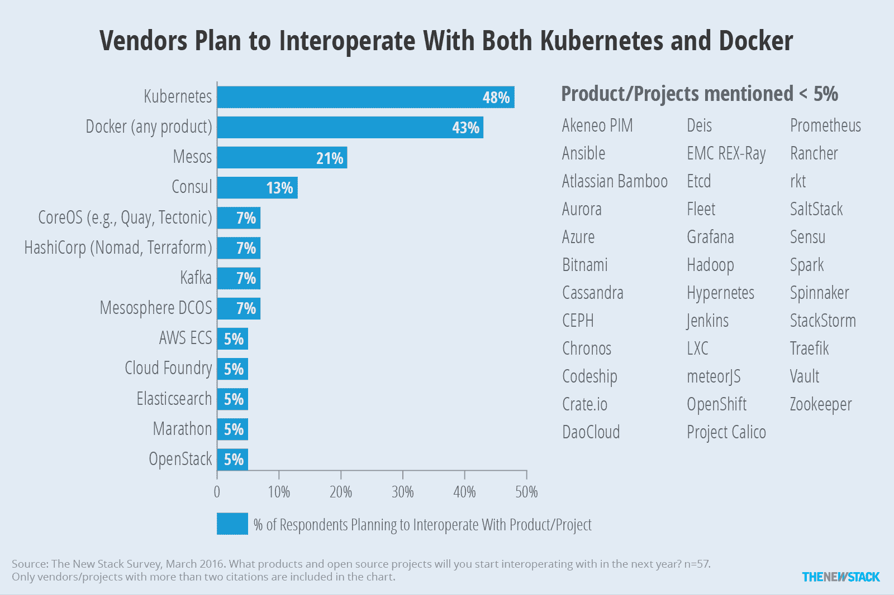
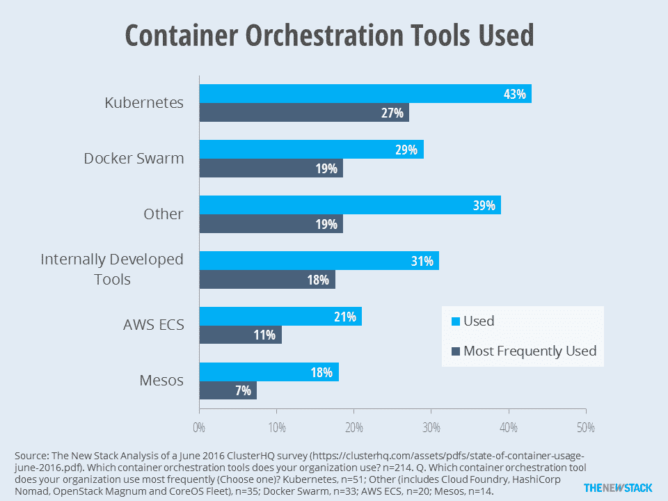

# Supergiant 构建于 Kubernetes 之上，用于管理分布式应用的多租户

> 原文：<https://thenewstack.io/supergiant-builds-kubernetes-manage-multi-tenancy-distributed-applications/>

 [研究报告

一个完整的公司生态系统正在被创建，以使 Kubernetes 成为企业级产品。虽然一些公司能够为其他容器环境提供支持，但其他公司只关注 K8s 领域。

**Supergiant** 是一个运行 Docker 容器的框架，托管有状态的集群应用。它在幕后利用 Kubernetes，并在 Kubernetes 不能达到目的的情况下拥有自己的结构和代码，如持久存储和外部负载平衡。它提供了 Kubernetes 的调整版本。其主要产品是企业级支持。

**ElastiKube** 是 Kubernetes 的一个管理平台，目标是为容器化的应用程序提供自助服务体验。它由 ElasticBox 创建，后者于 2016 年 6 月被 CenturyLink 收购。

**StackPointCloud**是一项测试服务，允许用户在他们选择的云提供商处轻松创建、扩展和管理任何规模的 Kubernetes 集群。——**劳伦斯·赫特**](https://thenewstack.io/parity-check-container-orchestration-mean/) 

提供托管弹性搜索服务的 [Qbox，](https://qbox.io/)的团队喜欢讲述这家白手起家的公司是如何从工程师疯狂地通宵工作支持票和淹没在成本中，到在基础设施上节省 50%，获得更好的稳定性和性能，以及获得一些睡眠。

它很快发现专用的虚拟机模型不适合这种计算密集型应用程序。然而，虽然它决定考虑 Docker 容器，但它希望避免“嘈杂的邻居”问题，这种问题在具有 SaaS 产品的共享基础架构上很常见，并避免数据库等有状态应用程序的性能问题。

Qbox 将如何为客户的资源“爆发”需求提供扩展空间，同时提高利用率——利用率一直低于 30%——以及相关的 it 浪费？

它在开源集群管理器 [Kubernetes](/category/kubernetes/) 中找到了答案，这使得在多租户环境中运行分布式应用程序更加容易，并提供了对资源共享的粒度控制。

Qbox [将其在该领域的三年经验与 Kubernetes 相结合，创建了开源项目](http://supergiant.io/about) [Supergiant](http://supergiant.io/) ，这是一个管理 Kubernetes 集群上任何分布式应用的框架。它在 GitHub 上可用，在 Apache 2.0 下获得许可。

“当用户批量索引时，我们会遇到问题。他们的计算资源将被完全占用，因为他们在虚拟机上。Qbox 首席执行官马克·布兰登说。

“使用 Elasticsearch，如果您达到计算资源的极限，它将停止提供搜索结果，我们的客户经常会遇到这个问题。取而代之的是 Supergiant，它拥有单租户的所有优势，比如没有“吵闹的邻居”，但拥有多租户的所有优势。他们使用的硬件比分配给他们的大得多。

“如果你有一个像 Elasticsearch 这样的突发应用，你可以优雅地控制过剩，而不是停止，”他说。

所以它提供了更多的性能，更少的门票和更低的成本。以前只适用于 AWS，Supergiant 刚刚添加了 Digital Ocean，并在路线图中加入了 Google Cloud、Rackspace 和 OpenStack。

## Kubernetes 扩展

根据 Brandon 的说法，容器和 Kubernetes 都不能很好地处理分布式应用，而这正是 Supergiant 的用途。

“我们不是要取代 Kubernetes，而是要增加 Kubernetes。“Supergiant 更像是 Kubernetes 的延伸，”他说。

Supergiant 的核心功能是组件，本质上是一个微服务，在一个应用程序中只做一件事。一个组件是一个服务、复制控制器和 pod，它们都被包装在一个对象中。它以一种易于管理的方式整合了部署复杂拓扑所需的所有 Kubernetes 和云操作。开发人员可以使用公开可用的配方，也可以保留自己的私有存储库。

对于容器中的有状态应用程序,“您需要指定 RAM、卷、处理器数量、实际的容器本身——它的位置、安全设置。有了 Elasticsearch，你不必做主从配置，但你可以，”布兰登说。

“使用 Supergiant，只需一键操作。您需要多少节点就有多少节点，它将自动扩展，它将在节点可用时自动连接和重新连接卷，它将实现负载平衡，等等。”

Supergiant 自动设置入口点，将负载平衡器和 **[kube-proxy](http://kubernetes.io/docs/admin/kube-proxy/)** 设置包装到一个可配置对象中。Kube-proxy 将流量从外部路由到内部的正确容器。入口点可以在组件和应用程序之间共享，尽管这不是 Kubernetes 的特性。

与名称空间不同，Supergiant 使用术语 application 来更容易地理解 Supergiant API 中的结构。API 将所有配置放入一个简单的配置中，可以导出、导入或与其他 Supergiant 用户共享。

Supergiant 将重点放在四个方面:安装、持久存储、负载平衡和自动伸缩。

它不使用 Kubernetes 的持久卷。相反，在 AWS 上，它使用弹性块存储(EBS)。这些卷会在节点服务器重新启动后保持不变，从而确保节点停机时数据不会丢失。

Supergiant 的工具管理持久存储的方式允许您动态迁移数据、更改硬盘大小或类型。

据 Brandon 说，这个超级巨人团队还创建了自己的外部负载平衡，这对于使用 Kubernetes 的分布式应用程序来说“不够理想”。

## 前方的路

布兰登说，Supergiant 很快获得了 Qbox 的足够兴趣，可以提供支持的版本。

其用户包括平面设计市场 [99designs](https://99designs.co.uk) 、餐厅外卖服务 [DoorDash](https://www.doordash.com/) 、手机应用开发公司 [3 Sided Cube](https://3sidedcube.com/) 和课堂社区网站 [ClassDojo](https://www.classdojo.com/) 。

不再自举，费耶特维尔，阿肯色州。总部位于美国的 Qbox 已经筹集了 286 万美元。

Supergiant 的路线图侧重于简化部署。布兰登预见了 Elasticsearch、Redis、MongoDB 和其他网站的一键式版本。该公司还希望在 Kubernetes 上添加自己的监控应用程序、安全应用程序等。

[数字海洋](https://www.digitalocean.com/)是新堆栈的赞助商。

专题图片:NASA 戈达德太空飞行中心的“恒星形成实验室”，获得 CC BY-SA 2.0 许可。

<svg xmlns:xlink="http://www.w3.org/1999/xlink" viewBox="0 0 68 31" version="1.1"><title>Group</title> <desc>Created with Sketch.</desc></svg>