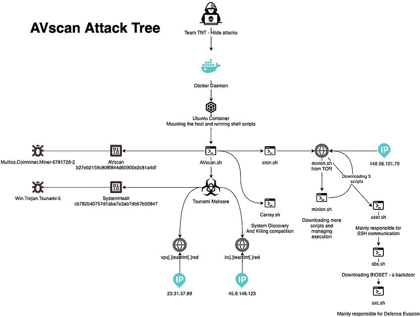

# 供应链攻击和云原生:你需要知道的

> 原文：<https://thenewstack.io/supply-chain-attacks-and-cloud-native-what-you-need-to-know/>

拉妮·奥斯纳特

拉妮是 Aqua Security 公司战略和产品营销副总裁。他在企业软件公司工作了超过 25 年，涉及项目管理、产品管理和市场营销。

在过去的几年中，软件供应链攻击有所增加，其中最突出的例子是太阳风攻击。随着生产环境获得了多层保护和安全团队的大量关注，恶意行为者将目光投向了“毒井”，即瞄准开发应用程序或其构建块组件的地方。这是在(大部分是正确的)假设下完成的，即开发环境不像产品环境那样受到严密的审查，并且目标是正确的组件，例如，那些被广泛使用的组件，一旦它被部署而未被检测到，最终会使攻击能够访问许多生产环境。

一旦攻击者成功渗透供应链，他们能做什么？很多事情。近年来，许多观察到的云中攻击的最终目标是加密货币挖掘，这是有害的，如果不是危险的话。然而，我们也看到了针对数据盗窃、凭据盗窃、拒绝服务攻击基础设施(bots)的攻击，以及可以根据发现的情况逐步扩展到多个目标的攻击。

但是这对云原生环境意味着什么呢？云原生应用是否更容易受到供应链攻击？我将试着回答这些问题，用 Aqua 在野外观察到的攻击的网络研究结果来举例说明我的观点。

## **对云原生供应链的威胁**

云原生应用程序开发环境有几个特征，这使得它们成为寻求将恶意代码嵌入供应链的攻击者的有利目标。

首先，云原生应用程序开发的特点是广泛使用开源组件，通常从公共注册中心获得。虽然许多开源项目得到了很好的治理，并受到了很多人的审查，但有些项目却没有，这使得恶意的参与者可以伪装成贡献者。更老练的攻击者也可以用静态代码扫描极难检测的方式嵌入恶意软件。攻击者在供应链中的位置越高，他们广泛传播其代码的机会就越大，这就是为什么更高级的攻击者会寻找可能在许多不同的应用程序中重新出现的广泛使用的包。

此外，容器映像、函数和包使用 CI/CD(持续集成/持续交付)管道频繁更新，为攻击者创造了将自己嵌入流程的多种机会。Aqua 的网络研究团队 Team Nautilus 已经检测并分析了对 CI SaaS 环境的攻击，这些攻击滥用 CI 进程本身来获取对云 CPU 时间的访问。从那里，进入那些 CI 管道中正在构建的工件是一个相对较短的跳跃。

## **观察到的攻击媒介**

我们对野外针对集装箱和 Kubernetes 环境的攻击的网络研究显示了不同程度的复杂性和规避技术。从相对简单到更高级，我们看到:

*   [将恶意图像放入公共注册表](https://blog.aquasec.com/container-security-tnt-container-attack)，要么是为了将它们放入受损环境，要么是希望有人会使用它们。
*   将恶意代码隐藏在良性的“普通”图像中，希望开发人员在不知道图像中隐藏着什么的情况下使用它们。我们也看到了在这方面使用的“错别字占用”，其中一个流行的图像名称被故意拼错——例如，“tesnorflow”而不是“tensorflow”。
*   [通过使用无法根据其签名识别的多态、不断演变的恶意软件来逃避恶意软件的静态分析](https://blog.aquasec.com/crypto-mining-malware-container-security)，并在映像作为容器部署和运行后调用附加组件。
*   通过[直接在主机上构建映像](https://blog.aquasec.com/malicious-container-image-docker-container-host)，绕过 CI/CD 管道中的控制。
*   [滥用基于云的 CI 工具](https://blog.aquasec.com/container-security-alert-campaign-abusing-github-dockerhub-travis-ci-circle-ci)，攻击者利用免费的 SaaS 产品，在构建应用程序的幌子下运行加密货币挖掘。

图 1: AVScan 攻击树，显示了逐步分支和恶意软件下载(来源:团队 Nautilus，Aqua)

在这些攻击的不同阶段，恶意行为者会执行渐进的、越来越严厉的操作来实现他们的目标，并在环境中建立持久性，即，使他们能够在特定的容器、主机甚至集群之外继续攻击。

## 这种情况下有什么好消息吗？

谢天谢地，是的。云原生应用程序的固有特性使其更能抵御攻击，并能够限制攻击造成的损害:

*   管道中的高度自动化允许开发人员嵌入控制，这些控制可能会检测到供应链攻击，或者至少使供应链攻击更难成功。(下一节将详细介绍)。
*   由于云原生工作负载的编排和通常短暂的性质，攻击者极难持久。当像 Solarwinds 攻击这样的攻击发生并感染某处的 Windows 服务器时，该 Windows 服务器可能会以相同的权限、相同的 IP 地址运行，几个月甚至几年都没有停机或升级。相比之下，在大多数云环境中，无服务器功能通常运行几秒钟，最多 15 分钟，这将限制潜在的损害。
*   cloud native 的可观察性要优越得多。感谢像 [Tracee](https://blog.aquasec.com/ebpf-container-tracing-malware-detection) 这样的开源工具，我们可以获得关于每个进程、每个网络连接、每个事件的非常详细的实时信息。在流程级别、功能级别或容器级别，更容易检测异常并将其隔离。

消除供应链攻击的风险实际上是不可能的，但是开发人员和安全团队可以采取一些措施来降低这种风险:

*   **控制对公共注册表和开源组件的访问:**通过限制可以访问公共映像和包的人数来降低风险，并为基本映像创建一个有管理的内部注册表。实施一个流程以确保仅使用可信映像。
*   **对映像进行数字签名或使用其他方法维护开发到生产映像的完整性:**确保您正在部署的映像与您审查过的映像相同，并防止在预定义的管道之外部署映像——例如使用 Kubernetes 准入控制器。
*   **隔离您的开发/试运行环境:**如果您的供应链被成功渗透，攻击者可能会试图进入相邻的环境，即使没有针对生产环境获取管理凭证、敏感 IP 或源代码等信息。请确保对访问进行鉴定，并将其限制在特定的 IP 地址(或 VPN)。
*   **使用静态和动态分析扫描图像中的恶意软件:**虽然使用静态、基于签名或基于模式的工具扫描图像和功能中的恶意软件有一定的价值，但更复杂的攻击现在通过分阶段进行攻击来规避这种技术——在图像中嵌入看似无害的小组件，然后仅当图像作为容器运行时才下载和运行额外的恶意软件。为了检测这种恶意软件，您需要使用动态分析和跟踪方法来观察容器在安全沙箱中的行为。
*   **使用入口/出口网络控制和允许列表:**许多类型的恶意软件将需要与外界的网络连接，用于命令和控制，用于下载额外的恶意软件组件，或者用于泄漏敏感数据或加密货币哈希。
*   **监控您的运行时环境:**尽管存在上述问题，如果您的供应链被渗透，这最终会在您的生产环境中表现为异常活动。

供应链攻击已经存在并将继续发展，组织应该调整其安全实践来检测、识别和缓解它们。

<svg xmlns:xlink="http://www.w3.org/1999/xlink" viewBox="0 0 68 31" version="1.1"><title>Group</title> <desc>Created with Sketch.</desc></svg>