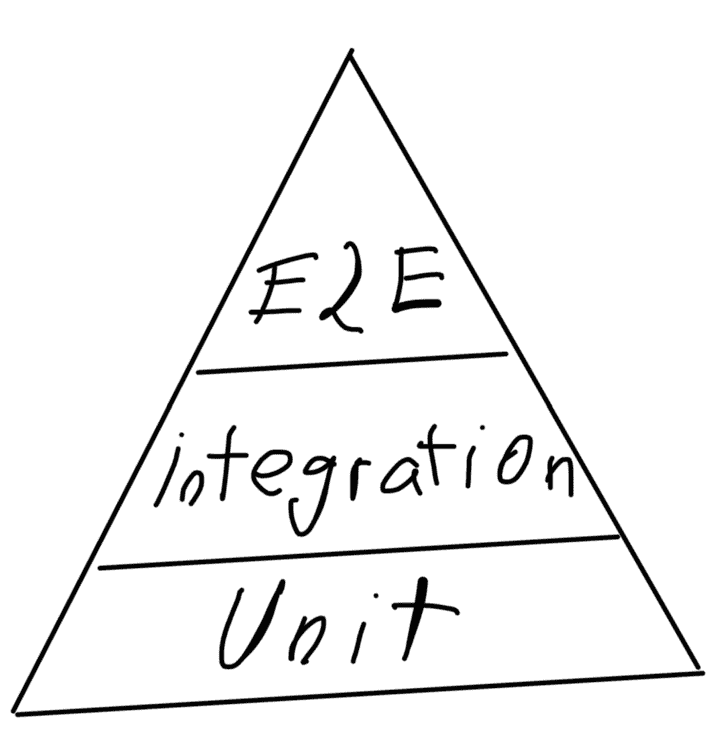

# 软件测试现在是每个开发人员的工作

> 原文：<https://thenewstack.io/surprise-software-testing-is-every-developers-job-now/>

我的一位编码指导老师亲切地将[软件测试](https://thenewstack.io/why-you-should-start-testing-in-the-cloud-native-way/)称为“编码的蔬菜”

然而，越来越多的公司在软件开发生命周期的早期优先考虑测试，旨在获得更好的用户体验(也就是项目时间线上的[左移](https://thenewstack.io/the-great-security-shift-to-the-left/))。

但是到底什么是测试，它做什么？虚拟演示软件提供商 [Prezi](https://prezi.com/?utm_medium=paid_mix&utm_source=paid_google&utm_campaign=&utm_content=&utm_term=&hsa_acc=3264047659&hsa_cam=15989335383&hsa_grp=&hsa_ad=&hsa_src=x&hsa_tgt=&hsa_kw=&hsa_mt=&hsa_net=adwords&hsa_ver=3&gclid=Cj0KCQjw1bqZBhDXARIsANTjCPJGNgR9Gh7N56uz-YEobYmkAyMcTMtCTZMsmyIrtD3AXilorjwsIxAaAiMwEALw_wcB) 的软件工程师 Attila Vágó 最近在[发表的一篇博文](https://engineering.prezi.com/testing-testing-1-2-3-is-this-thing-on-deff196939eb)就涉及了这个话题。

Vágó生动地将测试描述为“你的软件和客户的快乐之间的衬垫。填充物越薄，用户越不高兴，你就越能感受到他们的挫败感。”

用最基本的术语来说，测试是“过程、动作和代码的组合”，其目的是在最终用户有机会与之交互之前，确认网站上应该发生的一切都正确可靠地发生了。

测试回答了这个问题:解决方案满足需求吗？

好吧。测试可能有点性感。Vágó很早就提出了一些关于测试如何将人带到太空的事实。外太空。阿波罗制导计算机开发工作的 60%是软件测试。

如果测试对 NASA 来说足够好，对我们其他人来说也足够好。

## **测试金字塔**

Martin Fowler 著名的金字塔不包括静态测试，因为这些后来被加入到 Kent C. Dodds 著名的测试奖杯中。

**单元测试**:理解[单元测试](https://thenewstack.io/unit-testing-time-consuming-product-saving/)的一个简单方法是，单元测试测试应用程序的每一个单元。这对于测试带有输入和输出、辅助方法、对象、过程和模块的函数非常有用。如果它有一个或多个输入和一个输出，它可能需要一个单元测试。

**集成测试**:理解[集成测试](https://thenewstack.io/how-to-do-microservices-integration-testing-in-the-cloud/)的一个好方法是，集成测试测试所有单元之间的集成程度。这是在测试行为而不是输出。如果单击此按钮，它的行为是否符合预期？集成测试擅长测试 UI 的孤立范围，但不擅长测试主要的应用程序缺陷。

**端到端测试(E2E)** : Vágó称端到端测试为“测试中的大问题” [E2E](https://www.techopedia.com/definition/7035/end-to-end-test) 测试整个应用程序——所有用户流与所有相关的依赖关系。测试环境尽可能接近真实的生产环境，或者在某些情况下，接近生产环境。

*但是哪一层最重要呢？*看你问谁了。互联网上关于这一点的争论和其他事情一样多。这是如此的激动人心，以至于 Vágó将这场辩论称为“宗教狂热”，认为哪一层是最重要的。

但事实上，无论你实施哪种测试，你都不会出错，因为金字塔的三个层次都是必要的。编写单元测试、集成测试，并遵循 E2E 测试来进一步验证流程，可以极大地改善最终用户的体验。一个好的测试可以揭示架构问题和不尽如人意的 UX。这不是一个“非此即彼”的情况。

## **太多或不够**

未考虑边缘情况会产生**未充分测试**类别。很大一部分生产错误是由意外情况造成的，所以要测试意外情况。如果文本输入需要一个字符串，如果输入接收到一个空字符串会发生什么？如果字符串是一个名称，如果它全部是字符或空格会发生什么？顺其自然。如果 100%的预期结果被测试，那么这个单元根本没有被测试。

有许多特定的场景属于**太多测试**类别，但是它们都有一个共同点，那就是重叠和进行成本效益分析的技能(时间/$$$)。考虑单元测试和集成测试之间有大量重叠的情况。如果一切都整合得很好，那么它的功能也符合预期。通常有必要平衡可用的测试工具，以适当地分配资源和优先级。

在太多测试类别中突出显示的另一个例子是一个使用 React 测试库和 Cypress 的应用程序的更具体的实例。沉重的 E2E 层和同样沉重的集成套件集带来了持续的维护成本。因此，在这种情况下，如果应用程序有非常繁重的集成测试，请考虑将 E2E 缩减到整个流程，而不是测试所有内容。

## **质量文化**

但是这不是我的工作…惊喜！测试是每个人的工作！工作流编写代码，然后将代码发送给 QA 团队进行所有测试和 bug 报告的日子(如果曾经存在的话)已经一去不复返了。如果 QA 团队花在测试和编写错误报告上的时间是开发人员花在编写代码上的时间的两倍，那么问题就不仅仅是几个错误了。

鼓励质量测试的一个很好的方法是在 sprint 中留出时间来进行适当的测试。建议将 sprint 时间的 25%到 40%作为通过健壮测试来防止 bug 所需的时间。想象一下，如果测试是一种预先的想法而不是事后的想法，会发生什么变化。

测试不一定要单独完成；在团队之间分享棘手的测试用例。创建一个可以跟踪测试和 bug 的影响表。错误是不可避免的，但其中许多是可以预防的。实施良好的测试实践不需要马上从零到 100。开始任何新的东西，甚至改进某样东西都需要时间。即使从 50%的覆盖率开始，也将逐渐增长到 70%，在不太遥远的将来，70%将逐渐增长到 100%。

测试和解决独特的 QA 问题实际上是每个人的责任，是良好的日常开发实践的一部分，而不是“额外”的努力。Vágó说得好，“完美被高估了，但努力却没有。”

<svg xmlns:xlink="http://www.w3.org/1999/xlink" viewBox="0 0 68 31" version="1.1"><title>Group</title> <desc>Created with Sketch.</desc></svg>