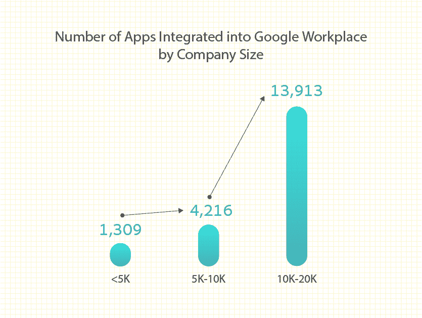
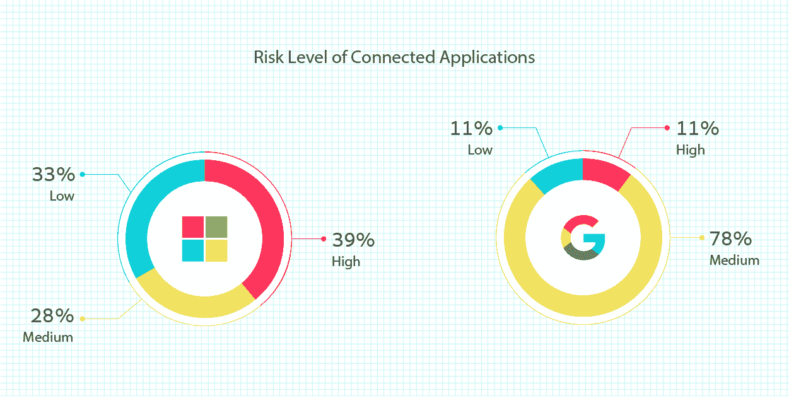
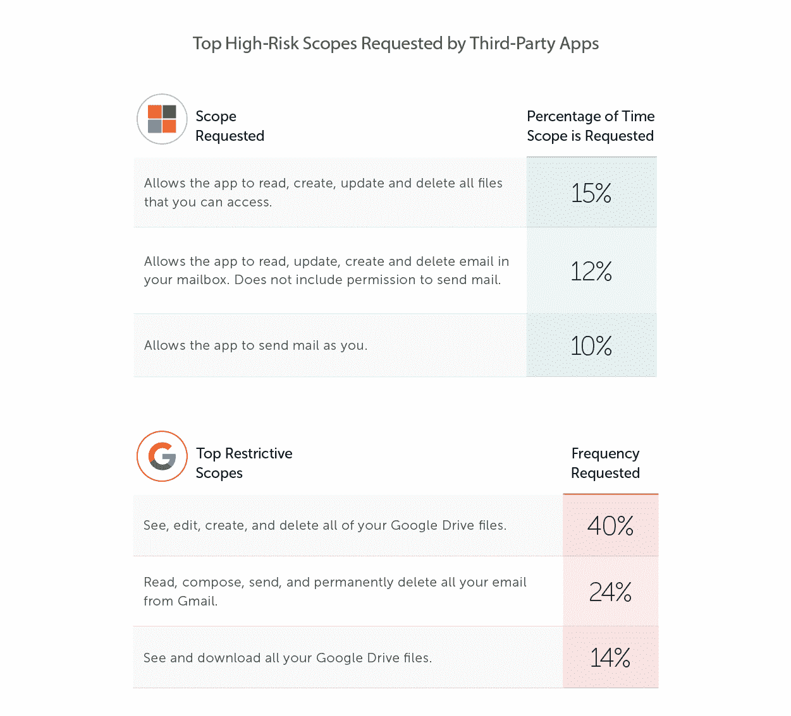

# 2023 年第三方应用访问报告的惊人结果

> 原文：<https://thenewstack.io/surprising-results-in-the-2023-third-party-app-access-report/>

员工总是在寻找提高效率和降低日常生活复杂性的方法。他们这样做的方法之一是将众多第三方应用程序连接到他们的 Microsoft 365 或 Google Workspace。例如，他们可能使用自动表单来增强 Google Docs 的表单构建功能，或者使用 Pixabay 免费图像来导入图像。这种从 SaaS 到 SaaS 的通道已经成为惯例；问题是它的安全含义通常被忽略了。

Adaptive Shield 最新报告，*[揭秘风险&第三方互联 app 的现实](https://www.adaptive-shield.com/saas-to-saas-3rd-party-app-risk-report-2023?utm_source=TheNewStack&utm_medium=sponsored_content&utm_campaign=tns_surprisingresultsinthe20233rd-partyappaccessreport) *，*深入剖析使用第三方 app 的风险。该报告有助于安全团队更好地了解该问题的范围和严重性，因为它回答了三个核心问题:*

 *1.  有多少第三方应用程序链接到公司的软件即服务堆栈？
2.  这些应用程序需要什么类型的权限？
3.  联网应用带来的风险有多真实？

## 出现了大量的连接

根据这项研究，拥有 10，000 名 SaaS 用户的公司平均有 2，033 个应用程序连接到微软 365，6，710 个连接到谷歌工作区。如图 1 所示，该报告表明，随着公司数量的增长，其联网应用的数量也在增长。

图一。用户与 Google Workspace 集成的平均应用数量。

了解第三方应用程序的风险不仅仅是这些应用程序的数量和被授予的权限级别。集成应用程序时，它会请求用户必须授予的特定权限。

## 用户向他们的应用程序授予重要权限

App 权限可分为低、中、高风险三类。根据授予的权限范围，应用程序可以施加相当大的控制。

如图 2 所示，连接到 Google Workspace 的所有应用程序中，近 80%被归类为中等风险。与此同时，39%的微软 365 连接应用程序是高风险的。

图二。连接到 Microsoft 365 和 Google Workspace 的应用程序的风险级别。

这些权限给公司带来了巨大的风险，因为应用程序可能会被威胁者接管，他们可以窃取、出售、加密或发布他们找到的数据。

## 第三方应用程序实际上能做什么？

在微软 365 中，27%的高范围应用可以读取、更新、创建和删除内容。许多应用程序拥有邮箱的完全访问权限，包括以用户身份发送电子邮件的能力。

Google Workspace 的高风险应用权限同样令人担忧。40%的高风险范围为应用程序提供了查看、编辑、创建和删除任何或所有 Google Drive 文件的权限，而 24%允许应用程序删除 Gmail 帐户中的所有电子邮件。

图 3。连接到 Microsoft 365 和 Google Workspace 的应用程序请求的顶级高风险权限。

这些权限为威胁参与者提供了访问、窃取或加密公司数据所需的一切。即使没有威胁因素，软件中的一个漏洞也会对公司的数据造成灾难性的后果。

## 从 SaaS 到 SaaS 的收获和见解

大量的联网应用给组织带来了巨大的风险，显然安全团队需要更深入地了解联网 SaaS 应用的数量及其权限

SaaS 安全解决方案，如 Adaptive Shield，通过提供对连接的应用程序和权限范围的全面可见性来保护这种攻击面。有了这些数据，安全团队可以为每个应用做出明智的决策，确保数据的完整性和安全性。

*下载完整报告《[揭露风险&第三方互联应用的现实](http://www.adaptive-shield.com/saas-to-saas-3rd-party-app-risk-report-2023?utm_source=TheNewStack&utm_medium=sponsored_content&utm_campaign=tns_arethirdpartysaasappsputtingyourdataatriskanewreport)》，了解更多关于 SaaS 互联应用危险的见解和观察。*

<svg xmlns:xlink="http://www.w3.org/1999/xlink" viewBox="0 0 68 31" version="1.1"><title>Group</title> <desc>Created with Sketch.</desc></svg>*