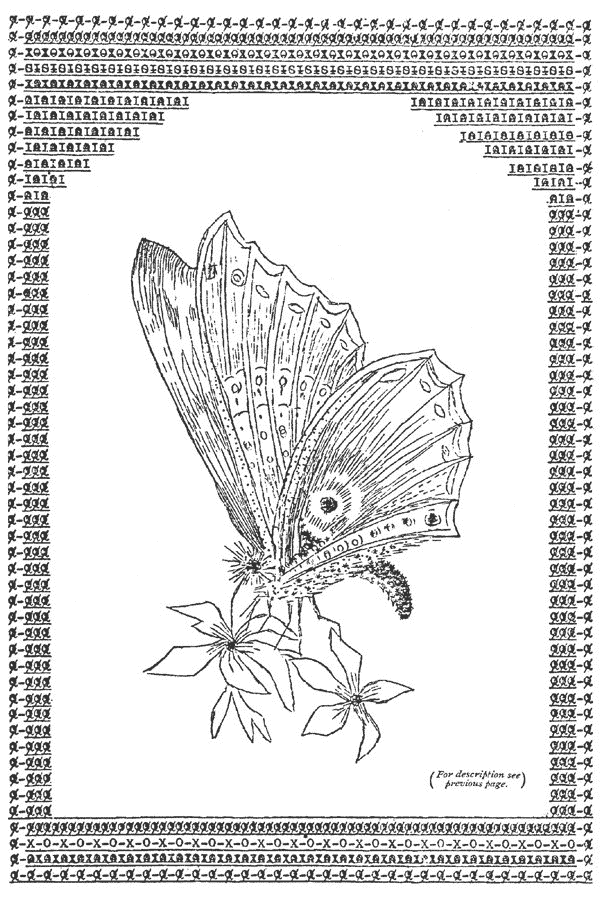
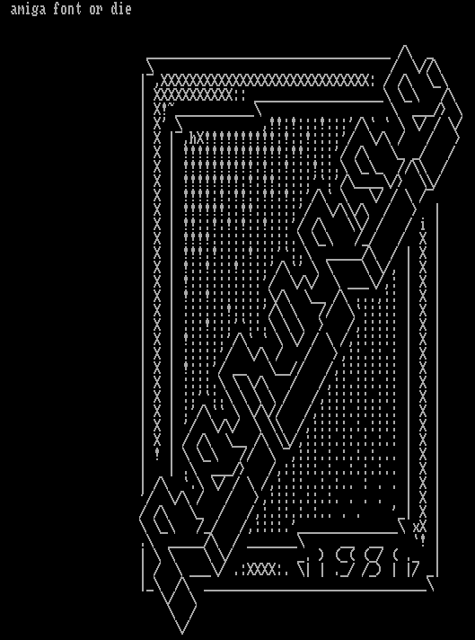
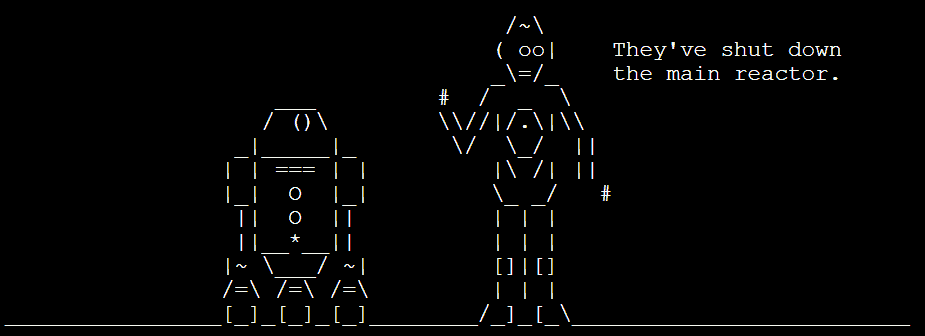

# ASCII 艺术令人惊讶的丰富历史

> 原文：<https://thenewstack.io/surprisingly-rich-history-ascii-art/>

最近有一些讨论评估了 ASCII 艺术的历史，以及对其未来的一些想法。

ASCII 艺术基本上是仅通过文本字符创建的图像，具体来说是在美国信息交换标准代码中指定的 128 个字符，这是一种用于电子通信的字符编码标准。

文字艺术比计算机早了很久。通过对这个话题的研究，我了解到，自从古希腊的*以来，人们就一直在玩弄文字的间距，这种现象有时被称为“具象诗”(或“[形诗”](https://en.wikipedia.org/wiki/Concrete_poetry))。*

*

乔治·赫伯特 1633 年的“复活节翅膀”

上个月，一些自称“sourcer Bot”[的人试图追溯我们今天称之为*文本*艺术的历史](https://blog.sourcerer.io/ascii-art-dead-or-alive-cc237391e5d8)，并实际上挖掘出了 1898 年的这个壮观的例子。

这幅由弗洛拉 F.F 斯泰西(Flora F.F. Stacey)创作的图像被收录在 2014 年出版的书籍“[打字机艺术，现代选集](https://www.amazon.com/Typewriter-Art-Anthology-Barrie-Tullett/dp/1780673477/)”中，该书指出，19 世纪的文字艺术家有一种不同的技术可供他们使用:“多次将纸张送入滚筒，每次都以不同的角度进行，以便对图像进行套印和微调。”

“维多利亚时代的女性速记员开创了一种独特的艺术形式”，BrainPickings.org 大学 2014 年的一篇论文称这本书为“一个美丽的寓言，讲述了所有的技术最终是如何被用来作为艺术和政治声明的不可预见的画布。”

## 进入 20 世纪

这本书还引用了 20 世纪 20 年代包豪斯艺术学院使用打字字符“作为探索构图和页面三维空间的一种方式。”

这张图片来自艾伦·里德尔(Alan Riddell)的一部现已绝版的作品，名为“[打字机艺术](https://hyperallergic.com/122363/typewriter-art-online/)”(1975)，试图捕捉这种艺术形式从 19 世纪 90 年代到 20 世纪 70 年代的最早演变。它的序言声称已经鉴定了“来自 18 个国家的 65 位从业者的 119 部作品。”(这本书的 PDF 格式[可以在网上](https://monoskop.org/File:Riddell_Alan_ed_Typewriter_Art.pdf)找到。)

还有其他一些早期的例子。一位文字艺术爱好者指出了一些 1939 年至 1948 年间出现在《大众科学》杂志上的例子[，“由艺术家在经典机械打字机上创作的”这甚至比 ASCII 标准被定义还要早几十年。](http://www.roysac.com/blog/2007/02/keyboard-text-art-from-over-twenty-years-before-ascii/)

但是，随着第一台计算机的出现，文字艺术有了全新的意义，这似乎是无可争议的，因为它提供了一种诱人的视觉传达信息的新方式。

你可以在一些最早的电脑游戏中感受到它的潜力——例如，《星际迷航》(1971)、《侠盗猎车手》(1980)和《网络黑客》(1987)中的地图。

不可避免地，人们无法抗拒试图创造艺术的挑战。Ninja 网站亲切地保存了一些 1981 年的早期艺术作品:

随着这十年的推移，拨号公告板系统采用了文本艺术来欢迎他们看不见的访客——这是一种失落而不为人知的民间艺术，被视为使他们的服务更加花哨和视觉化的一种方式。有时，他们用当时大多数个人电脑支持的颜色和“扩展”ANSI 字符集来扩充他们的作品。我的一个朋友指给我一个“Shawn-Da-Lay Boy Productions 的纪念品，它在 20 世纪 80 年代末创作了这幅杰作:

BBS 专门提供可以下载的文本文件——这些文件也不时地被精心制作的文本艺术所增强:

最终，BBS 被拨号上网所取代。但是在网络世界完全采用网络浏览器(它提供了第一个结合实际图像和文本的简单方法)之前，还需要几年时间。因此，互联网的早期仍然为崭露头角的 ASCII 艺术家提供了一个肥沃的环境。在 20 世纪 90 年代初，互联网仍然是一个非常基于文本的媒体，提供基本的服务，如电子邮件，互联网中继聊天，以及在新闻组上阅读(和留下)消息的能力。

人们*费力地*处理他们的“签名”文件，试图让他们的信息结尾给他们的联系方式增添一点活力。以下是我最喜欢的几个，它们从 1994 年起就一直留在我硬盘上一个被遗忘的文件里…

甚至还有一个新闻组，它的唯一目的是嘲笑过分精心制作的东西。违反网络礼仪规定的四行限制的新闻组发帖人的签名文件。该新闻组以其主犯之一的名字命名，名为 alt . fan . wardrome。

当然，还有一个新的新闻组小组致力于*欣赏*日益流行的艺术形式——alt . ascii-art

对于文字艺术爱好者来说，那是一个神奇的时代。一个叫 Christopher Johnson 的人早在 1995 年就注册了域名 Chris.com，显然从那以后他已经用这个域名托管了超过 23 年的 ASCII 艺术库。

我永远不会忘记我自己在 1994 年对 ASCII 艺术的尝试…

## ASCII 战争艺术

这一切都是从某个聪明人坚持认为互联网不如 Prodigy 这样的拨号上网服务开始的。看起来他几乎是在挑战人们对他签名中粗俗艺术的嘲笑。

首先，我在引用他的帖子时开始使用他的作品…

最终，我将它用于我自己的讽刺 ASCII 艺术。

有一次，我甚至创造了自己的表情符号来表达一种特殊的情绪——他的观点“甚至会让一只老鼠无聊死。”

**8o—**

很快我就上传了我自己的抽象杰作——比如“米奇把他的手指伸进了电灯插座”

很快它就有了自己的生命。这成了“我的事情”——只用键盘符号就能画出有趣的图画。

沉醉于成功，我的 ASCII 艺术图像变得越来越精致…

我愉快而又煞费苦心地制作了这些图片，让它们适合各种场合:

24 年过去了，我仍然记得用键盘上的字符制作艺术品时那种令人眩晕的兴奋感。整个经历绝对令人陶醉。这是*的乐趣*，但以一种近乎原始的方式。这感觉就像是释放了人类原始的渴望，在一个共同认可的时刻联系在一起。

在它最好的时候，感觉*神奇* …

还有很多其他人也在玩 ASCII 艺术。1995 年国际混淆 C 代码竞赛中的一个参赛作品甚至被隔开，因此它的命令[形成了二进制逻辑端口如何执行加法的图表](http://www.ioccc.org/1995/heathbar.c)。

1999 年还出现了 Unix 命令 [cowsay](https://en.wikipedia.org/wiki/Cowsay) :

## 光辉岁月？

很难摆脱这种感觉，即这是文字艺术的“光辉岁月”——它的衰落与网络的崛起不谋而合，这使得在文本中嵌入真实的图像文件变得更加容易。

维基百科的 ASCII 艺术条目记得“[书呆子男孩的冒险](https://web.archive.org/web/20060206031238/http://www.nerd-boy.net/%20)”，这是一个原始的 ASCII 艺术漫画，从 2001 年到 2007 年的六年间被上传到 alt.ascii-art 新闻组——但它显然没有什么野心。“我很无聊，想画一些打羽毛球的人……”作者[在一页](https://web.archive.org/web/20070621170154/www.nerd-boy.net/about.php)上回忆道。

岁月流逝，带来了壮观的视频游戏图形，真正的虚拟现实耳机——年复一年，似乎没有人再摆弄 ASCII 艺术了。最近的所有讨论都让我感到疑惑:在一个充满表情符号、位图符号和轻松分享真实照片的世界里，ASCII 艺术还有一席之地吗？

简而言之，我认为它将永远受到欢迎——而且我不是唯一一个。Slack 实现了一个/耸肩命令，它会在你的消息末尾添加一些适当的 ASCII 艺术。

**¯\_(ツ)_/¯**

Sourcerbot 的文章指出，直到今天，仍然有 ASCII 艺术档案

[on Pinterest](https://www.pinterest.co.uk/techfeelings/ascii-art/?lp=true)

和一个论坛

[on Reddit](https://www.pinterest.co.uk/techfeelings/ascii-art/?lp=true)

.

谁知道接下来会把我们引向何方？当 Sourcererbot 的历史[出现在黑客新闻](https://news.ycombinator.com/item?id=16411059)上时，它引发了一些有趣的讨论。有人一定要推荐整部电影"*《星球大战》* "的伟大的 [ASCII 文本翻译——这显然是一个 18 年的项目。](http://www.asciimation.co.nz/)

但也有人分享了自己的实验:[将视频转换成 ASCII](https://news.ycombinator.com/item?id=16412225) 。“我开始将视频转换为 8 位颜色，在这个过程中，我尝试了像素化，然后突然有点跑题了……”

[https://www.youtube.com/embed/oRdrMM20keI?feature=oembed](https://www.youtube.com/embed/oRdrMM20keI?feature=oembed)

视频

“这是一次有趣的学习经历，”他们写道，并补充了一个似乎可以概括总体情绪的想法。

“显然，我认为 ASCII 艺术不会有任何发展……”

* * *

## WebReduce

<svg xmlns:xlink="http://www.w3.org/1999/xlink" viewBox="0 0 68 31" version="1.1"><title>Group</title> <desc>Created with Sketch.</desc></svg>*