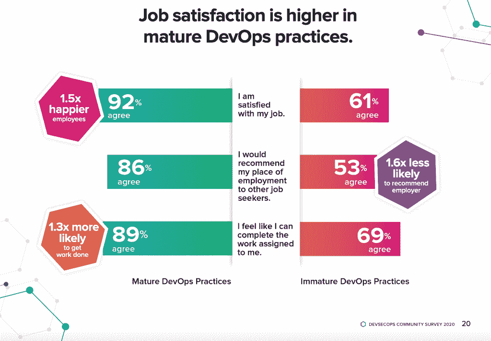
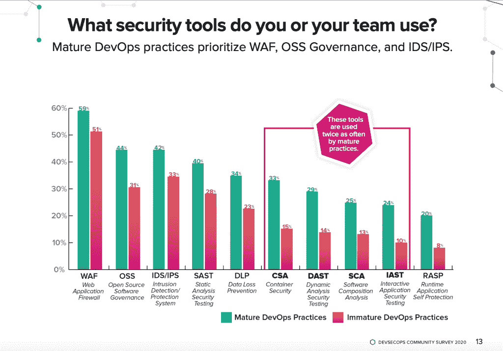
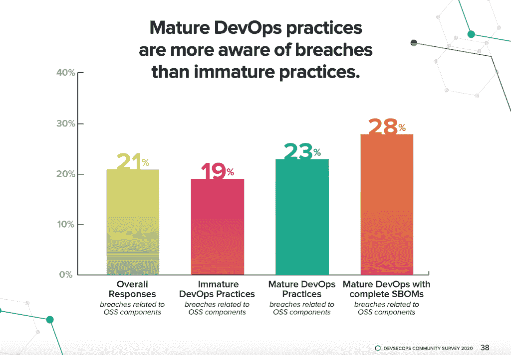

# 调查:快乐的开发者生产更安全的软件

> 原文：<https://thenewstack.io/survey-happy-developers-produce-more-secure-software/>

[Sonatype](https://www.sonatype.com/) 赞助本帖。

 [DJ 施林

DJ 是 DevSecOps 的先驱、倡导者和安全架构师，并为采用 DevSecOps 实践的组织提供思想领导。他鼓励组织将安全和信任文化深深融入到他们的核心价值观和产品开发过程中。](https://www.linkedin.com/in/djschleen/) 

快乐的开发人员更加投入工作，并因此产生更好的业务成果，这并不奇怪。但是快乐的开发者会生产出更安全的软件吗？根据我们的 [2020 DevSecOps 社区调查](https://www.sonatype.com/2020survey)，答案是肯定的。原因也不是无限量的红牛！

我们调查了来自 120 个国家的 5，045 名开发人员，以了解 DevSecOps 的新兴趋势。我们还想了解哪些实践影响了开发人员的喜悦。我们发现在具有成熟 DevSecOps 实践的团队中工作的开发人员是最快乐的。这些开发人员几乎有两倍的可能性:

*   说他们喜欢自己的工作(可能性增加 1.5 倍)
*   完成工作(可能性提高 1.3 倍)
*   鼓励朋友来和他们一起工作(可能性增加 1.6 倍)

那么什么是成熟的 DevSecOps 实践呢？根据 New Stack 对 Sonatype 副总裁 Derek Weeks 的播客采访，调查参与者被要求评估他们组织的 DevOps 成熟度等级。这些信息与其他数据点相关联，比如他们使用了什么工具。

“那些说自己成熟的人，”Weeks 评论道，“他们用的是什么工具？那些说自己不成熟的人，他们用的是什么工具？他们正在接受什么培训，等等。我们发现这两种人群之间存在巨大差异。”

[第 112 集:Derek Weeks 副总裁 Sonatype——一家成功开发店的秘密](https://thenewstack.simplecast.com/episodes/episode-112-derek-weeks-vp-sonatype-the-secrets-of-a-successful-devsecops-shop)

那么这些特征是如何影响生产更安全软件的实践的呢？至少有四种相关性使他们比那些不太快乐的人更优秀。

### 快乐的开发人员喜欢(或热爱)他们的工作

员工满意度有短期和长期的影响。从短期来看，满意的员工往往有更多的内在动力来做好自己的工作。从长远来看，员工满意度稳定了团队更替。工作满意度也增加了成功合作所需的人际熟悉度和信任度。

正如社会科学家 Arnold Bakker 在[中报道的一个基于证据的工作投入模型](https://journals.sagepub.com/doi/full/10.1177/0963721411414534):

“敬业的员工更乐于接受新信息，工作效率更高，也更愿意付出更多努力。此外，敬业的员工会主动改变工作环境，以保持敬业精神。”

因此，快乐的开发人员在积极的文化中茁壮成长就不足为奇了，这是 DevSecOps 团队的基础。

我们的调查支持这项研究。在成熟的 DevOps 实践中，开发人员的工作满意度最高。成熟 DevOps 组织中超过 92%的开发人员表现出高水平的工作满意度。相比之下，在不成熟的开发运维实践中，61%的业内同行以积极的方式描述了他们的工作满意度。

Sonatype 的 Weeks 还评论说,“脾气暴躁”的开发人员抱怨管理层的方式与他们更快乐的同行之间有很大的差异。

Weeks 说，大约 44%的不满意的开发人员将他们团队中的摩擦归咎于高管和管理层，而只有 14%的满意的开发人员归咎于高管。“所以，就你在组织中看到的摩擦而言，这是一个巨大的差异？”他说。

### 快乐的开发人员效率更高

DevSecOps 社区调查也显示了成熟的 DevOps 实践和开发人员生产力之间的强相关性。在成熟的 DevOps 实践中，89%的开发人员说他们更有可能完成工作。相比之下，在不成熟的 DevOps 实践中工作的 69%的开发人员认为他们可以完成他们的任务。你愿意 10 个开发人员中有 7 个还是 9 个觉得他们能完成分配给他们的工作？我会随时接受这九个，尤其是当我们实施新的安全控制或试图在对手发现漏洞之前修复漏洞时。

对于开发人员来说，花时间在安全性上并不是一个新问题。连续三年，参加我们社区调查的 47%的开发人员表示，他们认为安全性很重要，但很难找到更多的时间花在安全性上。我们的数据显示，拥有成熟的 DevSecOps 实践的团队每天都在做更多的事情，并且做得更有效。这是因为成熟的 DevOps 实践更有可能实现自动化工具来帮助开发人员理解安全风险。

### 快乐的开发人员丰富了人才的获取和保留

有才华的开发人员倾向于认识同样有才华的同行，通常是跨专业的。这为企业带来了两大优势:人才获取和创新。两者都有安全隐患。

首先，快乐的开发人员表现出强烈的愿望来招募他人加入他们的组织。当被问及是否会推荐他们的公司作为其他人工作的好地方时，86%的成熟 DevOps 实践向他们的雇主竖起了大拇指。在不成熟的实践中只有 53%这样做(1.6 倍的差异)。在竞争激烈的市场中，一个充满快乐员工的团队会让你更容易去上班，也更容易招募新员工。

这很重要。福布斯[杂志](https://www.forbes.com/sites/johnhall/2019/05/09/the-cost-of-turnover-can-kill-your-business-and-make-things-less-fun/#5ac2c2be7943)上 [GrowthForce](https://www.growthforce.com/blog/the-real-cost-of-employee-turnover-its-more-than-you-think) 的总裁兼首席执行官斯蒂芬·金说，“替换一个知识型员工需要 8-12 周，然后再花一两个月，这种替换才能达到最高生产率。”。一名带来 100，000 美元收入的员工离职会给公司带来至少 25，000 美元的收入损失，更不用说这种中断了。这意味着拥有快乐的开发人员肯定是有成本效益的。

据 Weeks 称，拥有快乐的 DevOps 开发人员是吸引更多人才的好方法。

“做好本职工作的人，”他说，“会有人吵着要成为他们组织的一部分。”

其次，通过利用快乐的开发者的社交圈，具有成熟实践的企业吸引了新思想和观点的涌入。这是产品创新所必需的，也是安全创新所必需的。有安全意识的个人建立有安全意识的团队。

### 快乐的开发人员更快地发现安全漏洞

快乐的开发人员——在更成熟的 DevOps 实践中工作——也更有可能发现安全漏洞。我们在 2020 年 DevSecOps 社区调查中查看了成熟和不成熟 DevOps 团队之间的违规确认，发现 23%的成熟 DevOps 实践已经确认或怀疑违规与他们使用已知易受攻击的开源组件有关。相比之下，只有 19%不成熟的开发运维实践认识到了安全漏洞。在一些最成熟的开发运维实践中，组织的违规确认率高达 28%。

类似的模式也出现在我们的 2019 年 DevSecOps 社区调查中，其中更成熟的 DevOps 实践证实了更高水平的违规。为什么会这样呢？我们与许多 DevOps 领导者的交谈表明，成熟的文化奖励沟通、协作和分享新信息。他们“没有无声的失败”的文化(归功于丹·吉尔)奖励意识。在凤凰计划中，吉恩·金写道“说出真相是一种爱的行为。隐瞒真相是一种仇恨的行为。或者更糟，冷漠。”

享受工作、信任雇主并拥有支持信息共享的文化的员工更有可能传播违规意识。反过来，提高认识会进一步加快补救。

我们的 2020 年调查还显示，在成熟的 DevOps 团队中工作的快乐开发人员依靠谣言工厂发现安全问题的可能性降低了 3.8 倍。将成熟的 DevOps 团队视为“积极参与”的开发人员，而将不成熟的团队视为“脱离”

您关注得越多，支持您的工具就越多，您就越有能力保护您组织的应用程序和与之相关的数据。

### 幸福是文化的基础部分

更快乐的 DevSecOps 专业人员更容易去工作，完成工作，并使您的企业能够交付更好的结果。“建设幸福”本身就是一种实践。这是文化转型的核心部分，采用 DevSecOps 实践是成功的必要条件。如果您正在构建 DevOps 转型的业务案例，请分享“快乐因素”的证据快乐的开发人员生产率更高，构建的代码更安全，对业务也更有利。

对于那些寻找快乐开发者导致安全编码实践的更多证据的人，我们邀请你通读 [2020 DevSecOps 社区调查](https://www.sonatype.com/2020survey)。

来自 Pixabay 的 Istvan Pocsai 的专题图片。

<svg xmlns:xlink="http://www.w3.org/1999/xlink" viewBox="0 0 68 31" version="1.1"><title>Group</title> <desc>Created with Sketch.</desc></svg>