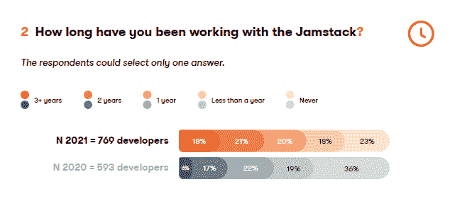

# 调查:Jamstack 用户关注的不仅仅是性能提升

> 原文：<https://thenewstack.io/survey-jamstack-users-look-beyond-performance-gains-next-js/>

对更好性能的追求可能不会推动对 [Jamstack](https://thenewstack.io/the-sweetness-of-jamstack-javascript-apis-and-markup/) 的需求。[“2021 年 Jamstack 现状”](https://kontent.ai/resources/state-of-jamstack-2021-report)报告指出，全球有 592 名开发人员目前正在使用 web 框架堆栈，其中只有 39%的人认为性能是使用它构建应用的三大原因之一。首要选择是安全性(45%)和成本效益(42%)。相比之下，在 2020 年的研究中，性能以 52%的比例位居榜首。不同之处在于，开发人员更有可能拥有至少一年的使用现代 web 开发架构的经验。

研究中发现的其他变化也可能归因于样本的差异。最值得注意的是，今年的研究包括了更大的公司，来自员工人数超过 250 人的公司的受访者从 2020 年的 41%上升到 2021 年的 57%。

该研究还询问了开发人员更喜欢使用哪三种静态站点生成器。Next.js 不再是被引用的领先框架，从 2020 年的 27%到 2021 年的 17%。下降的部分原因是开发商意识到还有其他选择。2021 年的调查增加了[统计](https://statiq.dev/)，发现 18%的人更喜欢使用。NET 框架。Angular 和 Angular hybrid 应用程序的框架被添加到问卷中，17%的 Jamstack 开发人员喜欢使用它。

与 [Luminary](https://www.luminary.com/) 共同赞助本报告的 [Kentico Software](https://www.kentico.com/) 的开发者传道者 Ondrej Polesny 认为，Next.js 采用率下降的另一个原因是，Jamstack 的新来者仍在试验以 web 为中心的内容管理系统，而 Next.js 的功能更符合企业级内容管理系统(CMSes)。

Kentico Kontent 是众多无头 CMS 选项之一。该调查询问 Jamstack 开发者最喜欢在哪里保存他们的内容。9%的人提到了 Kontent，而 38%的人更喜欢谷歌文档。 [GraphCMS](https://graphcms.com/) 已经上升到第二大最受欢迎的位置，从 2020 年的 14%上升到 2021 年的 24%。请注意，该调查并未提及 WordPress 或在其他传统系统中存储内容。一次使用多个 CMS，CMS 迁移和 [Jamstack vs. WordPress](https://thenewstack.io/jamstack-vs-wordpress-which-is-the-future-of-web-architecture/) 在可预见的将来是值得讨论的话题。

* * *

来源:[“jam stack 2021 的状态”](https://kontent.ai/resources/state-of-jamstack-2021-report)。2020 年，受访者仅来自澳大利亚、德国、英国和美国。2021 年，该研究分布在全球，31%的参与者来自亚洲。

* * *

<svg xmlns:xlink="http://www.w3.org/1999/xlink" viewBox="0 0 68 31" version="1.1"><title>Group</title> <desc>Created with Sketch.</desc></svg>