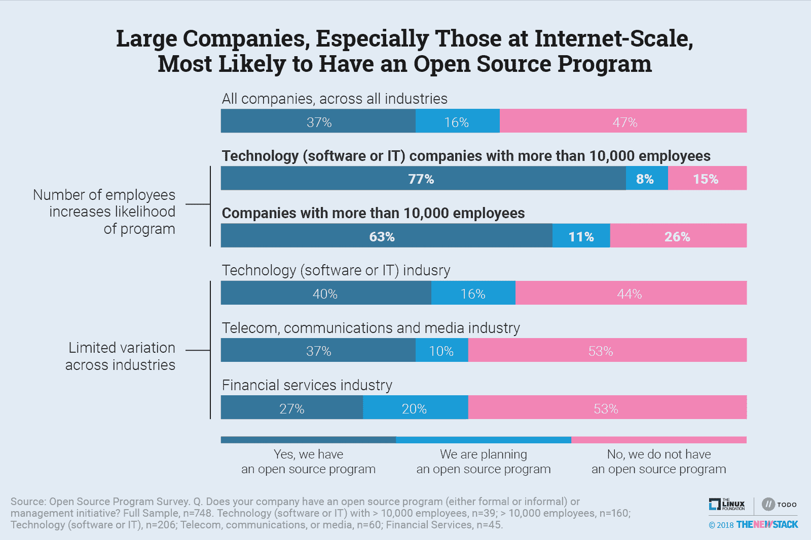
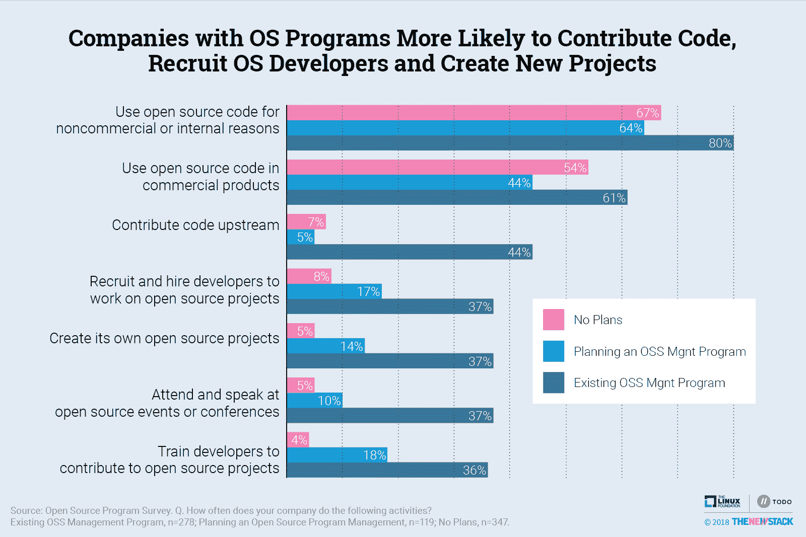
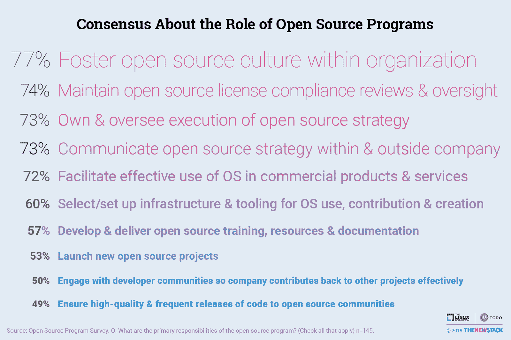
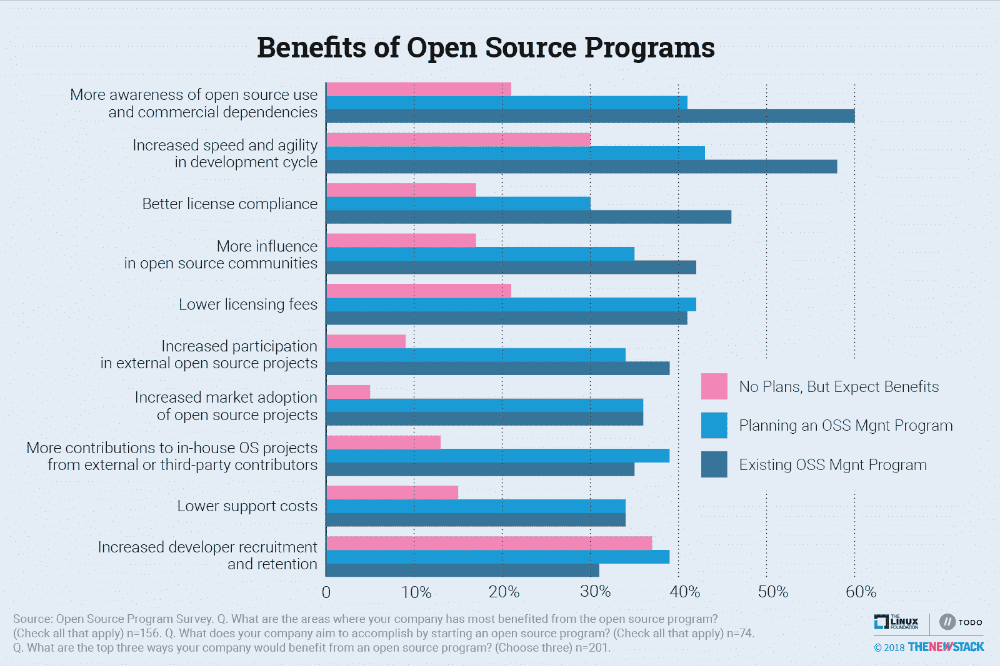
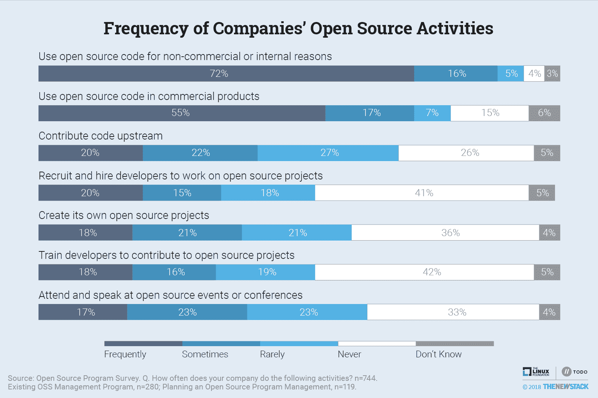
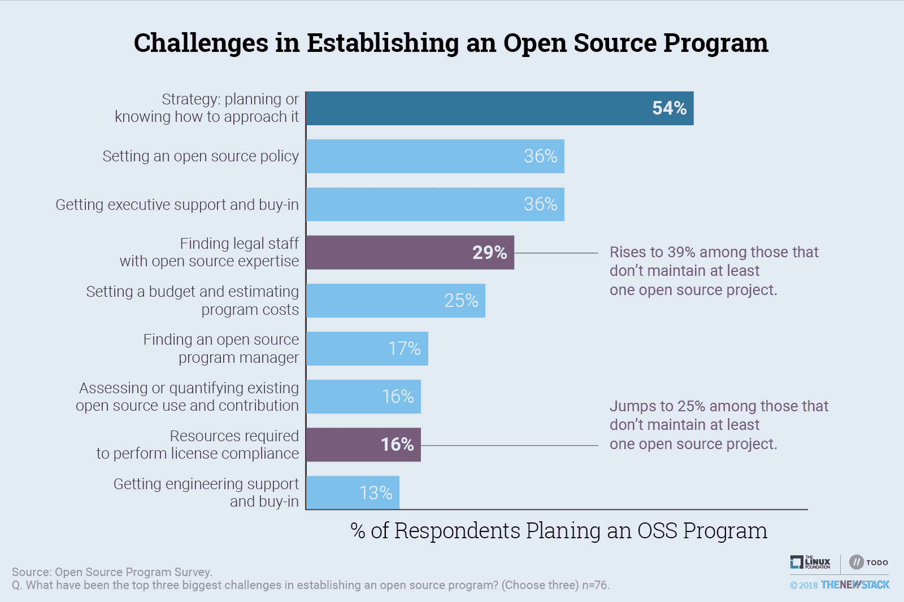
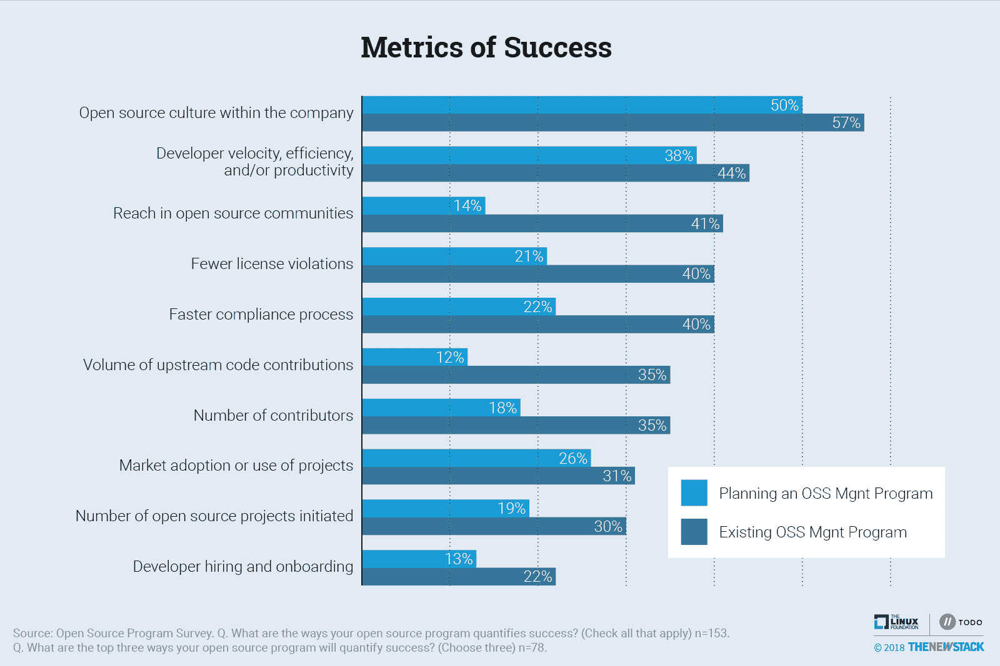
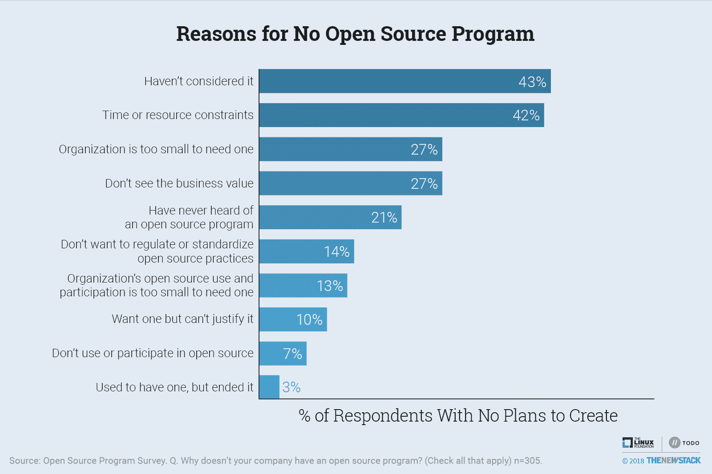
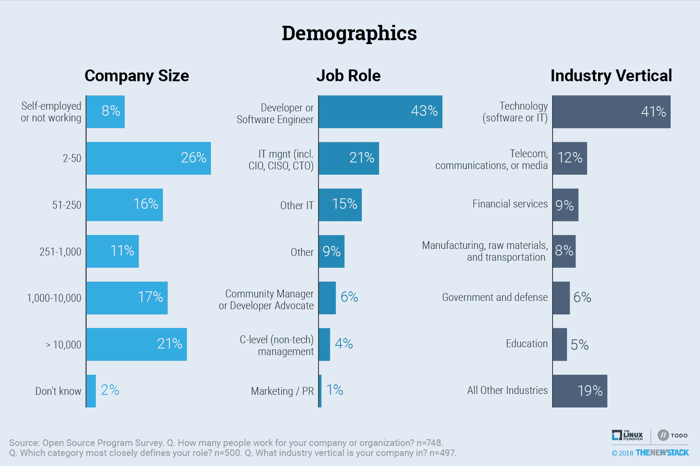

# 调查:开源程序是大公司的最佳实践

> 原文：<https://thenewstack.io/survey-open-source-programs-are-a-best-practice-among-large-companies/>

根据 New Stack 和[Linux Foundation](https://www.linuxfoundation.org/)(通过 [TODO Group](https://todogroup.org) )进行的一项调查，开源软件程序在组织如何采用 DevOps 和开源最佳实践方面发挥着重要作用。通过实施[开源最佳实践](https://todogroup.org/guides/create-program/)，组织正在帮助开发人员在管理他们业务所依赖的大量开源软件时变得更有效率和更有条理。

总共有 748 人向我们的调查提供了信息，其中将近一半是开发人员。公司规模具有广泛的代表性，21%的受访者在员工超过 10，000 人的大公司工作，42%的受访者来自员工不超过 250 人的中小型公司。本文末尾解释了调查方法。研究结果揭示了开源项目是如何组织的，以及它们在组织中扮演什么角色。

## 结果显示了什么

大型技术公司在建立开源项目以创造和培养最佳实践方面处于领先地位。他们庞大的开发团队严重依赖开源组件。在这个群体之外，所有行业都采用了开源程序，平均接近 37 %,但对这些程序的期望各不相同。其他重要的调查结果包括:

*   所有行业中超过一半的受访者(53 %)表示他们的组织有开源软件项目或计划建立一个。
*   大公司运行开源程序的可能性是小公司的两倍(63%比 37%)。)
*   根据自称在福布斯全球 2000 强公司工作的 49 名受访者，我们预计到 2020 年，拥有开源程序的大公司数量将增加两倍。

“互联网规模的公司推广开源程序，以提高工程效率并影响对其业务至关重要的软件生态系统。[托多集团](https://todogroup.org/)的联合创始人、[云计算原生计算基金会(CNCF)](https://www.cncf.io/) 的首席技术官 [Chris Aniszczyk](https://twitter.com/cra) 表示:“我很高兴看到其他组织纷纷效仿这种建立开源项目的最佳实践，以改善业务成果并帮助开源的可持续性。

被调查者认为他们公司的开源项目正在对公司的软件团队产生真正的影响。开源项目的成功已经在产品工程和 DevOps 团队中实现。超过 60%的参与计划的受访者认为他们的开源计划对业务至关重要，并对他们的工作能力产生了重大影响。

开源项目似乎培养了一种量化工程师和开发者贡献的文化。这一点变得至关重要，因为它支持基于微服务的云原生设计等现代架构。如果与利用开源技术进行应用程序架构开发的 DevOps 实践一起部署，这样的架构会变得更加有效。

数据表明，拥有开源项目的公司从开源代码和社区参与中获得了更多的好处。值得注意的是，44%拥有开源程序的公司向上游贡献代码，而其他公司的这一数字约为 6%。对外部项目的上游贡献是衡量公司处理维护/效率成本的承诺的最佳方式，也是健康开源文化的指标——在分析开源办公室提供的复合价值时，这是一个非常值得考虑的因素。

## 开源程序的好处

数以千计的开源项目都有来自拥有开源办公室的组织的参与者，他们消费——反过来又贡献给——任何数量的项目。这种兴趣显示了足够的结果，值得公司考虑更深入和更集中的方法来开发他们管理的开源办公室。

开源项目通常有三个核心特征:它们 1)执行和交流组织的开源软件策略，2)维护许可证合规性，最重要的是，3)培养开源文化。

将一个结构放在开源开发者和过程的周围似乎是违反直觉的，这在传统上已经超出了管理的范围。但是调查结果显示，这些程序具有积极的商业价值，并且改进了软件开发。根据调查，管理开源项目的三大好处是:1)了解开源的使用/依赖，2)提高开发者的灵活性/速度，3)更好的许可证合规性。

要点:这是一个让社区了解开源项目的好处的机会——加快开发速度和改进许可证合规性——这一点非常明显，展示了开源项目提供的价值。当将没有开源项目的公司与有计划或正在进行投资的公司进行比较时，结果尤其值得注意。

几乎所有(89%)拥有开源项目的企业都有内部维护的开源项目。事实上，46%的公司维持着 11 个或更多的项目。尽管创建操作系统项目并不是拥有一个项目的首要原因，但吸引外部对内部项目的贡献显然是已经运行和计划运行操作系统项目的公司的主要优势。

## 开放源码程序的新浪潮

云原生技术公司代表了以这种战略方式使用开源软件的第一批公司。这些组织中的工程师经常在开源软件开发中扮演积极的角色。

这些公司开源参与的成熟表现在对上游项目更高水平的贡献，以及他们自己项目的启动。

然而，正如许多先前的研究表明的那样，开源的使用在科技和非科技公司中已经变得司空见惯。这项调查支持这些结果:72%的被调查公司说他们经常出于非商业或内部原因使用开源软件，55%的公司使用商业产品。

在过去的两年中，随着一批新的开源程序的涌现，开源程序的根基越来越深。这些公司不太可能建立自己的项目，而更可能使用现有的开源技术。希望和期望是，随着政策的发展和开源文化的成熟，他们也将创建自己的项目。

值得注意的是，为什么有新生项目的公司会首先起步。43%计划开源项目的公司将开发周期中更好的速度和灵活性列为最大的预期收益。并列第二的最大预期收益是较低的许可费用以及开源文化的推广。如果这些羽翼未丰的项目启动新的项目，并提供真正的好处，我们预计他们将成熟为更正式的实体。

在很大程度上，开源程序是在公司的软件工程或开发部门中创建的(大约 41%的程序)。这类计划往往以非正式的方式开始——作为一个工作组或几个关键的开源开发者以及围绕开源许可和贡献的一系列政策——并随着时间的推移演变成正式的计划。总的来说，55%的开源项目的人说它是“正式的”，而在那些正在计划项目的人中，这个数字下降到 24%。

超过一半(52%)的公司拥有管理产品中操作系统代码及其依赖项使用的政策，46%的公司提供了可接受的许可证列表。除了在有开源项目的组织中，其他政策不太常见。例如，没有项目计划的人中只有 11%有项目上游的政策，而计划项目的人中有 26%和运行项目的人中有 65%有这样的政策。

## 创建和运行程序的挑战

运行一个开源程序确实有它的困难。一位受访者说，“在这一点上，投资回报率是负的。我们将其视为一项长期战略投资。”当被问及他们的三大挑战时，已经实施计划的公司的最高回答(39%)是预算和计划成本不足。除了预算问题，除了在组织内建立意识之外，似乎没有任何其他值得注意的挑战，这意味着尽管组织正在努力实现他们的使命，但这些努力需要时间。

在计划项目的 77 名受访者中，70%的人预计明年会这样做。随着他们的计划即将开始，54%的人说“战略:计划或知道如何实现它”是建立一个项目的最大挑战。建立开源政策和获得管理层的认同和支持是建立项目中接下来两个最常提到的挑战。组织需要解决有关制定政策的具体问题，这可能会推动他们自己开发开源程序，因为许多受访者认为这是一项具有挑战性的工作，因为公司已经制定了管理代码发布和贡献的政策。

没有维护自己的开源项目的公司更有可能提到寻找具有开源专业知识的法律人员和寻找执行许可证合规性所需的资源的挑战。尽管没有内部维护的 OS 项目的公司可能有不同的需求，他们仍然可以期待真正的方法来衡量成功。

参与现有和计划中项目的人被问及他们将如何衡量成功。尽管文化很难衡量，但它是被引用的首要指标。开发速度、效率和/或生产力是第二个最常见的指标。

拥有现有项目的公司更有可能使用其他类型的指标。几乎三倍多的从业者引用了追踪上游代码贡献的数量。大约两倍的人计算许可证违规的下降来衡量成功。

这些数据证实了新堆栈观察到的现象:拥有开源程序的公司有一种支持度量的文化，特别是在通过在线代码库观察到的活动方面。这种对可量化结果的关注解释了为什么这些开源程序对许多公司来说是业务关键的:他们期待开发者提高和/或产生产品收入，以及优化运营成本。

## 很多公司都没有计划，但是为什么呢？

尽管人们对开源程序有着广泛的兴趣，但 47%的受访者仍然没有运营开源程序的计划。当被问及为什么他们的公司没有开源程序时，43%的人说他们以前没有考虑过。换句话说，被调查者对开源感兴趣，并通过调查了解了开源项目。紧随其后的第二个理由(42%)是时间限制。27%并列第三，解释是组织太小或看不到商业价值。

高达 70%的没有项目的人认为，尽管存在挑战，但它会产生积极的影响。在那些不期望受益的人中，最主要的原因是组织太小。

## 方法学

501 人完成了调查，另有 247 名受访者的不完整数据被纳入分析。23 个回答被排除，因为它们似乎来自同一家公司(基于电子邮件地址、公司名称或 IP 地址)。数据清理使我们能够更自信地将数据解释为来自单个公司，而不仅仅是单个受访者。

公司规模具有广泛的代表性，21%的受访者在员工超过 10，000 人的公司工作，32%的受访者来自员工不超过 50 人的公司。43%的受访者是开发人员或软件工程师。41%的受访者表示他们在 IT 或软件公司工作，这一群体更有可能开展广泛的开源活动。

完整的数据集[可以在这里找到](https://github.com/todogroup/survey):

## 预言

这些数据可以用来预测未来两年内将会有多少开源程序。在查看了许多数据来源(例如，世界银行、LinkedIn)以及福布斯全球 2000 年全球最大公司名单后，我们创建了一个模型，该模型假设:1)至少有 6，000 家公司拥有超过 10，000 名员工；2)根据读者对技术公司的定义，200 至 500 家企业将符合描述范围。68 名受访者来自最大的科技公司，我们的样本涵盖了所有可能被调查的大型科技公司中至少 13%的公司。此外，在大型科技公司现有的所有开源程序中，有 22%到 54%接受了调查。

尽管 68 家被调查的大型科技公司中有 48 家有项目，但是实际的开源项目从业者可能被过度抽样了。然而，我们认为，许多未被抽样的大型科技公司可能正在考虑建立一个项目。因此，虽然在未来两年计划一个项目的 54 家公司中只有 3 家是大型科技公司，但我们相信超过 6%的公司将很快启动一个项目。用真实的数字来表示，这意味着对未来两年将创造新项目的 21 家大型科技公司的预测偏低。如果 25%的人在这段时间内启动了开源程序，这个数字将会上升到 88。基于这一分析，我们预计大公司将遵循技术行业的最佳实践，继续开发开源程序的趋势。

<svg xmlns:xlink="http://www.w3.org/1999/xlink" viewBox="0 0 68 31" version="1.1"><title>Group</title> <desc>Created with Sketch.</desc></svg>