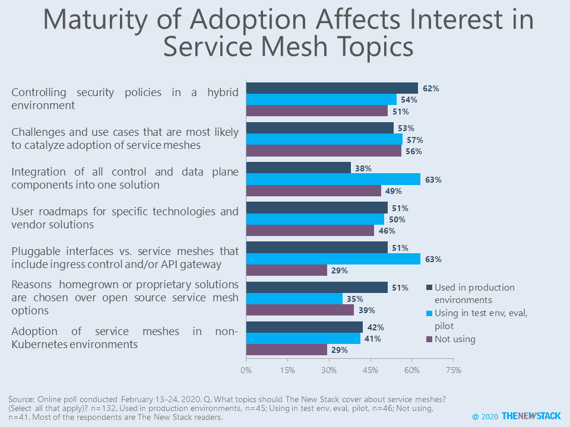

# 调查结果:服务网格有助于安全性、可观察性和流量控制

> 原文：<https://thenewstack.io/survey-results-service-mesh-useful-for-security-observability-and-traffic-control/>

熟悉服务网格的人表示，这项技术对于组织在未来 12 个月内改善分布式系统的安全性、可观察性和流量控制的努力非常重要。这是 New Stack 在 2 月 13 日至 24 日进行的一项在线调查的 138 个回复中的一个。对原始数据和列表结果的访问在[公开工作簿](https://docs.google.com/spreadsheets/d/1rElH4EYpisIQuU41Cl2TGzMpSGQ2ahxM5cWZHDBCeDk/edit#gid=1124322559)中。

三分之一的受访者组织使用服务网格来控制生产 Kubernetes 环境中微服务之间的通信流量。另外 34%在测试环境中使用服务网格技术，或者正在试验或积极评估解决方案。我们没有试图衡量实际采用情况，而是使用这些数据来探索在不久的将来如何做出决策。

服务网格尚未被“早期多数”技术采用者采用，但 46%的调查对象正在试用它们，或计划在未来 12 个月内评估或实施它们。生产环境中成功和失败的故事可能会影响这些计划。

在将服务网格用于生产 Kubernetes 环境的公司中，60%的公司认为它们对于在分布式系统中控制应用流量的近期改进极其重要，另外 30%的公司认为它们很重要，但不是必不可少的。就技术对安全性和可观察性的影响而言，这些数字仅略低。在那些对服务网格感兴趣的人中，51%的人认为它对提高安全性至关重要，43%的人认为它具有可观察性。安全性和可观测性可能被视为解决开发运维团队和现场可靠性工程团队面临的两个最大问题的众多技术之一。

未来的研究需要衡量这些技术对企业级分布式系统的影响。

只有 30%的评估/试点/测试群组使用人员表示，网格对于改善其组织的交通控制至关重要，但我们预计，随着人们开始接触该技术的日常操作，这一数字将大幅上升。

该小型调查的结论是，在继续覆盖服务网格时，要求输入新堆栈应该采取的角度。在非 Kubernetes 环境中采用服务网格是最不受欢迎的建议主题，部分原因是调查中的第一个问题集中在 Kubernetes 用例上。

在生产中使用服务网格的组织中，人们最有可能对两个主题感兴趣:1) 62%的人希望了解更多有关如何在混合环境(例如，多云、多服务网格、非容器、其他服务网格)中控制安全策略的信息，以及 2) 51%的人希望了解已经调查了开源服务网格选项(例如 [Istio](https://istio.io/) )但最终决定开发自己的网格功能或引入专有企业解决方案的公司。使用服务网格但不用于生产的受访者对另外两个主题最感兴趣:1)偏好可插拔接口(自带)与包含入口控制和/或 API 网关的服务网格，以及 2)将控制和数据平面组件集成到单个解决方案中的重要性。

一位受访者写道，要求“真实的客户故事，即使他们失败了。炒作的很烦。”另一个人想要更多关于“网格对开发人员和 QA 团队的重要性”的教育

我们鼓励读者在未来[对我们网站的贡献](https://thenewstack.io/contributions/)中使用这项研究，或者作为即将到来的[播客](https://thenewstack.io/podcasts)的主题。

## 基于采用程度的结果

专题图片由来自 Pixabay 的 John Mounsey 拍摄。

<svg xmlns:xlink="http://www.w3.org/1999/xlink" viewBox="0 0 68 31" version="1.1"><title>Group</title> <desc>Created with Sketch.</desc></svg>