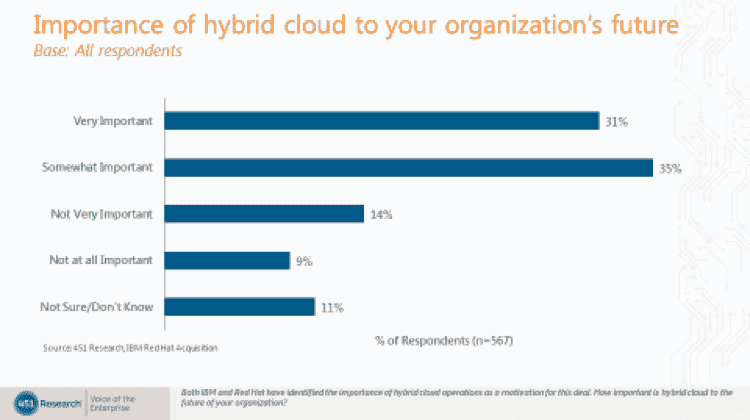
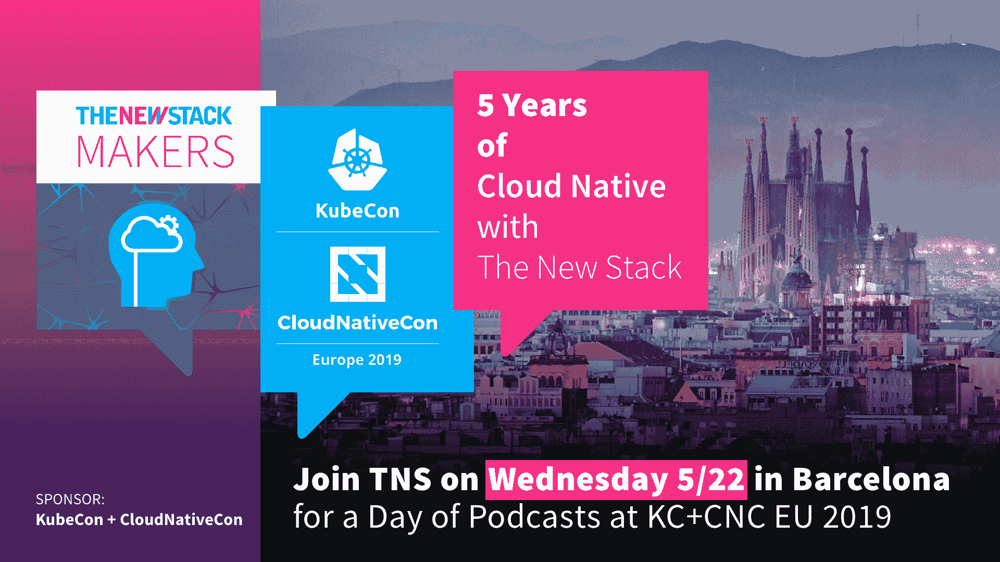

# 调查结果显示了混合云是如何发生的

> 原文：<https://thenewstack.io/survey-results-show-how-the-hybrid-cloud-is-happening/>

云本地计算基金会赞助了这篇文章。

 [杰伊·莱曼

杰伊为比特纳米完成了这项 451 研究。他是 451 Research 的首席分析师、cloud native 和 DevOps。](https://twitter.com/ripcitylyman) 

我们看到越来越多的企业使用案例涉及多云和混合云的使用，持续的调查数据强化了这样一种观点，即企业不仅对利用一个公共云感兴趣，而且对利用多个公共云感兴趣，不仅是公共云，还有私有云及内部环境。

根据 451 Research 在 2018 年为 Bitnami 完成的对 644 名企业 IT 决策者的“企业之声:云托管和托管服务、预算和展望”调查，超过一半(58%)的组织正在寻求一种混合战略，涉及集成的内部系统和外部云/托管资源。

然而，对于企业正在采用这种多云和混合云战略的想法，仍然存在一些怀疑，这让人想起多年前随着云使用的普遍增加而产生的一些恐惧、不确定性和怀疑。

也许这是因为一些人只看到了当今的多云现实，很难接受混合云涅槃的想法，即应用程序及其 API 和数据真正可以跨不同的云和本地环境移植。企业组织通常采用自己的方式来适应当今的多云现实。他们相当独立地采用了 IaaS、SaaS 和 PaaS，在可能的情况下寻求集成，但主要服务于开发人员、it 运营商和组织内业务线的不同突发事件。当这些组织展望未来时，他们通常希望根据成本、性能、数据主权和地理位置/区域等因素，在最有意义的时候利用不同的基础架构。这种最佳执行场所(BEV)方法是有意义的，但前提是应用程序可以跨不同的基础架构无缝运行，包括云和内部。

我们的[企业数字脉搏之声:2018 年供应商评估报告](https://clients.451research.com/reportaction/96340/Toc)表明，几乎所有这些环境都有望增长，主要是以传统 IT 基础设施为代价，而传统 IT 基础设施正在下降。当被问及他们组织的主要工作负载部署地点时，我们对 1，000 多名 IT 决策者的调查显示，IaaS 从 2018 年的 8%增长到 2020 年的 19%。作为主要工作地点的 SaaS 从 2018 年的 12%增长到 2020 年的 20%。内部私有云也从 2018 年的 16%增长到 2020 年的 20%。

大多数组织都在努力使用这种基础架构组合，我们也越来越多地看到不同公共云的混合，它们在不同领域加速发展，如人工智能和机器学习、大数据应用和技术或服务范围。我们还没有到达混合云的天堂，但是许多组织已经越来越近了。虽然这在调查受访者中所占比例较小，但我们的“企业之声:2017 年云转型、工作负载和关键项目”表明，近 13%的组织计划在未来两年内部署多个云环境，其中跨不同云环境无缝交付单一业务功能。

在 Kubernetes(一种分布式应用程序框架以及容器编排技术)的持续增长中，可以看到企业采用多云和混合云的更多证据。正如 Docker containers 通常与企业采用云的时机相吻合，Kubernetes 与混合云的企业采用率增长的时机相吻合。尽管存在复杂性和其他挑战，Kubernetes 与超大规模公共云提供商一起，正在真正塑造现代 IT 运营范式。

混合云的现实在去年的 IBM-Red Hat 334 亿美元的大交易中得到进一步验证，IBM 强调混合云是该交易的主要驱动力。在交易宣布后，我们调查了由数百名企业领导组成的 451 联盟小组，他们似乎一致认为混合云是交易的重要组成部分，“多云改进”被认为是交易积极情绪的驱动因素(另一篇博客文章中强调了这一点[)。该调查还表明，在超过 565 名受访者中，绝大多数人认为混合云“非常重要”(31%)和“有点重要”(35%)，只有 14%的人认为混合云“不太重要”，只有 9%的人认为混合云对他们组织的未来“一点也不重要”。](https://451research.com/blog/1979-is-ibm-red-hat-deal-reaction-a-sign-of-mega-deal-fatigue-new-survey-sounds-off)

推动云原生技术(如 containers 和 Kubernetes 以及多云和混合云)采用的是数字化转型。企业数字化转型的第一步也是最基本的一步是有效地利用不同的云计算基础设施，并使开发人员和 IT 运营能够使用不同的云基础设施更快、更高效地移动。随着我们离今天的多云现实越来越远，企业将越来越接近真正的混合云天堂，即工作负载在众多选择中最高效的基础架构上运行。

要了解更多关于集装箱化基础设施和云原生技术的信息，请考虑参加 5 月 20 日至 23 日在巴塞罗那举办的[kube con+CloudNativeCon Barcelona](https://events.linuxfoundation.org/events/kubecon-cloudnativecon-europe-2019/)。

通过 Pixabay 的特征图像。

<svg xmlns:xlink="http://www.w3.org/1999/xlink" viewBox="0 0 68 31" version="1.1"><title>Group</title> <desc>Created with Sketch.</desc></svg>