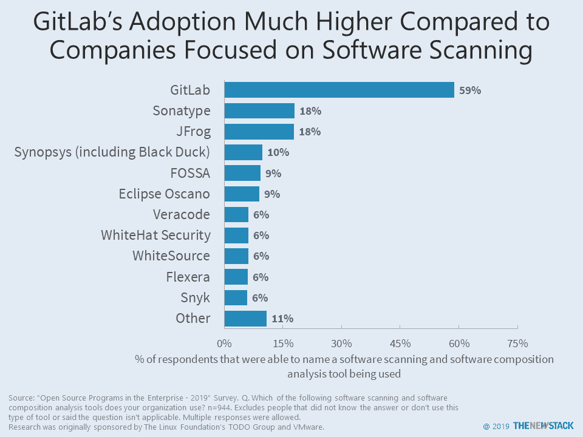

# 调查称:GitLab 广泛用于软件扫描，GitHub 赫然在目

> 原文：<https://thenewstack.io/survey-says-gitlab-widely-used-for-software-scanning-github-looms-large/>

GitLab 无疑是用于开源项目的软件扫描和软件组成分析的顶级工具吗？显然，如果你将 GitHub 的默认功能包括在你的分析中，答案是否定的，但是很长一段时间以来，GitHub 并没有被纳入许多市场分析中。这种情况应该会改变。

根据 2019 年[与](https://thenewstack.io/research-shows-open-source-program-offices-improve-software-practices/)[Linux 基金会](https://www.linuxfoundation.org/)和 [TODO 集团](https://todogroup.org/)进行的关于企业中开源新堆栈的调查，近一千人表示他们知道他们的组织正在使用什么进行扫描/合成分析。59%的人选择了 GitLab，这是基于前 10 名提供商的名单，这份名单来自最近一份关注安全问题的 Forrester 报告。 [Sonatype](https://www.sonatype.com) 和 [JFrog](https://jfrog.com/) 并列第二，后面是 [Synopsys](https://www.synopsys.com/) 、 [FOSSA](https://fossa.com/) 和 [Eclipse Oscano](https://projects.eclipse.org/projects/technology.oscano) 等几家公司。

虽然 GitHub Action 的依赖性管理功能尚未公布，但回想起来，GitHub 应该包括在问题中，因为像 GitHub 这样的代码库可以扫描安全性、软件合规性和依赖性。尽管如此，只有少数受访者强烈认为这类产品类别应该包括 GitHub 在 944 名受访者中，有 103 人在“其他”回复中写道，其中只有 6 人引用了 GitHub。

我们并不是说 GitLab 比 GitHub 用得多。相反，我们的数据显示 GitHub 在那个领域有很大的领先优势。如果使用 GitLab 扫描功能的公司也将其用作代码库，那么不言而喻的是 GitHub 的客户也会这么做。目前，很难确定 GitHub 用户中有多少人将它的商业扫描功能与其他工具结合使用，比如那些将它用作代码库的工具。然而，如果是这种情况，他们也可能使用 GitHub 的原生扫描功能或 GitHub 的 [marketplace](https://github.com/marketplace) 的某些产品。

我们发现，关于扫描相关工具的研究可能会受到提供的多项选择答案以及对调查做出回应的人的类型的广泛影响。例如，由于新思科技的黑鸭子具有相对较高的品牌认知度，如果调查迫使某人回答这个问题，它可能会被更多地命名。

我们在 Tidelift 进行的未发表的[研究显示，如果一个问题是开放式的，结果会有很大的不同。该调查询问了使用什么软件或服务来评估开源依赖的健康状况。112 名受访者中有 40 人提到了 GitHub，至少有四分之一的人明确表示他们使用了 GitHub 的安全警报。](https://tidelift.com/subscription/managed-open-source-survey) [Travis CI](https://travis-ci.org/) 和 [Snyk](https://snyk.io) 分列第二和第三，分别被引用 11 次和 10 次。

如果把 GitHub 作为一个选项，这个图表的结果可能会有很大的不同。如果更多的受访者担任信息安全职位，Veracode 或 WhiteHat Security 等公司可能会被更多地提及。

新堆栈的调查还询问了用于管理开源仓库的内容。GitHub 付费版本的使用率甚至超过了去年的 T1，从 30%上升到 35%。国产解决方案的使用频率较低，从 21%降至 15%，来自 GitLab 和 Bitbucket 等其他供应商的付费版本略有下降。值得注意的是， [Smartbear Software](https://smartbear.com/resources/ebooks/the-state-of-code-review-2019/?utm_medium=referral&utm_source=thenewstack&utm_campaign=2019socr) 的新研究报告了不同的结果，GitHub Enterprise 的采用率在 2019 年上升了近三分之一，达到 13%，而 GitLab 商业产品的采用率翻了一番，达到 8%。这两项调查很可能对早期采用者进行了过度采样。

不经意的观察者可能会怀疑。一份[最近的报告](https://boyter.org/posts/an-informal-survey-of-10-million-github-bitbucket-gitlab-projects/)发现 GitHub 上有 968011 个存储库，而 Bitbucket 有 248217 个，GitLab 有 56722 个。这些数字具有欺骗性，因为其中包括空的和不活动的存储库。调查数据显示了许多不同的结果，因为它侧重于专业开发人员团队使用的代码库。

无论你如何分析，GitHub(及其母公司微软)和 GitLab 都有可能继续将他们庞大社区的一部分转化为付费用户。目前，较小的供应商正在与代码库一起使用，但当较大的公司将更多的安全性和合规性扫描工具捆绑到他们的产品中时，可能会受到威胁。

<svg xmlns:xlink="http://www.w3.org/1999/xlink" viewBox="0 0 68 31" version="1.1"><title>Group</title> <desc>Created with Sketch.</desc></svg>