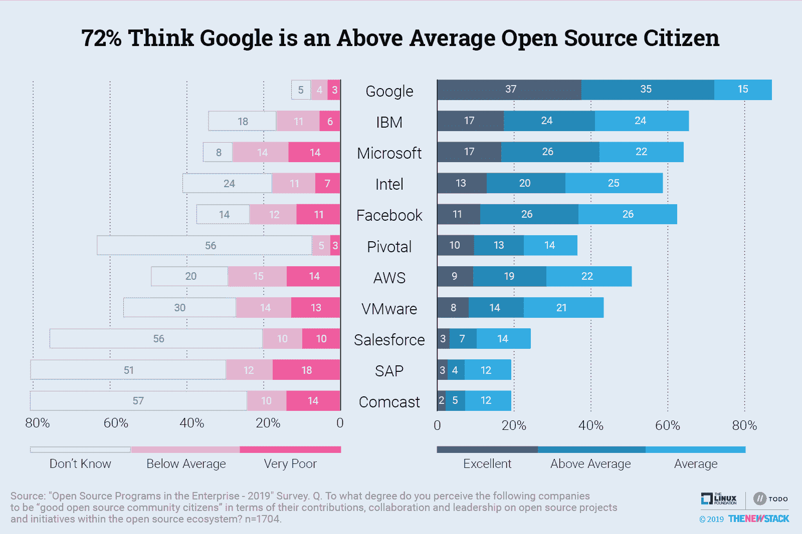
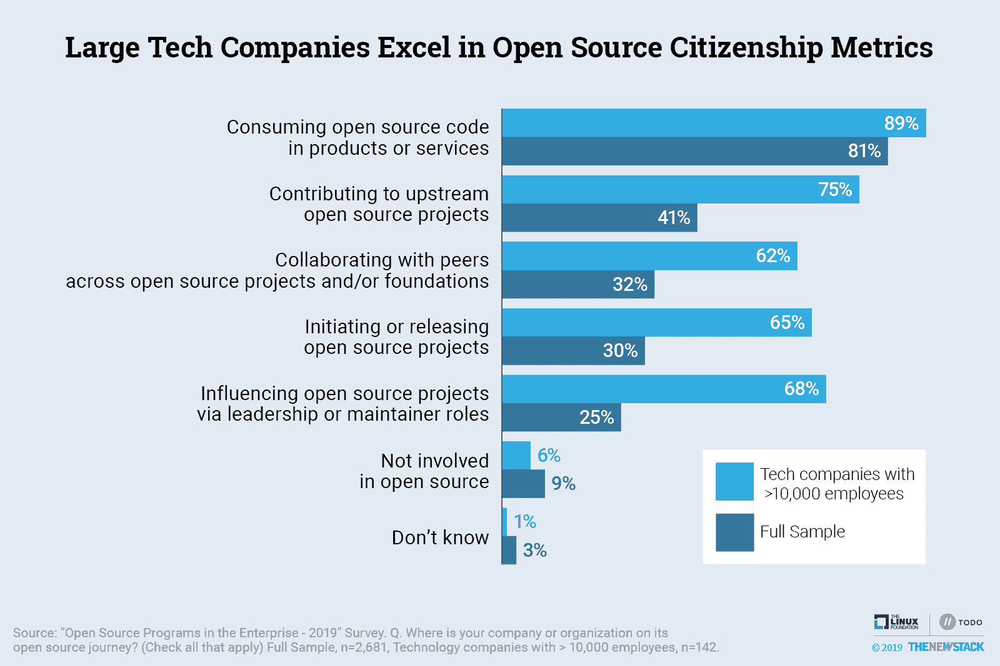
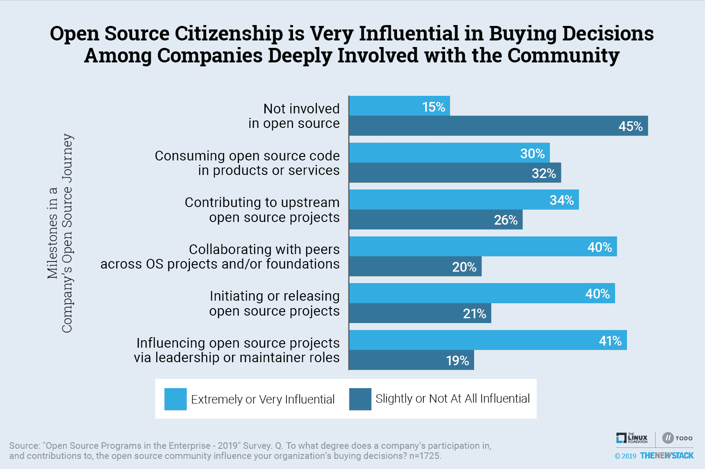

# 调查显示开发者和他们的雇主如何衡量好的开源公民

> 原文：<https://thenewstack.io/survey-shows-how-developers-and-their-employers-measure-good-open-source-citizenship/>

一家公司是开源社区的良民还是犯了“openwashing”的罪？几乎在任何时候，当一个公司将一个产品作为开源产品进行营销或者宣布软件已经开源时，这个问题都会被问到。与 Linux 基金会的 [TODO Group](https://todogroup.org/) 和 VMware 一起，新的 Stack 对企业中的开源进行了研究，提供了数据和框架来回答这个问题。

该研究将企业贡献、与他人的合作和领导力确定为开源公民的关键指标。然后，根据这些指标，评估社区如何看待 11 家公司的开源公民身份。我们在[调查了 2700 名](/research-shows-open-source-program-offices-improve-software-practices/)人，其中绝大多数在某种程度上使用开源，一半人在经常在商业产品中使用开源的公司工作。

有了关于贡献、合作和领导力的数据，我们展示了受访者自己的雇主如何达到这些基准。由此产生的分析提供了不同程度的开源用户如何看待公司的开源参与以及这如何影响他们公司的雇佣或购买决策的洞察力。他们的回答对开源生态系统的可持续性以及开源社区如何衡量和定义良好的企业公民具有重要意义。

## 主要发现:

*   谷歌的开源品牌强于同行。
*   与所有受访者相比，最积极的上游贡献者对微软和英特尔的看法更积极；AWS 的情况正好相反。
*   深入参与社区的公司做出的购买决定会受到供应商开源身份的显著影响。
*   大型科技公司最有可能积极参与开源生态系统；75%参与上游项目，相比之下，整个研究中只有 41%参与。

## 认识

*“就其在开源生态系统中对开源项目和倡议的贡献、合作和领导而言，您认为以下公司在多大程度上是‘良好的开源社区公民’？”*

我们向受访者询问了关于 TODO Group 名成员的问题，他们代表了科技公司的广泛领域。TODO Group 的所有成员都对开源进行了大量投资，许多成员都有专门的开源项目来制定政策和鼓励贡献。虽然我们询问的许多公司得到的评级很一般，但其他公司表现良好。当这个新问题被纳入未来的研究中时，我们期望看到观念的转变。

有开源承诺历史的公司更有可能被视为良好的开源公民。高居榜首的是谷歌，与排名第二的公司相比，有两倍多的受访者认为谷歌的公民素质非常优秀。总体而言，72%的人认为谷歌优秀或高于平均水平。Android、Kubernetes 和 TensorFlow 只是起源于谷歌的一些热门项目，该公司还参与了其权限之外的数百个项目。

名单上的下一个是 [IBM](https://developer.ibm.com/open/) 、[微软](https://cloudblogs.microsoft.com/opensource/)、[英特尔](https://01.org/)、[脸书](https://opensource.facebook.com/)和 [Pivotal](https://pivotal.io/open-source) ，与负面评价相比，它们都获得了更多正面评价。

IBM 的研究人员长期以来一直在为开源做出贡献，即使没有收购开源巨头 Red Hat，他们也可能在这项研究中取得很好的成绩。像 IBM 一样，英特尔在历史上也为 Linux 相关项目做出过贡献。

尽管存在公关障碍，但平均而言，微软和脸书的形象是正面的。尽管如此，28%的人认为微软是一个低于平均水平或糟糕的开源公民。经历过 Linux 与 Windows 之战的老兵，尤其是那些为小型企业工作的老兵，仍然对微软怀恨在心，并很快指出，微软的许多开源项目都嵌入到了一个更大的生态系统中，并从中获利。脸书的挑战主要是由于消费者相关的隐私问题，而不是它如何支持开源项目。

## 尚未决定的投票

许多人对一家公司的开源公民身份没有意见，超过一半的研究回答“不知道”四家供应商。缺乏观点的一个原因是品牌意识。例如，web 开发人员可能不知道 Pivotal，因为该公司专注于基础设施软件产品。[康卡斯特](https://comcast.github.io/)拥有强大的消费品牌；然而，与实际销售和支持技术解决方案的其他公司相比，它接触开源社区的机会有限。

尽管 [Salesforce](https://opensource.salesforce.com/) 和[SAP](https://developers.sap.com/open-source.html)都是软件巨头，但也有很高比例的人无法对这些公司发表意见。这证明了大部分社区并没有自动将私有软件供应商归类为反开源。不幸的是，剩下的回答者中，对企业参与开源持负面看法的是持正面看法的两倍。

## 影响感知的因素

与那些相信自己是好的开源公民的人相比，[亚马逊网络服务](https://aws.amazon.com/opensource/)和 [VMware](https://www.vmware.com/opensource.html) 都有稍微多一点的诋毁者。然而，很大一部分开源选民仍在形成对这些公司的看法。这项研究发现了一些影响人们对这些公司看法的线索。

> 总的来说，开源社区仍然对企业动机持怀疑态度。

和脸书一样，AWS 是一个广为人知的品牌，但也面临着公众越来越多的批评。开发人员和技术专业人员对 AWS 有更多的接触，并且一致认为 AWS 通常以有竞争力的价格提供优质服务。如果受访者只根据性价比来评价 AWS，该公司应该会得到好评。这些数据更像是一幅混合的图画，因为它代表了开源社区的观点。

总的来说，开源社区仍然对企业动机持怀疑态度。只有 37%的受访者对供应商的平均评价是正面的，而 56%的受访者对供应商的评价偏差或低于平均水平。即使一个公司深深地卷入了开源项目，一些悲观主义者会声称这仅仅是因为一个不可告人的动机，而不是致力于社会责任或开源精神。

抛开永恒的悲观主义者和反商业人群的观点，仍然有真正的理由怀疑一家公司所谓的利他主义实际上是在赌公司市场份额的增长。VMware 副总裁兼首席开源官 Dirk Hohndel 承认，开明的利己主义在开源贡献中发挥了作用，但他认为“一个好的开源公民是这样一个人，他的团队纯粹是基于项目的良好愿望做出贡献的。”

开源社区的一部分人对 AWS 特别敌视，因为它被认为是一个接受者，而不是创造者。争论的焦点是 AWS 在其产品中使用开源代码，但并没有将大量资源投入到有益于整个社区的项目中。此外，AWS 被指控[威胁依赖所谓开源商业模式的初创公司](/fork-and-commoditize-gitlab-ceo-critiques-the-new-open-source-approach-by-amazon-web-services/)的生存能力。

开源创业公司的现任和有抱负的创始人是谈论开源公民的最可信的声音之一。然而，很少有证据表明基于开源的商业计划与实际的开源社区活动密切相关。

我们的调查样本中有五分之一可以被认为是活跃的开源社区成员，因为他们在一家经常为上游项目贡献代码的公司工作。这个群体对 AWS 的看法不太乐观，44%的人对其开源公民身份持负面看法，而 28%的人持正面看法。相比之下，活跃的社区成员对微软和英特尔的看法显著上升，这可能是因为他们被认为在支持开源项目方面做了实际工作。

## **改变感知需要时间**

负面看待 VMware 开源公民身份的人(27%)多于正面看待它的人(22%)。Hohndel 承认 VMware 有改进的空间，但对结果感到鼓舞。他告诉新的堆栈，“这肯定比我们几年前的情况有所改善。”他的理念是改变认知是一个长期的过程。作为该公司开源项目办公室的领导，Hohndel 确保开源领域的新成员看到 VMware 参与了许多上游项目，并积极为其关注的项目做出贡献。通过赞助这项关于新堆栈的调查，VMware 旨在深入了解如何改进并为未来的研究设定基准指标:他们希望衡量自己如何随着时间的推移而改进。

Hohndel 不太愿意把太多的价值放在企业开源活动的营销和品牌上。Hohndel 引用了他作为软件开发人员的背景，他说:“我真的相信我们需要在项目中以良好的工作、良好的贡献和良好的公民意识来领导。随后，你如何营销和谈论它就变得很重要了。”

## **衡量好的开源公民**

确定一个人是否是公民是全世界持续政治争议的来源。定义企业公民也很困难，但我们喜欢澳大利亚迪肯大学一个研究单位的解释:

*“企业公民是一种认可，即一个企业、公司或类似企业的组织对其寻求经营许可的社区负有社会、文化和环境责任，对其股东或直接利益相关者负有经济和金融责任。”*

开源本身既是一个社区，也是更大的社会和经济的组成部分。即使从不使用开源软件的公司也从它所产生的经济生产力中受益。开放源码的用户可以被视为被动公民，与管理其使用的法律有利害关系。为开源项目做出贡献的个人是更积极的公民。

当公司支持项目时，他们会参与到社区中。这种支持可以采取直接资助、采用标准许可和实践以及允许员工在工作时间参与项目的形式。

对照主观的责任清单来衡量一家公司是一项艰巨的任务。但这并没有阻止我们去尝试。为了调查的目的，“优秀的开源社区公民”是从开源生态系统中对开源项目和倡议的贡献、合作和领导能力方面来衡量的。这些度量标准对那些被视为狭隘自利的活动进行了贴现。

新的堆栈试图根据实际参与情况来衡量开源公民的现状。调查的第一个问题是询问受访者他们的公司在开源之旅中处于什么位置。由于 81%的受访公司在产品或服务中使用开源代码，我们认为这不是一个有价值的差异化。该研究还发现，30%的受访公司正在启动或发布开源项目。这并没有准确地反映良好的公民意识，因为这些项目可能对更大的社区影响很小或没有影响。相反，我们关注开源社区参与的以下措施:

*   **贡献:** 41%的受访者雇主为上游开源项目做出贡献。这表明开发工作可以由更大的社区来分担，而不仅仅是一家公司。
*   **合作:** 32%的受访者的雇主在开源项目和/或基金会中与同行合作。合作所需的信任降低了无形的交易成本，这是[行为经济学分析](https://www.econlib.org/library/Columns/y2019/Klingaspectsoftrust.html)的一个重要方面。
*   **领导力:** 25%的受访者的雇主通过领导或维护者的角色来影响项目。尽管有人抱怨公司过度影响社区决策，但他们也给员工时间去做一些不那么吸引人的、对开源项目的成功至关重要的清洁工作。

## **其他测量方法**

开源公民身份也可以根据开源代码的使用程度来衡量。美国政府的一个试点项目要求所有机构发布至少 20%的新定制代码作为开源，该项目提出了以下指标:代码行数；独立模块的数量；成本；软件项目的数量；以及系统认证和认可的界限。执行这项规定将会很困难。尽管对于什么类型的许可证是真正的开源存在分歧，但是识别许可证的使用模式并不是最大的挑战。相反，确定应该评估整个堆栈的哪些部分是一个值得关注的问题。例如，如果您使用 Kubernetes 和 Linux，这些项目中的数千行代码可能会被计算出来。

从 GitHub 和其他代码库中获得的统计数据使得初步评估公司参与开源项目变得很容易。新的堆栈本身使用了丰富的 GitHub 数据，以及关于企业参与的额外信息来分析 Docker 生态系统。(参见我们的电子书“[应用和微服务与 Docker &容器](https://thenewstack.io/ebooks/docker-and-containers/applications-microservices-docker-containers/)”的第 52 页)。更多[最近](https://www.cncf.io/cncf-kubernetes-project-journey/)，对 Kubernetes 项目的评估显示，VMware 和其他公司已经开始代表该项目贡献者群体的更大比例。这些方法有它们的优点，但是很难应用，因为每个公司和项目的实践都是独特的。要了解如何使用统计数据来评估项目，我们建议回顾一下 [CHAOSS](https://chaoss.community/metrics/) (开源软件社区健康分析)项目正在做什么。

## 描述参与度最高的社区成员

17%的调查对象在同时参与、合作和领导开源项目的公司工作。这些公司很可能有几个政策来支持开源社区。例如，71%的调查受访者的公司是开源基金会的成员或赞助商，而这项研究的平均比例是 23%。此外，与 18%的研究平均值相比，51%的组织制定了奖励和认可组织内外开源贡献者的计划。

调查数据发现，大型技术公司比任何其他被调查的部门更有可能参与开源生态系统。在这项研究的 142 家大型科技公司参与者中，56%的人说他们的公司正在上游做出贡献，与同行合作，并通过领导者或维护者的角色影响项目。尽管大型科技公司为开源开发提供了大量的开发人员，但这只是一个企业中所有开发人员的一小部分。

## **良好开源公民的影响**

关于企业社会责任的争论只有在影响到经济活动时才有意义。就像环境活动家一样，开源支持者一直在进行一场改变态度和行为的长期斗争。大多数消费者声称关心环境，但价格、便利性和质量历来是购买决策的优先考虑因素。同样的决策矩阵也适用于软件，开源软件通常会根据其优点做出可信的声明。虽然这种类比并不完美，但我们看到，就像环境一样，社区中的一部分人正在基于软性的“社会责任”问题做出决策。在这一节中，我们将回顾良好的企业开源公民意识是如何影响使用什么软件以及开发人员决定在哪里工作的。

我们[之前报道过](/research-shows-open-source-program-offices-improve-software-practices/)关于一家公司对开源社区的贡献和参与是否会对购买决策产生影响还没有达成共识。32%的调查对象表示，一家公司对开源社区的参与和贡献对其组织的购买决策影响很小或根本没有影响。另一方面，29%的人说它非常或非常有影响力。另有 23%的人注意到了中等程度的影响。

我们做了更深入的研究，发现对那些相信自己是开源社区可靠成员的公司来说是好消息。总体而言，认为公司的社区参与对购买决策很重要的受访者也更有可能认为特定公司是好公民。值得注意的是，在 29%认为公民身份至少非常有影响力的人中，AWS 和英特尔都认为公民身份评级比研究平均值增加了 7 个百分点。这是一个迹象，表明一些市场悲观情绪可以被视为来自怀疑者，他们不会根据自己的态度做出购买决定。

相比之下，在开源社区中积极与他人合作的公司在选择供应商时更有可能考虑开源活动。因此，40%在项目和/或基金会中与同行合作的公司表示，公民身份至少对购买决策有很大影响，与所有受访者相比增加了 11 个百分点。发起或领导项目的公司也可能会说公民身份会影响购买决策。

企业开源公民身份可能会对未来员工的招聘产生更大的影响。Dice 和 Linux 基金会 2018 年的一项[调查发现，在雇佣“开源开发者”的公司中，48%的公司在财务上支持开源项目，至少部分是为了帮助招聘。我们的数据显示，38%的受访者的雇主至少有时会招募开发人员从事开源项目，35%的雇主至少有时会培训开发人员为开源项目做出贡献。](https://thenewstack.io/oss-employers-developers/)

数据表明，拥有最成熟开源实践的公司也最有可能雇佣有开源项目工作经验的开发人员。例如，64%定期为上游项目贡献代码的公司也定期(有时或频繁)招募和雇佣开发人员从事开源项目。其他人的比例是 27%。

我们还知道，培训开发人员为开源做出贡献的公司实际为上游项目做出贡献的可能性几乎是前者的两倍。

展示强大的社区参与将对招聘产生积极影响。前面提到的 2018 年研究描述了雇主吸引开源开发者的方式。最有效的是提供培训和参加会议的机会。Close behind 为开发人员提供了从事开源项目的时间，并提供了关于这种贡献的明确政策。我们最近的调查发现，拥有开源项目办公室(OSPO)的公司更有可能拥有许多这样的政策。值得注意的是，59%的公司表示增加开发人员招聘和保留是他们 OSPO 的一个好处，他们有一个奖励和认可开源贡献者的计划。相比之下，只有 18%的研究实施了这样的计划。

有趣的是，我们知道开发人员希望为一家好的开源公司工作。未来的研究需要确定这一点如何影响到在哪里工作的决定，以及工资、从事新的令人兴奋的项目的机会和工作/生活平衡等因素。

## **结论**

也许做一个好的开源公民的最大好处是它可以帮助改变公司的运营方式，从技术采用和许可实践，到政策，招聘和雇用。它还可以改变内部共享和开发技术的方式，以提高开发人员的生产率并降低开发成本，这种做法有时被称为内部外包。VMware 的 Hohndel 警告公司不要投资于专注于技术栈边缘部分的开源项目。相反，公司应该决定哪些软件组件对您的业务至关重要，并帮助您的产品与众不同。

总的来说，雇佣和维护开发者的能力可能是开源公民的最大好处。此外，与开源社区关系最密切的公司倾向于在社区参与的基础上做出购买决定。

从长远来看，营销和宣传你的开源项目价值有限，因为开发者持怀疑态度，他们可以看穿开源。相反，专注于建立良好开源公民的三个标准的艰苦工作:贡献、合作和领导。

* * *

**方法:**调查于 2019 年 7 月 8 日至 29 日进行，共收到 2700 多份回复。通过社交媒体和发送给 Linux 基金会、TODO Group 和新堆栈电子邮件列表的电子邮件向受访者征集意见。完整的数据集[可以在这里找到](https://github.com/todogroup/survey/tree/master/2019)。

<svg xmlns:xlink="http://www.w3.org/1999/xlink" viewBox="0 0 68 31" version="1.1"><title>Group</title> <desc>Created with Sketch.</desc></svg>