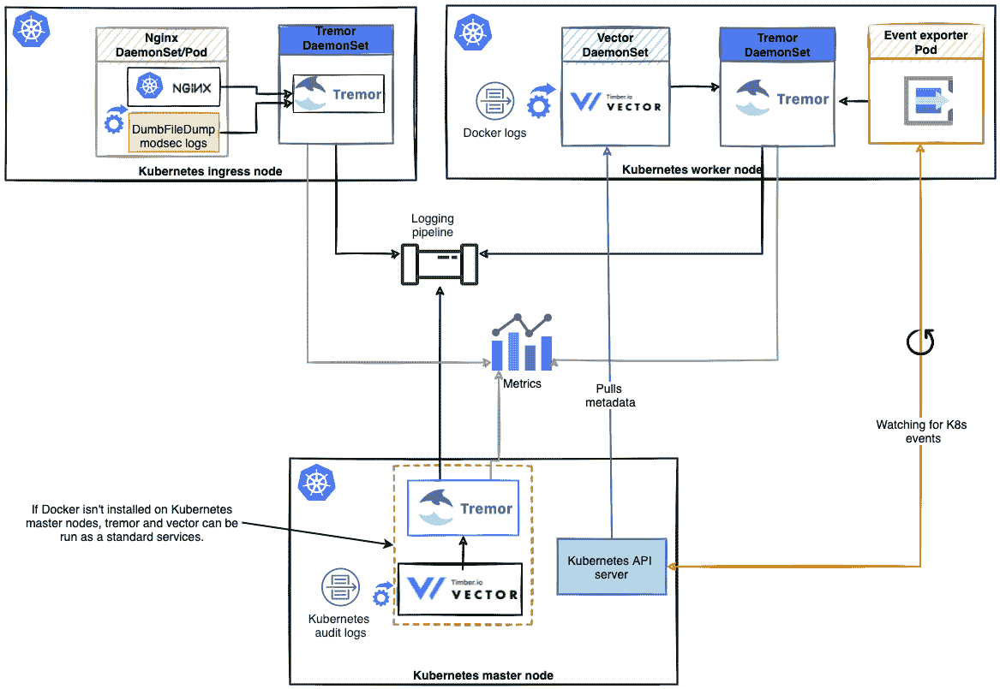

# 幸存的可观测性随着震颤淹没了库伯内特斯

> 原文：<https://thenewstack.io/surviving-observability-floods-on-kubernetes-with-tremor/>

[](https://www.linkedin.com/in/matthias-wahl-14640b71/)

 [马提亚斯·瓦尔

马提亚斯认为自己以成事为名，犯下了种种罪行，这些罪行至今仍困扰着他。除此之外，他还是 Ponylang 社区的成员，并通过对 Rust 编译器大喊大叫来让震颤在 Wayfair 编译来赚钱。](https://www.linkedin.com/in/matthias-wahl-14640b71/) [](https://www.linkedin.com/in/matthias-wahl-14640b71/)

有时你无法避免:生产系统最终会以这样或那样的方式崩溃。它们被流量淹没，无法足够快速地扩展，或者出现硬件故障或错误配置。在作为软件工件的经过良好测试的应用程序和平稳运行的生产环境之间总是存在差距。当一切都崩溃时，它将会崩溃，你希望看到它的发生，并从你的环境中获得足够的信息，以便你可以修复破损。你想以闪电般的速度快速看到它。

一个破损或过载的生产系统也破坏了可观察性管道，因此实际上来自所述生产系统的信号有巨大的延迟，这是导致[震颤](https://www.tremor.rs/)产生的特殊经历。它还可以推广到下游系统无法以与上游系统相同的速度扩展的场景——例如，将无状态 web 应用程序想象为上游系统，而将时序数据库引擎想象为下游系统。通常，传入流量与生成的日志消息数量呈线性相关。在错误场景中，情况并不清楚，但是频繁地重复重启和失败可能会产生大量的日志消息。失败的请求通常比成功的请求生成更多的日志——想想您的平均异常回溯。

那么，震颤是如何帮助我们看到需要什么的呢？

震颤是一个事件处理引擎，侧重于易用性，性能和有效的资源利用。凭借其通用而灵活的架构，它非常适合简单的 ETL 工作负载、数据分发以及最重要的流量整形。在我们看来，当我们的系统被淹没时，没有比延迟日志更糟糕的了。但是在我们需要的时候有一些日志，因为我们不能处理所有的日志。所以我们决定建立自己的工具，让你可以扔掉日志。不是全部，而是一些，而且是以一种受控的方式。在这方面，震颤是一种复杂的/开发/零设备，带有一些奇特的旋钮。那建筑呢？你把你自己的逻辑连接在一起，使用外部世界的连接器和管道，在管道中你使用我们自己的快乐的小 DSL 表达你的应用程序逻辑，叫做[涓滴](https://www.tremor.rs/docs/tremor-query/walkthrough)。

让我向您介绍一些技术和模式，围绕我们如何成功地将震颤应用到我们的 Kubernetes 基础设施，以减轻淹没我们的可观察性管道。

在所有这些模式中，震颤作为一个中间怪物，如果它检测到超过配置的速率限制或过载的下游系统，就会悄悄地丢弃事件。是的，你没看错。我们的震颤安装将扔掉一些宝贵的小日志消息或指标数据点。请记住，与所有延迟很久才到达的日志相比，我们更重视一些按时到达的日志。您可以决定这里的细节:是应该增加在震颤检测到下游超时或错误时被丢弃的事件的百分比，还是应该在超时或错误后的配置时间内丢弃所有传入的事件？如果您愿意深入研究，您可以自己在震颤脚本中实现自定义背压算法，并附带一个有用的语言服务器协议( [LSP](https://github.com/tremor-rs/tremor-language-server/) )，以及大量用于在投入生产之前测试您的实现的工具。

那么，插入中间震颤的最佳位置在哪里呢？嗯，你可能已经猜到了:这要看情况。主要取决于你想消费和转发什么。

## 震颤如恶魔

将震颤作为 DaemonSet 部署在集群中是很有意义的，因此它将位于每个工作节点上，从本地节点和所有运行的 pod 和容器收集日志和指标。一个 worker 节点上运行的 pods 和 containers 的数量在一个合理的范围内，足以让一个震颤实例优雅地处理它们的日志。如果节点大小支持一群豆荚，那么你可以很容易地 chonk 你的震颤 DaemonSet。

应用程序日志可以直接发送到震颤 DaemonSet，例如通过 UDP/TCP，或者可以通过 Filebeat、Fluentd 或 Vector 等工具收集，这些工具通常会跟踪由容器引擎或 kubelet 生成的日志文件。

[](https://cdn.thenewstack.io/media/2021/09/16a6a5bf-image1.png)

在 Wayfair，我们的入口和工作节点上存在震颤 DaemonSets。他们将日志转发到我们的集中日志记录管道。它们通过 Rsyslog 和容器日志来消耗系统日志，这些日志通过 Vector 读取，并通过 UDP 转发给震颤。除此之外，他们还收集节点级和容器级的指标。

如果你想用震颤作为 DaemonSet 开始运行，看看我们的[舵图](https://github.com/tremor-rs/tremor-k8s-helm)。

## 震颤如边车

震颤也可以作为一个边车部署到您的应用程序吊舱，并直接收集日志的来源。我们目前利用这种模式为用户提供更好地控制系统范围的速率限制的可能性，当日志超过某个速率时，系统范围的速率限制将随机丢弃日志。例如，随着震颤 sidecar 如此接近他们的应用程序，开发人员可以配置基于会话 id 或事务 id 的速率限制，并在某些会话/事务超过强制速率时丢弃它们的日志，同时保留其他会话/事务的所有日志—查看完整的事务/会话，而不是部分事务/会话。这也将速率限制移动到可观测性信号的源头，在这种情况下是日志，从而减少下游测井管道的压力，以防单个实例淹没整个系统。事后看来，这并不罕见。

虽然 sidecar 部署在资源方面的开销最大，但它可以针对每个 pod 进行定制，我们很好地利用了这一点。如果这种精细的控制是必要的，那就去做，不要担心。我们使用了一些不为人知的技巧让震颤变得尽可能的快速和节约资源。

## 震颤作为常规部署

将震颤作为常规部署也非常容易。我们这样做是因为我们希望在我们的生产环境中按照应用领域划分我们的震颤部署，以避免嘈杂的邻居问题。为此，每个域都有自己的用来发送日志的震颤集群。我们可以控制每个应用程序的日志配置，所以路由实际上不是什么大问题。每个应用领域都被分配了一个震颤集群，我们根据领域需求来确定它的大小，这些需求在我们可以控制的范围内增长。

通过这种设置，重载域不会主导整个震颤集群或可观测性管道，也不会降低我们系统中所有其他公民的延迟。

如果你想开始使用震颤作为部署，请查看我们的[头盔图](https://github.com/tremor-rs/tremor-k8s-helm)。

## Kubernetes 事件的震颤

Kubernetes 集群发生的任何有意义的事情都通过主节点作为 Kubernetes 事件公开。为了能够看到集群上发生了什么，并使这些事件可用(例如，作为审计日志)，我们通过[kubernetes-event-exporter](https://github.com/opsgenie/kubernetes-event-exporter)将它们转发给主节点上运行的一个震颤实例。

我们在每一个需要轻量级有效负载验证和规范化的地方，或者需要将流量中的极端突发平滑到可预期的数量的地方，都使用了震颤。这简化和减轻了下游的可观察性管道，并且总体上使我们的操作更加容易，万一堤坝真的决堤了。

这其实很容易做到:

```
define qos::backpressure operator bp
  with
  timeout  =  100
  end;
  create operator bp;

  select event from in into bp;
  select event from bp into out;
  select event from bp/err into err;

```

这是震颤管道的定义。你在顶部洒上一些 [YAML，然后配置通过 UDP 监听哪个端口，以及如何到达下一个 Kafka 集群。现在，只需简单地调用:
，您就可以轻松地进行流量整形了](https://gist.github.com/mfelsche/6217a0e76bac75c63a6784c1f3ac3850)

```
tremor server run  -f  main.trickle  -f  config.yaml

```

## 谢谢你和我们一起颤抖

我希望我能理解使用震颤来收集库本内特斯星团中所有可能的可观测陨石的好处。我们以前被基础架构故障困扰过，无法及时发现故障的确切位置。我们很自豪地说，自从我们把震颤放在中间，我们就能够在 Wayfair 保持双脚干燥。也许你也能从中受益！(自我说明:备选标题:作为沙袋图案的震颤)。


*要了解更多关于 Kubernetes 和其他云原生技术的信息，请考虑参加 10 月 11 日至 15 日举行的 [KubeCon+CloudNativeCon 北美 2021](https://events.linuxfoundation.org/kubecon-cloudnativecon-north-america/) 。*

<svg xmlns:xlink="http://www.w3.org/1999/xlink" viewBox="0 0 68 31" version="1.1"><title>Group</title> <desc>Created with Sketch.</desc></svg>